# 用 TinyML 检测不稳定电网

> 原文：<https://medium.com/mlearning-ai/detecting-unstable-electrical-grid-with-tinyml-81535e3b0bea?source=collection_archive---------6----------------------->

如何应用 TinyML 方法防止电网过载？


# 本项目使用的物品:

## 硬件组件

[粒子氩](https://store.particle.io/products/argon) ×1

## 软件应用和在线服务

[内乌顿微小 ML](https://neuton.ai)
粒子构建 Web IDE

# 故事

**简介**

电力是现代社会和经济发展的核心。越来越多的国家努力转向可持续能源系统，这是一个相当具有挑战性的过程，因为它导致发电越来越不稳定和电网过载。不稳定的电网会危及人们的生命和财产安全。这意味着电力系统应该进行及时的监控和优化，这是人工智能和机器学习可以轻松处理的。

事实上，人工智能已经成为电力行业必不可少的工具。它为动态变化环境下的能耗分析和电网监控提供了独特的自学解决方案。在这个项目中，我们将探索如何利用机器学习模型来有效监控电网，如视频所示。

**可再生能源&智能经济**

可再生能源的兴起为全球社会提供了对传统、有限且不利于气候的化石燃料的迫切需求的替代品。然而，它们的通过提出了一套新的范例，其中两个值得特别注意:

*   在可再生能源兴起之前，传统的生态系统很少有生产实体(能源)通过单向流动向消费者供应能源。随着可再生能源的出现，最终用户(家庭和企业)现在不仅消耗能源，而且有能力生产和供应能源。此外，对于一个可靠的生态系统，人们需要确保能源电网更加智能，并配备对威胁和故障的准确检测。

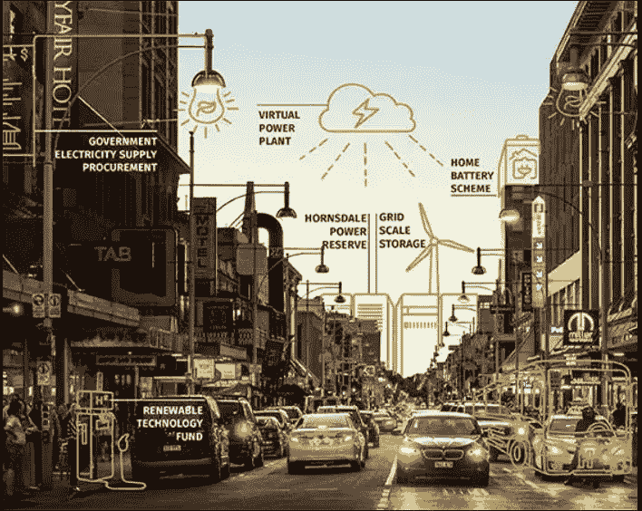

*   尽管可再生能源的灵活性越来越大，但在更复杂的发电/配电/消费环境中的供需管理以及相关的经济影响(例如，决定是否以给定价格购买能源)变得更加具有挑战性。

**电网稳定性需求**

在智能电网中，收集消费者需求信息，并根据当前的供应条件进行集中评估。由此产生的建议价格信息被发回给客户，让他们决定是否进一步使用。由于整个过程是时间相关的，因此对**电网稳定性**的动态估计不仅是一个问题，也是一个主要要求。

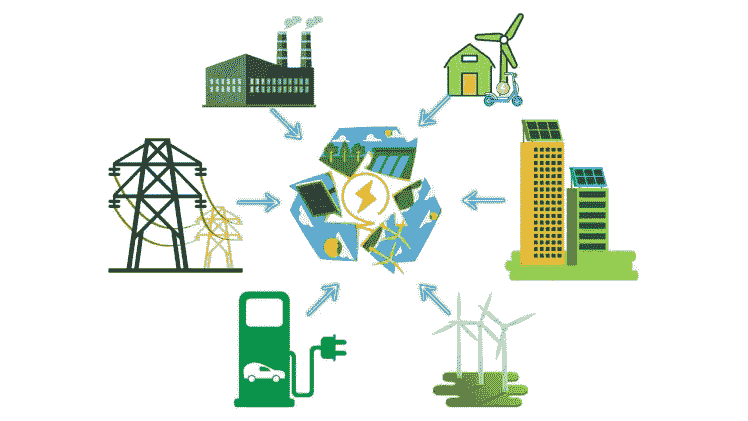

简而言之，目标是以动态方式理解和规划系统参与者带来的能源生产和/或消费干扰和波动，不仅考虑到技术方面，还考虑到参与者如何应对相关经济方面(能源成本)的变化。

**智能电网应用人工智能的挑战**

*   **数据积累不足:**没有足够的数据样本来满足多样化的人工智能技术应用的要求，样本收集可能是一个耗时的过程。
*   **可靠性:**虽然应用于电力系统的人工智能技术表现出高水平的问题识别，但它并不总是满足实际应用的要求。
*   **基础设施:**应用 AI 基于丰富的数据样本、先进的计算能力、分布式的通信协作。然而，快速生产人工智能算法和分布式协作平台等相关基础设施资源的支持能力和水平需要提高。
*   **缺乏电力行业专用算法:**相比于感知、预测、安全维护，电力系统人工智能的算法适应性仍然较弱。

# 解决办法

在这个项目中，我们将探索如何通过一个免费平台[内乌顿 TinyML](https://bit.ly/3Pmt0hY) 和一个集成的物联网平台即服务(Particle IoT)来预测电网稳定性，该平台有助于将软件应用部署到互联设备，从边缘到云，以及从云到边缘。

此外，我们还将探索此类电网运营的通信基础设施。结合人工智能和物联网的知识，我们将尝试解决上述挑战的一些部分。

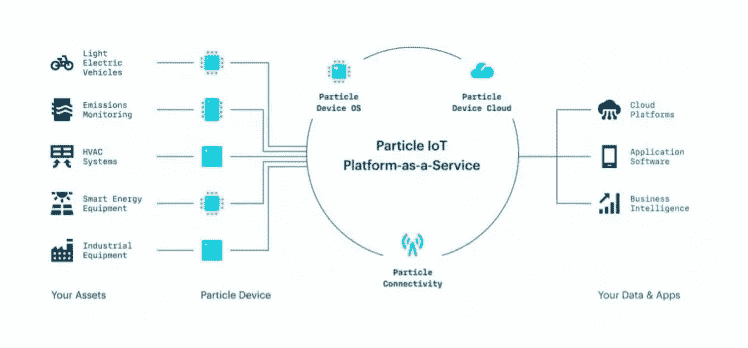

# 资料组

原始数据集包含 10，000 个观察值。它还包含 **12 个主要预测特征**和两个因变量。

**预测特征**:

*   “tau1”到“tau4”:每个网络参与者的反应时间，在 0.5 到 10 范围内的真实值(“tau1”对应于供应商节点，“tau2”到“tau4”对应于消费者节点)；
*   “p1”到“p4”:每个网络参与者产生(正)或消耗(负)的标称功率，对于消费者来说是在-2.0 到-0.5 范围内的真实值(“p2”到“p4”)。由于消耗的总功率等于产生的总功率，p1(供应商节点)=-(p2+P3+P4)；
*   “g1”到“g4”:每个网络参与者的价格弹性系数，在 0.05 到 1.00 范围内的真实值(“g1”对应于供应商节点，“g2”到“g4”对应于消费者节点；‘g’代表‘伽马’)；

**因变量**:

*   ‘stab’:特征微分方程根的最大实部(如果为正，则系统线性不稳定；如果为负，则线性稳定)；
*   “stabf”:分类(二元)标签(“稳定”或“不稳定”)。

由于“stab”和“stabf”之间存在直接关系，因此“stab”将被删除,“stabf”仍将作为唯一的因变量。下面是数据集的链接:[https://archive . ics . UCI . edu/ml/datasets/Electrical+Grid+Stability+Simulated+Data+](https://archive.ics.uci.edu/ml/datasets/Electrical+Grid+Stability+Simulated+Data+)

# 程序

**第一步:导入数据集并选择目标变量**

在内乌顿平台上，我们将上传用例的数据集，并选择“stabf”作为目标变量。

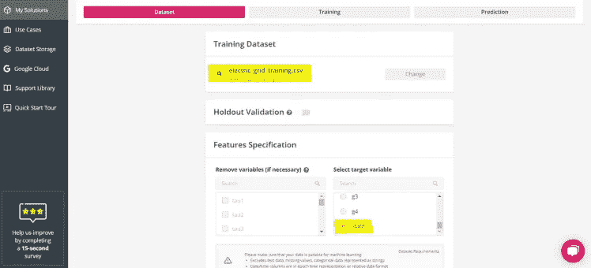

在训练参数中，设置输入数据类型 **FLOAT32** 和归一化类型**“每个特征的唯一比例”**。然后进行模型训练。

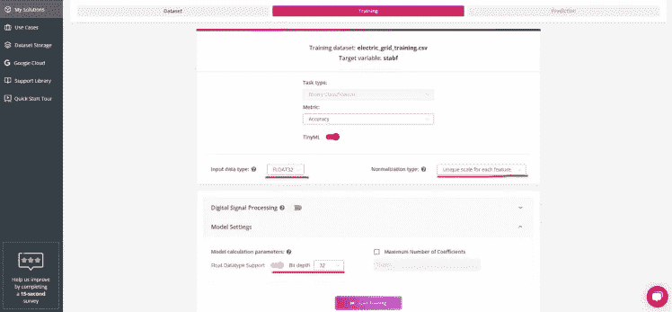

**第二步:训练和探索性数据分析**

一旦训练开始，我们就会看到模型数据分析，这有助于我们理解原始因变量和自变量之间的密切关系。

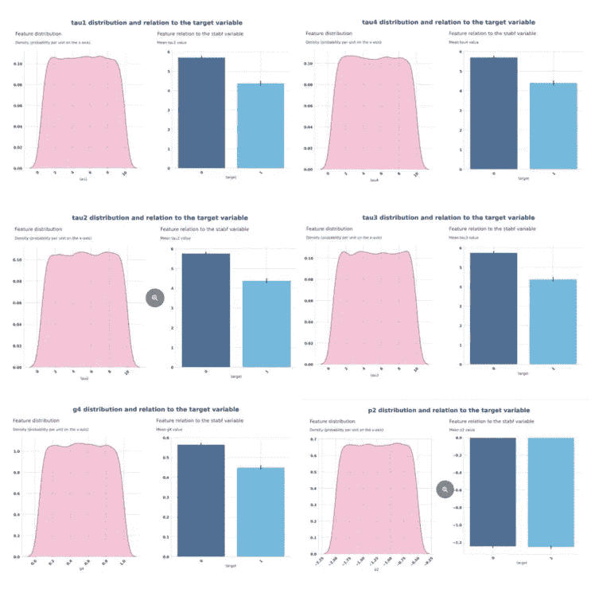

**关联:**

验证每个数字特征和因变量之间的相关性，以及导致潜在不希望的共线性的数字特征之间的相关性是很重要的。下面的热图概述了因变量(“stabf”或“target”)和与目标二元相关性最高的前 10 个数字特征之间的相关性。

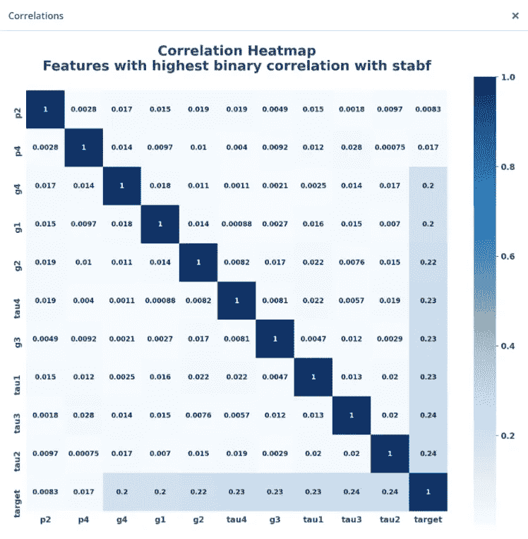

训练结束后可以看到模型度量:模型精度 **0.921435！**

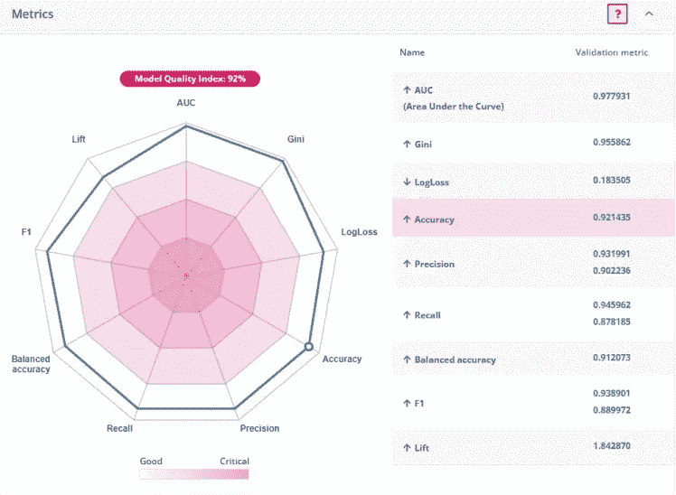

我们还可以使用生成的**混淆矩阵**来查看分类性能。

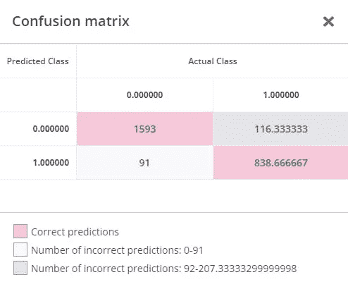

下载该模型，以便在我们的物联网设备上进一步部署。


**第三步:硬件设置和模型嵌入**

我们为这个项目选择了粒子氩板(虽然你可以使用任何粒子板，而不需要重新编程每个板)。粒子氩是一个强大的 Wi-Fi 开发工具包，你可以在 Wi-Fi 网络上使用。

Argon 配备了 Nordic nRF52840 和 Espressif ESP32 处理器，内置电池充电电路，可以更轻松地连接锂电池和 20 个混合信号 GPIOs，以便与传感器、执行器和其他电子设备接口。


粒子物联网板安全可靠，设备齐全，允许智能电网基础设施以更快、更低的速度提供电网故障的数据和更新。

**设置粒子创意和工作台:**

将下载的内乌顿模型添加到粒子工作台项目文件夹中。您的文件夹结构如下所示(校验和、解析器、协议、应用程序和统计功能)。这些文件是使用 CSV 上传工具对串行通信接收的数据进行预测所必需的。


下面是最重要的功能:

```
static float* on_dataset_sample(float* inputs)
{
 if (neuton_model_set_inputs(inputs) == 0)
  {
 uint16_t index;
 float* outputs;

 uint64_t start = micros();
 if (neuton_model_run_inference(&index, &outputs) == 0)
    {
 uint64_t stop = micros();

 uint64_t inference_time = stop - start;
 if (inference_time > max_time)
        max_time = inference_time;
 if (inference_time < min_time)
        min_time = inference_time;

 static uint64_t nInferences = 0;
 if (nInferences++ == 0)
      {
        avg_time = inference_time;
      }

else
      {
        avg_time = (avg_time * nInferences + inference_time) / (nInferences + 1);
      }

      RGB.control(true);

      RGB.color(255, 255, 255);   // white

 switch (index)
      {
 case 0:      
        Particle.publish("Prediction: Stable Grid", String(index));
        RGB.color(0, 255, 0);
 break;

 case 1:
        Particle.publish("Prediction: Unstable Grid", String(index));
        RGB.color(255, 0, 0);
 break;

 default:
 break;
      }

 return outputs;
    }
  }

 return NULL;
}
```

在云中或本地编译应用程序。编译完成后，您就可以将它刷新到您的设备上了。确保您为设备选择了正确的粒子操作系统。

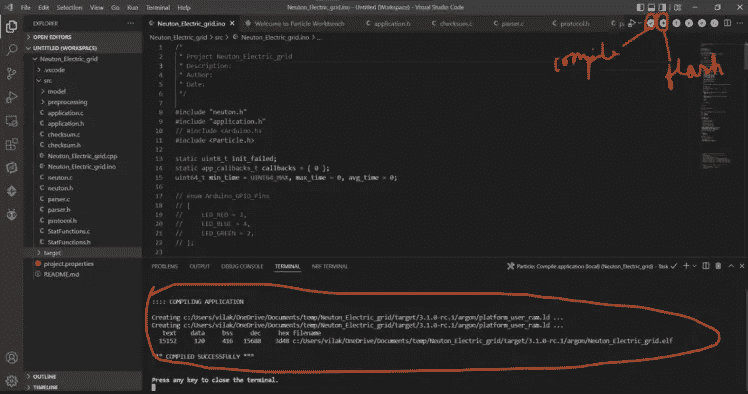

**CSV 数据上传实用程序:**

我们将通过 USB 串行端口发送测试数据集 CSV 文件中的测试数据特征来测试我们的预测。

*   安装依赖项，

```
# For Ubuntu
$ sudo apt install libuv1-dev gengetopt
# For macOS
$ brew install libuv gengetopt
```

*   克隆这个回购协议，

```
$ git clone https://github.com/Neuton-tinyML/dataset-uploader.git
$ cd dataset-uploader
```

*   运行“make”来构建二进制文件，

```
$ make
```

完成后，您可以通过 USB 发送 CSV 文件。

```
$./uploader -s /dev/ttyACM0 -b 230400 -d /home/vil/Desktop/electric_grid_test.csv
```

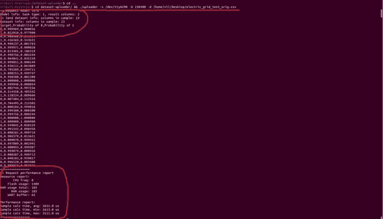

预测打印在粒子物联网云上。

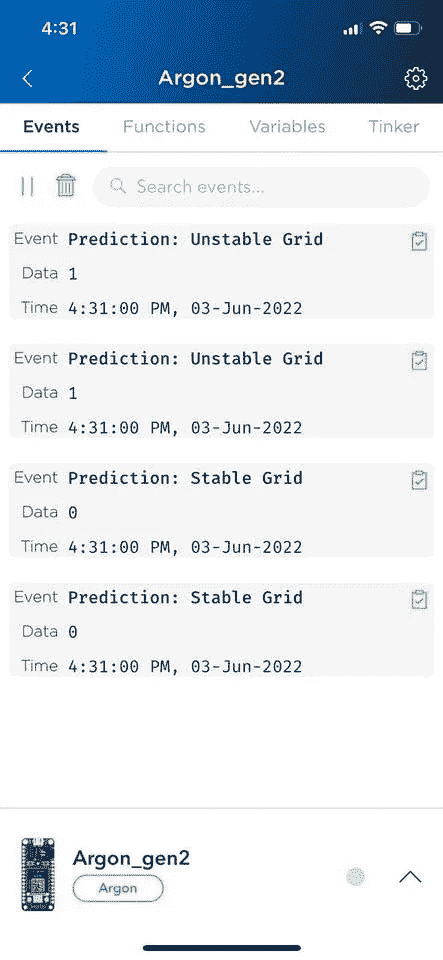

监控电网的稳定性有助于发现“不可靠”的能源，避免严重的损害。此类人工智能+物联网项目的最佳策略不仅是进行预测，还包括收集和报告数据，以改进粒子等未来设备的模型，并使 OTA 更新更容易。

[](/mlearning-ai/mlearning-ai-submission-suggestions-b51e2b130bfb) [## Mlearning.ai 提交建议

### 如何成为 Mlearning.ai 上的作家

medium.com](/mlearning-ai/mlearning-ai-submission-suggestions-b51e2b130bfb)