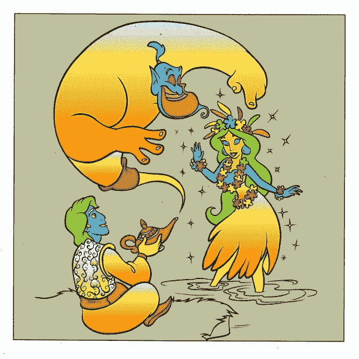

# 使用 Python 确定数据集中的熵和信息增益

> 原文：<https://medium.com/mlearning-ai/determine-entropy-and-information-gain-in-a-dataset-using-python-3036b9314825?source=collection_archive---------0----------------------->

我看了一个关于数据科学的视频，了解了一些关于如何确定事件概率的术语。引用了一个是否在户外玩游戏的用例，所以我决定写一个程序来说明这个例子。

我从 GitHub 库获得了一个数据集，可以在这里找到它…