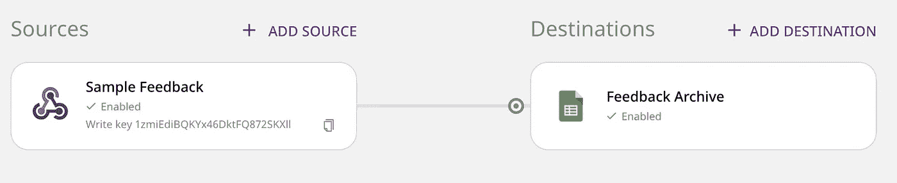
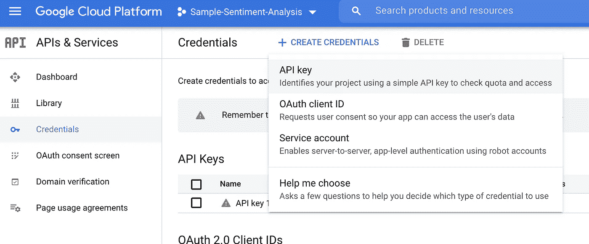
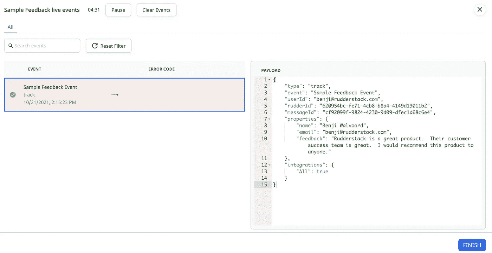
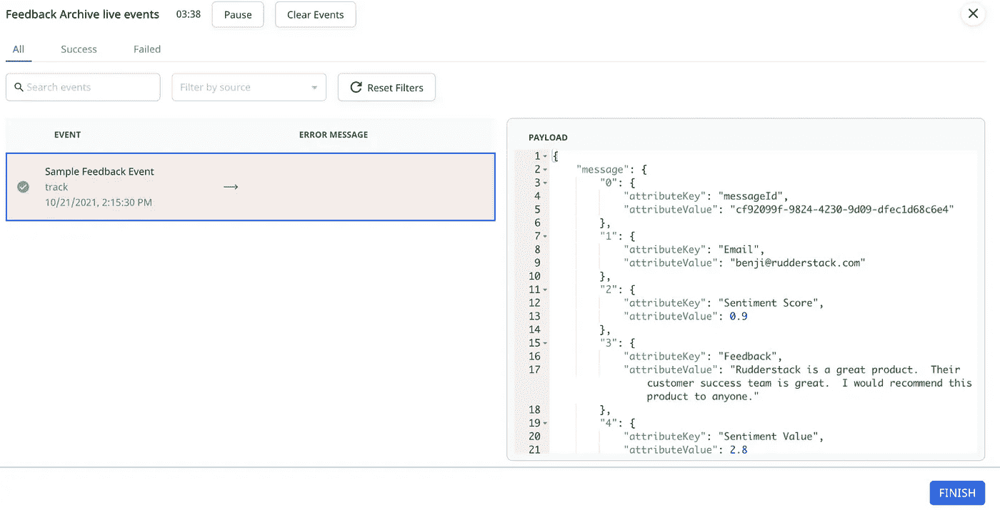
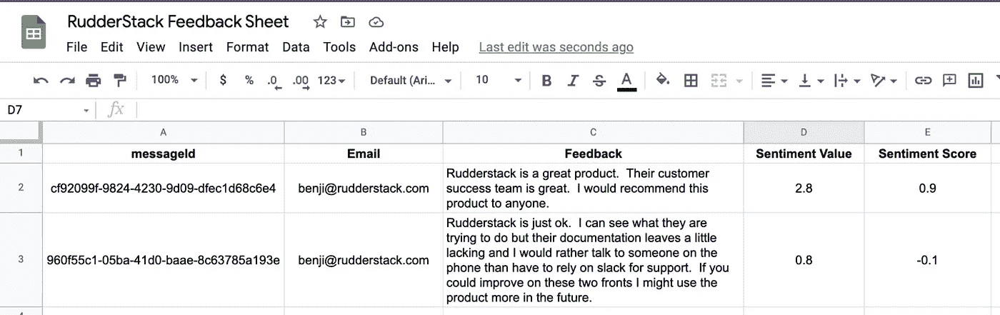
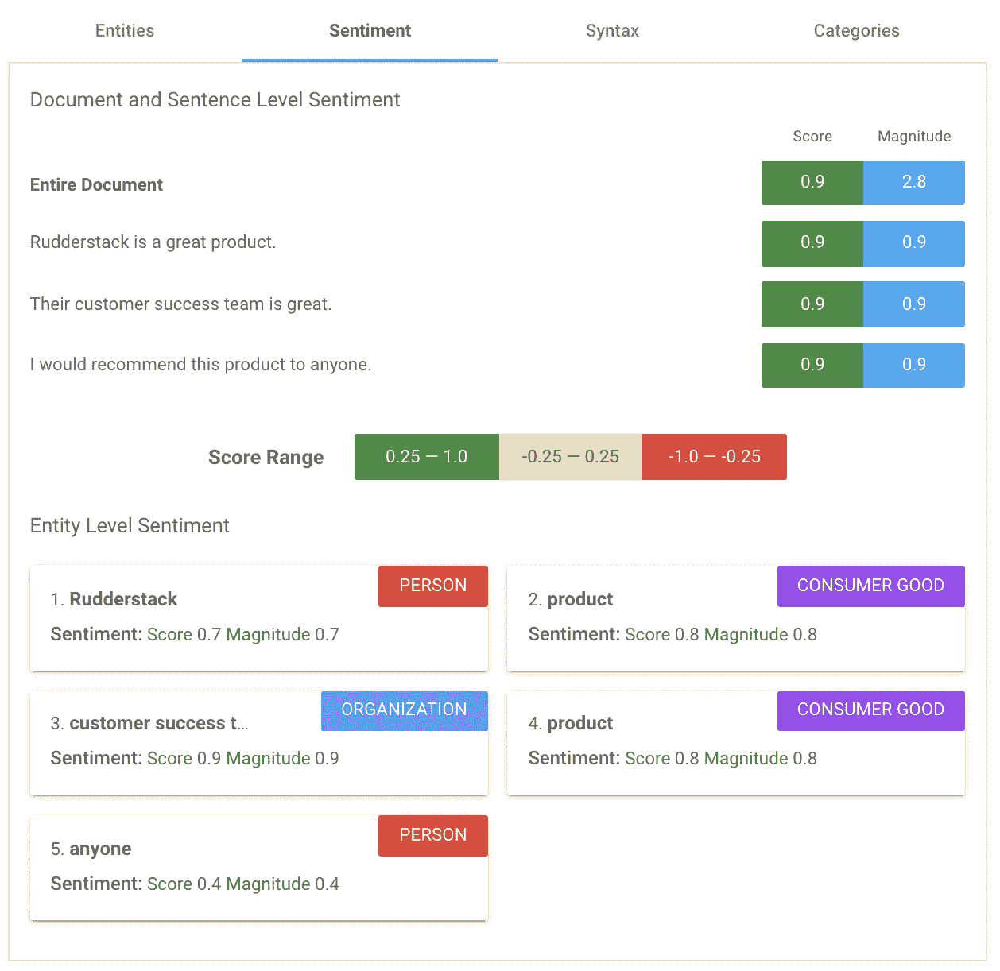

# 利用方向舵堆栈用户转换确定情感分析

> 原文：<https://medium.com/mlearning-ai/determining-sentiment-analysis-with-rudderstack-user-transformations-fd6555b94099?source=collection_archive---------7----------------------->


大多数公司都在收集用户和顾客的反馈，但从这些反馈中判断情绪并不容易。无论你是使用净推介值(NPS ),还是只是建立自己的调查，当只有一小部分被邀请的人回应时，很难衡量你的客户的感受。即便如此，异常值也可能使结果向一个或另一个方向倾斜。

因此，在 RudderStack，我们建立了一个系统来应对这些挑战，并让我们清楚地了解客户情绪。我们使用 NPS 并应用谷歌的[情绪分析 API](https://cloud.google.com/natural-language/docs/analyzing-sentiment)——可以使用方向舵堆栈用户转换来调用——来对我们通过 [Halp](https://www.atlassian.com/software/halp) 、Slack Support 和 [contact](https://rudderstack.com/contact) 表格收集的反馈进行评分。然后，可以将这个情感分数传递给数据仓库进行汇总和报告。更重要的是，它可以用于分类和升级支持票证和表单提交。

在本教程项目中，您将了解如何在您自己的堆栈中复制我们的情感分析系统。

**项目组成**

舵栈应用

*   Webhook 源
*   Google 工作表目的地
*   用户转化

谷歌项目

*   启用自然语言 API(需要链接计费帐户，但新用户可以获得 300 美元的信用)
*   Google 工作表 API 已启用
*   创建和使用 API 凭证

邮递员项目

*   本文档中包含的示例有效负载用于测试目的

# 如何用 RudderStack 构建自己的情感分析系统

# 第一步:注册方向舵堆栈

如果您还没有 RudderStack 帐户，[请在这里免费注册](https://app.rudderlabs.com/signup?type=freetrial)。对于这个项目，我们将创建一个简单的 Webhook 源，并通过 Postman 发送一些示例负载。这些将模拟从 webforms、zendesk tickets 等接收消息。

如果您是 RudderStack 的新手，请查看我们的[5 分钟内发送数据指南](https://rudderstack.com/blog/how-to-send-data-in-5-minutes-using-rudderstack)以帮助您了解应用程序和/或查看我们的文档[在 RudderStack 中创建 Webhook 源](https://rudderstack.com/docs/destinations/webhooks/)。

# 步骤 2:连接你的 Webhook 源码

将你的 Webhook 源连接到你的数据仓库，或者，如果你只是测试产品，你可以将你的结果发送到一个 [Google Sheet](https://rudderstack.com/docs/destinations/productivity/google-sheets/) 。设置好你的服务账户后，别忘了启用 [Google Sheets API](https://console.cloud.google.com/apis/library/sheets.googleapis.com?q=sheets&id=739c20c5-5641-41e8-a938-e55ddc082ad1&project=rudder-integration&supportedpurview=project) 。



我们将为我们的 Google Sheets 目的地创建一个用户转换，您可以在设置过程中创建它，或者跳过它，在您设置好 Google 项目后添加它。

# 步骤 3:创建一个谷歌云项目

创建一个谷歌云项目，并按照这些指令启用[自然语言 API。设置项目的关键步骤是 1)在项目中启用自然语言 API，并在云控制台的 API&服务](https://cloud.google.com/natural-language/docs/setup)菜单中[创建必要的凭证。(注意:API 键不在 IAM 菜单中，而是在 API 的&服务选项下)](https://cloud.google.com/docs/authentication/api-keys)



在您创建您的 API 密匙之后，将其粘贴到下面的用户转换中。

# 步骤 4:创建用户转换

通过复制下面的示例代码，创建一个用户转换来调用 Google API。

*注意:* *映射到提交中内容字段的反馈属性。如果您在 Postman 中更改了有效负载或者使用了不同的事件源，您将需要更新此映射。您可以通过在 Webhook Live Events viewer 中复制源事件有效负载并将其粘贴到“识别”窗口中，然后单击“运行测试”来测试 API。*

```
export async function transformEvent(event) {if (event.properties && event.properties.feedback){var payload = {};payload["document"] = {}payload["document"]["type"] = 'PLAIN_TEXT'payload["document"]["content"] = event.properties.feedbackpayload["encodingType"] = "UTF8"const res = await fetch("https://language.googleapis.com/v1/documents:analyzeSentiment?key=YOUR_GOOGLE_CLOUD_API_KEY", {method: "POST",body: JSON.stringify(payload)});if (res.documentSentiment && res.documentSentiment.magnitude){event.properties.sentiment_value = res.documentSentiment.magnitudeif (res.documentSentiment.score){event.properties.sentiment_score = res.documentSentiment.score}}event.response = JSON.stringify(res);}return event;}
```

来自 Webhook 源实时事件查看器的测试负载:

```
{"type": "track","event": "Sample Feedback Event","properties": {"name": "Benji Walvoord","email": "benji@rudderstack.com","feedback": "Rudderstack is a great product.  I highly recommend it.  It is my favorite SAAS product of all time."},"integrations": {"All": true}}
```

# 步骤 5:从邮递员发送样本有效负载:

Postman 是测试 RudderStack 的一个很棒的工具，尤其是在测试 Webhook 或者 SDK 源码的时候。在 postman 中，使用以下内容创建一个新的 HTTP 请求:

**方法:**Post
**URL:**<你的数据平面 URL: > /v1/track
**授权:**基本用户名:webhook_source_write_key 密码:(留白)
**正文:** Raw / JSON

样品主体:

```
{"userId": "benji@rudderstack.com","event": "Sample Feedback Event","properties": {"email": "benji@rudderstack.com","feedback": "Rudderstack is a great product.  Their customer success team is great.  I would recommend this product to anyone.","name": "Benji Walvoord"},"integrations": {"All": true}}
```

发送事件后，我们可以在源和目的地的实时事件查看器中查看它。请注意，在 Google Sheets destination 视图中，列是如何基于 Google Sheets destination 设置中的字段映射进行映射的。

Webhook 源实时事件查看器



目的地实时事件查看器



# 第六步:发送负面评论

使用相同的有效载荷但不同的反馈发送负面评论:“方向舵偏正。我可以看到他们正在尝试做什么，但他们的文档留下了一点不足，我宁愿在电话上与人交谈，而不是依赖 slack 来获得支持。如果你能在这两方面有所改进，我将来可能会更多地使用该产品。”

# 第 7 步:在谷歌表单中查看结果:



我们最初的正面反馈返回了 0.9 的情绪得分，情绪值为 2.8，而我们的第二次测试返回了-0.1 的负面得分，情绪值为 0.8。

# 第八步:如何解释结果

对结果的解释通常归结为情绪得分是正还是负以及情绪值的权重。对于解释结果的详细回顾，请查看 Google 自己文档的[解释结果](https://cloud.google.com/natural-language/docs/basics#interpreting_sentiment_analysis_values)部分。所以，让我们拿同样的正反馈例子，用 Google 的自然语言 API 演示来测试一下。这为我们提供了以下视觉效果来解释我们是如何获得分数和价值的:



文档的情感得分指示文档的方向或总体情感，而幅度指示提供了多少情感内容。一般来说，大小通常与文档或消息的长度成比例。

正如您所注意到的，在这个示例中，我们只传递整个文档结果，但是如果我们返回到用户转换，并在我们的示例有效负载上运行测试，我们将看到与上面返回的相同的逐句分析:

```
[{"type": "track","event": "Sample Feedback Event","userId": "benji@rudderstack.com","rudderId": "620954bc-fe71-4cb8-b8a4-4149d19011b2","messageId": "cf92099f-9824-4230-9d09-dfec1d68c6e4","properties": {"name": "Benji Walvoord","email": "benji@rudderstack.com","feedback": "Rudderstack is a great product.  Their customer success team is great.  I would recommend this product to anyone.","sentiment_value": 2.8,"sentiment_score": 0.9},"integrations": {"All": true},"response": "{\"documentSentiment\":{\"magnitude\":2.8,\"score\":0.9},\"language\":\"en\",\"sentences\":[{\"text\":{\"content\":\"Rudderstack is a great product.\",\"beginOffset\":0},\"sentiment\":{\"magnitude\":0.9,\"score\":0.9}},{\"text\":{\"content\":\"Their customer success team is great.\",\"beginOffset\":33},\"sentiment\":{\"magnitude\":0.9,\"score\":0.9}},{\"text\":{\"content\":\"I would recommend this product to anyone.\",\"beginOffset\":72},\"sentiment\":{\"magnitude\":0.9,\"score\":0.9}}]}"}]
```

如果我们分解来自谷歌的回复，我们可以看到它是如何与上面的图片保持一致的:

```
"{\"documentSentiment\":{\"magnitude\":2.8,\"score\":0.9},\"language\":\"en\",\"sentences\":[
{\"text\":{\"content\":\"Rudderstack is a great product.\",\"beginOffset\":0},\"sentiment\":{\"magnitude\":0.9,\"score\":0.9}},{\"text\":{\"content\":\"Their customer success team is great.\",\"beginOffset\":33},\"sentiment\":{\"magnitude\":0.9,\"score\":0.9}},{\"text\":{\"content\":\"I would recommend this product to anyone.\",\"beginOffset\":72},\"sentiment\":{\"magnitude\":0.9,\"score\":0.9}}]}"
```

# 结论

我们希望在本教程中，您已经了解了使用 RudderStack 是多么容易，以及如何利用 RudderStack 用户转换来增强您的数据。一旦你的项目建立并运行，看看其他可用的 [API 选项](https://cloud.google.com/natural-language/docs/how-to)，包括*、*、*分类语法、*和*分析语法*。如果您想了解如何使用谷歌的 AutoML 服务使用 RudderStack 来训练和测试更高级的特定行业建模，[请立即联系我们的团队](https://rudderstack.na.chilipiper.com/book/me/david-daly)。

*本博客最初发表于:* [*https://rudder stack . com/blog/determining-opinion-analysis-with-rudder stack-user-transformations*](https://rudderstack.com/blog/determining-sentiment-analysis-with-rudderstack-user-transformations)

[](/mlearning-ai/mlearning-ai-submission-suggestions-b51e2b130bfb) [## Mlearning.ai 提交建议

### 如何成为 Mlearning.ai 上的作家

medium.com](/mlearning-ai/mlearning-ai-submission-suggestions-b51e2b130bfb)