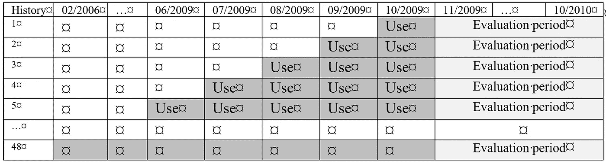
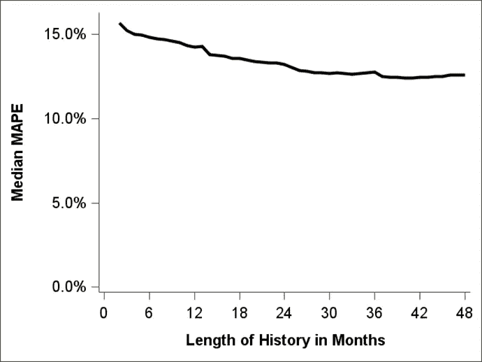
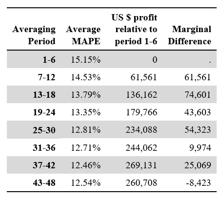
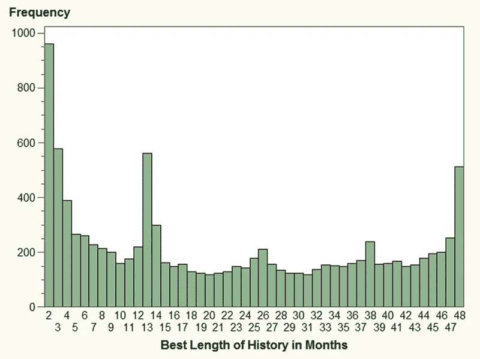

# 为时间序列预测确定时间序列数据的最佳历史长度

> 原文：<https://medium.com/mlearning-ai/determining-the-best-length-of-the-history-of-your-timeseries-data-for-timeseries-forecasting-f8600a3c086?source=collection_archive---------0----------------------->

# 介绍

本文研究了时间序列的可用数据历史长度对未来预测质量的影响。本文给出的模拟研究结果说明了长时间历史对于进行良好的时间序列预测的重要性。

本文中显示的结果基于一项模拟研究，其中可用的时间历程不断增加，并分析了相应的模型质量。因此，时间历程的长度和模型质量之间的**关系可以以可视化的方式进行研究。**

此外，对于每个时间序列和每个时间序列的不同模拟重复，选择提供最佳预测质量的时间序列的长度。在这些结果的基础上，**最佳时间历程长度**在所有时间序列例子上的分布被显示和讨论。

一般假设是，随着时间历史的增加，根据这些数据训练的预测模型的质量会提高(用 MAPE 的下降来表示)。一般来说，您可以看到数据量的增加(可用时间历史的长度)和预测质量之间的关系。

## 提前给出结论

本文展示了基于对**的模拟研究的结果，不同长度的时间序列数据如何影响预测质量**。结果与直觉相符，即平均而言，较长的时间历史会提高预测质量。

除了这些结果，还分析了时间历程的**最佳长度。将会表明，时间历程的单个最佳长度也可以很短(从 1 个月到 12 个月)。对于潜在模式变化频繁且快速的时间序列来说尤其如此，因此，较新的历史比较旧的历史更重要。**

# 模拟程序

模拟程序如下:

*   对于所有可用于分析的时间序列，时间历程被截断为长度 1。基于该 1 值数据，对接下来的 12 个时段进行预测，并根据样本外数据中的真实(未触及的)数据进行评估。
*   在下一步中，可用的时间历史被向后增加到最近 2 个月。同样，预测质量是在未来 12 个月进行评估的。
*   通过在每次迭代中增加一个额外的历史月份来重复该过程，直到达到 48 个月的最大数据历史。

Illustration of the TIME HISTORIES for the simulation environment

对于时间序列的不同起始点，也重复这一过程。这意味着上述设置在时间序列中被“移位”,以避免研究仅依赖于一个起始点的结果。

# 数据历史的可用长度

上面描述的模拟过程已经在来自不同行业的 788 个时间序列上运行，包括休闲、零售、钢铁制造、造纸以及石油和天然气生产。

此模拟的结果(关于预测模型的质量在可用历史长度上如何变化)显示在折线图中。

Median MAPE by available length of history

一般假设是，随着时间历史的增加，根据这些数据训练的预测模型的质量会提高(用 MAPE 的下降来表示)。总的来说，我们希望看到数据量的增加(可用时间历史的长度)和预测质量之间的关系。

X 轴代表相应的可用历史月份数。Y 轴代表所有时间序列和所有轮班方案的 MAPE 中值。

下图显示了与上述相同的线图；但是，它具有不同的 Y 轴刻度，可以更详细地了解线条的特征。它更真实地展现了 MAPE 随着时间的推移而发生的相对变化。

Median MAPE by available length of history (different Y-axis scaling)

从图表中，您可以看到 MAPE 随着时间历史中可用月份的增加而减少。更详细地研究生产线的路线，您可以看到以下特征:

*   从第 2 个月到第 4 个月有一个陡峭的下降，这表明至少需要几个月才能在某种程度上预测序列的平均水平。
*   该线在第 12 个月之前进一步下降，表明每个额外月份的相对贡献在这里起着重要作用，因为只有很短的时间历史可用。
*   从第 12 个月到第 13 个月，当季节性周期的第一次重复开始时，可以再次看到急剧下降。从这里开始，时间序列的季节性细节可以集成到模型中。
*   MAPE 线进一步下降，显示在第 24 个月之后再次下降，其中在数据中可获得完整的第二周期。
*   这在第三个完整赛季后的第 36 个月重复。X 轴边缘处的潜在增加也可能是由于数据伪影造成的，应该不重要。

对每个时间历史长度的 MAPE 统计数据的四分位间距分析也显示了变异性的降低(6 个月:14.7%，18 个月:12.9%，30 个月:12.5%，42 个月:12.2%)。这表明随着历史长度的增加，预测误差平均减少，结果的稳定性增加。

# 解释

线形图中显示的结果符合直觉，即平均而言，随着可用时间历史方面数据量的增加，预测模型的质量也会提高。

还可以看出，前两个完整年份的可用性表明对模型质量的巨大贡献。额外的几个月仍然提供质量改进，但是相对较低。此外，这个发现是直观的:当只有几个月可供分析时，对模型质量的边际影响更高。

# 商业案例计算

一个虚构的参考公司用于计算不同模拟场景结果的业务案例。预测质量的变化转化为避免过度预测和预测不足的量化，相应的利润以美元表示。

这样做是为了说明不同数据质量变化的影响。以美元为单位的数字应仅被视为基于模拟情景假设和所述商业案例的粗略指示。在个别情况下，这些价值和关系有些不同。业务案例允许您比较不同模拟场景中的结果，并使结果和发现更加明显。

## 参考公司质量数据通信

咨询公司“Quality DataCom”从事通信业务。该公司拥有一条生产和销售面向最终用户设备的电子配件的业务线，可进行批发和零售。该公司生产 10，000 种产品出售给客户。对于这些产品中的每一种，平均每月售出 1000 件。这导致每月销售总量达到 10，000，000 台。

Quality DataCom 目前的平均绝对百分比误差(MAPE)率为 15%。这意味着预测平均总共偏离 1，500，000 个单位。

提高预测质量的好处是避免缺货情况，即每单位损失 1 美元的利润。此外，由于过多的库存和运输以及生产非销售商品，过度预测会造成 1 美元的损失。

因此，MAPE 从 15%到 14%下降一个百分点，为该公司产生 10，000，000 单位的额外利润，乘以 1%的预测误差差，等于预测误差减少 100，000 单位。将其乘以 1 美元，得出月利润为 100，000 美元。因此，MAPE 每降低 1 个百分点，每年可获得 120 万美元的利润。

## 量化较长数据历史的价值

将这些结果与参考公司相关联表明，在时间历史中，对于每个额外的可用月份，可以获得额外的每月 6350 美元的利润。

Average MAPE values plus the financial impact for the business case

该表显示了平均 MAPE 值以及对虚构的参考公司 Quality DataCom 的财务影响。商业案例的价值以相对于 1-6 个月的绝对值显示。因此，平均 7-12 个月的时间段在业务案例中确定了额外实现的 61，561 美元的 MAPE。最后一列显示了从一个可用性范围转移到另一个可用性范围时的边际收益。

# 分析可用时间历程的最佳长度

## 模拟程序

对于每个时间序列，对不同长度的时间历史的预测已经被训练。基于这些结果，对于每个时间序列，可以确定对未来时段的最佳预测的最佳历史长度。

这导致时间历史的分布，该分布为特定时间历史和偏移提供具有最小 MAPE 的模型。

Bar chart for the optimal length of data history

从柱状图中，你可以看到

*   最佳历史值的范围从 2 到 48，其中每个单独的历史长度以合理的频率表示。
*   第二年、第三年和第四年开始时的峰值表明，在某些模拟中，下一个季节周期的信息可用性对模型很重要。

> 没有明确的迹象表明，最好的预测总是在最长的可用历史上进行的。

*   在从 2 到 12 的范围内存在(令人惊讶的)高值累积。这意味着大约三分之一的模拟案例(35.68%)中，12 个月或更短的时间历史产生了最好的预测。

Best length of available history grouped by half-years

*   从表中的数据可以看出，在一半(49.91%)的模拟案例中，时间历程的最佳长度小于 1.5 年。大约三分之一的模拟案例在超过 2.5 年的时间历程中取得了最佳结果。

# 解释

> 结果非常接近模拟数据的背景。对于最佳时间长度相对较短(最长 12 个月或 18 个月)的模拟情况，来自较早时间段的附加信息不会提高预测质量。相反，它降低了它的等级。

从商业的角度来看，从零售中提取的时间序列经常是这种情况，其中需求模式显示出波动的行为。这里，只有最近几个月描述了最近的行为。在这种情况下，第 1 个月到第 12 个月的数据的最新图片胜过通过重复数据中的季节性周期最终获得的额外好处。

# 结论

本文展示了基于模拟研究**的结果，这些模拟研究是关于不同长度的时间序列数据如何影响预测质量**。折线图中显示的结果符合直觉，即平均而言，较长的时间历史会提高预测质量。该图还显示了如果已经有了更长的时间历史，额外几个月的边际收益的下降。还可以看到完成另一个季节循环的步骤。它们也符合直觉。

除了这些结果，还分析了时程的**最佳长度。已经表明，时间历程的个体最佳长度也可以非常短(从 1 到 12 个月)。对于潜在模式变化频繁且快速的时间序列来说尤其如此，因此，较新的历史比较旧的历史更重要。**

# 数据相关性

这一发现也提到了“数据相关性”的话题。让相关数据可用于分析也是数据质量的一个特征。然而，数据相关性在大多数情况下被理解为需要有可用的相关数据，就像访问额外的数据源一样。数据质量问题通常是“没有相关的数据”

这里遇到的数据相关性问题有些不同。由于时间历史的长度和来自更早时期的信息，可能有太多的数据和信息可用，这些数据和信息不像最近的数据那样与预测未来相关。

因此，分析师的任务是确保只使用可用数据中的相关部分。虽然这是预测建模中执行变量选择的典型任务，但在研究时间序列预测的最佳时间历史长度时，这种情况很少发生。

本文强调了在时间序列预测中仔细分析时间历史最优长度的必要性。为了便于单独分析数据，附录 D 中提供了用于运行这些模拟的部分程序，可以下载。

# 时间序列数据的自我评估

参考 SAS 社区文章:[使用%TS_HISTORY_CHECK 宏](https://communities.sas.com/t5/SAS-Communities-Library/Determine-the-best-length-of-the-history-of-your-timeseries-data/ta-p/790754)确定时间序列数据历史的最佳长度，在这里您可以找到一个 SAS 宏，它允许评估您的单个时间序列数据。

此宏可用于分析如上所示的最佳历史长度，以及数据历史长度和预测质量之间关系的折线图。

# 链接和下载

量化不同长度的数据历史在时间序列预测中的影响

数据科学的 [**数据准备**](https://www.youtube.com/playlist?list=PLdMxv2SumIKsqedLBq0t_a2_6d7jZ6Akq) 网络研讨会包含更多关于该主题的内容。

SAS 社区文章:[使用%TS_HISTORY_CHECK 宏](https://communities.sas.com/t5/SAS-Communities-Library/Determine-the-best-length-of-the-history-of-your-timeseries-data/ta-p/790754)确定时间序列数据的最佳历史长度

网络研讨会:[使用多元统计数据深入了解预测误差](https://www.youtube.com/watch?v=d6T4geQFzzk&list=PLdMxv2SumIKs0A2cQLeXg1xb9OVE8e2Yq&index=12)

我的[幻灯片收藏](https://github.com/gerhard1050/DataScience-Presentations-By-Gerhard)中的第 102 号演示文稿包含更多关于这个主题的视觉效果。

我的 SAS 出版社书籍“[使用 SAS](https://github.com/gerhard1050/Data-Quality-for-Data-Science-Using-SAS#readme) 进行分析的数据质量”中的第 20 章和第 21 章更详细地讨论了这些主题。

 [## Mlearning.ai 提交建议

### 如何成为 Mlearning.ai 上的作家

medium.com](/mlearning-ai/mlearning-ai-submission-suggestions-b51e2b130bfb)