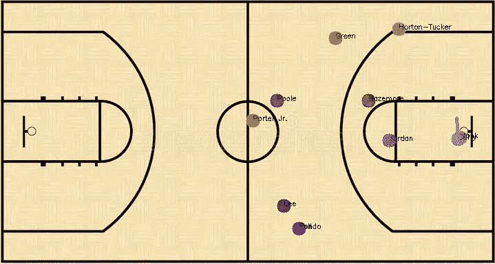
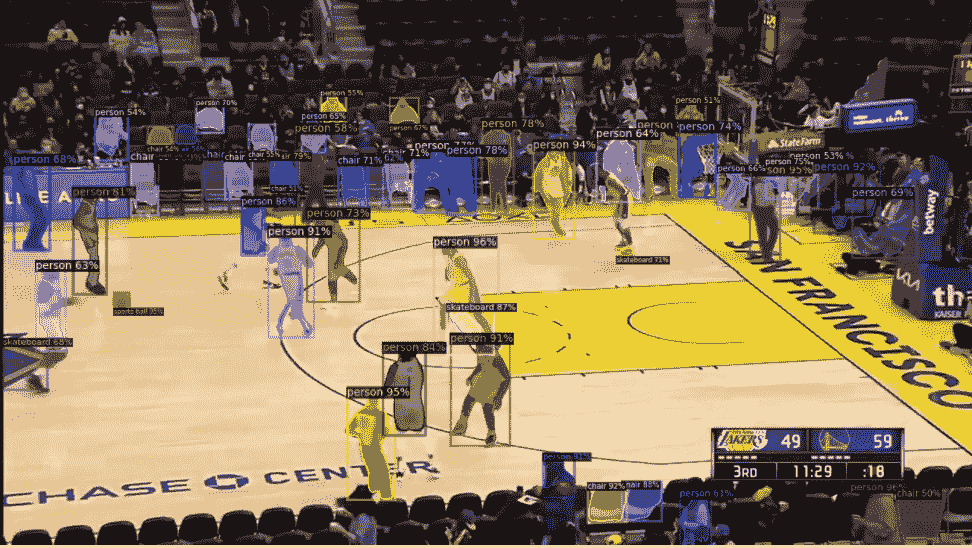
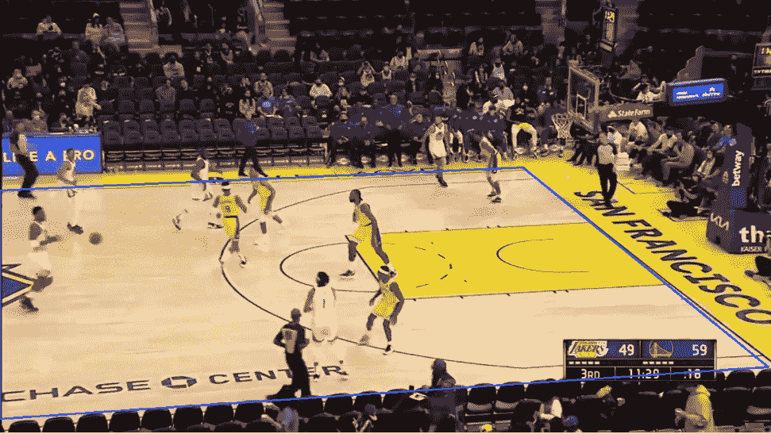
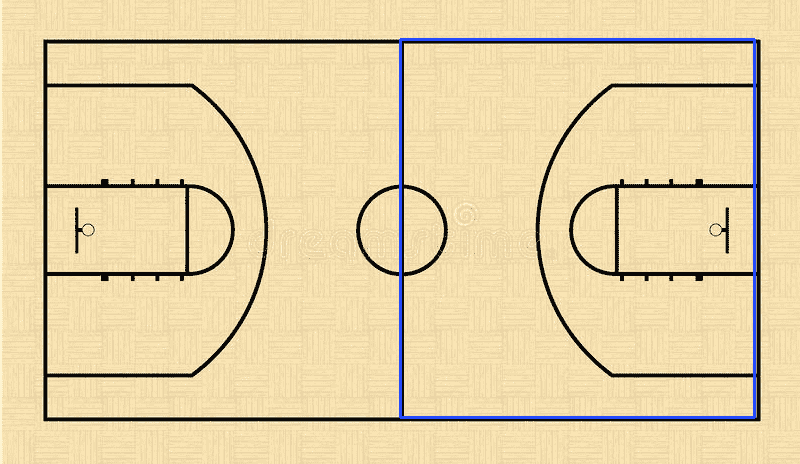
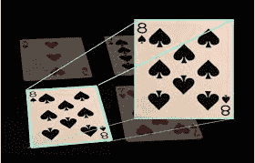
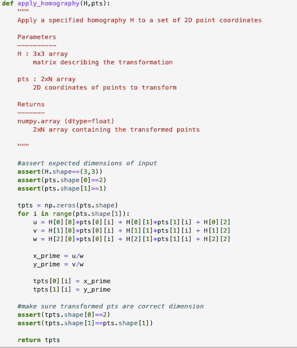
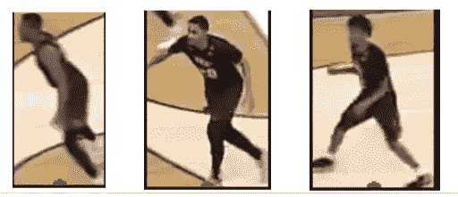
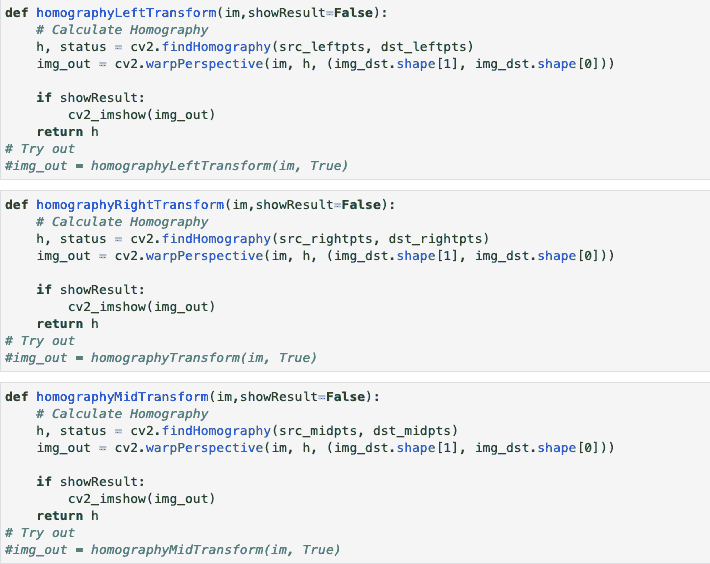
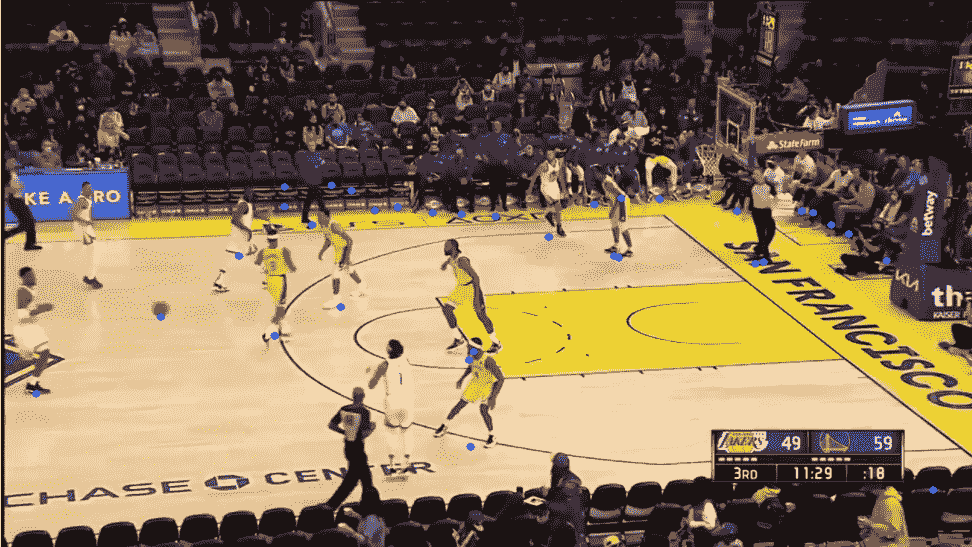
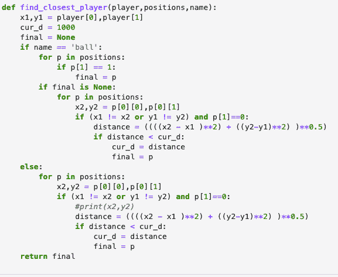

# 使用广播数据和应用单应性开发用于运动员跟踪的篮球小地图

> 原文：<https://medium.com/mlearning-ai/developing-a-basketball-minimap-for-player-tracking-using-broadcast-data-and-applied-homography-433183b9b995?source=collection_archive---------1----------------------->

如果你最近看过 ESPN 关于斯蒂芬·库里的视频，分析师通常会提到库里有巨大的耐力，因为他在昨晚的比赛中跑了 2.7 英里。这些分析师如何准确知道一个球员在球场上移动了多少？有几个原因。首先，NBA 已经开始放置来自第三方来源的球员跟踪设备，如 Kinexon。这些设备跟踪代表玩家相对于观众的位置的实时三维坐标。第二种方式是 NBA 设置摄像机捕捉球场的多个视图，并使用一种称为单应和球员检测的概念来捕捉球员在球场上的移动。球员跟踪已经成为体育界的一个大现象，因为它允许数据科学家根据球员在球场上的移动方式对球员的影响进行更深入的分析。

例如，团队可以合并逐场比赛数据和球员跟踪模拟，以添加球员在球场上的影响的背景。现在，如果你有一个像德雷蒙德·格林这样的球员，你可以想象他的能力，堵塞切割道，在转换中摆脱出来，并设置有效的屏幕。与实际的比赛电影相比，这些模拟在二维层面上更容易可视化，因为实际的比赛电影中广播角度无法有效地捕捉球场上的空间。本研究项目旨在探索单应性在 YouTube 篮球比赛转播片段中的应用，以创建一个二维模拟小地图。

什么是单应性？单应是一种变换，因为我们利用投影来关联两个图像。本质上，单应是同一场景的两个图像之间的变换，但是从不同的角度。虽然 NBA 从许多不同的位置捕捉图像来确定球场上的球员，但许多高中比赛和一些大学比赛只是从广播角度捕捉的。因此，我想探索在广播画面上应用单应性来跟踪球员在球场上的运动的有效性。这可以用来测量某些球员之间的距离，以及帮助教练和球队教员通过使用 2D 模拟与实际比赛镜头一起更容易地分解电影。

为了跟踪玩家，我需要安装一些特定的 python 库和包。这个项目利用 pytorch 和 COCO 数据集。PyTorch 是一个广泛使用的深度学习库，用于对象检测。PyTorch 运行 detectron2，这是一个由脸书(Meta)构建的开源对象检测算法。我在 COCO 数据集上对它进行了训练，该数据集有一组经过预处理并可由对象检测算法识别的对象。当我将 detectron2 可视化工具应用于一场 NBA 比赛的一个初始帧时，我得到了下面的图像。

现在探测器 2 可以探测到球和球员，我需要通过只捕捉球场内的球员来减少噪音。下一步是在我们的图像上绘制视觉边界，并将其映射到 2D 的一个篮球场上，这将用于我们的小地图。这个想法是在球场边界内应用物体检测，这样我就只跟踪合法的球员，而不是边线上的球迷、教练或裁判。代表球场角落的源点将映射到代表下面显示的 2D 球场图像角落的目标点上。

Input Right Boundary Image

Output Right Boundary Image

要理解这个功能，让我们参考左边卡片的图片。该卡显示在一个三维水平，但我利用单应变换在 2D 平面。连接源点和目标点的线表示为矢量。这些是被重构的向量。

从这里开始，我将单应函数应用到一组点上，将一个 3D 向量转换成一个 2D 数组，表示法院图像上指定区域内的一个位置。应用单应函数如下所示。

detectron2 算法利用 DefaultPredictor.predictor 方法返回每个已识别对象的预测框列表。对象类存储在预测类中，其中人对象标记为 0，而球标记为 32。对于每一个预测的对象，无论是运动员还是球，我都将预测框的尺寸以及表示运动员位置的转换后的数据点存储在一个字典中。然后将字典传递给另一个函数，根据预测框的尺寸在所有被捕获的玩家周围创建单独的图像。下面是捕获图像的输出示例。

当我最初开发管道时，我想使用球员图像来捕获和评估球衣上的图像像素样本，以将球员分为主队或客场队。然而，我注意到 Youtube 广播数据没有很高的分辨率，此外，当一帧图像是在球员移动身体的过程中捕捉到的，捕捉到的像素不是很清晰。这导致了玩家分类阶段的问题，这使我把注意力集中在一组定义好的玩家的个人玩家跟踪上。

仅使用广播数据的一个主要问题是，当球员集体移动到球场的另一侧时，单个摄像机现在正在移动，并且单应性的维度发生变化。因此，我必须创建三个独立的单应变换算法来封装整个法庭。我对输入视频中的帧进行了硬编码，其中应该使用正确的单应变换函数。这三个转换如下所示。

正如你所看到的，我们的函数将每一帧作为一幅图像，并使用 OpenCV，一个用于计算机视觉、机器学习和图像处理的巨大开源库，将源点的向量转换到前面显示的 2D 法院图像上。

一旦图像和它们的 2D 播放器位置被捕获，下一步就是添加更多的约束来减少输出视频中的噪声。虽然我使用 Shapely(一个用于分析平面几何对象的 python 包)来检查球员对象是否在球场内，但它仍然可能会发现坐在边线上的球迷，因为只有一个摄像机角度会很难在球场周围绘制几何边界。以此帧为例，查看拾取的“噪声”量。蓝点代表应该在球场上的球员。

在球员坐标上建立阈值，以双重检查他们是否真的在球场边界内。一旦我减少了噪声，我就在输入视频的早期选择一个特定的帧来捕捉球场上的初始球员并存储他们。这一部分是必要的，因为我没有访问玩家跟踪设备，所以我需要手动参考每个玩家最初。

一旦存储了初始玩家和他们的初始位置，我继续从输入视频中抓取每一帧，并通过数据管道将其传送到存储新位置的集合。我调用一个函数来查找与我拥有的每个玩家最接近的玩家。具有玩家位置的原始散列表被新的最接近的位置替换，并且玩家沿着连接初始位置和新位置的线被绘制到 2D 球场图像上。所收集的位置的临时列表现在被重置，并将在传递到 find_closest_player 函数之前捕获另外 3 帧的位置。

OpenCV 使用视频写入器来写入这些改变的帧，一旦视频被完全处理，视频写入器将关闭，篮球小地图就完成了。完成的小地图输出如下所示。OpenCV 相当直观，允许开发人员设置每秒帧数的速度来提高或降低速度。我将我的视频设置为 6 fps，这样球员的动作就非常容易看到。以下是输入和小地图输出:

改进这个项目的最好方法是在被捕获的玩家周围获得质量更好的图像。一旦实现了这一点，RGB 像素评估将产生更准确的结果，并对主客场球员的正确数量进行分类。这将提高玩家跟踪的准确性，因为我可以区分主场和客场玩家，而不仅仅是哪个玩家最接近原始玩家的位置。

另一个可以进一步研究的方面是如何检测视频何时应该在左、右和中间边界之间切换。现在，我正在手动输入哪些帧来切换单应变换算法。但随着检测能力的提高，当大多数球员在球场上的不同边界上时，它可能会检测到，然后自动切换平面状态。这将完全自动化管道，并允许我们不硬编码的初始位置。

**注意:**有关该项目的全面实施的更多信息，请访问下面的 GitHub 链接。如果你想联系或合作，请随时通过 LinkedIn 联系我。

 [## GitHub-gauravmohan 1/Basketball _ 单应

### 初始输入视频放在视频文件夹中。然后我们安装我们的依赖项。这包括检测器 2 和…

github.com](https://github.com/GauravMohan1/Basketball_Homography/)  [## 加州大学欧文分校唐纳德·布伦信息和通信学院本科生研究助理

### 你好！我是 UCI 大学商业/计算机科学专业四年级新生。我有创建功能的经验…

www.linkedin.com](https://www.linkedin.com/in/gaurav-mohan/)  [## Mlearning.ai 提交建议

### 如何成为 Mlearning.ai 上的作家

medium.com](/mlearning-ai/mlearning-ai-submission-suggestions-b51e2b130bfb)