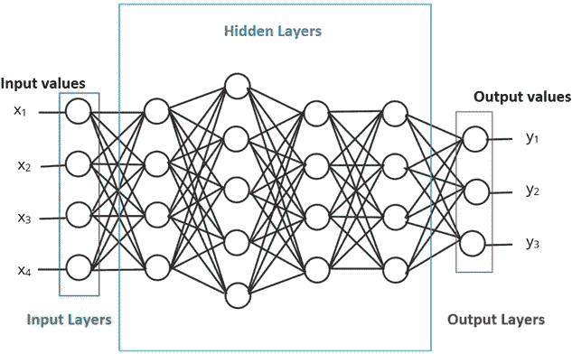
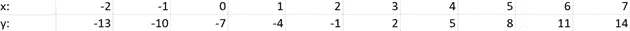
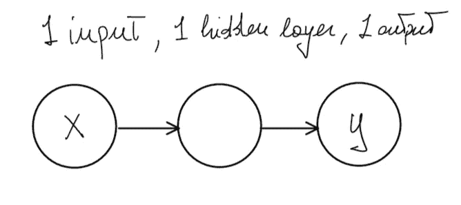

# 用 TensorFlow 开发第一个神经网络

> 原文：<https://medium.com/mlearning-ai/developing-the-first-neural-network-with-tensorflow-5fade1a23395?source=collection_archive---------5----------------------->

# 介绍

在本文中，我将解释什么是神经网络，以及如何通过 Google Colab 使用 TensorFlow 库实现它。

## 你需要知道的是

为了能够理解这篇文章，如果你有一些 Python (Numpy 库)和机器学习方面的知识会更好。

# 机器学习

> *机器学习是一个研究领域，它赋予计算机自动学习和根据经验改进的能力，而无需显式编程*。

**换句话说，人工智能的这个分支** **用数据来回答问题。**过去，我们一直手动分析由人、计算机、电话和其他设备生成的数据，但近年来，数据量呈指数级增长，传统方法难以处理。

这就是机器学习发挥作用的地方，它可以用来自动从这些数据中学习，这样我们就可以从这些海量的信息中理解。

# 神经网络

神经网络是一种可以被训练来识别模式的模型。它由层组成，包括输入层和输出层，以及至少一个隐层，其中**深度神经网络**包含一个以上的隐层。每一层中的神经元学习越来越抽象的数据表示和特征，使得对数据进行分类成为可能。



## 训练神经网络

通过**梯度下降**训练神经网络。每一层中的权重从随机值开始，随着时间的推移，这些权重被迭代地改进，以使网络更加精确。一个**损失函数**用于量化网络有多不准确，一个称为**反向传播**的程序用于确定是否应该增加或减少每个权重以减少损失。

## 开发神经网络

**Python** 是创建机器学习算法最流行的编程语言之一。今天，神经网络可以在不精确知道训练如何工作的情况下使用。事实上，大多数现代机器学习库已经极大地自动化了训练过程。我要介绍的使用的库是 Google 的 **TensorFlow。**

# 张量流

TensorFlow 是 Google 开发的一个开源库，主要用于机器学习应用程序，可以轻松构建和部署 ML 模型。

> **张量流**这个名字来源于这种神经网络对多维数据阵列执行的操作，这些数据阵列被称为**张量**，在处理大量数据时非常方便。

# 科拉布

Colaboratory 是 Google 的产品，类似于 Jupyter notebook，允许通过浏览器编写和执行 python 代码。它非常适合机器学习，因为它提供了对包括 GPU 在内的计算资源的免费访问。

正常情况下 **TensorFlow 库**需要安装并导入才能使用，但是**在 Google Colab 上是“随时可用”的，我们只需要导入它**！

```
# Import TensorFlow
import tensorflow as tf
```

## 模型定义

我们将开发的第一个模型将会非常简单，但理解如何**创建、配置、训练模型并最终用它来给我们一个预测将会非常有用。**

假设我们有以下几组数字。我们想创建一个神经网络来理解它们之间的关系。



你可能已经注意到，关系是由下面的函数定义的:y=3x-7。

对于每个机器学习应用程序，第一步是**收集数据**:所以让我们将 x 和 y 的值保存在两个不同的 **numpy 数组**中。

```
# Import numpy
import numpy as np# y = 3x -7
x = np.array([-1.0, 0.0, 1.0, 2.0, 3.0, 4.0, 5.0], dtype=float)
y = np.array([-10.0, -7.0, -4.0, -1.0, 2.0, 5.0, 7.0], dtype=float)
```

## **创建最简单的神经网络:**

我们可以创建的最简单的神经网络只有一个输入、一个输出和一个只有一个节点的隐藏层。



为了使用 TensorFlow 创建这样的模型，我们首先将神经网络定义为顺序的，这意味着它将具有一系列层，然后我们只需向它添加一个密集层，它将代表我们的隐藏层

```
from tensorflow.keras.layers import Densemodel = tf.keras.Sequential([Dense(units=1, input_shape=[1])])
```

一旦**创建了**模型，就可以用 **model.compile()，**配置损失和指标，可以用 **model.fit()，**用 **model.evaluate()** 对模型进行训练，用 **model.predict()进行预测。**

```
model.compile(optimizer='sgd', loss='mean_squared_error')
model.fit(x, y, epochs=500)
print(model.predict([25.0]))
```

打印出来的数值不是 68 而是 67.997734，为什么会这样？因为神经网络处理概率，给定输入到模型中的 7 个点，它理解 x 和 y 之间的关系是 y =3x-7，具有很高的概率，但是 7 个点不足以确定，所以它预测点 25 非常接近 68，但是不一定是 68。

## 完整代码

在这里你可以看到完整的代码或者通过 Google Colab 试试看:

## 下一步是什么？

在下一篇文章中，我将展示如何为图像分类开发一个更复杂的神经网络，以及如何使用 Google Colab 来加速训练过程。