# 使用机器学习的钻石定价

> 原文：<https://medium.com/mlearning-ai/diamonds-pricing-using-machine-learning-9e97064e6353?source=collection_archive---------2----------------------->

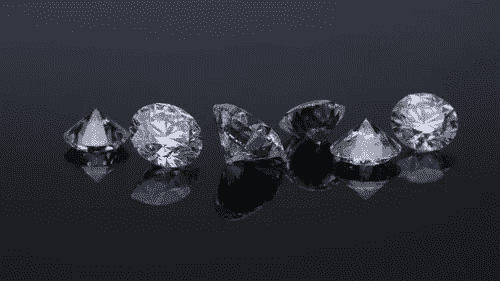

photo by [Edgar Soto](https://unsplash.com/@edgardo1987) unsplash

# 正在导入所需的库。

```
from sklearn.ensemble import RandomForestRegressor, AdaBoostRegressor, ExtraTreesRegressor, GradientBoostingRegressor
from sklearn.metrics import mean_squared_error, r2_score,mean_absolute_error 
from sklearn.model_selection import cross_val_score
from sklearn.model_selection import train_test_split
from sklearn.linear_model import LinearRegression
import matplotlib.pyplot as plt
from sklearn import ensemble
import sklearn.naive_bayes
import seaborn as sns
import pandas as pd
import sklearn
```

# 加载数据集

```
data_path= 'datasets/diamonds.csv'
diamonds_org = pd.read_csv(data_path)
diamonds_org.head()
```

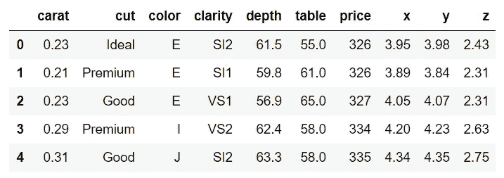

# 检查 Nan 值

```
diamonds_org.isnull().sum()
```

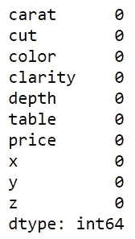

# 检查每列中的唯一值

```
diamonds_org[‘carat’].unique()
```

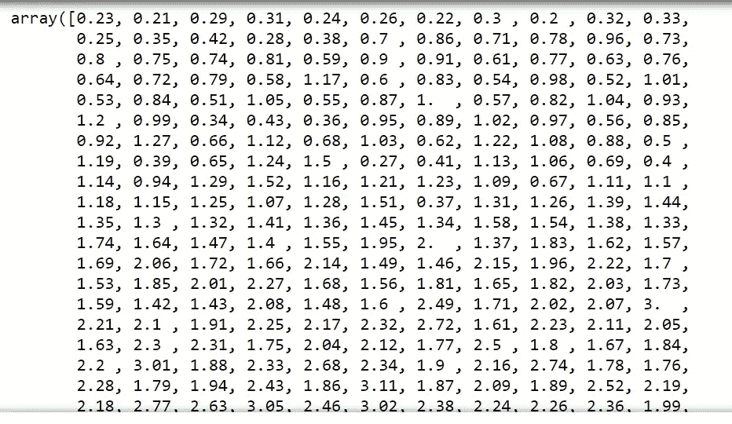

```
diamonds_org[‘clarity’].unique()
```

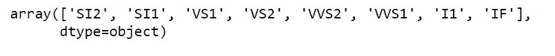

```
diamonds_org['cut'].unique()
```

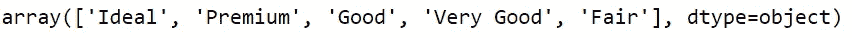

```
diamonds_org['depth'].unique()
```

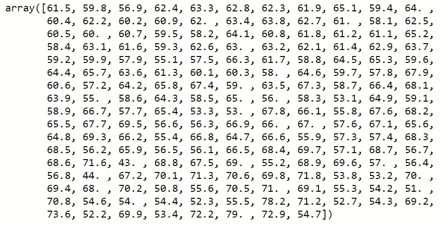

```
diamonds_org['table'].unique()
```

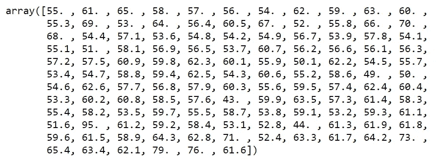

```
diamonds_org.loc[(diamonds_org[‘x’]<=0) | (diamonds_org[‘y’]<=0) | (diamonds_org[‘z’]<=0)]
```

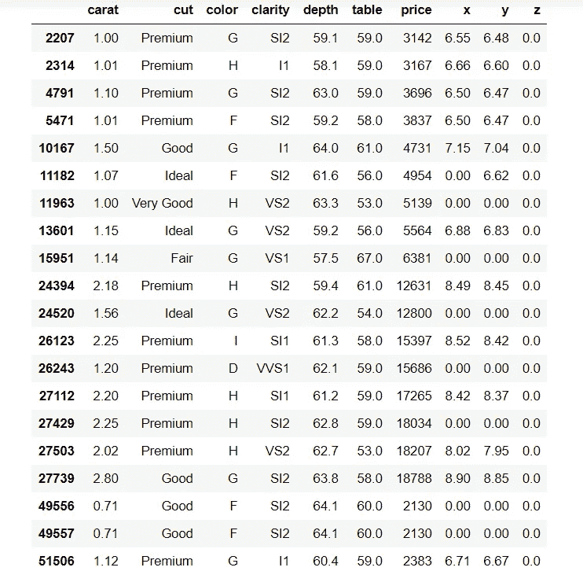

长度、宽度或高度中的任何一个为零都没有任何意义。但是我们可以看到有些行的值为“0”。因此，让我们从数据框中移除这些行。

```
len(diamonds_org[(diamonds_org['x']<=0) | (diamonds_org['y']<=0) | (diamonds_org['z']<=0)])
```

产量:20

```
diamonds_org = diamonds_org[(diamonds_org[[‘x’,’y’,’z’]] != 0).all(axis=1)]
```

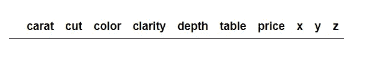

从上面的数据帧中，我们可以看到它包含以下特征:

```
1\. carat
2\. cut
3\. color
4\. depth 
5\. table 
6\. price 
7\. x (length in mm) 
8\. y (width in mm) 
9\. z (height in mm)
```

7，8，9 个属性并合并成单个属性为 volume，为 volume = x *y* z，做法如下。

```
diamonds_org[‘volume’] = diamonds_org[‘x’]*diamonds_org[‘y’]*diamonds_org[‘z’]
diamonds_org[:5]
```

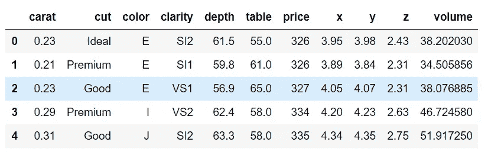

现在不需要 x、y、z，因为它们被合并到单个柱体积中。所以我们要删除这些列。

```
diamonds_org = diamonds_org.drop(['x', 'y', 'z'], axis=1)
diamonds_org[:5]
```

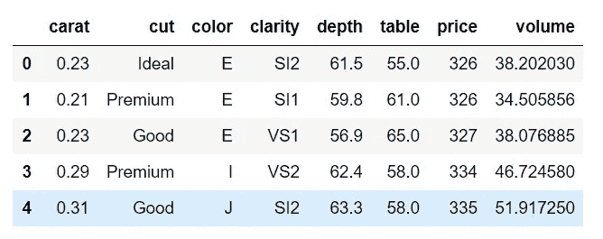

# 特征之间的相关性

```
sns.set(rc={'figure.figsize':(6,6)})
corr = diamonds_org.corr()
sns.heatmap(data=corr, square=True , annot=True, cbar=True, cmap="YlGnBu")
```

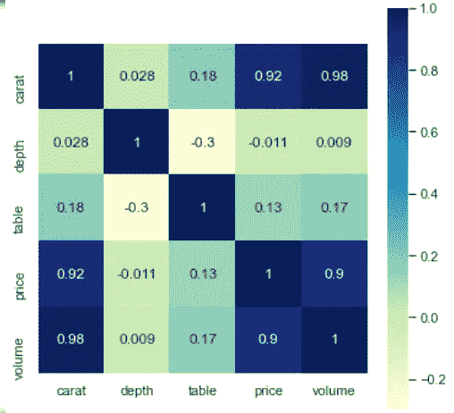

从上图得出的结论:

1.  深度与价格成反比。
2.  钻石的价格与克拉及其尺寸密切相关。
3.  钻石的重量(克拉)对其价格影响最大。
4.  成交量似乎与价格甚至彼此高度相关。
5.  自我关系。一个特性的值是 1。
6.  还可以得出其他一些推论。

# 所有功能的可视化

# 克拉

```
sns.kdeplot(diamonds_org['carat'], shade=True , color='r')
```

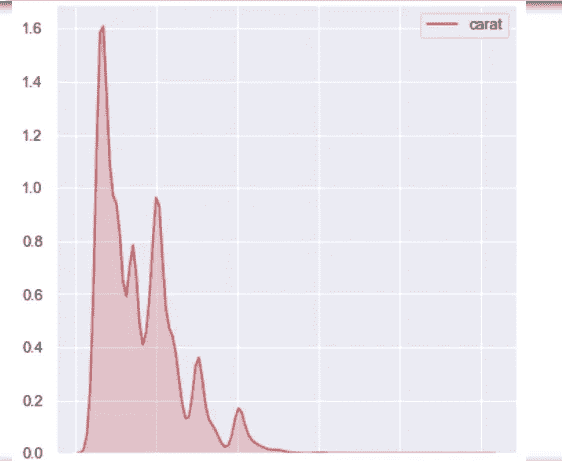

# 克拉与价格

```
sns.lineplot(diamonds_org[‘carat’], diamonds_org[‘price’], color=’blue’)
```

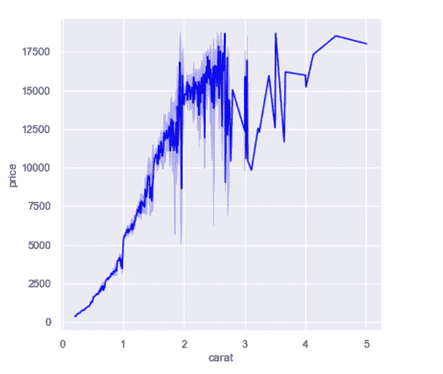

# 切口

```
sns.factorplot(x='cut', data=diamonds_org , kind='count',aspect=2.5 )
```

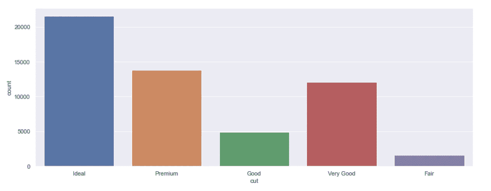

# 削减与价格

```
sns.lineplot(diamonds_org['cut'], diamonds_org['price'], color='orange')
```

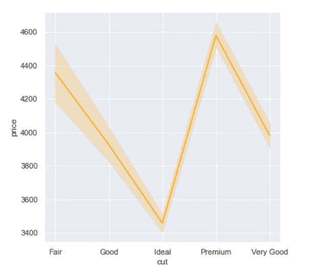

# 颜色

```
sns.factorplot(x=’color’, data=diamonds_org , kind=’count’,aspect=2.5 )
```

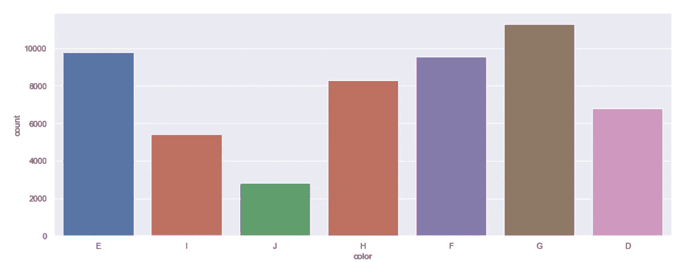

# 颜色与价格

```
sns.lineplot(diamonds_org['color'], diamonds_org['price'], color='gray')
```

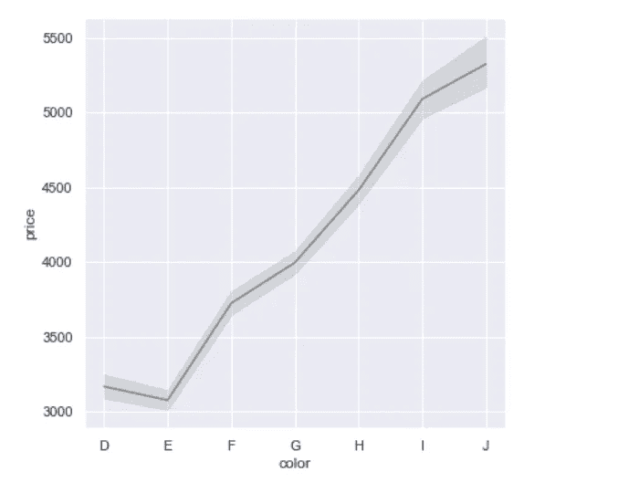

# 清楚

```
sns.factorplot(x='clarity', data=diamonds_org , kind='count',aspect=2.5 )
```

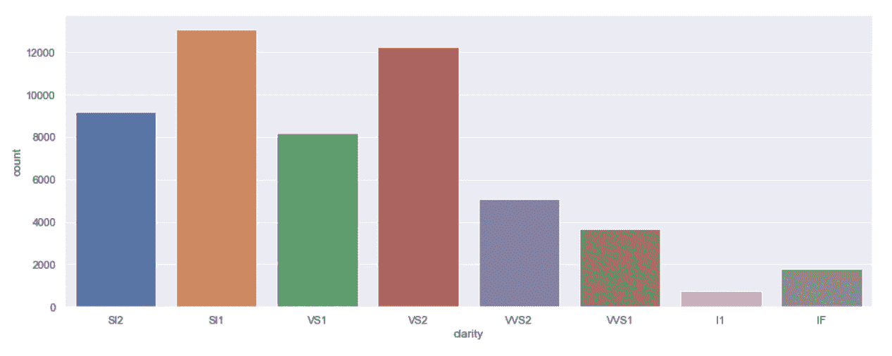

# 透明度与价格

```
sns.lineplot(diamonds_org['clarity'], diamonds_org['price'], color='yellow')
```

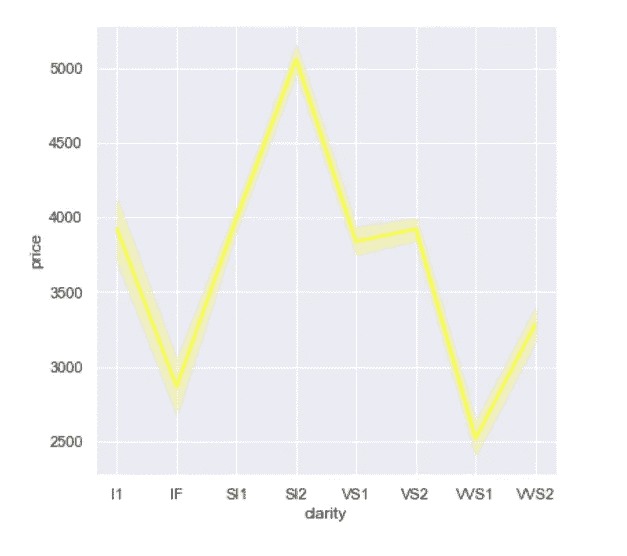

# 深度

```
plt.hist('depth' , data=diamonds_org , bins=25)
```

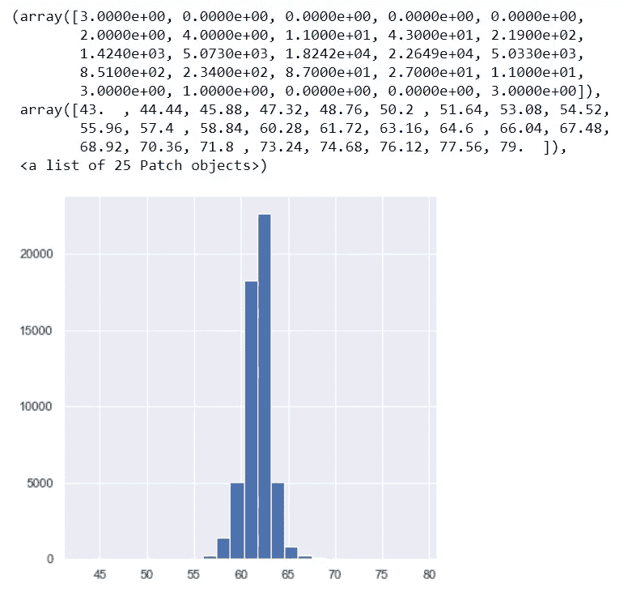

# 深度与价格

```
sns.lineplot(diamonds_org['depth'], diamonds_org['price'], color='red')
```

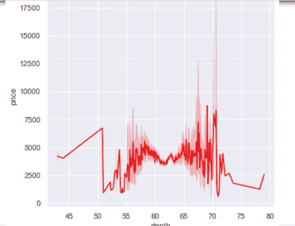

# 桌子

```
sns.kdeplot(diamonds_org[‘table’] ,shade=True , color=’orange’)
```

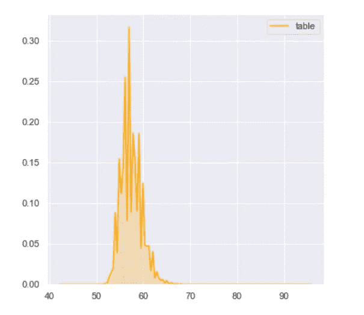

# 桌子与价格

```
sns.lineplot(diamonds_org['table'], diamonds_org['price'], color='green')
```

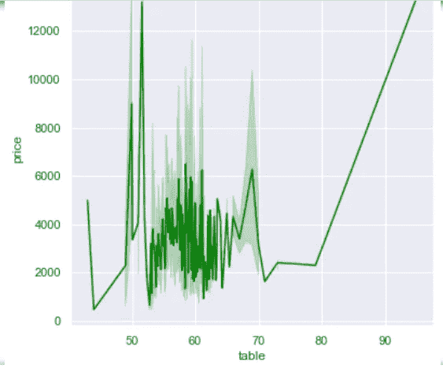

# 卷

```
plt.figure(figsize=(5,5))
plt.hist( x=diamonds_org['volume'] , bins=30)
plt.xlim(0,800)
plt.ylim(0,50000)
```

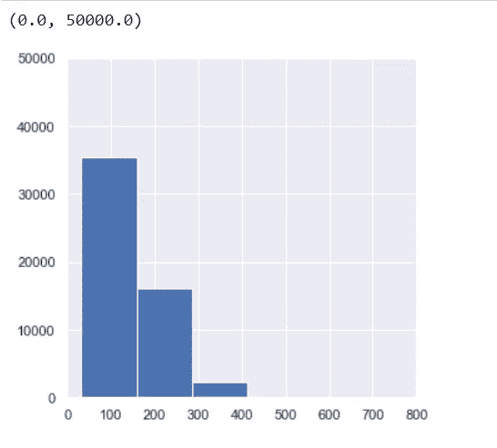

# 数量与价格

```
sns.lineplot(diamonds_org[‘volume’], diamonds_org[‘price’])
```

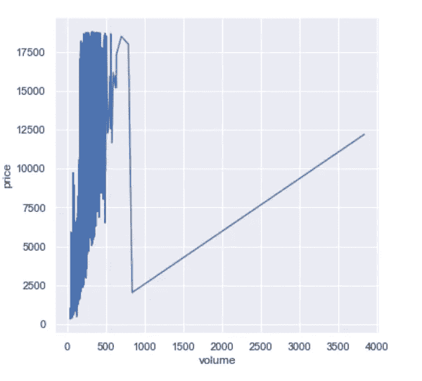

# 特征编码

检查要素的数据类型

```
diamonds_org.dtypes
```

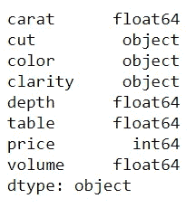

“剪切”的一键编码

```
dummy_cut = pd.get_dummies(diamonds_org['cut'], prefix = 'cut' , drop_first = True)
dummy_cut.head()
```

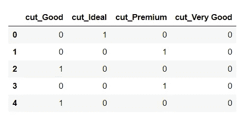

```
print(diamonds_org.shape)
print(dummy_cut.shape)
```


连接 dummy_cut 和 diamonds_org 数据框

```
X = pd.concat([diamonds_org, dummy_cut], axis=1)
print(X.shape)
print(X[:3])
```

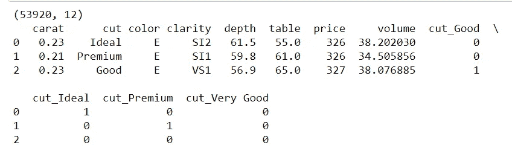

删除已编码的剪切列

```
X = X.drop([‘cut’], axis=1)
print(X.shape)
X[:3]
```


彩色一键编码

```
dummy_color = pd.get_dummies(X['color'], prefix = 'color' , drop_first = True)print(dummy_color.shape)
print(X.shape)
```

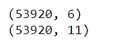

连接 X 和 dummy_color 数据帧，并删除颜色列

```
X = pd.concat([X, dummy_color], axis=1)
X = X.drop(['color'], axis=1)
print(X.shape)X[:3]
```

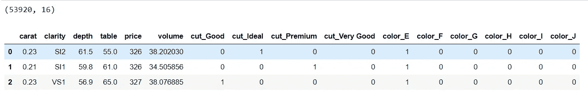

```
dummy_clarity = pd.get_dummies(X[‘clarity’], prefix = ‘clarity’ , 
 drop_first = True)
print(dummy_clarity.shape)
print(X.shape)X = pd.concat([X, dummy_clarity], axis=1)
X = X.drop([‘clarity’], axis=1)
X[:5]
```

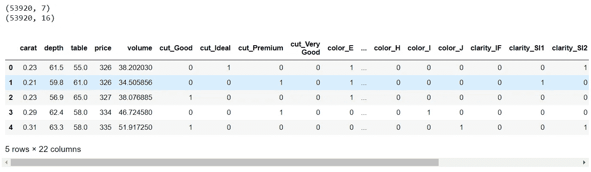

# 特征缩放

将数据分成 X，y

```
y = X['price']
X = X.drop(['price'], axis=1)
```

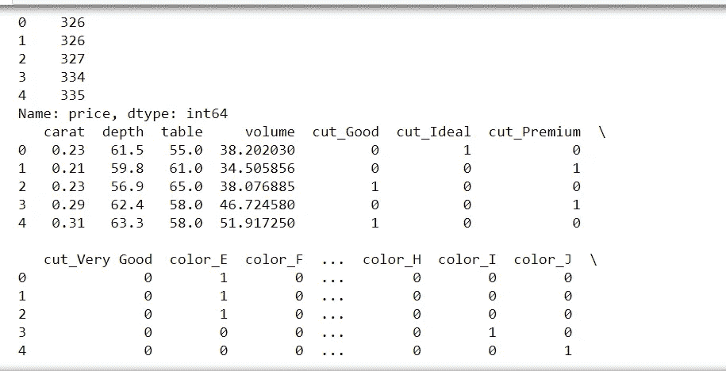

将数据分为训练和测试数据

```
X_train, X_test, y_train, y_test = train_test_split(X,y,test_size=0.2, random_state=66)
```

# 建模算法

```
models = [‘RandomForestRegressor’, ‘AdaBoostRegressor’, ‘ExtraTreesRegressor’, ‘GradientBoostingRegressor’, ‘LinearRegression’]
r2_scores = []
```

# 随机森林回归量

```
model_RF =  RandomForestRegressor()
model_RF.fit(X_train , y_train)y_pred = model_RF.predict(X_test)
accuracies = cross_val_score(estimator = model_RF, X = X_train, y = y_train, cv = 5,verbose = 1)
print('')
print('###### RandomForestRegressor ######')
print('Score : %.4f' % model_RF.score(X_test, y_test))
print(accuracies)mse = mean_squared_error(y_test, y_pred)
mae = mean_absolute_error(y_test, y_pred)
r2 = r2_score(y_test, y_pred)print('')
print('MSE    : %0.2f ' % mse)
print('MAE    : %0.2f ' % mae)
print('R2     : %0.2f ' % r2)
r2_scores.append(r2)
```

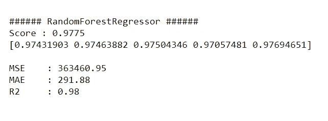

# AdaBoostRegressor

```
model_ABR =  AdaBoostRegressor()
model_ABR.fit(X_train , y_train)y_pred = model_ABR.predict(X_test)
accuracies = cross_val_score(estimator = model_ABR, X = X_train, y = y_train, cv = 5,verbose = 1)
print('')
print('###### AdaBoostRegressor ######')
print('Score : %.4f' % model_ABR.score(X_test, y_test))
print(accuracies)mse = mean_squared_error(y_test, y_pred)
mae = mean_absolute_error(y_test, y_pred)
r2 = r2_score(y_test, y_pred)print('')
print('MSE    : %0.2f ' % mse)
print('MAE    : %0.2f ' % mae)
print('R2     : %0.2f ' % r2)
r2_scores.append(r2)
```


# 树外回归因子

```
model_ETR =  ExtraTreesRegressor()
model_ETR.fit(X_train , y_train)y_pred = model_ETR.predict(X_test)
accuracies = cross_val_score(estimator = model_ETR, X = X_train, y = y_train, cv = 5,verbose = 1)
print('')
print('###### ExtraTreesRegressor ######')
print('Score : %.4f' % model_ETR.score(X_test, y_test))
print(accuracies)mse = mean_squared_error(y_test, y_pred)
mae = mean_absolute_error(y_test, y_pred)
r2 = r2_score(y_test, y_pred)print('')
print('MSE    : %0.2f ' % mse)
print('MAE    : %0.2f ' % mae)
print('R2     : %0.2f ' % r2)
r2_scores.append(r2)
```

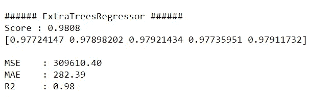

# 梯度推进回归器

```
model_GBR =  GradientBoostingRegressor()
model_GBR.fit(X_train , y_train)y_pred = model_GBR.predict(X_test)
accuracies = cross_val_score(estimator = model_GBR, X = X_train, y = y_train, cv = 5,verbose = 1)
print('')
print('###### GradientBoostingRegressor ######')
print('Score : %.4f' % model_GBR.score(X_test, y_test))
print(accuracies)mse = mean_squared_error(y_test, y_pred)
mae = mean_absolute_error(y_test, y_pred)
r2 = r2_score(y_test, y_pred)print('')
print('MSE    : %0.2f ' % mse)
print('MAE    : %0.2f ' % mae)
print('R2     : %0.2f ' % r2)
r2_scores.append(r2)
```

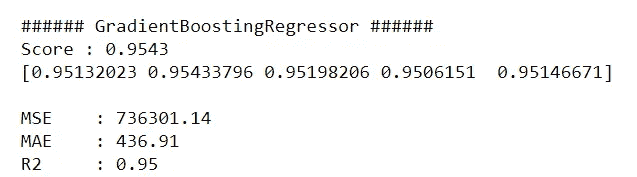

# 线性回归

```
model_LR =  LinearRegression()
model_LR.fit(X_train , y_train)y_pred = model_LR.predict(X_test)
accuracies = cross_val_score(estimator = model_LR, X = X_train, y = y_train, cv = 5,verbose = 1)
print('')
print('###### LinearRegression ######')
print('Score : %.4f' % model_LR.score(X_test, y_test))
print(accuracies)mse = mean_squared_error(y_test, y_pred)
mae = mean_absolute_error(y_test, y_pred)
r2 = r2_score(y_test, y_pred)print('')
print('MSE    : %0.2f ' % mse)
print('MAE    : %0.2f ' % mae)
print('R2     : %0.2f ' % r2)
r2_scores.append(r2)
```

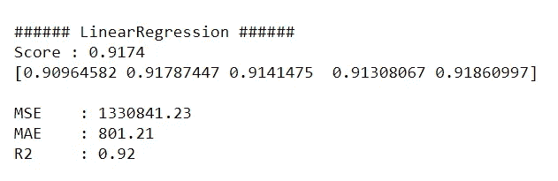

# 可视化算法的 R2 分数

```
compare = pd.DataFrame({‘Algorithms’ : models , ‘R2-Scores’ : r2_scores})
compare.sort_values(by=’R2-Scores’ ,ascending=False)
```

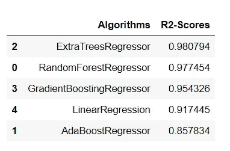

```
plt.plot(compare['Algorithms'], compare['R2-Scores'], label = "R2-Score")
```

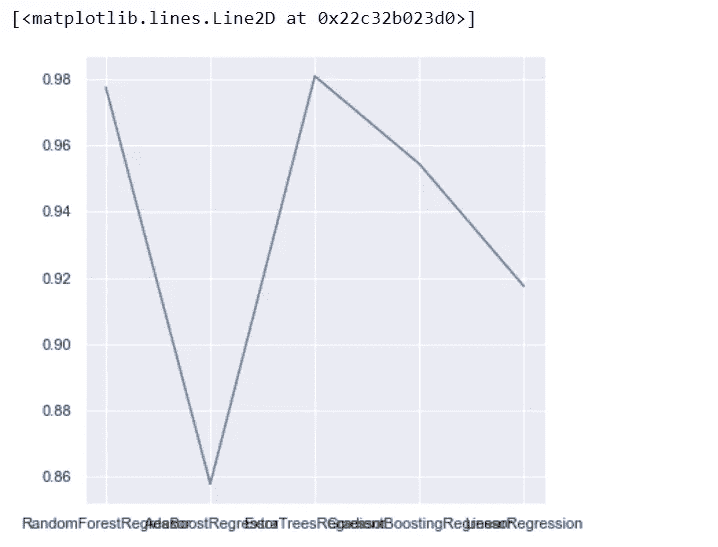

```
sns.barplot(x='R2-Scores' , y='Algorithms' , data=compare)
```

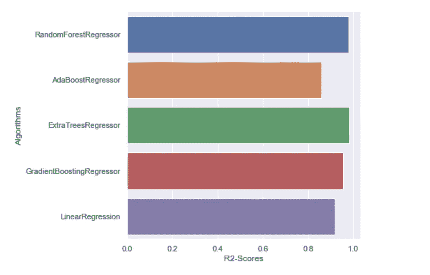

# 额外的树回归，因为它具有最高的 r2 分数(98%)