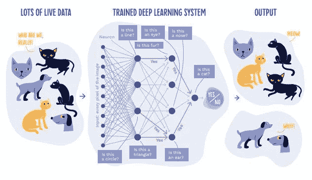
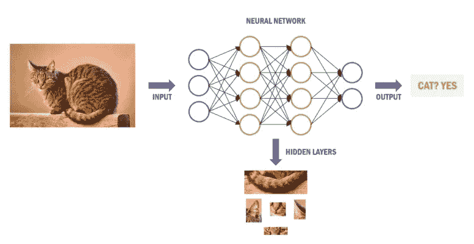

# 神经网络中批量大小与历元的差异

> 原文：<https://medium.com/mlearning-ai/difference-between-the-batch-size-and-epoch-in-neural-network-2d2cb2a16734?source=collection_archive---------0----------------------->

H 你是否曾经对神经网络中批量和时期的概念化感到困惑？相信我，大多数发烧友往往吃了很多苦才知道这些想法的区别，我甚至都没有意识到。

本文将讨论批量大小和时期的概念，并通过可视化表示突出重点。

**读完这篇文章你会知道什么？**

*   什么是批？
*   什么是纪元？
*   batch 和 epoch 有什么区别？

# **什么是批量？**

批量大小是通常一次通过神经网络的样本数。批量通常被称为小批量。

> 理解有困难？放心吧！让我们看看下面的图片

**Figure: Classification process of neural network**

> 你在上面的图像中观察到了什么？一些图像被输入到神经网络中，最终，它会给你一个预测，不是吗？

假设我们有 1000 万个数据集(图像)，在这种情况下，如果在没有定义批量大小的情况下训练模型，将需要大量的计算时间，这将不是一种有效的方法。这就是为什么出现了批量大小的概念，即您不必单独训练每个图像，但是您可以通过批量大小来训练它，以便将模型作为一个组来训练。例如，如果您将批次大小定义为 100，则整个训练数据集中的 100 个样本图像将作为一组一起训练。

***“批量越大，训练时每个历元的模型越快。”***

可以从训练数据集生成一个或多个批次。批次梯度下降是一种学习算法，它使用所有训练样本来生成单个批次。当批量为一个样本时，学习算法称为随机梯度下降。当批量大于一个样本且小于训练数据集的大小时，学习算法被称为小批量梯度下降。

*   **批量梯度下降**。批量大小=训练集的大小
*   **随机梯度下降**。批量= 1
*   **小批量梯度下降**。1 <批量大小<训练集的大小

小批量梯度下降最受欢迎的批量是 32、64 和 128 个样品。

# 什么是纪元？

批量大小和时期不相似。两者都有不同的工作方法。一个时期是机器学习中使用的一个术语，指的是机器学习算法在整个训练数据集上通过的次数。如果批量大小是整个训练数据集，则历元数等于迭代数。

以沿着 x 轴**的历元**作为时间并且模型的误差或能力在 y 轴上的线图是典型的。这些图也称为学习曲线，有助于确定模型是否具有**过度学习、** **欠学习、**或**充分拟合训练数据集的**。

# **批量和历元有什么区别？**

*   批量大小:批量大小是在更新模型之前处理的样本数量。历元数代表通过**训练数据集的总次数。**
*   Epoch:表示**机器学习**算法已经完成的整个训练数据集的遍数

# **结论**

最后，本文简要讨论了批量大小和时期。这两个概念没有被很多人很好地理解；然而，希望这篇文章对那些已经开始从事深度学习的人有用。