# 能力上的差异

> 原文：<https://medium.com/mlearning-ai/difference-in-ability-2e823ae447e?source=collection_archive---------2----------------------->

## 贝叶斯认知建模

在这篇博文中，我将使用 Lee & Wagemakers 所著的《[贝叶斯认知建模](https://bayesmodels.com/)》一书中的另一个例子。这本书充满了认知心理学的例子，可以用贝叶斯方法来处理。由于这些例子大多是通过 **WinBUGS** 完成的，我想看看我是否能使用 *brms* 和 *stan* 来重现它。所以，这就是这篇博文的内容。(我知道这本书也提供了 stan 代码，但我想看看我能用 *brms* 走多远，它的功能比 base **STAN** 或 **WinBUGS** 要少)。

在这个例子中，我将模拟视觉刺激被识别的准确性——这里是色情图片。第一部分是对 100 名受试者的两次刺激的准确性进行建模。每个阶段有 60 次试验，所以我们可以把它当作一个二项式问题。

在本书中，创建的模型是多元的，但是在 *brms* 中，如果您不使用正态分布，这将更加困难。因此，我将使用残差的非结构化组件矩阵将模型转换为多级模型。这在一定程度上模拟了多元分布。

让我们开始吧。

```
rm(list=ls()) 
library(dplyr)
library(ggplot2)
library(brms)
library(bayesplot)
library(tidybayes)
library(marginaleffects)
```

这里你可以看到刺激被正确识别的色情图片的比例。因为我们知道试验的次数正好是 60 次，所以我们也知道成功试验的次数。其实你下面看到的半连续音阶根本不是连续的。它只是一个二项式模型的变换。

```
prc1.ero <- c(0.6000000, 0.5333333, 0.6000000, 0.6000000, 0.4666667, 
              0.6666667, 0.6666667, 0.4000000, 0.6000000, 0.6000000,
              0.4666667, 0.6666667, 0.4666667, 0.6000000, 0.3333333,
              0.4000000, 0.4000000, 0.2666667, 0.3333333, 0.5333333,
              0.6666667, 0.5333333, 0.6000000, 0.4000000, 0.4666667, 
              0.7333333, 0.6666667, 0.6000000, 0.6666667, 0.5333333,
              0.5333333, 0.6666667, 0.4666667, 0.3333333, 0.4000000,
              0.5333333, 0.4000000, 0.4000000, 0.3333333, 0.4666667,
              0.4000000, 0.4666667, 0.4666667, 0.5333333, 0.3333333,
              0.7333333, 0.2666667, 0.6000000, 0.5333333, 0.4666667,
              0.4000000, 0.5333333, 0.6666667, 0.4666667, 0.5333333,
              0.5333333, 0.4666667, 0.4000000, 0.4666667, 0.6666667,
              0.4666667, 0.3333333, 0.3333333, 0.3333333, 0.4000000,
              0.4000000, 0.6000000, 0.4666667, 0.3333333, 0.3333333,
              0.6666667, 0.5333333, 0.3333333, 0.6000000, 0.4666667,
              0.4666667, 0.4000000, 0.3333333, 0.4666667, 0.5333333,
              0.8000000, 0.4000000, 0.5333333, 0.5333333, 0.6666667,
              0.6666667, 0.6666667, 0.6000000, 0.6000000, 0.5333333,
              0.3333333, 0.4666667, 0.6666667, 0.5333333, 0.3333333,
              0.3333333, 0.2666667, 0.2666667, 0.4666667, 0.6666667)

prc2.ero <- c(0.3333333, 0.6000000, 0.5333333, 0.2666667, 0.6666667,
              0.5333333, 0.6666667, 0.4666667, 0.4666667, 0.6666667,
              0.4000000, 0.6666667, 0.2666667, 0.4000000, 0.4666667,
              0.3333333, 0.5333333, 0.6000000, 0.3333333, 0.4000000,
              0.4666667, 0.4666667, 0.6000000, 0.5333333, 0.5333333,
              0.6000000, 0.5333333, 0.6666667, 0.6000000, 0.2666667,
              0.4666667, 0.4000000, 0.6000000, 0.5333333, 0.4000000,
              0.4666667, 0.5333333, 0.3333333, 0.4000000, 0.4666667,
              0.8000000, 0.6000000, 0.2000000, 0.6000000, 0.4000000,
              0.4000000, 0.2666667, 0.2666667, 0.6000000, 0.4000000,
              0.4000000, 0.4000000, 0.4000000, 0.4000000, 0.6666667,
              0.7333333, 0.5333333, 0.5333333, 0.3333333, 0.6000000,
              0.5333333, 0.5333333, 0.4666667, 0.5333333, 0.4666667,
              0.5333333, 0.4000000, 0.4000000, 0.4666667, 0.6000000,
              0.6000000, 0.6000000, 0.4666667, 0.6000000, 0.6666667,
              0.5333333, 0.4666667, 0.6000000, 0.2000000, 0.5333333,
              0.4666667, 0.4000000, 0.5333333, 0.5333333, 0.5333333,
              0.5333333, 0.6000000, 0.6666667, 0.4000000, 0.4000000,
              0.5333333, 0.8000000, 0.6000000, 0.4000000, 0.2000000,
              0.6000000, 0.6666667, 0.4666667, 0.4666667, 0.4666667)   
x <- matrix(cbind(prc1.ero,prc2.ero),
            nrow=100) 
n <- nrow(x)
dimnames(x)[[1]]<-seq(1,100,1)
dimnames(x)[[2]]<-c("1", "2") 
df<-as.data.frame(x)
class(df)
d <- df
Subject <- rownames(d)
rownames(d) <- NULL
df <- cbind(Subject,d)
colnames(df)<-c("Subject", "Session1", "Session2")

ggplot(df, aes(Session1, Session2))+
  geom_point()+
  theme_bw()
```

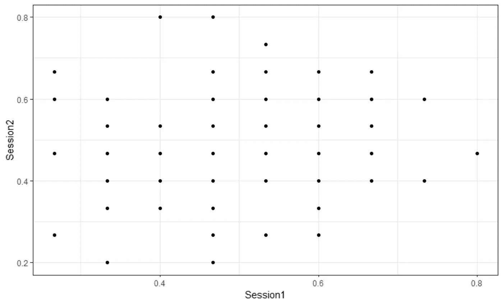

And here we see, for 100 subjects, the percentage correct for **Session 1** and **Session 2**.

我们也可以将数据转换成长格式。

```
df_long<-df%>%
  tidyr::pivot_longer(cols=Session1:Session2,
                      names_to = "Block",
                      values_to = "PC")
str(df_long)
df_long$Subject<-as.numeric(df_long$Subject)
df_long<-df_long%>%dplyr::mutate(time = if_else(Block == "Session1",1,2))
ggplot(df_long, aes(x=factor(Subject), 
               y=Block, 
               fill=PC))+
  geom_tile()+
  viridis::scale_fill_viridis(option="magma")+
  theme_bw()
```

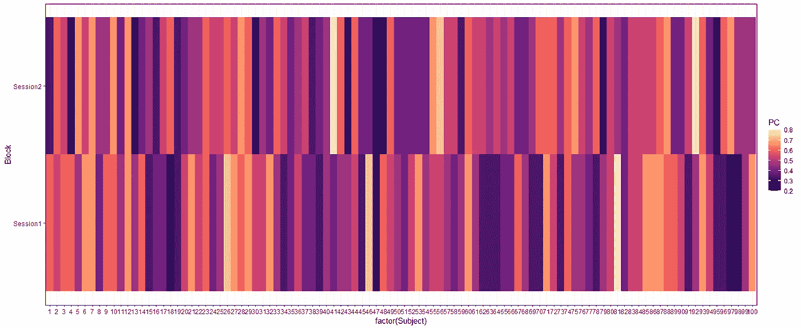

In long format it looks like this. You can clearly see that the previous accuracy does not have to predict the next accuracy. There are so many ways to model this data, but I will stick with the models from the book and have a go at them using **brms**.

在这本书里还有一张图片，显示了一个组合的准确度出现的次数。让我们画出同样的图，但为此，我们需要计算组合。

```
colnames(df)<-c("Subject", "Session1", "Session2")
df%>%
  group_by(Session1, Session2)%>%
  count()%>%
  ggplot(., aes(x=Session1, 
                    y=Session2, 
                    size=n))+
  geom_point()+
  theme_bw()+
  theme(legend.position = "none")
```

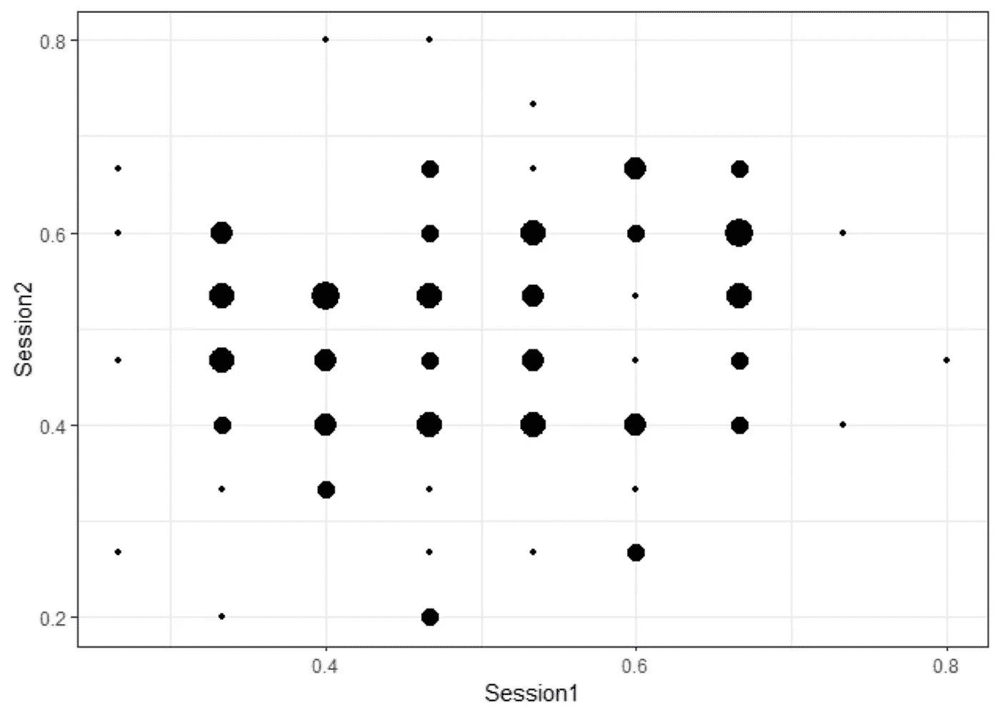

让我们做第一个建模练习。在 *brms* 中，您可以使用多元正态分布，但这不是该数据集的正确分布。然而，让我们应用它，看看我们在哪里结束。

```
bform1 <- bf(mvbind(Session1, Session2) ~ 1)
fit1   <- brm(bform1, data = df, chains = 4, cores = 6)
summary(fit1)
plot(fit1)
```

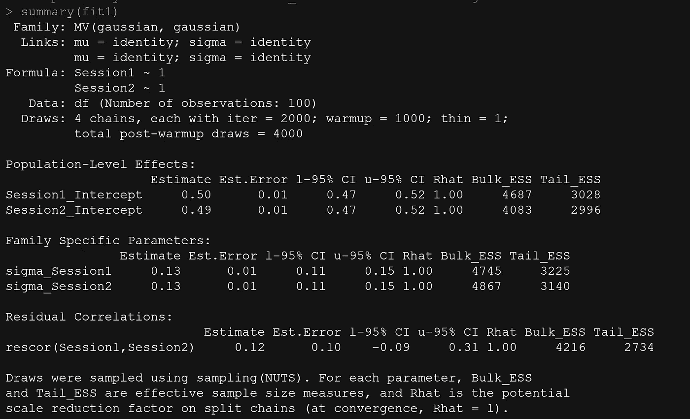

You can see that, simultaneously, the mean and standard deviation of both parameters (**Session 1** and **Session 2**) are measured, AND their correlation. It is that correlation that makes it multivariate normal.

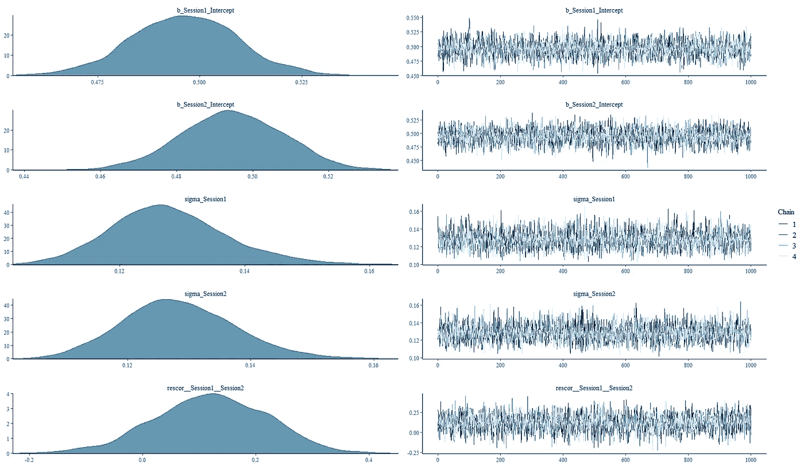

The **recor** parameter is the correlation parameter. As you can see, it is set at about 0.1, which means that there really is not a lot of correlation between **Session 1** and **Session 2** accuracy measures.

让我们检查一下这个模型的预测能力。

```
df %>%
  add_epred_draws(fit1, 
                  ndraws=10, 
                  allow_new_levels = TRUE) %>%
  ggplot(., aes(Session1, Session2))+
  geom_point()+
  geom_point(aes(y = .epred, 
                group = paste(Subject, .draw)), alpha = 0.25, color="red") +
  theme_bw()
```

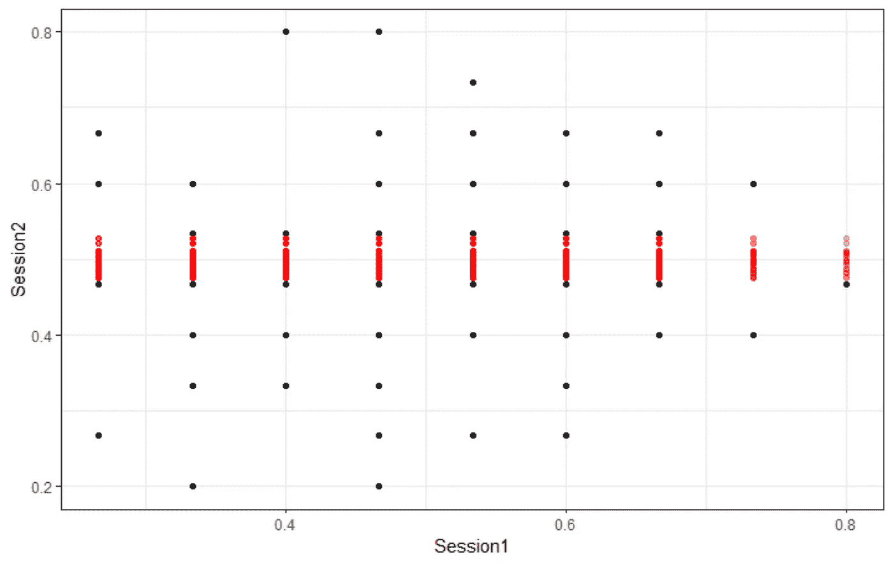

如果我们用长格式绘制数据，如果你问我，我会觉得更有意义。此外，您应该能够看到还有另一种数据建模方式，那就是通过多级模型。

```
ggplot(df_long, aes(x=Block, 
                    y=PC, 
                    group=Subject))+
  geom_line()+
  geom_point()+
  theme_bw()
```

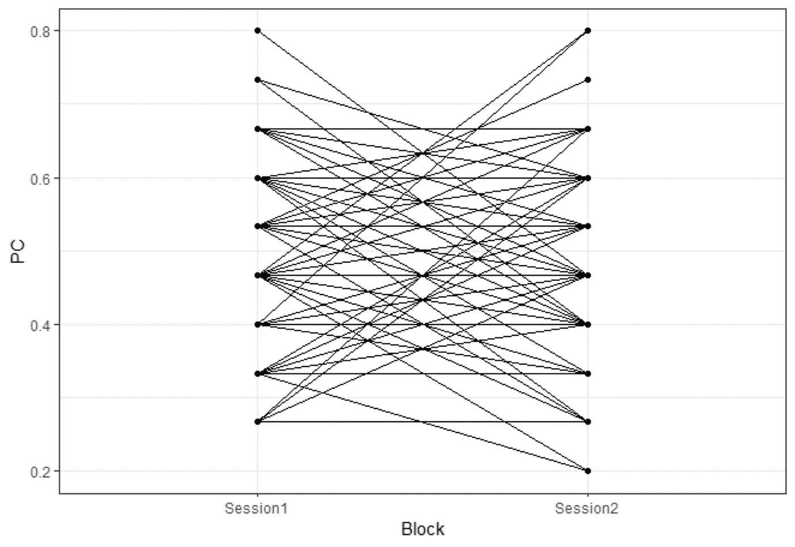

The exact same data, but then in a “time-format”.

让我们通过重复测量混合模型设计开始数据建模。

```
get_prior(PC ~ time + (1 + time |Subject), 
          data = df_long,
          family=Beta(link="logit"))
```

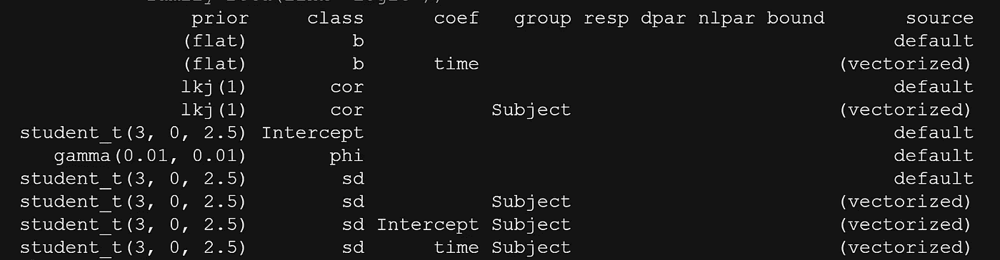

These are the variables that need to go in.

我们可以绕一小段路，使用 Frequentist 模型，通过 Beta 分布对数据进行建模。这不是使用的最佳分布，因为数据本质上是二项式的，线性变换实际上没有帮助。换句话说，可以使用最接近生成过程的分布来对数据进行最佳建模。

```
fit2_try<-glmmTMB::glmmTMB(PC ~ time +(1|Subject), 
                      data = df_long,
                      family=list(family="beta",link="logit"))
summary(fit2_try)
```


Not a whole lot of variance that can be attributed by the subject. This is because the accuracy scores within subjects, and across subjects, are really not that correlated. At all.

让我们使用 brms 框架运行重复测量模型。我将使用书中的先验知识，这些知识在平均意义上是没有信息的，但在精确度上却非常严格。这意味着它们是信息性的。

```
fit2   <- brm(PC ~ time + (1 + time|Subject), 
              data = df_long,
              family=Beta(link="logit"),
              prior = c(
                prior(normal(0,0.001), class=Intercept),
                prior(normal(0,0.001), class=b, coef=time), 
                prior(inv_gamma(0.001,0.001), class=phi), 
                prior(inv_gamma(0.001,0.001), class=sd,  coef=Intercept, group=Subject),
                prior(inv_gamma(0.001,0.001), class=sd,  coef=time, group=Subject),
                prior(lkj(1), class=cor, group=Subject)),
              chains=4, 
              cores=6, 
              warmup = 3000,
              iter = 6000)
summary(fit2)
plot(fit2)
```


Sampling is okay. The **phi** is the precision parameter of the **Beta** distribution I used.

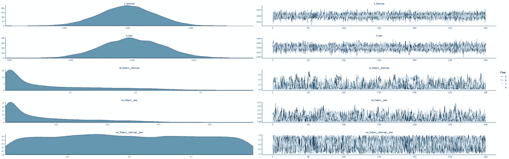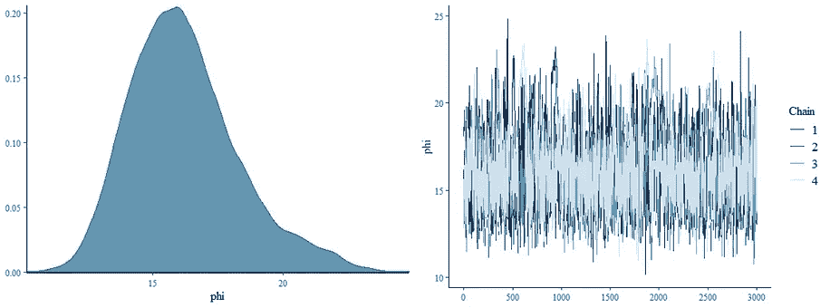

Here you can the see the mean (location) parameters, the variance components, their correlation, and the precision.

让我们绘制来自模型的预测，以更好地了解它到底在做什么。

```
df_long %>%
  add_epred_draws(fit2, 
                  ndraws=10, 
                  allow_new_levels = TRUE) %>%
  ggplot(., aes(x = time, 
             y = PC,
             group=Subject)) +
  geom_line(aes(y = .epred, 
                group = paste(Subject, .draw)), alpha = 0.25, color="red") +
  geom_point(data = df_long, color="black")+
  geom_line (data = df_long, color="black")+
  theme_bw()
```

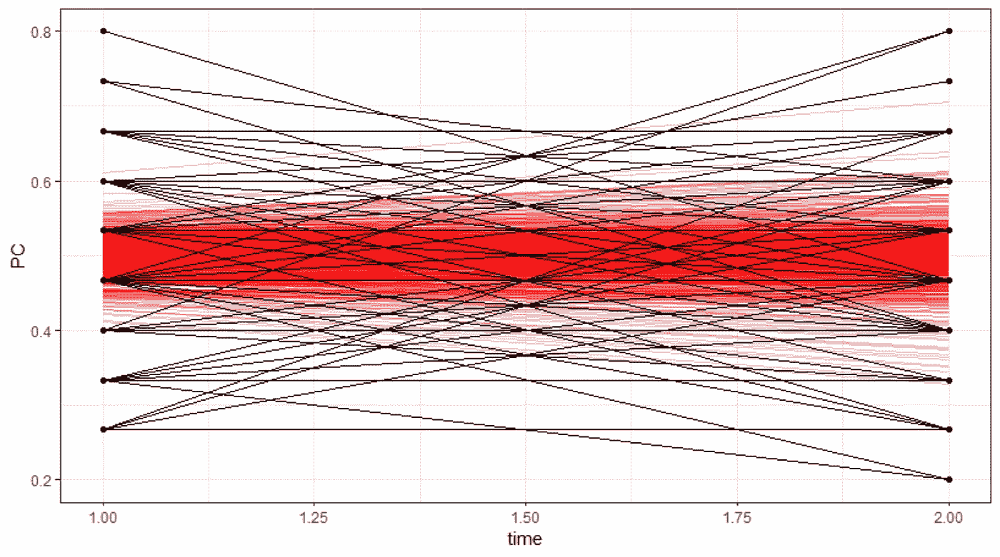

The red line is the model prediction and it is predicting no correlation at all. The data, however, do seem to show correlation, but it is very subjective dependent and all over the place. **Mixed models** have a tendency to [shrink](/towards-artificial-intelligence/blups-and-shrinkage-in-mixed-models-sas-3fbc6662fa6b) extremes and this is most likely what we are seeing here.

现在是使用二项分布的时候了。

```
get_prior(Y | trials(N)  ~ 
            time + (1 + time|Subject), 
          data = df_long,
          family=binomial(link = "logit"))

df_long$N=60
df_long$Y<-round(df_long$PC*df_long$N)
fit2.1   <- brm(Y | trials(N)  ~ 
                  time + (1 + time|Subject), 
                data = df_long,
                family=binomial(link = "logit"),
                prior = c(
                  prior(normal(0,0.001), class=Intercept),
                  prior(normal(0,0.001), class=b, coef=time), 
                  prior(inv_gamma(0.001,0.001), class=sd, group=Subject), 
                  prior(inv_gamma(0.001,0.001), class=sd,  coef=Intercept, group=Subject),
                  prior(inv_gamma(0.001,0.001), class=sd,  coef=time, group=Subject),
                  prior(lkj(1), class=cor, group=Subject)),
                chains=4, 
                cores=6, 
                warmup = 3000,
                iter = 6000)
```

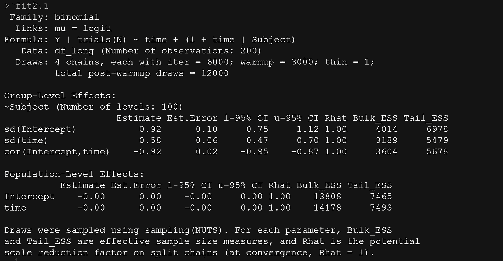

Sampling looks good, but it seems as if there are no population-level effects. A very high negative correlation effect, which is clearly different from what we have seen before.

我很想看看模型的预测会告诉我什么，尤其是考虑到高负相关系数。

```
df_long %>%
  add_epred_draws(fit2.1, 
                  ndraws=10, 
                  allow_new_levels = TRUE) %>%
  ggplot(., aes(x = time, 
                y = Y,
                group=Subject)) +
  geom_line(aes(y = .epred, 
                group = paste(Subject, .draw)), alpha = 0.25, color="red") +
  geom_point(data = df_long, color="black")+
  geom_line (data = df_long, color="black")+
  theme_bw()
```

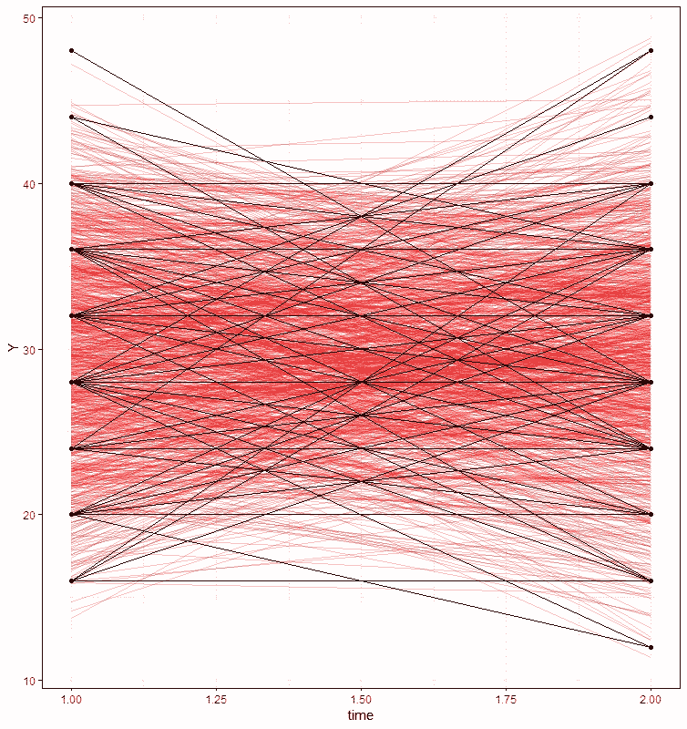

Looking quite good!

看来这最后一个模型是成功的。现在，在这本书里有这个模型的续篇，其中包括人格特质外向性。假设是这一特征与情色图片的准确性有关，我将这样建模。老实说，我省略了很多背景故事，因为在这篇博客中，我只想告诉你如何对这种数据建模。如果你对背景感兴趣不如买这本书！

```
extrav   <- c(50, 80, 79, 56, 50, 80, 53, 84, 74, 67,
              50, 45, 62, 65, 71, 71, 68, 63, 67, 58,
              72, 73, 63, 54, 63, 70, 81, 71, 66, 74, 
              70, 84, 66, 73, 78, 64, 54, 74, 62, 71,
              70, 79, 66, 64, 62, 63, 60, 56, 72, 72,
              79, 67, 46, 67, 77, 55, 63, 44, 84, 65,
              41, 62, 64, 51, 46, 53, 26, 67, 73, 39,
              62, 59, 75, 65, 60, 69, 63, 69, 55, 63,
              86, 70, 67, 54, 80, 71, 71, 55, 57, 41,
              56, 78, 58, 76, 54, 50, 61, 60, 32, 67)

prc1.ero <- c(0.6000000, 0.5333333, 0.6000000, 0.6000000, 0.4666667, 
              0.6666667, 0.6666667, 0.4000000, 0.6000000, 0.6000000,
              0.4666667, 0.6666667, 0.4666667, 0.6000000, 0.3333333,
              0.4000000, 0.4000000, 0.2666667, 0.3333333, 0.5333333,
              0.6666667, 0.5333333, 0.6000000, 0.4000000, 0.4666667, 
              0.7333333, 0.6666667, 0.6000000, 0.6666667, 0.5333333,
              0.5333333, 0.6666667, 0.4666667, 0.3333333, 0.4000000,
              0.5333333, 0.4000000, 0.4000000, 0.3333333, 0.4666667,
              0.4000000, 0.4666667, 0.4666667, 0.5333333, 0.3333333,
              0.7333333, 0.2666667, 0.6000000, 0.5333333, 0.4666667,
              0.4000000, 0.5333333, 0.6666667, 0.4666667, 0.5333333,
              0.5333333, 0.4666667, 0.4000000, 0.4666667, 0.6666667,
              0.4666667, 0.3333333, 0.3333333, 0.3333333, 0.4000000,
              0.4000000, 0.6000000, 0.4666667, 0.3333333, 0.3333333,
              0.6666667, 0.5333333, 0.3333333, 0.6000000, 0.4666667,
              0.4666667, 0.4000000, 0.3333333, 0.4666667, 0.5333333,
              0.8000000, 0.4000000, 0.5333333, 0.5333333, 0.6666667,
              0.6666667, 0.6666667, 0.6000000, 0.6000000, 0.5333333,
              0.3333333, 0.4666667, 0.6666667, 0.5333333, 0.3333333,
              0.3333333, 0.2666667, 0.2666667, 0.4666667, 0.6666667)
df2<-cbind(extrav, prc1.ero)
str(df2)
df2<-as.data.frame(df2)
colnames(df2)<-c("Extra", "PC")
df2$N<-60
df2$Y<-df2$PC*df2$N
d <- df2
Subject <- rownames(d)
rownames(d) <- NULL
df2 <- cbind(Subject,d)
ggplot(df2, aes(Extra, Y))+
  geom_point()+
  theme_bw()
```

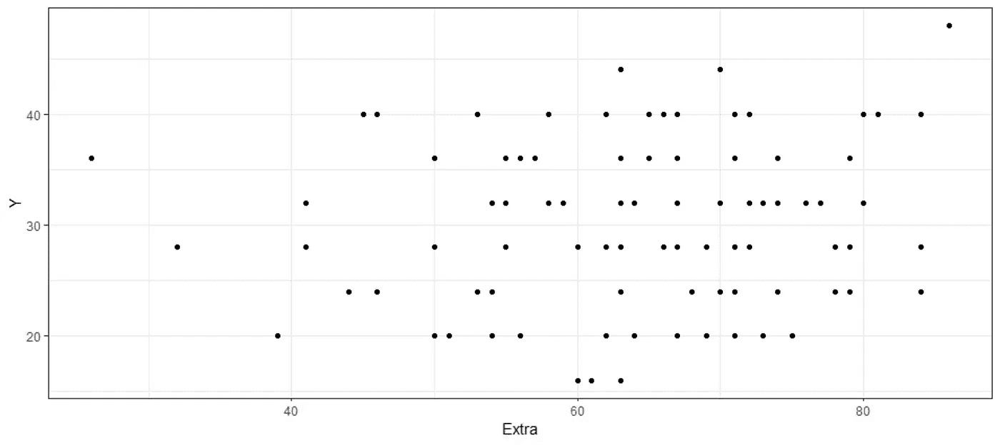

The extraversion rating of 100 subjects and the correct number of pictures (out of 60) in the first session.

我们知道二项式是最好的，所以让我们直接应用它。下面的模型显示了准确性和外向性得分之间的函数关系。因此，你可以期待一个回归模型出来。

```
get_prior(Y | trials(N) ~ Extra , 
          data = df2,
          family=binomial(link = "logit"))
df2$N<-as.integer(df2$N)
df2$Y<-as.integer((df2$Y))
fit3<-brms::brm(Y | trials(N) ~ Extra, 
               data = df2,
               family=binomial(link = "logit"),
               prior = c(
                 prior(normal(0, 1), class=b, coef=Extra ),
                 prior(normal(0, 1), class=Intercept)), 
               chains=4, 
               cores=6, 
               warmup = 3000,
               iter = 6000)
summary(fit3)
```

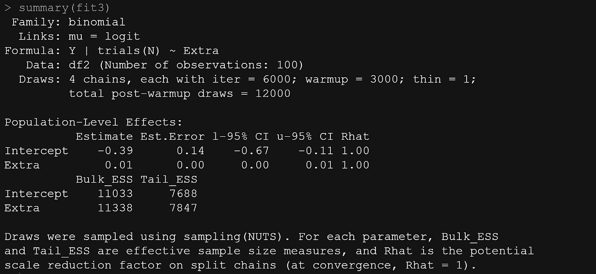

```
df2 %>%
  add_epred_draws(fit3, 
                  ndraws=200, 
                  allow_new_levels = TRUE) %>%
  mutate(PC_pred = .epred/N)%>%
  ggplot(., aes(x = Extra, 
                y = PC)) +
  geom_line(aes(y = PC_pred, 
                group = paste(.draw)), alpha = 0.25, color="red") +
  geom_point(data = df2, color="black")+
  theme_bw()
```

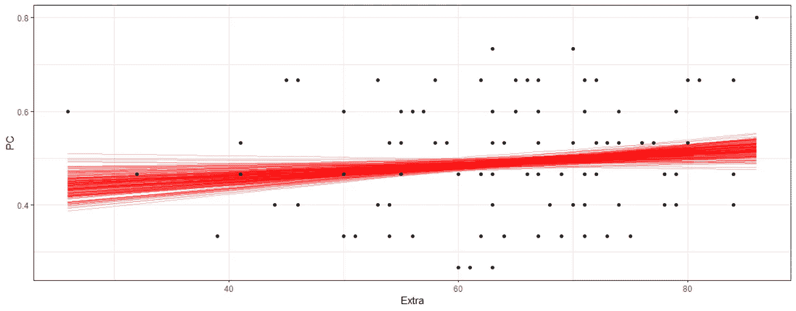

As predicted, the predictions show a regression. However, this is not the final model.

既然我们知道外向性得分，我们也可以将其应用到之前的模型中，该模型显示了**时段 1** 和**时段 2** 之间的相关性。

```
df_long$Extra<-rep(df2$Extra, each=2)
ggplot(df_long, aes(x=Extra, y=PC, color=factor(time)))+
  geom_point()+
  theme_bw()+
  labs(col="time")
```

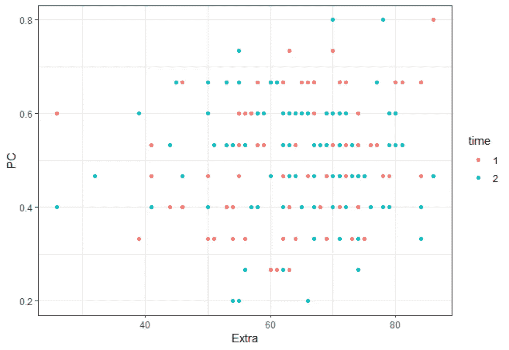

The extra score and accuracy for **Session 1** and **Session 2** (time=1 & time=2).

让我们建立模型，全力以赴。在这个模型中，我们指定外向性得分将对每次会话产生不同的影响，并且在受试者内部和受试者之间存在差异。

首先，测试版的模型只是向你展示这个模型会有多糟糕。

```
fit4   <- brm(PC ~ time*Extra + (1 + time|Subject), 
              data = df_long,
              family=Beta(link="logit"),
              prior = c(
                prior(normal(0,0.001), class=Intercept),
                prior(normal(0,0.001), class=b, coef=time),
                prior(normal(0,0.001), class=b, coef=Extra), 
                prior(inv_gamma(0.001,0.001), class=phi), 
                prior(inv_gamma(0.001,0.001), class=sd,  coef=Intercept, group=Subject),
                prior(inv_gamma(0.001,0.001), class=sd,  coef=time, group=Subject),
                prior(lkj(1), class=cor, group=Subject)),
              chains=4, 
              cores=6, 
              warmup = 3000,
              iter = 6000)
summary(fit4)
pp_check(fit4, ndraws=200)
df_long %>%
  add_epred_draws(fit4, 
                  ndraws=100, 
                  allow_new_levels = TRUE) %>%
  ggplot(., aes(x = Extra, 
                y = PC)) +
  geom_point(aes(y = .epred, 
                group = paste(Subject, .draw)), alpha = 0.25, color="red") +
  geom_point(data = df_long, color="black")+
  theme_bw()+
  facet_wrap(~time)

df_long %>%
  add_epred_draws(fit4, 
                  ndraws=10, 
                  allow_new_levels = TRUE) %>%
  ggplot(., aes(x = Extra, 
                y = PC)) +
  geom_point(aes(y = .epred, 
                 group = paste(Subject, .draw)), alpha = 0.25, color="red") +
  geom_point(data = df_long, color="black")+
  theme_bw()+
  facet_wrap(~time)
```

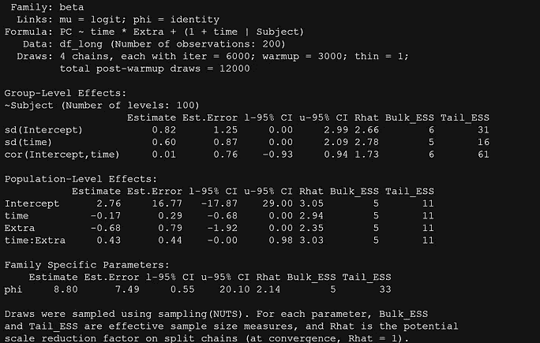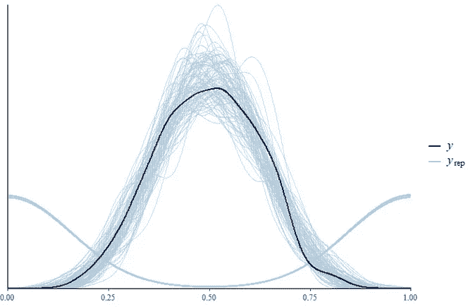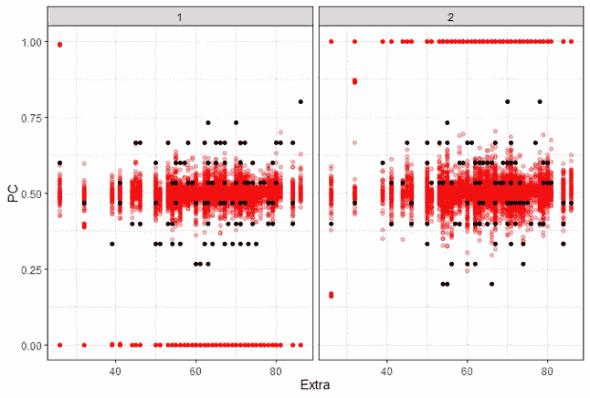

The model is not good with extreme Rhat values. This shows in the resulting predictions which are off.

接下来，二项式模型。

```
fit5   <- brm(Y | trials(N) ~ time*Extra + (1 + time|Subject), 
              data = df_long,
              family=binomial(link="logit"),
              prior = c(
                prior(normal(0,0.001), class=Intercept),
                prior(normal(0,0.001), class=b, coef=time),
                prior(normal(0,0.001), class=b, coef=Extra), 
                prior(inv_gamma(0.001,0.001), class=sd, group=Subject), 
                prior(inv_gamma(0.001,0.001), class=sd,  coef=Intercept, group=Subject),
                prior(inv_gamma(0.001,0.001), class=sd,  coef=time, group=Subject),
                prior(lkj(1), class=cor, group=Subject)),
              chains=4, 
              cores=6, 
              warmup = 3000,
              iter = 6000)
summary(fit5)
pp_check(fit5, ndraws=200)
df_long %>%
  add_epred_draws(fit5, 
                  ndraws=100, 
                  allow_new_levels = TRUE) %>%
  ggplot(., aes(x = Extra, 
                y = Y)) +
  geom_point(aes(y = .epred, 
                 group = paste(Subject, .draw)), alpha = 0.25, color="red") +
  geom_point(data = df_long, color="black")+
  theme_bw()+
  facet_wrap(~time)
```


Good Rhat values means good sampling.

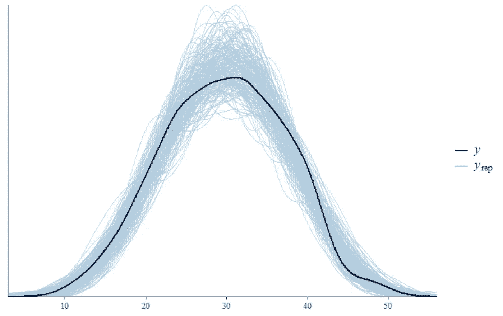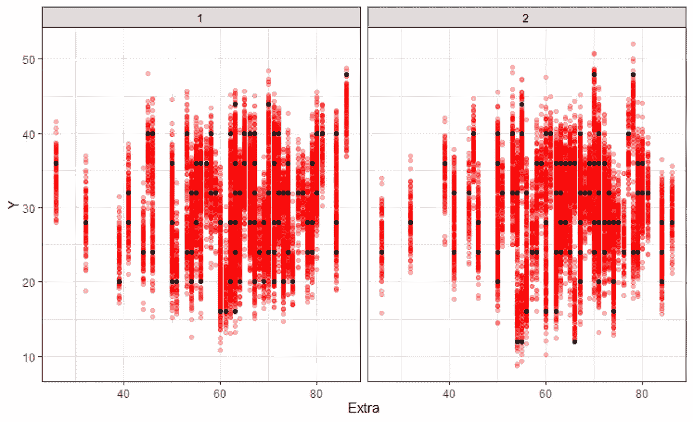

Predictions also looking good! However, because the sampling space overlaps you can not directly see how good the model is. Lets redo the predictions in long format.

```
df_long %>%
  add_epred_draws(fit5, 
                  ndraws=100, 
                  allow_new_levels = TRUE)%>%
  group_by(Subject, 
           Block, 
           time)%>%
  dplyr::summarise(meanpred = mean(.epred), 
                   meanY = mean(Y), 
                   meanN = mean(N))%>%
  ggplot(.)+
  geom_point(aes(x=time, y=meanY, group=Subject))+
  geom_line(aes(x=time, y=meanY, group=Subject))+
  geom_line(aes(x=time, y=meanpred, group=Subject), col="red", alpha=0.5)+
  theme_bw()
```

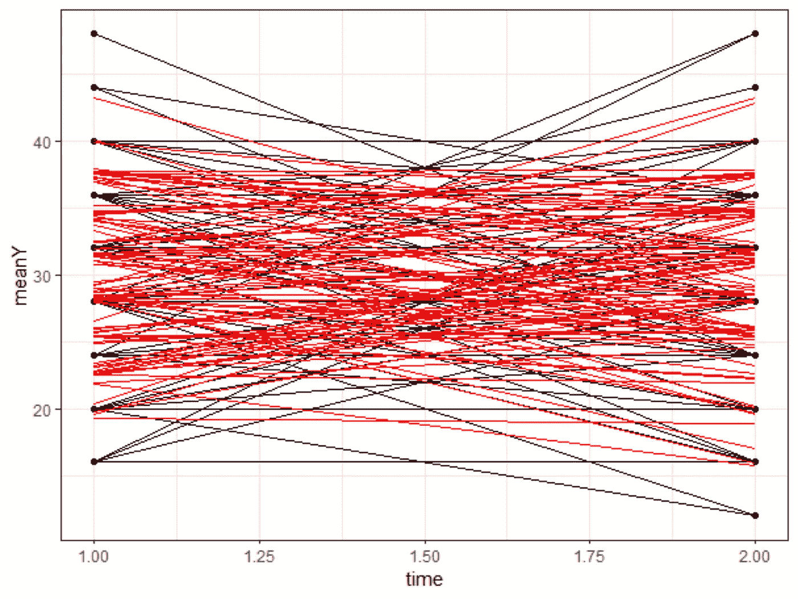

Much better!

我们也可以将最后两个图结合起来，将连续变量外向性切割成一个二元变量，然后绘制汇总预测。

```
df_long$CutExtra<-cut(df_long$Extra, breaks=5)
table(df_long$CutExtra)
df_long %>%
  add_epred_draws(fit5, 
                  ndraws=100, 
                  allow_new_levels = TRUE)%>%
  group_by(CutExtra, 
           Block, 
           time)%>%
  dplyr::summarise(meanpred = mean(.epred), 
                   meanY = mean(Y), 
                   meanN = mean(N))%>%
  ggplot(.)+
  geom_point(aes(x=time, y=meanY, group=CutExtra))+
  geom_line(aes(x=time, y=meanY, group=CutExtra))+
  geom_point(aes(x=time, y=meanpred, group=CutExtra), col="red")+
  geom_line(aes(x=time, y=meanpred, group=CutExtra), col="red")+
  theme_bw()+
  facet_wrap(~CutExtra)
```

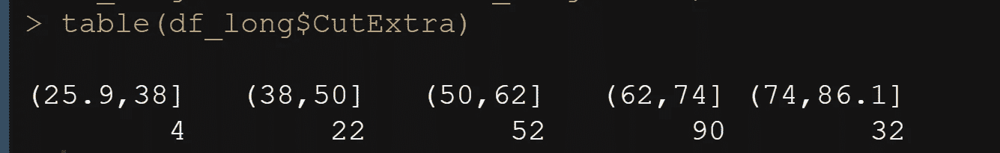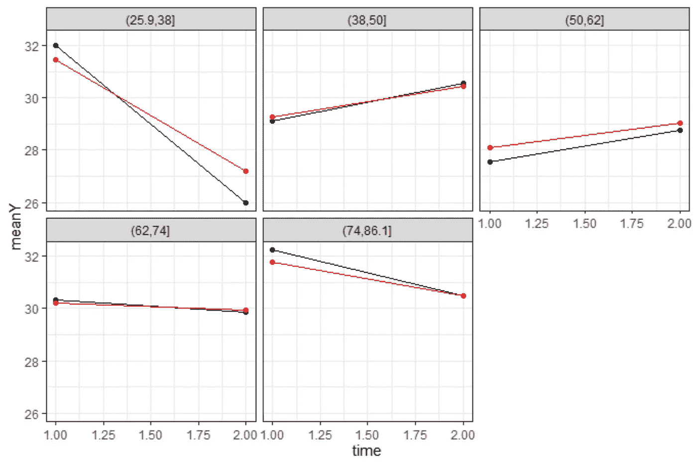

As you can see, prediction summaries overlap with observed summaries, except for the first split, but that makes sense considering that bin only has four observations.

我想这就是了。我们现在有两个模型，这些模型是多水平二项式模型，与多元二项式模型相当。尽管您不能在 brms 中将多元二项式指定为分布，但与多元正态不同，我们可以对其建模！

如果有任何问题，或事情不对劲，请让我知道！

[](/mlearning-ai/mlearning-ai-submission-suggestions-b51e2b130bfb) [## Mlearning.ai 提交建议

### 如何成为 Mlearning.ai 上的作家

medium.com](/mlearning-ai/mlearning-ai-submission-suggestions-b51e2b130bfb)