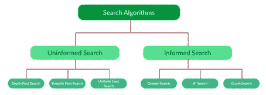
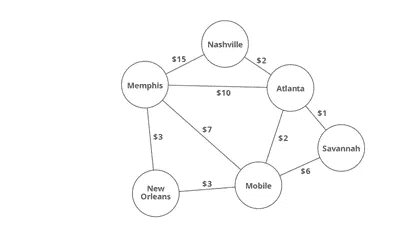
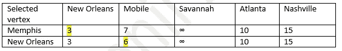
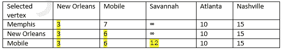
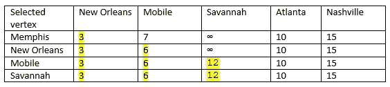
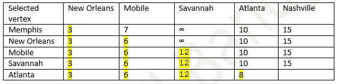
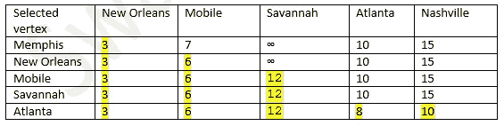
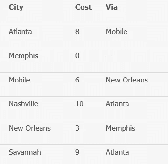

# 数据科学中的不同搜索算法

> 原文：<https://medium.com/mlearning-ai/different-search-algorithms-in-data-science-4340c524098c?source=collection_archive---------2----------------------->

目前有许多有用的搜索算法，它们可以根据我们想要解决的需求来适应不同的问题。它们分为两大类，请参见以下内容:

当我们必须识别给定问题或数组中不同值时，可以使用不同的搜索算法。

线性搜索

二进位检索

跳转搜索

插值搜索

指数搜索

子列表搜索(在另一个列表中搜索链接列表)

斐波那契搜索

无处不在的二分搜索法

递归程序，线性搜索给定数组中的元素

递归函数进行子串搜索。

无界二分搜索法示例(找到单调递增函数第一次变为正值的点)

我们来探讨一下知情搜索算法中的贪婪搜索。

Greedy 是一种算法范式，它一个节点一个节点地构建解决方案，总是选择下一个提供最明显和直接好处的节点。所以，选择局部最优的问题也会导致全局最优解。

贪婪算法中有标准类型，我们可以看到如下:

活动选择问题

埃及分数

作业排序问题

作业排序问题(使用不相交集)

作业排序问题——损失最小化

作业选择问题——损失最小化策略

霍夫曼编码

用于排序输入的高效霍夫曼编码

霍夫曼解码

水连接问题

警察抓小偷。

支架平衡的最小互换

装配货架问题

将鼠标分配到孔中

我们可以用它来解决标准类型的问题，但是当我们不得不使用图来解决问题时，我们参考下面的贪婪图解决方案。

克鲁斯卡尔最小生成树

Prim 的最小生成树

博鲁夫卡最小生成树

MST 的反向删除算法。

最小生成树的问题求解(克鲁斯卡尔和普里姆的)

Dijkstra 最短路径算法

戴尔算法

用于邻接表表示的 Dijkstra 算法

用于邻接表表示的 Prim 的 MST

贪婪算法的正确性

连接所有城市的最低成本。

最大流量问题简介

无向图中单圈分量的个数

我们将使用 Dijkstra 算法中的最短路径算法来解决其中的一个例子。

让我们考虑一下，A 想从孟菲斯去纳什维尔，找到到达那里的最便宜的路径。有很多公路或航空公司遵循这一点，以确定最便宜的路线到达。

从下图中找到到达不同城市的不同路线和费用。

Dijkstra 算法用于解决加权有向图上的单源最短路径问题。

让我们找到从孟菲斯到纳什维尔的最短路径。我们将使用该表来确定和更新放松。

步骤 1)从孟菲斯出发，选择从孟菲斯出发的最小费用，它在表格下面突出显示(新奥尔良)，这里从孟菲斯出发的最小费用是 3，也就是到达新奥尔良。

如果我们从孟菲斯到新奥尔良去莫比尔，比去莫比尔要多花 6 美元。因此，将更新图表中的内容(以黄色突出显示)。

步骤 2)现在选择另一个顶点，它将给出到达下一个目的地的最小成本。我们已经解决了新奥尔良的问题，现在选择另一个成本更低的城市，即莫比尔。

从孟菲斯到萨凡纳，我们会得到 12 美元的零钱，这是前所未有的。

从孟菲斯到莫比尔需要 6 美元，从莫比尔再到那里需要 6 美元，所以总共是 12 美元。

步骤 3)现在让我们考虑另一个成本更低的城市，那就是萨凡纳。

要到达亚特兰大，我们有以下路径:

1.我们可以直接从孟菲斯到亚特兰大，这样可以给我们 10 美元

2.如果我们从萨凡纳到亚特兰大，这将给我们 13 美元，但我们已经有价值少于到达亚特兰大 10 美元，所以将保持原样。

步骤 4)现在我们可以选择下一个城市到达下一个目的地。

要到达亚特兰大，我们有三条路:

1.我们已经推导出到达亚特兰大的路径，即孟菲斯到亚特兰大，花费 10 美元，在这一点上更少。

2.如果我们选择从莫比尔到亚特兰大的路线，如果我们从莫比尔到亚特兰大，我们可能在 8$内到达亚特兰大。因此，重写表中的参数。

步骤 5)现在让我们选择亚特兰大作为顶点来解决下一个城市问题。

我们已经知道，到达纳什维尔需要 15 美元，但如果我们沿着从亚特兰大到纳什维尔的路线，将花费 2 美元。

我们已经从孟菲斯到达亚特兰大，最低花费 8 美元。因此，我们可以将纳什维尔成本改写为(8+2) $ = 10 美元

因此，我们已经解决了使用贪婪方法的 Dijkstra 算法的问题，该算法使我们达到孟菲斯到纳什维尔的最低成本为 10 美元。我们的决赛桌如下图所示，起点是孟菲斯。

# Dijkstra 算法的复杂性分析；

假设一个图中有 V 个顶点。那么根据定义，将有|V-1|条边。主外循环运行|V|次。内部循环意味着实际成本计算发生的地方，对于一个完整的图运行|V-1|次，因为每个顶点都有|V-1|条边。

此外，对于内部循环的每次迭代，我们对顶点执行提取最小值和减少键操作。

因此，总运行时间的上限为 O(|V| * |V-1|)，相当于 O(|V|2)

我们的初始化要求每个节点的工作量不变，再加上我们考虑所有节点的时间来确定最佳解决方案，这将给我们 O(N)O(N)个节点进入优先级队列将花费 O(N * LG(N))O(N∫LG(N))的时间。这是所有初始化工作的 O(N * LG(N))O(N÷LG(N))总时间。

我们将每条边更新一次表中的成本，即 O(M)O(M)次。每次优先级表更新花费 O(lg(N))O(lg(N))时间。也就是 O(M * LG(N))O(M∫LG(N))总时间。

将所有步骤放在一起，Dijkstra 算法的时间复杂度为 O(N * LG(N)+M * LG(N))O(N∫LG(N)+M∫LG(N))。有时候，这个复杂度写成 O((N + M)lg(n))O((N+M)lg(n))。

**时间复杂度:θ((v+e)logv)=((6+9)log6)= 15 log6 = 11.67。**