# 计算特征重要性的不同方法

> 原文：<https://medium.com/mlearning-ai/different-ways-to-calculate-feature-importance-5aefe7bf9236?source=collection_archive---------4----------------------->

确定哪些特征与期望的预测输出更相关，称为特征重要性，已经成为一个有趣的话题大约一年了。我尝试了几个不同的特性重要性库，比如 scikit permutation_importance、eli5 PermutationImportance 和 SHAP。我认为收集所有的特性重要性方法可能是有用的。

请注意，排列方法不会给出相同的重要特性列表，因为它取决于特性的排列。因此在这方面，SHAP 方法看起来更可靠，因为特征重要性是基于关于不同特征组合的模型预测。

我使用的数据集来自 Kaggle，是关于咖啡的开盘价和收盘价，因为我喜欢❤️咖啡！尽情享受吧！

# 跨多个单元使用的库

# 子功能

# 加载数据

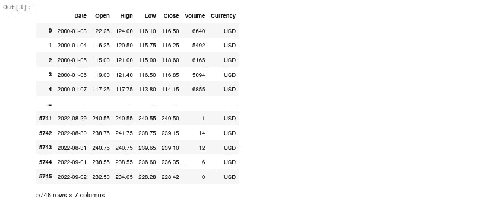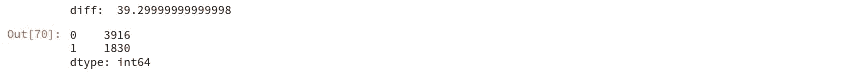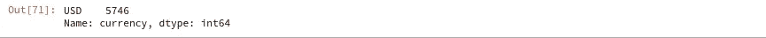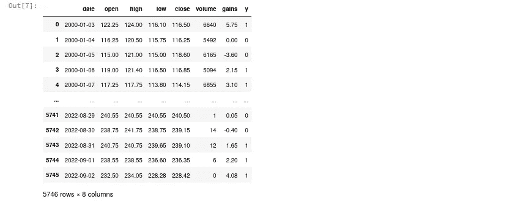

# 准备 X 和 y 矩阵

让我们测试一下该数据集的一些预测模型:

Xgboost 给出了比 RandomForest 更好的 F1 分数，所以让我们使用 xgboost 模型。

# 排列重要性:识别重要特征

## 方式 0:手工排列重要性

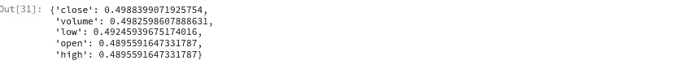

## 方式 1: scikit 排列 _ 重要性

## 方式 2: scikit 特性 _ 重要性

## 方式 3: eli5 置换重要性

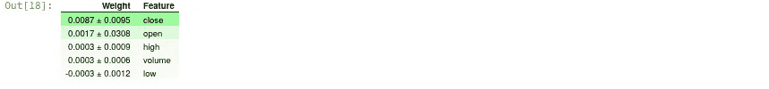

## 方式四:**SHAP(SHapley Additive explaints)**用手

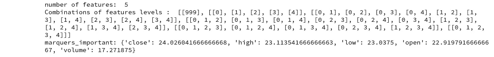

我们可以看到，从最重要到最不重要，它按收盘、盘高、盘低、开盘和成交量进行了排序。

## 方式五:使用**【SHAP(SHapley Additive exPlanations)**库，手工计算特征重要性

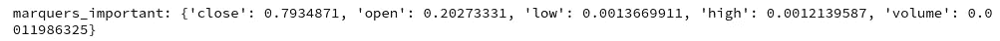

我们可以看到，手动函数的要素重要性排序与 Python SHAP 库不同，但第一个和最后一个要素是相同的。尽管结果不完全相同，但知道 SHAP 算法是如何工作的还是很好的。

## 方式六:**【SHAP】(SHapley Additive explaints)**Python 库

让我们看看 shap_values 和 explainer 对象中的函数，以便更好地理解如何绘制形状值。

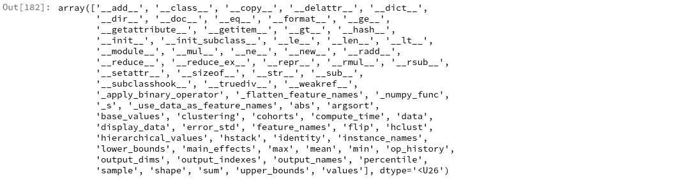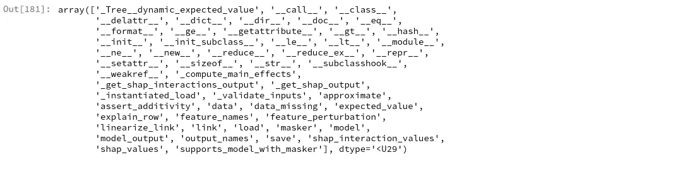

## 为绘图设置 shap_values.feature_names

## 汇总图或蜂群

给出“对模型最重要的特征的概述”。它绘制了每个样本的每个特征的 SHAP 值，因此我们知道每个特征的值如何影响预测值；在手工计算 SHAP 时，我只计算了每个特征的 SHAP，因为我对样本求和。

下图按所有样本的 SHAP 量值总和对要素进行排序，并使用 SHAP 值显示每个要素对模型输出的影响分布。

颜色表示特征值(红色高，蓝色低)，分布显示预测精度提高(正)和预测精度降低(负)。

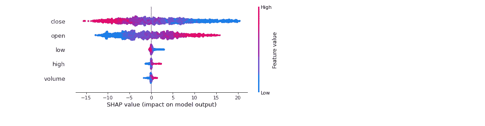

我们再次看到，根据特征值分布，收盘、开盘、盘低、盘高和成交量是最重要到最不重要的特征。低收盘价提高了每日收益的预测精度，反之，高收盘价降低了预测精度。

## 瀑布图

显示哪些特征从基值(训练数据集的平均模型输出)中“推出”模型输出。将预测值推高的要素显示为红色，将预测值推低的要素显示为蓝色。

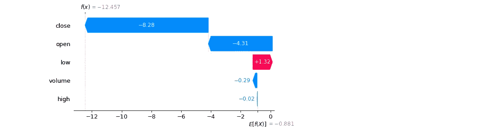

## 力图

在一个图上显示一个特征。如果我们采用许多力图解释，如下面每个要素的图，将它们旋转 90 度，然后水平堆叠，我们可以看到整个数据集或下面的时间序列图的解释。

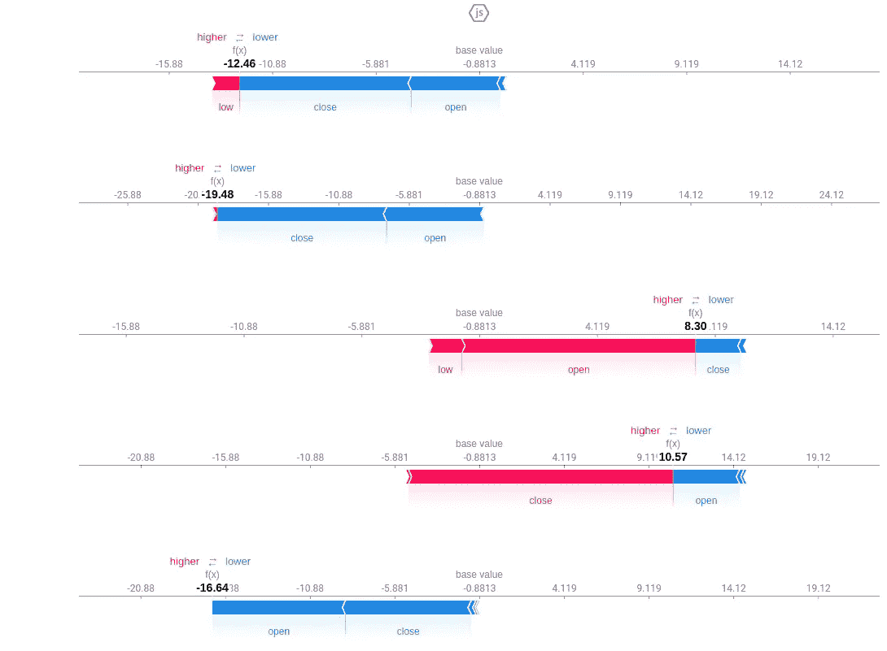

在一个图上显示所有特征。

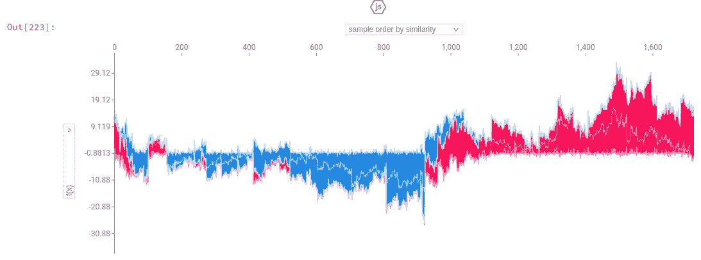

## 条形图

显示具有最大平均 SHAP 值的要素。

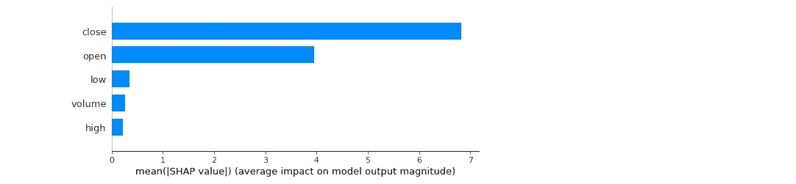

## 条形图群组

下图显示了与最重要特性的值组相关的重要特性，这在我们的例子中是接近的。

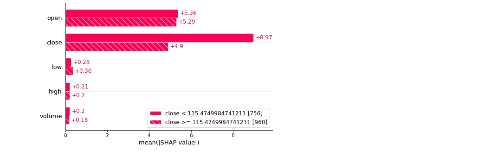

SHAP 图书馆有更多的功能，像散点图、热图、decision_plot，但我发现提到的五个图是最有用的。

希望这个特性重要性方法的列表是有用的，在一个地方有好的信息总是好的！如果我找到更多的方法，我会继续更新这个帖子！

练习愉快！👋

# 参考

1.  解释如何编码 SHAP 的优秀博客文章，并引用了原始论文(Lundberg 和 Lee，2017)。[https://towards data science . com/shap-explained-the-way-I-wish-someone-explained-it-to-me-ab 81 cc 69 ef 30](https://towardsdatascience.com/shap-explained-the-way-i-wish-someone-explained-it-to-me-ab81cc69ef30)
2.  https://github.com/slundberg/shap
3.  [https://medium . com/data man-in-ai/the-shap-with-more-elegant-charts-BC 3 e 73 fa 1c 0 c](/dataman-in-ai/the-shap-with-more-elegant-charts-bc3e73fa1c0c)
4.  [https://shap . readthe docs . io/en/latest/example _ notebooks/API _ examples/plots/decision _ plot . html](https://shap.readthedocs.io/en/latest/example_notebooks/api_examples/plots/decision_plot.html)

 [## Mlearning.ai 提交建议

### 如何成为 Mlearning.ai 上的作家

medium.com](/mlearning-ai/mlearning-ai-submission-suggestions-b51e2b130bfb)