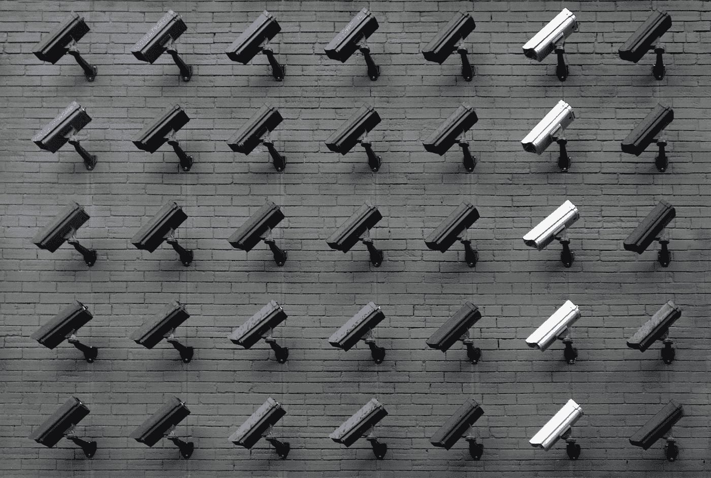

# 机器学习中的差分隐私和隐私保护

> 原文：<https://medium.com/mlearning-ai/differential-privacy-and-privacy-preserving-in-machine-learning-594719b75fea?source=collection_archive---------5----------------------->

在这篇文章中，我将提出差分隐私的定义，并在使用数据科学技术训练机器学习模型或推动洞察力时，保护用户的隐私和个人数据。

Photo by [Lianhao Qu](https://unsplash.com/@lianhao?utm_source=medium&utm_medium=referral) on [Unsplash](https://unsplash.com?utm_source=medium&utm_medium=referral)

# 什么是差分隐私？