# 微分满足条件计算

> 原文：<https://medium.com/mlearning-ai/differentiality-meets-conditional-computation-60d88435ec24?source=collection_archive---------7----------------------->

对 2020 年我最喜欢的一篇论文的简要而详尽的总结，这是一篇探索决策树和神经网络之间可能的错综复杂关系的研究工作。

*我很高兴能这样做:)* [这些天来，我倾向于人工智能研究，这抛弃了我最近在阅读和理解不断涌现在勇敢的人工智能世界中的令人兴奋的方法和理论方面的突破。](https://arxiv.org/abs/2002.07772)

这篇文章强调了在研究论文 [*中解释的核心概念和理论:树集合层:可微性满足条件计算。*](https://arxiv.org/abs/2002.07772) 要全面了解，需要对决策树和神经网络的工作原理有一个基本的了解。

# 介绍

作者开始结合神经网络和树集成的独特统计和计算优势，为神经网络引入一个新层，该层由称为**软树**的*可微分决策树*的集成组成。可微分树的讨论并不是什么新东西，它已经存在了一段时间，但一直很难推销，因为它们在训练和推理方面都很慢，因为它们无法执行*条件计算*。

> 条件计算是指模型以依赖于输入的方式运行的能力，即通过将样本路由通过少量节点(单个根到叶路径)仅激活其架构的一小部分的能力。

决策树有几个吸引人的特性，其中一个最优秀的特性是它们执行条件计算的能力。这带来了计算上的好处和统计上的特性。但是决策树缺乏良好的表示学习机制，它们需要大量的特征工程。而这是神经网络(NNs)擅长的领域，它在图像识别、语音识别等领域的能力非常突出。然而，神经网络不支持条件计算，并且很难调整。

作者提出了一种混合神经网络模型 ***TEL:树集成层*** ，它结合了树集成和神经网络的优点。这将是一个可微分决策树的附加模型，可以将其插入神经网络的任何位置，并使用梯度下降与网络的其余部分一起训练。

可微分树的转换已经存在，并且在文献中，它已经在神经网络的上下文中显示出有希望的结果，但是它们在训练和推理期间都不提供真正的条件计算。在可微分树中联合优化是困难的，因为树的训练复杂性随着树的深度成指数增加。常见的方法是使用贪婪的“阶段式”程序来训练树，即一次只更新一棵树，并且不再更新，这是梯度增强模型的主要原则。TEL 配备了一种新的机制来执行条件计算，该机制通过引入用于样本路由的新的稀疏激活函数以及探索稀疏性的专用前馈和反向传播算法来实现。所提出的算法使得在宽树和深树上的联合优化成为可能。

> 联合优化指的是同时更新每棵树。作者假设联合优化产生比 GBDT 更紧凑和更有表现力的集合。这使得模型尺寸减小了 20 倍以上。

该文件的概念强调如下:

1.  一个新的激活函数，用于在树的小部分路由样本(类似于经典树),而不会失去其可区分性。
2.  条件计算是通过专门的前馈和反向传播算法来实现的，这些算法利用稀疏性来获得最佳的时间复杂度。
3.  在 26 个数据集上的实验证实了 TEL 是 CNN 中当前可微分树、GBDT 和密集层的有竞争力的替代物。

# 树集合层

在这一部分，我将强调 **TEL** 的要点。正如我前面所说，这是一个可微分决策树的附加模型。作者正式介绍了 TEL 层，并继续讨论了它的路由机制。我将略去数学表达式，从理论上作更多的解释。

## 可区分决策树:

经典决策树执行*硬路由*，即样本在每个内部节点处被路由到恰好一个方向。硬路由在损失函数中引入了不连续性，使得树不能连续优化。这就是为什么树是以贪婪的方式建造的。软树是执行软路由的决策树的变体，因此得名*软树*:)。

> 软路由是一种样本路由，其中每个内部节点可以以不同的比例同时将样本路由到左边和右边，这种机制使得软树是可区分的。

但是软树不能排他地将样本路由到左边或右边，这使得条件计算不可能。这是为软树引入的新的激活函数，它使得条件计算成为可能，同时保持可微性。TEL 使用概率模型引入软树，概率用于建模路由过程，树的最终预测是对叶子的期望，使得 T 成为确定性函数。经典决策树使用轴对齐分裂，软树基于超平面(即*倾斜)*分裂，其中使用特征的线性组合来做出路由决策。每个内部节点都与定义节点超平面分裂的可训练权重向量 *w* 相关联。

Fig. 1 Probability of a sample reaching a leaf

假设每个叶子存储在训练期间学习的权重向量 *o* 。在正向传递期间， *o* 是一个恒定向量，即它不是输入样本的函数。对于样本 *x* ，他们将树的预测定义为叶输出的期望值，即，

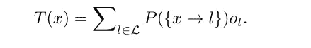

Fig. 2 The prediction of a tree.

## 激活功能

内部节点使用激活函数来计算路由概率。逻辑(又名 sigmoid)函数是软树的常见选择。逻辑函数可以输出任意小的值，但不能输出精确的零。其含义是样本 *x* 将以正概率到达树中的每个节点，因此随着树深度的增加，计算树的输出变得指数昂贵。提出了一种新颖的 ***平滑阶跃激活函数*** ，可以输出精确的 0 和 1。它是 *S 形的*并且是连续可微的，类似于逻辑函数。平滑阶跃函数是区间[-γ/2，γ/2]内的三次多项式，0 向左，1 向右。假设该函数采用下图中的参数形式。

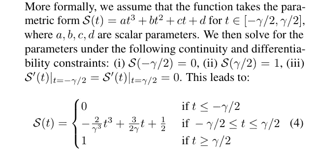

Fig. 3 Smooth-step activation function

平滑阶跃函数对所有实数 *t、*连续可微，包括*γ/2*和 *γ/2。*下图比较了平滑阶跃函数*和* γ=1 以及逻辑函数(这是标准逻辑函数的一个重新调整变量)。

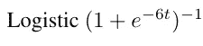

Fig. 4 Logistic Function

Fig. 4 Smooth-step v Logistic

在界限[-γ/2，γ/2]之外，平滑步长函数执行硬路由，类似于经典决策树。γ的选择控制硬路由样本的比例。非常小的γ会导致内部节点出现许多零梯度，而非常大的γ可能会限制条件计算的范围。在他们的实验中，在树层之前使用了批量归一化，以便平滑阶跃函数的输入保持居中和有界。他们注意到它在防止内部节点具有零梯度方面非常有效，至少在最初的几个训练时期是如此。超参数 gamma( γ)用于在他们对模型进行实验的数据集之间平衡训练性能和条件计算。

对于样本 *x* ，如果 *P (x → i) >为 0，即*，则称节点 *i* 可达。如果该样本到达该节点的概率大于零，则称该节点是可达的。可达树的数量直接控制条件计算的范围。下面是对于深度为 10(即，具有 1024 个叶子)和不同γ的单棵树，作为训练时期的函数的可到达叶子的平均数量(每个样本)的图。这是在糖尿病数据集上完成的。

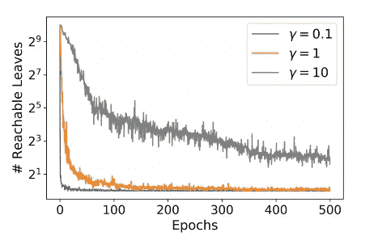

Fig. 5 Number of reachable leaves per sample with a tree depth of 10

从图中，我们可以看到，在训练期间，可达叶的数量迅速收敛到 1。

在下一节中，作者将展示如何利用平滑阶跃函数及其梯度中的稀疏性来开发高效的前向和后向传播算法。

# 条件计算

作者提出了一阶优化方法(如 SGD 及其变体)来优化 TEL。在这种情况下，计算瓶颈是梯度计算，其时间和内存复杂性会随着树的深度呈指数增长。这促使作者通过利用平滑阶跃函数及其梯度中的稀疏性来开发用于 TEL 的更有效的前向和后向传播算法。还解释了为了有效地利用条件计算，每个样本应该到达相对较少数量的叶子。这可以通过将平滑阶跃函数的参数γ选择得足够小来实现。

## 有条件向前传球

在计算梯度之前，需要对树进行正向传递。作者的算法利用了以下观察:如果到叶子 *l* 的路径上的某个边具有零概率，那么 *P (x → l) = 0，*将没有必要沿着该路径继续评估。因此，从根开始遍历树，并且每次节点在一侧输出 0 概率时，其后代在该侧被忽略。图 2 中*的求和仅在遍历到达的叶子上执行。*

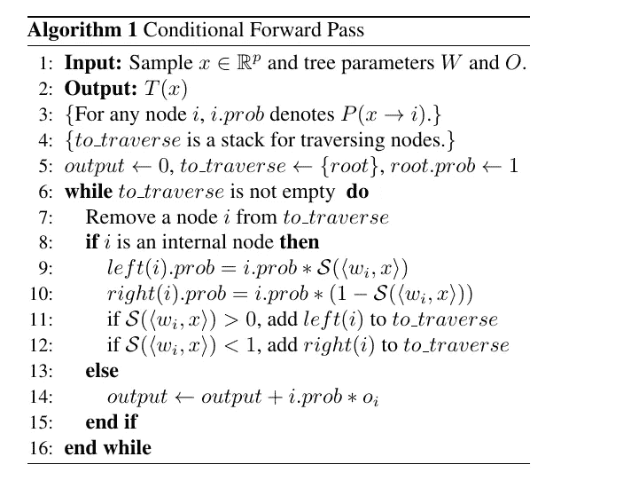

Fig. 6 The pseudocode for the conditional forward pass algorithm

## 条件反向传递

在这里，作者开发了反向传递算法，以有效地计算恒定权重向量 *O、*权重向量 *w、*和样本 *x、*上的梯度。从这里开始，作者使用几个定理来展示该算法如何在网络上工作和计算。下面是运算的算法。

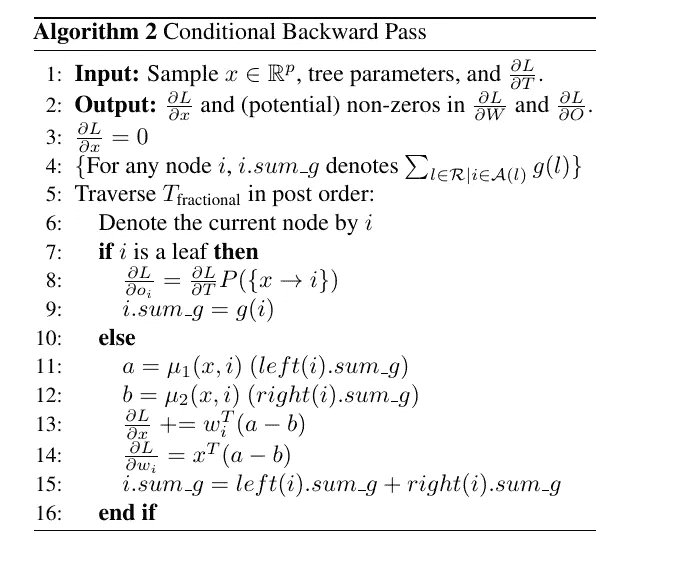

Fig. 7 The pseudocode for the conditional backward pass algorithm

作者强调了关于条件后向传递和条件前向传递之间的时间复杂度的有趣观察，即后向传递具有更好的时间复杂度。这在 NNs 的标准反向传播中非常罕见，因为正向和反向传递遍历相同的计算图。他们将复杂性的提高归功于他们在分数树上操作的算法，与前向遍历的树相比，分数树上的节点数量明显较少。

> 在这种情况下，分数树被视为简化的计算图

# 实验

从预测、条件计算和紧凑性方面评估了 **TEL** 的性能。将其作为独立层和 NN 中的层进行评估，并与标准软树、**、**和密集层进行比较。该模型在来自不同领域的 26 个分类数据集(二元&多类)上进行评估。其中 23 个是[宾机器学习基准](https://epistasislab.github.io/pmlb/)，其余 3 个是 **CIFAR-10** 、 **MNIST、**和**时尚 MNIST** 。

## 模型实现

**TEL** 在 TensorFlow 2.0 中实现，使用定制的 C++内核进行前向和后向传播，以及 Keras Python 可访问的接口。这个实现是开源的，可以在这里[获得。](https://github.com/google-research/google-research/tree/master/tf_trees)

对于所有实验，使用具有树形结构 Parzen 估计器(TPE)的 Hyperopt 进行超调。用分层 5 重交叉验证对模型的 AUC 或准确性进行了优化。对于神经网络，使用 Adam 和交叉熵损失。

## ***平滑步进 vs .逻辑激活***

在 50 个时期内测量训练时间，作为两个激活函数的树深度的函数。使用的参数是 10 的集合大小，对于平滑阶跃函数，γ=1，因为这对应于最差情况的训练时间，优化参数如下:批量大小= 256，学习率=0.1。下图中的表格显示了它们在不同数据集上的表现，它包含了 **TEL** 架构中两个函数的 AUC。A ***** 表示统计显著性，最佳结果以**粗体**表示。

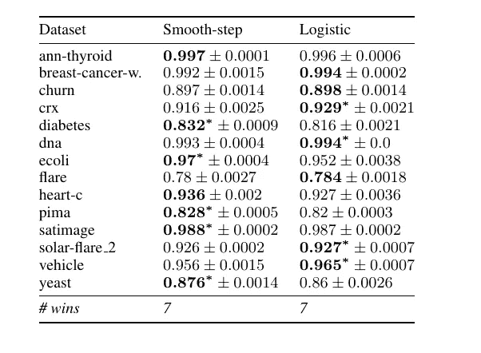

Fig. 8 The comparative performance of the Smoothstep and Logistic function

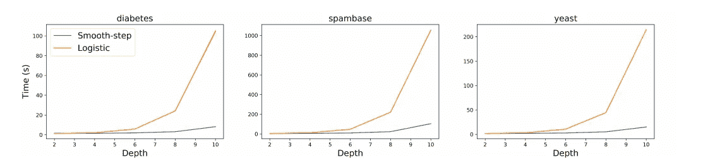

Fig. 9 Training time(sec) vs tree depth for smooth-step and logistic function over 5 repetitions

## TEL vs 梯度增强决策树

对于 **GBDT** ，使用了 **XGBOOST** 。 **CART** 和 **L2 正则化逻辑回归(LR)** 用作基线。为了公平起见，TEL 被用作一个独立的层。对于**电话**和 **GBDT** ，树的数量、深度、学习率和 L2 正则化被调整。批次大小、时期和γ针对 **TEL** 进行了调整，并且在 Hyperopt 中以 AUC 为度量单位进行了 50 轮调整。下图显示了它们的比较性能。

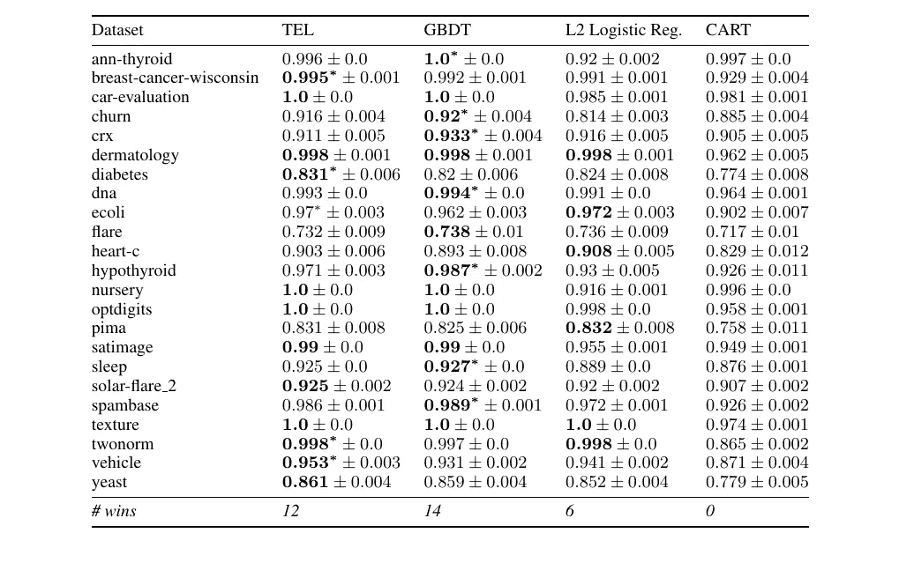

Fig. 10 Test AUC on 23 PMLB datasets over 15 random repetitions

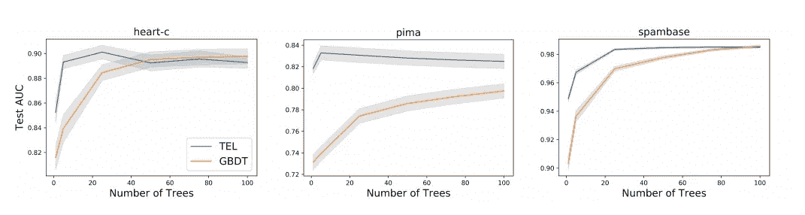

Fig. 11 Mean est AUC vs # of trees (15 trails)

## 细胞神经网络中的 TEL vs 稠密层

作者在 CNN 的 **CIFAR-10** 、**、**和**时尚 MNIST** 数据集上研究了用 **TEL** 替代密集层的潜在好处。他们使用 2 个卷积层，然后是中间层(最大池化、丢弃、批量归一化)，最后是密集层；他们称之为 **CNN 密集**。他们还考虑了类似的架构，其中密集层被替换为**TEL**；他们把这个叫做 **CNN-TEL** 。他们以分类精度为目标度量，运行 Hyperopt 25 次迭代。调整后，使用 5 个随机权重初始化来训练模型。图中显示了它们的性能对比。

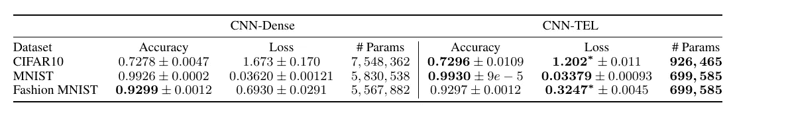

Fig. 12 Shows how both models compare to each other on the 3 datasets.

我们可以看到 **CNN-TEL** 中的参数数量比 **CNN-Dense** 少了大约 8 倍。这显示了表现层是如何被 **TEL** 有效利用的。

# 结论

我发现这篇论文很有趣，我期待着这种方法可能带来的令人兴奋的发展。作者已经在思考他们打算如何改进他们的小说方法。

我的下一步行动是使用 **PyTorch** 实现这个架构，我肯定会写一篇教程文章展示如何在 **PyTorch** 中实现 **TEL** 。

# 参考

1.  Hussein Hazimeh，Natalia Ponomareva，Petros Mol，Zhenyu Tan，Rahul Mazumder,《树集合层:可微性满足条件计算》, 2020 年。

*我将非常感谢对讨论的主题和我的写作方法的反馈和建议。我也仍然是 ML 研究的新手，我乐于接受将进一步帮助我成长的意见和合作。随时和我联系*[***LinkedIn***](https://www.linkedin.com/in/busayo-awobade-107a94175/)*。* ***我很乐意回答您的任何问题或 ML 工程任务:***

 [## Mlearning.ai 提交建议

### 如何成为 Mlearning.ai 上的作家

medium.com](/mlearning-ai/mlearning-ai-submission-suggestions-b51e2b130bfb) 

🔵 [**成为作家**](/mlearning-ai/mlearning-ai-submission-suggestions-b51e2b130bfb)