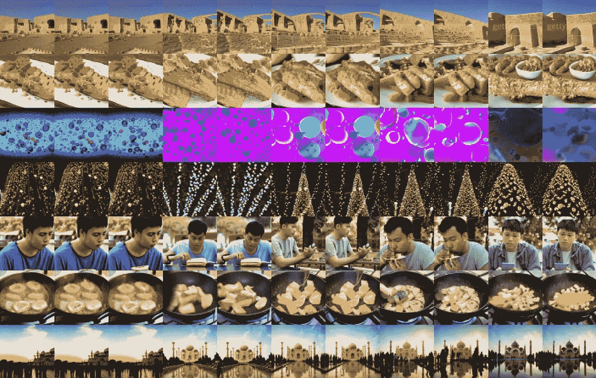

# 用于视频建模的扩散模型

> 原文：<https://medium.com/mlearning-ai/diffusion-models-for-video-modeling-77f0e5f2b86b?source=collection_archive---------4----------------------->

## [机器学习艺术](https://mlearning.substack.com)

## 视频生成的最新成果

[video diffusion model](https://mlearning.substack.com)

会见数据科学家和处于深度学习前沿的专业人士，他们发现可以用**最先进的视频质量分数**创建高质量的视频，只需使用几个简单的成分:高斯**扩散模型**，深度学习…