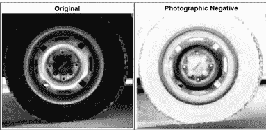
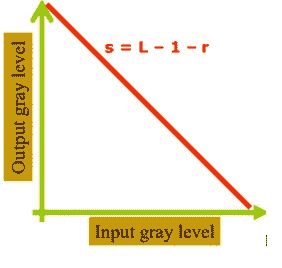
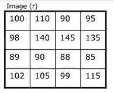
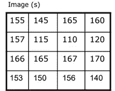
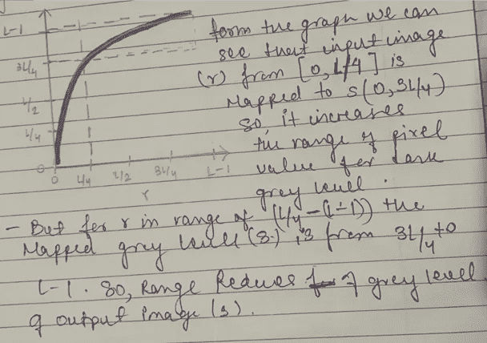
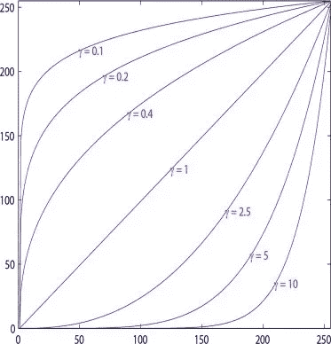

# 数字图像处理第四部分

> 原文：<https://medium.com/mlearning-ai/digital-image-processing-part-4-a25dd09a545c?source=collection_archive---------3----------------------->

*注:这是《数字图像处理》一书的摘要，第四版，拉斐尔·冈萨雷斯，田纳西大学理查德·伍兹，医学数据互动*

**强度变换函数和空间域**

因此，在本文中，我们将讨论在空间域中实现的强度变换函数。在空间域中，我们曾经直接对图像的像素进行操作。空间域技术在计算上更高效，并且需要更少的处理资源来实现。

空间域过程由 g(x，y)=T [f(x，y)]表示，其中 f(x，y)是输入图像，g(x，y)是输出图像，T 是在点(x，y)的邻域上定义的 f 上的算子。该运算符可应用于单个图像或多个图像。

图像增强:这是一个处理图像的过程，使结果比原始图像更适合特定的应用。

处理之前和之后的像素值将分别由 r 和 s 表示 **s=T(r)。**这里，T 是将像素值映射到像素值 s 的变换。

## 图像增强技术

***用于图像增强的三种基本类型的函数:***

1.  **线性函数**

**a)负变换:**通过使用由公式 ***S=L-1-R.*** 给出的负变换，获得强度等级在[0，L-1]范围内的图像的负片

*   这种类型的处理特别适合于增强嵌入在图像的黑暗区域中的白色或灰色细节，尤其是当黑色区域在尺寸上占优势时。

Figure 1: Negative Transformation of the original image

在图 1 中，我们可以看到，在原始图像的负变换之后，变换后的图像在有黑色的地方有白色，反之亦然。

在负变换中，黑色被转换成白色，白色被转换成黑色。对于 8 位图像灰度级或 L=256。如果 r=0(黑色),那么 s=L-1-r，那么就变成了 s=L-1，加上 L 的值，我们就得到 s = 256–1 = 255，这是白色的灰度级。

Figure 2: Graph of Negative Transformation

**消极的优点:**

产生一张相当于照相底片的照片。

增强暗区域中嵌入的白色或灰色细节。

**示例:以下矩阵表示 8 位图像(r)的像素值，应用负变换并找到结果图像像素值。**

Figure 3: Given original image(r)

**L= 2^8 = 256**

**s=L-1-r**

**s =255-r**

在将该变换应用于每个像素以便找到负片之后，变换后的图像是:

对于 r[0，0]灰度值= 100；L=256 所以，s[0，0]= 256–1-r[0，0]，s[0，0]= 255–100 = 155 所以 r[0，0]=155

Figure 4: Negative of the original image

**b)识别功能**

这是一个平凡的例子，其中输出强度等于输入强度。

**2。对数函数**

*   **日志转换**

对数变换的一般形式是 **s=c*log(1+r)** 其中 c 是常数，r > 0。

我们使用这种类型的转换来扩展图像中暗像素的值，同时压缩更高级别的值。

Figure 5: Graph of low transformation

c 值越高，图像越亮。当输入灰度值可能具有非常大的值范围时，这种变换是有用的。

*   **逆对数变换**

进行与对数变换相反的操作

**3。幂律/伽马函数**

其基本形式是 ***s=cr^gamma.*** 如果 **gamma 为< 1** 则图像变亮。如果 **gamma 为> 1** ，则图像变暗。它在**伽马=1 时简化为恒等函数。**

用于校正这些幂律响应现象的过程称为伽马校正。例如，在阴极射线管中，γ值从 1.8 变化到 2.5。

伽马校正对于在计算机屏幕上准确显示图像很重要。伽马校正在 MRI 中，即在医学成像中

*   **第 n 次权力转换**
*   **第 n 次根变换**

Figure 6: Power log Transformation

在下一篇文章中，我们将讨论分段线性变换…

这是 Rafael C. Gonzalez 所著《数字图像处理》一书第三章的摘要。想进一步了解这本书的内容，请阅读我的博客。谢谢大家，并喜欢，分享和评论你的建议…