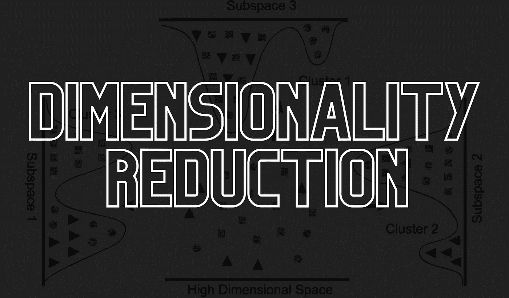
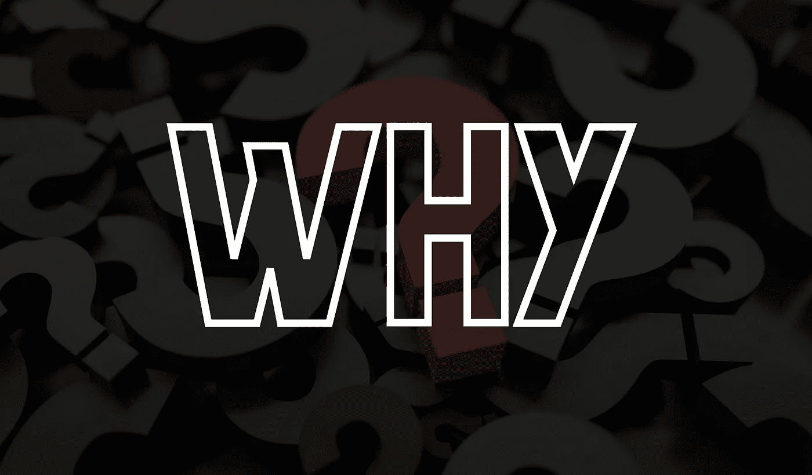
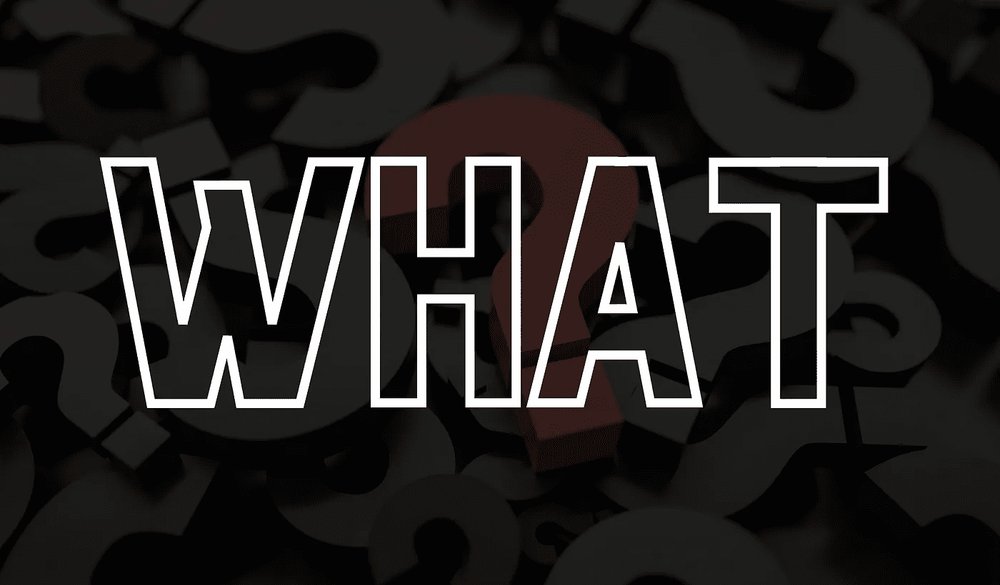

# 降维

> 原文：<https://medium.com/mlearning-ai/dimensionality-reduction-c4727ad078e6?source=collection_archive---------0----------------------->

## 什么，为什么和如何

在本文中，我们将踏上 ***降维*** 之旅。我们旅程的第一站是镇 ***为什么*。**从那里，我们将乘渡船去*镇，而我们将在*镇结束我们的旅程。另外，在说再见之前，有一个小惊喜给你们，我真的希望你们会喜欢它。**

# ****为什么****

****

**经常发生的情况是，在理解一个概念是什么之前，如果我们首先探索导致概念出现的因素，我们就会对概念本身有更好的直觉和更深入的理解，也就是说，我们将确切地做什么。**

**我们在日常生活中遇到的大多数真实世界数据集都是高维的，通常包含多达数百万个特征。当我们有一个高维数据集时，我们在处理它时会遇到大量的问题。其中一些包括:**

*   **人类最强的美德之一是想象的能力。更高维度的数据集使人类缺乏这种美德，因为人类只能将事物可视化到 3 维。**
*   **在许多 ML 模型中，可以看到训练时间和运行时间所需的空间和时间复杂性与数据集中的要素数量成正比。简而言之，数据集的维度越高，空间和时间复杂度的顺序就越高。**
*   **高维数据集增加了数据中的方差，这可能导致模型的过度拟合，即模型虽然在训练数据集上将具有良好的性能，但是在测试数据集上将表现得非常差。**
*   **在许多实际应用中，我们更看重性能而不是精度。在这样的应用中，高维数据集也是一个很大的障碍。**
*   **高维数据集中的要素通常是多重共线的，这在很大程度上降低了模型的预测。**
*   **闵可夫斯基距离(可以被认为是欧几里德距离和曼哈顿距离的推广)在更高维数据集中失去了可解释性。因此，当遇到高维数据集时，所有严重依赖于基于距离的度量的模型都面临着严重的打击。**

**以上要点突出了我们在处理高维数据集时不得不面对的一些主要问题，统称为 ***维数灾难*** 。我们穿着闪亮盔甲的骑士出现了💂🏼降维的概念。事不宜迟，我们继续吧。**

# **什么**

****

**为了解决所有上述问题和许多类似的问题，我们使用降维。根据维基百科的定义，它被定义为将数据从高维空间转换到低维空间，以便低维表示保留原始数据的一些有意义的属性，理想情况下接近其内在维度。**

**迷路了吗？🤔让我们再次定义它。它只是将我们的数据从高维空间转换到低维空间，同时尽可能多地保留信息。**

**现在，下一个自然的问题出现了，“所有这些听起来很神奇，但它是如何做到的呢？这是某种魔法吗？”✴️，这正是我们将在下一节回答的问题。**

# **怎么做**

****

**现在，最重要的问题来了， ***“如何？”*。**有些人可能想知道为什么这是最重要的问题。原因很简单，因为这个问题没有单一的答案。**

**机器学习社区吹嘘了大量的降维技术。事实上，如果我描述其中的每一个，这篇文章将会从一篇低维的文章变成一篇高维的论文😂。**

**因此，在本文中，我决定只探索这些技术的外部领域。但是正如我之前提到的，有一个惊喜在等着你们，所以，现在是 ***惊喜时间*** *。***

**我将很快就这些技术中的一些写详细的文章，对于其他的，我将包括最好的可能的资源让你们所有人详细掌握它们中的每一个。**

**不过在开始我们的旅行之前，我想提一件非常重要的事情。下面列出的技术并不是 ***穷举*。**虽然我已经尝试了尽可能多的技术，但是仍然有更多的技术存在。现在，让我们开始马拉松。**

> **缺失值比率**

**背后的想法很简单。对于我们的每个特征，我们计算**缺失值比率**，它可以简单地计算为**(缺失值的数量/观察总数)* 100** ，然后我们设置一个阈值。现在，我们简单地排除那些丢失值比率高于阈值的特征。关于缺失值比率更详细的理解和实现，请参考此 [*篇*](https://www.analyticsvidhya.com/blog/2021/04/beginners-guide-to-missing-value-ratio-and-its-implementation/) 。**

> **低方差滤波器**

**这项技术也很简单。我们简单地计算数据集中所有特征的方差，然后丢弃所有方差低于某个阈值的特征，同样，阈值的选择完全是主观的。关于低方差滤波器更详细的理解和实现，请参考这篇 [*文章*](https://www.analyticsvidhya.com/blog/2021/04/beginners-guide-to-low-variance-filter-and-its-implementation/) 。**

> **高相关滤波器**

**在这种技术中，我们简单地找出所有数字特征之间的相关性。如果相关系数超过某个阈值，我们可以丢弃其中一个特征。选择我们需要放弃的特性完全是主观的。更多详情，请参考本文 [*篇*](https://solegaonkar.github.io/ConceptHighCorrelationFilter.html) 。**

> **随机森林**

**虽然它是一个基于树的模型，用于非线性数据的回归和分类任务，但它也可以通过其内置的 **feature_importances_** 属性用于特征选择，该属性计算每个特征的特征重要性分数。关于随机森林模型的详细理解，请参考这篇 [*文章*](https://towardsdatascience.com/understanding-random-forest-58381e0602d2) *。***

> **主成分分析**

**在 PCA 中，我们基本上从现有变量中提取新变量，也称为**主成分，**其中每个主成分都是原始特征的线性组合。此外，它们是按照它们各自解释的方差的递减顺序提取的。我们使用特征向量和特征值的数学概念来计算主成分。**

**要想对 PCA 有一个难忘的了解，参考这个栈交换 [*线程*](https://stats.stackexchange.com/questions/2691/making-sense-of-principal-component-analysis-eigenvectors-eigenvalues) 。这是我遇到的对任何话题的最好解释之一，不仅仅是 PCA。关于它的实现，请参考这篇 [*文章*](https://towardsdatascience.com/pca-using-python-scikit-learn-e653f8989e60) *。***

> **独立成分分析**

**这是最广泛使用的降维技术之一，它基于信息论。PCA 和 ICA 的主要区别在于 PCA 寻找不相关的因素，而 ICA 寻找独立的因素。关于它的实现，请参考这篇 [*文章*](https://towardsdatascience.com/independent-component-analysis-ica-in-python-a0ef0db0955e) *。***

> **核主成分分析**

**核 PCA 是使用核方法技术的 PCA 的扩展。核主成分分析可以很好地处理非线性数据集，而正常的主成分分析不能有效地使用。关于内核 PCA 的详细了解，参考这篇 [*文章*](/swlh/vc-high-dimensional-pca-and-kernel-pca-415ef47e2d15) 。**

> **因素分析**

**这项技术基于**相关性**的概念。特定组中的所有变量在它们之间将具有高相关性，但是与其他组的变量具有低相关性，并且我们将每个组称为一个因子。关于因素分析的详细理解，请参考这篇 [*文章*](/mlearning-ai/a-deep-dive-into-factor-analysis-d64e550c358f) 。**

> **线性判别分析(LDA)**

**虽然它通常用于多类分类，但它也可以用于降维。这是一种受监督的算法，也考虑了类别标签。关于线性判别分析的详细理解，请参考这篇 [*文章*](https://towardsdatascience.com/linear-discriminant-analysis-explained-f88be6c1e00b) 。**

> **对应分析**

**也被称为**倒数平均**，这是一种传统上应用于**列联表**的技术。虽然它在概念上类似于 PCA，但是它适用于分类数据而不是连续数据。到目前为止，这就是关于 CA 的内容，但是很快我将会写一篇关于 CA 和 MCA 的文章，在这篇文章中，我也会对列联表进行一些阐述。**

> **多重对应分析**

**它可以简单地定义为 CA 在两个以上分类特征上的扩展。它用于检测和表示数据集中的底层结构。它通过将数据表示为低维欧几里得空间中的点来实现这一点。到目前为止，这就是 MCA，但很快我会写一篇关于 CA 和 MCA 的文章。**

> **多因素分析**

**它寻找存在于所有特征中的共同结构。当数据集由一组数字或分类要素组成时，使用该方法。这是因为 MFA 用于分析由几个组特征描述的一组观察值。它可以看作是主成分分析、多成分分析和 FAMD 的延伸。到目前为止，这就是 MFA，但很快我会写一篇完全基于这种技术的文章。**

> **混合数据的因子分析(FAMD)**

**它用于降低包含定量和定性特征的数据集的维度。这意味着 FAMD 适用于具有分类和数字特征的数据。可以看作是 PCA 和 MCA 的混合。到目前为止，这就是 FAMD，但很快我会写一篇完全基于这一技术的文章。**

> **奇异值分解**

**虽然它在数字信号处理中用于降噪和图像压缩，但它也可以用于降维。是从**线性代数**的海洋里借来的概念。关于奇异值分解的详细理解，参考这篇 [*文章*](https://towardsdatascience.com/understanding-singular-value-decomposition-and-its-application-in-data-science-388a54be95d) 。**

> **截断奇异值分解**

****截断 SVD** 不同于常规 SVD，因为它产生一个因子分解，其中列数等于指定的**截断**。它适用于许多行值为零的稀疏数据。到目前为止，这就是截断奇异值分解，但是很快我将会写一篇基于奇异值分解和截断奇异值分解的文章。**

> **t 分布随机邻域嵌入(t-SNE)**

**它也是一种非线性降维技术，就像核 PCA 一样，主要用于数据可视化。除此之外，它还广泛应用于图像处理和自然语言处理。关于 t 分布随机邻域嵌入的详细理解，可以参考这篇 [*文章*](https://towardsdatascience.com/an-introduction-to-t-sne-with-python-example-5a3a293108d1) 。**

> **多维标度(MDS)**

**就像 t-SNE，MDS 是另一种非线性降维技术。它试图保持实例之间的距离，同时减少非线性数据的维度。关于多维缩放的详细理解，请参考这篇 [*文章*](https://towardsdatascience.com/mds-multidimensional-scaling-smart-way-to-reduce-dimensionality-in-python-7c126984e60b) 。**

> **一致流形近似和投影(UMAP)**

**这是一种降维技术，可以像 t-SNE 一样用于数据可视化。然而，它也可以用于非线性数据集的降维。到目前为止，这就是 UMAP，但很快我会写一篇完全基于这一技术的文章。**

> **等距特征映射(Isomap)**

**就像 t-SNE 一样，它也用于非线性数据集的降维。它可以被看作是 MDS 或内核 PCA 的扩展。关于等距特征映射的详细理解，请参考这篇 [*文章*](https://towardsdatascience.com/isomap-embedding-an-awesome-approach-to-non-linear-dimensionality-reduction-fc7efbca47a0) 。**

> **局部线性嵌入(LLE)**

**这是一种无监督的降维方法。它试图减少特征的数量，同时试图保留原始非线性特征结构的几何特征。关于局部线性嵌入的详细理解，参考这篇 [*文章*](https://towardsdatascience.com/lle-locally-linear-embedding-a-nifty-way-to-reduce-dimensionality-in-python-ab5c38336107) 。**

> **黑森特征映射(HLLE)**

**它将数据投影到一个较低的维度，同时保留像 LLE 这样的局部邻域，但使用 Hessian 算子来更好地实现这一结果，因此得名。到目前为止，这就是 HLLE 的全部内容，但是很快我将会写一篇完全基于这种技术的文章。**

> **光谱嵌入(拉普拉斯特征映射)**

**它使用频谱技术，通过将附近的输入映射到附近的输出来执行降维。它保持局部性而不是局部线性。对于光谱嵌入的详细了解，可以查看我的 [*文章*](https://elemento.medium.com/demystifying-spectral-embedding-b2368bba580) 上相同。**

> **反向特征消除**

**该技术通过递归要素消除(RFE)过程从数据集中移除要素。该算法从初始特征集开始，并继续消除特征，直到它检测到性能分数中的可忽略变化。关于后向特征消除的详细理解，请参考这篇 [*文章*](https://towardsdatascience.com/backward-elimination-for-feature-selection-in-machine-learning-c6a3a8f8cef4) 。**

> **正向特征选择**

**这种方法可以被认为是反向特征消除的相反过程。它不是递归地删除特性，而是递归地添加特性。它从单个特性开始，并不断添加特性，直到检测到性能分数的微小变化。关于向前特性选择的详细理解，请参考这篇 [*文章*](https://towardsdatascience.com/feature-importance-and-forward-feature-selection-752638849962) 。**

> **自动编码器**

**这是一种人工网络，旨在将它们的输入复制到它们的输出。他们将输入压缩成一个**潜在空间表示**，然后从这个表示中重建输出。要详细了解自动编码器，请参考这篇 [*文章*](https://towardsdatascience.com/autoencoders-in-practice-dimensionality-reduction-and-image-denoising-ed9b9201e7e1) 。**

# **关闭**

**唷！在写这篇文章之前，我做梦也没想到会有这么多降维技术。每当我遇到以上列表中没有的降维技术时，我一定会更新这篇文章。**

**如果你们中的任何人遇到了以上列表中没有的降维技术，请在评论区告诉我，或者直接联系我。**

**另外，我还想提一件事。从上面的列表中可以看出，我已经提到我将分别就这些技术中的许多技术撰写文章，但是如果我找到了深入解释上述任何技术的资源，那么代替我自己撰写文章，我将只是包括该资源，以便我们所有人都可以受益。**

# **关于我的一点点👋**

**如果你没有兴趣认识作者，或者你已经认识我，你可以安全地跳过这一节。我保证这里没有隐藏的宝藏😆。**

**我是一个机器学习和深度学习的爱好者，这是我第一篇基于相同内容的文章。如果你喜欢，请把你的手放在一起👏如果你想阅读基于机器学习和深度学习的进一步文章 *#StayTuned。***

**非常感谢各位，让这次旅程成为可能。这的确是一次有趣的旅行，很快我会带着另一次冒险旅行回来。**

** [## Mlearning.ai 提交建议

### 如何成为 Mlearning.ai 上的作家

medium.com](/mlearning-ai/mlearning-ai-submission-suggestions-b51e2b130bfb)**