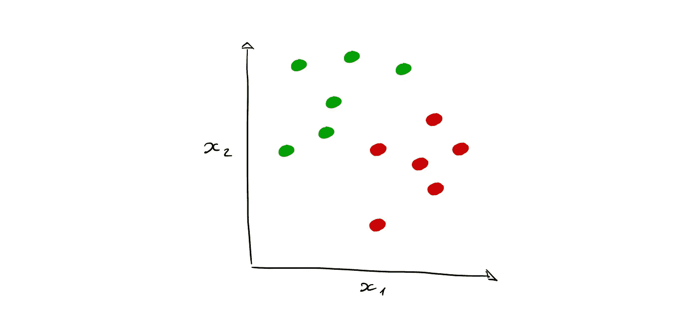
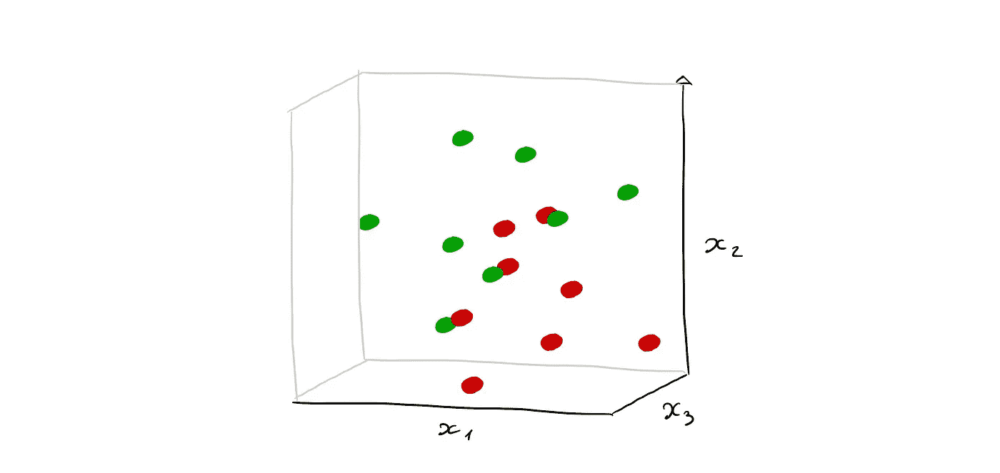
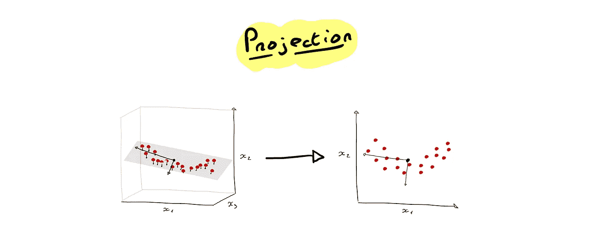
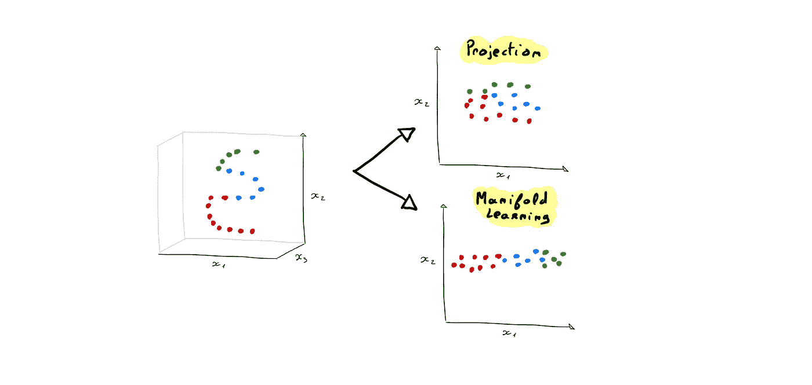
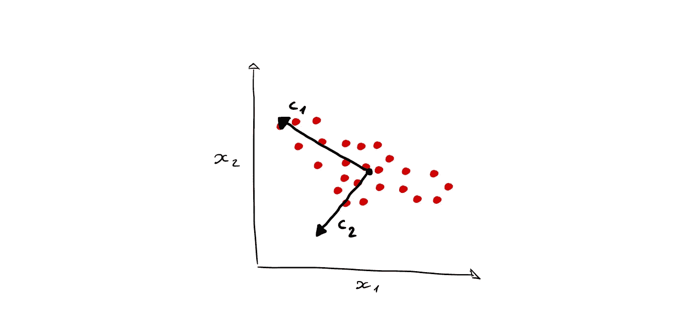
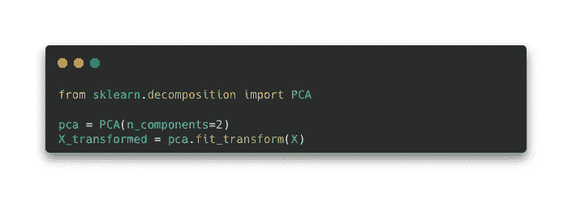
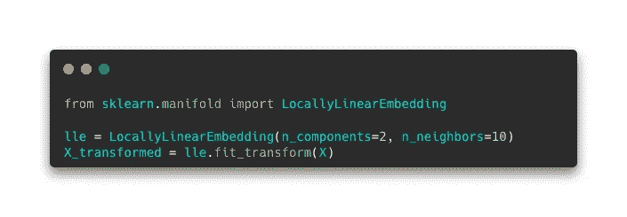

# 降维—降低模型复杂性

> 原文：<https://medium.com/mlearning-ai/dimensionality-reduction-fight-your-model-complexity-b80143b60b48?source=collection_archive---------2----------------------->

在本文中，我们将深入研究**维度** **缩减**来理解它的工作方式，以及为什么当你必须训练你的模型时，它可以成为一个救命稻草。

Photo by [Ehud Neuhaus](https://unsplash.com/@paramir?utm_source=medium&utm_medium=referral) on [Unsplash](https://unsplash.com?utm_source=medium&utm_medium=referral)

**维度** **约简**常与 **维度**的**诅咒** **概念一起引入。**

维数灾难可以表示为这样一种情况，其中 **的**号** **特征**(表格数据的列)为**高**，而数据集中的样本没有那么多。**

让我们有一个由 2 个要素和 12 个观测值组成的数据集:

如果我们添加一个特征，数据点之间的距离将增加，并改变模型的学习方式:

在**高** **次元** **空间**中，点彼此相距甚远。因此，对于具有许多要素的数据集来说，训练数据点将被广泛地分开。因此，维数灾难的出现意味着，如果要训练的数据太少，拥有许多特征将导致**较差的** **学习**，并且模型将对新的观察结果做出糟糕的预测。

> 在训练过程中增加特征的数量会导致数据结构更加复杂，因此，由于模型无法将观察结果相互关联，可能会出现**过度拟合**。

这个想法是通过允许机器从数据之间的最佳关系中学习来解决这个问题。事实上，我们所知道的机器学习是，在模型中初始化的算法将试图理解数据在它们之间是如何表示的，以便在面对新数据时能够正确地瞄准。
这也适用于其他类型的数据，如图像、文本或音频，模型将学习从特征中找出区别。然而，在上面呈现的非结构化数据(图像、文本、音频……)的上下文中，所述特征成倍增加(一个单词被表示为与其自身相关，但也与其他等等相关)，这导致了无法想象的维度。

**有什么方法可以降低数据集的维度，并面对这种负担？**

有不同的降维方法:一种是可以与**投影**相关联的**线性** **方法**，另一种是克服了第一种方法的缺点的**非线性** **方法**，**流形** **学习**(实际上也包括投影)。

# 对抗维数灾难的两种方法

正如我们之前看到的，处理数据集中的维度就是处理它包含的要素数量。一个解决方案是减少这个数字的**。然而，主要的障碍是拥有较少的特征，但是保持它们和目标之间的关系。我们想要的是我们的数据集的一种表示，它可以适合一个小维度的空间，以便模型学习得更好(更快)。但是必须维护数据的结构和每个点之间的关系。**

## 推断

第一种方法基本上是通过**将** **数据** **点**从上级维度空间投影到下级维度空间来降低维度，同时保留特征之间的关系。

如果我们将投影应用于 3D 数据集，它将允许数据集被表示成二维子空间，如下所示:

这个例子的灵感来自奥雷连·盖伦的书。

我们可以注意到的一个特殊性是，新的表示(在 2D)仅使用 2 个特征进行投影，而 3D 表示使用了 3 个特征。然而，在此之前，能够保持特征/变量之间的关系是合乎逻辑的，投影创建包含数据集的"**本质**"的新特征。**主** **分量** **分析** ( **PCA** )是最广为人知的投影技术，我们将在下一部分重点介绍。

关于投影的一件重要事情是，它在处理数据的线性结构时表现良好，但在处理非线性结构时有困难。它将创建一个新的表示，不会真正保留数据点之间的差异。

正如你所注意到的，投影使得机器学习变得困难。让我们看看如何达到第二个约简，并处理非线性结构。

## 流形学习

这种方法实际上包括投影，因为数学中的流形是:

> 在每个点附近局部类似于[欧几里得空间](https://en.wikipedia.org/wiki/Euclidean_space)的[拓扑空间](https://en.wikipedia.org/wiki/Topological_space)([维基百科](https://en.wikipedia.org/wiki/Manifold))。

流形允许将任何数据结构表示到低维空间中，通过最终将高维表示重组为唯一的局部表示来保持相同的结构。

如果我们考虑投影，它不会真正重新组合，而只是将 3D 结构表示成 2D 结构。

一个**2D**流形是一个可以折叠成一个大空间的二维:比如一个**球体**或者一个**圆环体**。

流形学习站在**两个** **假设**:

*   “流形假设是真实世界的高维数据存在于嵌入在高维空间中的低维流形上”(来自[流形的陈述:温和的介绍](https://bjlkeng.github.io/posts/manifolds/))。这意味着由于流形的存在，我们可以用高维数据来描述真实世界。
*   第二种假设倾向于解释，如果在低维流形空间中完成，则**回归**或**分类**问题**问题**将会更容易****到** **求解**(这并不意味着模型会执行得更好，但是，它可以学习得更快或者只是允许他学习)。**

**现在我们已经知道了降维的两种主要方法，让我们看看使用两种算法的技术: **PCA** 和 **LLE** 。**

# **降维的主要技术**

**我们将深入研究获取数据集结构并降低这些结构维度的技术。**

## **主成分分析**

**这种技术是最常见的，也可以用于无监督学习问题。**

****PCA** 使用投影方法来降低数据的维度。它找到数据集结构中的主要成分，并保留最有用的成分。**

**主分量是**单位向量**(特别能指定平面上非 nul 向量方向的向量) :**

****

**这些组件跟踪数据结构的表示，因为每个组件都对数据的变化有贡献(保留信息)。向量 c1 和 c2 是数据集的两个第一主分量。**

****的**比率** **解释** **方差**是 PCA 中的重要度量之一，因为通过查看每个组件的比率，您可以选择要保留的组件数量作为数据集的新表示。例如，第一个分量(最佳分量)可以解释数据中 80%的方差，第二个分量可以解释 10% …如果您决定保留 90%的方差，那么您将保留这两个分量，您的数据集现在将由 2 个要素组成，因此是 2 个维度。这就是基于投影的降维。****

**由于这些分量是单位向量，数据集的原始特征将不再用于学习，新特征将是主分量 1、主分量 2…**

**主成分分析在 **Scikit-Learn** 中可用，代码如下:**

****

**PCA 的**主要问题**是它主要对**线性** **数据** **结构**起作用**的事实，这就是为什么存在其他技术的原因。****

## **局部线性嵌入**

****LLE** 是一种非线性降维技术，它评估高维空间中每个数据点的邻域，并寻找保持这些最近邻域关系的较低邻域。
sci kit-Learn 定义提供了一个很好的比较:LLE“*可以被认为是一系列局部主成分分析，它们被全局比较以找到最佳非线性嵌入*”。**

**这项技术分几个步骤进行:**

*   **找到每个数据点的**局部线性关系** / **k** - **最近的** **邻居**，并关联使数据点与其邻居之间的距离最小的权重。由于这一点，该算法知道所有的本地社区。**
*   **一旦它理解了数据，它将寻找在 *d* 维空间中所有这些局部线性关系的**新的**表示。为此，它在新空间中搜索每个点的位置，该位置考虑第一步中找到的最小化的关系和距离。**

**作为 PCA， **LLE** 在 Scikit-Learn 中可用:**

****

# ****结论****

**在一个数据集越来越大的世界里，维数约简 **非常重要和有用。任何非结构化和复杂的数据都需要经过降维，以便模型进行学习。
存在不同的方法，如**投影**或**流形** **学习**，每种方法都有可直接应用于数据的算法。例如 **PCA** 或 **LLE** ，但其他一些也同样有效: **Isomap** ， **t-SNE** **方法**， **LDA** (线性判别分析)…****

**感谢你阅读这篇文章，我希望你喜欢并更好地了解降维是如何工作的！**

## ****资源:****

** [## Python -机器学习掌握中的主成分降维分析

### 减少预测模型的输入变量的数量被称为降维。更少的输入…

machinelearningmastery.com](https://machinelearningmastery.com/principal-components-analysis-for-dimensionality-reduction-in-python/)  [## 2.2.流形学习

### 寻找最基本的必需品简单的最基本的必需品忘记你的忧虑和冲突我是说最基本的…

scikit-learn.org](https://scikit-learn.org/stable/modules/manifold.html)  [## 使用 Scikit-Learn、Keras 和 TensorFlow 进行机器实践学习，第二版

### 通过最近的一系列突破，深度学习推动了整个机器学习领域。现在，甚至…

www.oreilly.com](https://www.oreilly.com/library/view/hands-on-machine-learning/9781492032632/)  [## Mlearning.ai 提交建议

### 如何成为 Mlearning.ai 上的作家

medium.com](/mlearning-ai/mlearning-ai-submission-suggestions-b51e2b130bfb)**