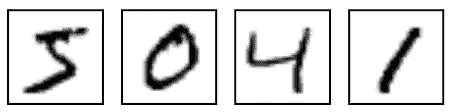
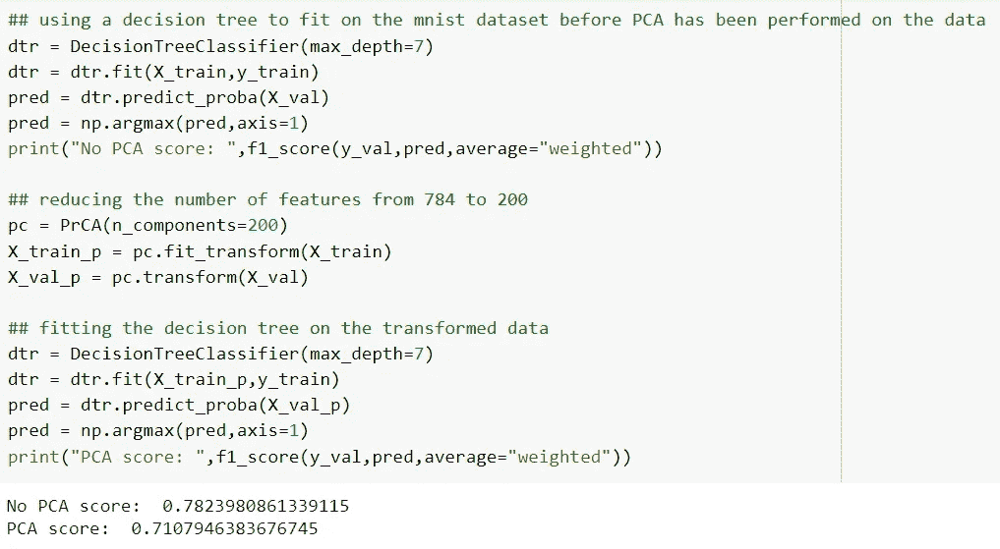
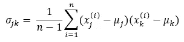
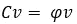
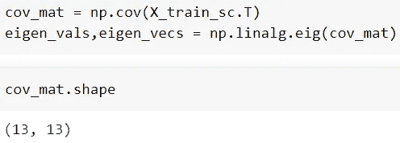
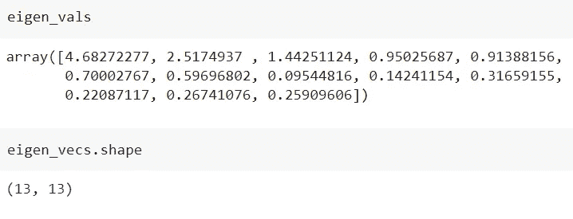
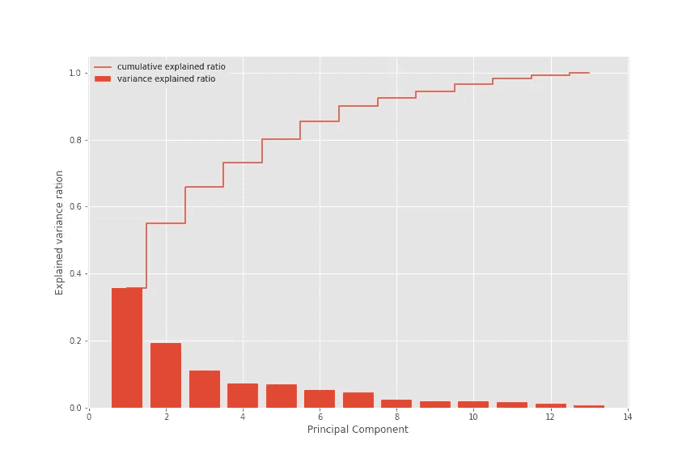
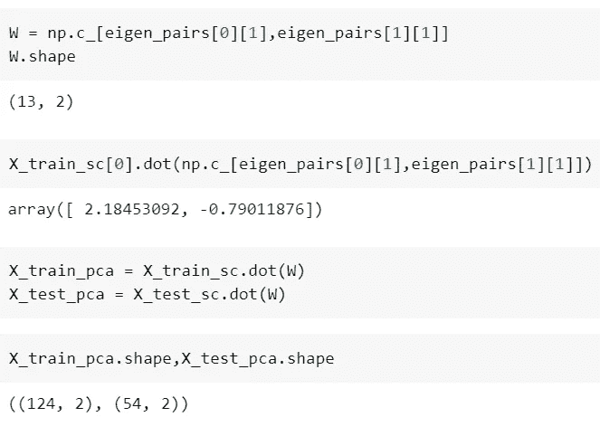
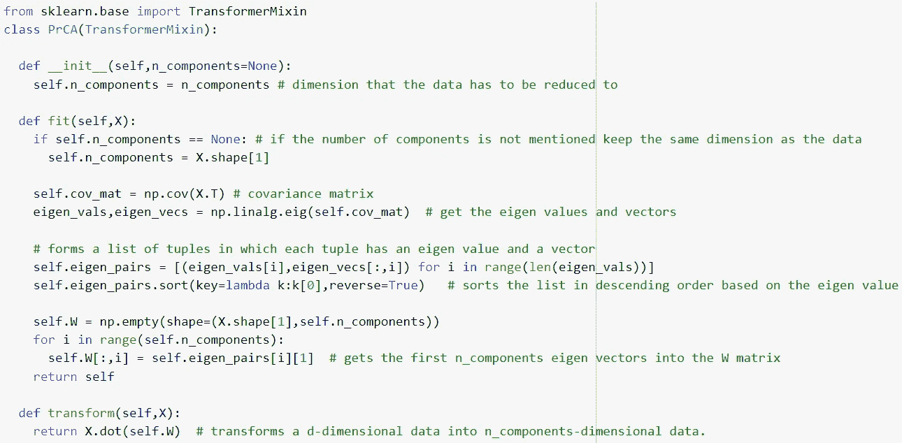

# 降维:主成分分析

> 原文：<https://medium.com/mlearning-ai/dimensionality-reduction-principal-component-analysis-d990233070e9?source=collection_archive---------7----------------------->

萨提亚·克里希南·苏雷什

数据集由许多要素组成。只要这些特征以某种方式与目标相关，并且在数量上是最优的，机器学习模型就能够在从数据中学习之后产生体面的结果。但是，如果特征的数量很大，并且大多数特征对模型的学习没有贡献，则模型的性能会下降，并且输出预测所花费的时间也会增加。通过将原始特征空间变换到子空间来减少维数的过程是执行维数减少的一种方法，主成分分析(PCA)就是这样做的。因此，让我们来看看 PCA 的构建概念。与文章相关的代码可以在[这里](https://github.com/SathyaKrishnan1211/Low-key-ML/blob/master/Notebooks/Principal_Component_Analysis.ipynb)找到。

**维数灾难:** 在开始 PCA 之前，我们先来了解一下为什么拥有大量特征是个问题。请看下图，该图显示了著名的“mnist”数据集中的实例。

每个图像的形状是 28x28，但是正如你所看到的，超过一半的区域对模型的学习没有贡献，但是模型仍然适合它们。空白占据了大量的内存，并且减慢了模型的学习过程。像这样的特征不仅存在于这个数据集中，而且存在于大多数真实世界的数据集中。看一下下图。在不应用 PCA 的情况下，我们得到 0.78 的 f1_score，并且在应用 PCA 之后，特征的数量减少到 200，并且 f1_score 大约为 0.71。特征的数量少于原始特征数量的三分之一，并且 f1_score 相当接近用所有特征获得的分数，并且训练过程已经被加速。这就是降维的好处。现在我们来了解一下 PCA。

**主成分分析:** 主成分分析是一种无监督的降维技术。PCA 将高维空间(n)中存在的数据转换到较低维的子空间(d 和 d<n)中，使得信息损失最小。PCA 通过使用协方差矩阵、特征向量和特征值来实现这一点。那么什么是协方差矩阵、特征向量和特征值呢？

**协方差矩阵:** 协方差矩阵是从 n x d 数据集构建的 d x d 矩阵，其中 n 是实例的数量，d 是数据集中存在的要素的数量。它由数据集中所有可能的要素对的协方差组成。因为所有的行和列都表示特征，所以出现在第 *i* 行和第 *j* 列的值与出现在第 *j* 行和第 *i* 列的值相同。从公式中很容易看出对角线是由每个特征的方差组成的。如果两个特征之间的协方差为正，则当一个特征增加时，另一个特征也会增加。如果协方差为零，则一个要素的变化不会影响另一个要素，如果协方差为负，则两个要素都将向相反方向增加。

**本征向量和本征值:** 本征向量是这样一种向量，当其经历线性变换时，仅改变其长度，就好像它被乘以标量一样。特征向量在 PCA 中用于形成低维子空间的轴，因此它们也被称为**主分量**。每个特征向量捕获数据中存在的一定量的方差。捕捉最多的将形成子空间。这里最大的优点是没有两个特征向量捕获相同的信息，因为它们彼此垂直，因此没有数据重复。在下面给出的等式中,“C”是一个矩阵,“v”是一个向量。标量“psi”称为特征值。当矩阵乘以“v”时，它不会导致“v”改变方向或移位，而是收缩或扩张。本征向量的幅度由相应的本征值给出，因为对于给定的矩阵可能有一个以上的本征向量。

**PCA 步骤:** 现在我们已经知道了进行 PCA 所需的概念，下面我们就来列出 PCA 进行降维所遵循的步骤。
1。将数据标准化或规范化。
2。形成协方差矩阵。
3。将协方差矩阵分解成特征向量和特征值。
4。按照特征值的降序对特征向量进行排序。
5。选择前 k 个特征向量，其中 k 是子空间的维数。
6。形成维数为 d×k 的矩阵 W，其中 d 是原特征空间的维数，k 是子空间的维数。7。通过将数据与 w 相乘来转换数据。

1.  **标准化或规范化数据** 在构建协方差矩阵之前标准化或规范化数据非常重要，因为如果每个轴具有不同的尺度，将很难将数据转换到更低维度的子空间。
2.  **形成协方差矩阵** 协方差矩阵由使用上述公式提供的数据集构建而成。下图显示了如何使用 numpy 来完成。它的形状是 13 x 13，因为“葡萄酒”数据集中有 13 个特征。

3.**将协方差矩阵分解为本征向量和本征值
使用 numpy 中的线性代数包从协方差矩阵中获得本征值和向量。找到协方差矩阵的十三个特征向量，每个向量的维数为 1×13。特征值代表由每个特征向量捕获的变化量。第一个特征向量捕捉最大的方差，随后是第二个向量，依此类推。**

现在是引入解释方差比率和总解释方差的时候了。解释方差比是特征值和所有特征值之和的分数，而总解释方差是各个主成分的所有方差之和。下图显示了每个特征向量的解释方差比和累积解释比。

最后四个步骤可以合并，因为它们相当简单。下面的代码展示了所有这些。首先，用具有最高特征值的两个特征向量形成 W 矩阵。然后，数据从 13 维数据集转换为 2 维数据集。

到目前为止，我讨论的所有内容都被合并到下面的代码中。

**结论:** 本文讨论了最流行的降维技术之一 PCA。在以后的文章中，将讨论后续的技术。希望你和我一样喜欢这篇文章。

 [## Mlearning.ai 提交建议

### 如何成为 Mlearning.ai 上的作家

medium.com](/mlearning-ai/mlearning-ai-submission-suggestions-b51e2b130bfb)