# 晚宴灾难…为什么说你对医疗保健的想法会暗中泄露你是否投票给特朗普

> 原文：<https://medium.com/mlearning-ai/dinner-party-disaster-why-saying-what-you-think-about-healthcare-secretly-reveals-if-you-voted-for-a481cf86f8ed?source=collection_archive---------3----------------------->

**注意你说的话**

马上要去参加一个晚宴？你不会孤单的。美国已经准备好了美酒、佳肴和欢乐，尽管这个国家的媒体已经写了大量关于礼仪和装饰的文章(点击[此处](https://www.rollingstone.com/product-recommendations/lifestyle/best-dinner-party-essentials-1190940/)、[此处](https://www.wsj.com/articles/the-return-to-dinner-parties-a-sensible-low-stress-guide-11622224850)或[此处](https://www.washingtonpost.com/food/2021/06/04/post-vaccine-dinner-party/))，但它对会话中的该做和不该做毫无帮助。这篇文章主要是关于禁忌的。当然，礼貌交谈的第三个话题是政治和宗教，虽然避免这些话题是很简单的建议，但看似安全的话题可能比你想象的更多地暗示了你的政治背景。正如你很快就会看到的，大量的话题都带有党派色彩，而且，就晚餐时讨论的程度而言，可能会宣传你的政治倾向，并在你的晚餐同伴口中留下酸味，不管你餐桌上的食物质量如何。

接下来的分析使用了大量机器学习工具来定义政治团体，将各种意识形态划分为左翼、右翼和温和派，并预测选民结果。正如这篇文章的标题所暗示的，询问某人对医疗保健的看法就像询问你的用餐伙伴他们在上次选举中如何投票一样有启发性。

总统先生，他们就是不喜欢你

自美国选择一位慈祥的前副总统作为第 46 任总统以来的 11 个月里，这个国家成功地为绝大多数需要疫苗的人提供了疫苗，经历了快速的就业增长，并看到其股票指数攀升至新的记录。总统标志性的立法成就广受欢迎，甚至连投反对票的共和党人有时也会邀功。来自民主党左派的立法优先权冒着点燃美国文化战争的风险已经酝酿，但还没有沸腾。虽然共和党人和民主党人可能对基础设施法案的轮廓有分歧，但两党对做一些事情，甚至任何事情的支持都是强有力的。

然而，尽管拜登自就职以来的支持率一直稳定，但他的不支持率却有所上升。美国交战部落的敌意从未被长期或真诚地压抑过，现在像一场古老的体育竞赛一样卷土重来，社交媒体提醒着双方的历史恩怨。事实上，就连民主党盟友也开始更加公开地表达他们的分歧，特别是在即将出台的基础设施法案的条件问题上。如果你和我们一样，你会觉得这是意料之中且不可避免的。为什么我们会有这样的行为，投票大众离意识形态中心有多远？意识形态在多大程度上决定了投票结果，哪些问题至关重要？同一个党内的选民有多少是以同样的方式看待世界的，或者换句话说，两个大党的帐篷有多大？

**询问美国的想法**

为了回答这些问题，我们求助于美国全国选举研究(ANES) 2020 年时间序列研究。每个选举周期，斯坦福大学和密歇根大学合作的 ANES 通过网络、视频和电话询问大量选举前和选举后的问题。由于新冠肺炎疫情，2020 年没有进行面对面的采访。相反，ANES 进行了大约 8000 次自我管理的在线调查、在线视频直播采访和电话采访。

为了简洁起见，我们不讨论调查设计。如果你有兴趣，详情可以在这里找到[。然而，下面的图表是自 1968 年以来在每次选举中最终投票的调查受访者的快速快照。认同民主党人、独立人士和共和党人的参与者数量每年都有所不同，但 2016 年至 2020 年之间选民偏好的唯一实质性变化发生在独立人士身上(注意，在整个选举周期中，受访者不一定完全相同)。虽然转变偏好的问题很有趣，也值得研究，但本文专注于 2020 年的调查数据，特别是关于移民、同性婚姻、患者保护与平价医疗法案和新冠肺炎等主题的 121 个问题。这些问题是在选举后提出的。我们明确不包括任何与工作批准、特定政府政策批准或回应(如政府对新冠肺炎的回应)或候选人偏好相关的问题。](https://electionstudies.org/data-center/2020-time-series-study/)

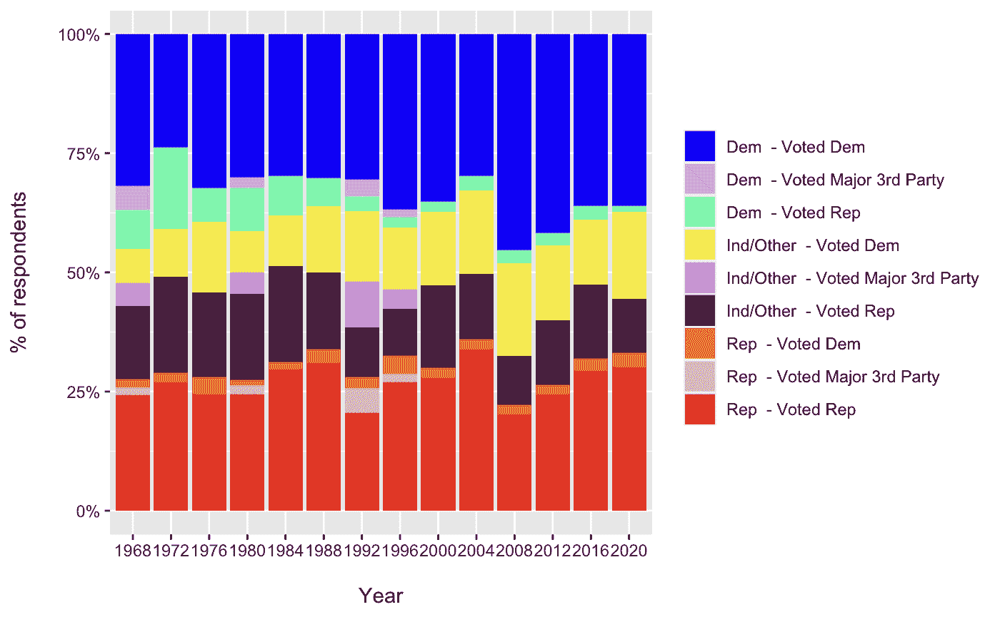

**美洲，成群**

首先，我们要确定构成共和党和民主党的意识形态联盟。为此，我们使用了一种叫做 K 均值聚类的技术。在这个包含 121 个问题的宇宙中，没有一个问题包含人口统计信息、党派或候选人偏好，K-means 算法将受访者分为不同大小的群组。例如，它可能将民主党人分成两个或二十个团体。为了确定最佳的聚类方案，我们使用一系列 30 个测试来指导我们的决策。

对于 Biden 选民划分和 Trump 选民划分，我们的测试报告理想的聚类数是两个。运用一点技巧，我们可以将这些群体描述为“温和派”和“极端派”。温和派在特朗普选民中占 55%，在拜登选民中占 46%。极端的拜登选民，更确切地说是自由派，可能会是患者保护与平价医疗法案的热情支持者，而极端的川普选民，也就是保守派，可能会赞成废除它。使用这种分类，我们对每个问题从保守到自由进行分级。大多数问题，如与患者保护与平价医疗法案有关的问题，都有明显的党派分歧，而其他问题，如国际贸易问题，则没有。

这份报告的作者没有发现直观的模型结论，即只有四个集群，平均分配给共和党和民主党，是一个最佳的解决方案。两大政党毕竟是大帐篷，我们预计会有大量不同的子群体。FiveThirtyEight 选举前报道的作者为每个政党选择了五到六个侧翼或通道(见脚注 1)。当我们根据 121 个问题的党派地图给每个回答者打分时，根据他或她的答案的党派性给每个人分配一个分数，聚类在视觉上是惊人的。下面的每个点代表一个人，由四个集群(y 轴)中的一个分组，并根据他们的意识形态得分(x 轴)进行映射。特朗普保守派和拜登自由派的整体意识形态倾向没有重叠。温和派就不是这样了。例如，看看意识形态得分大于零的拜登温和派。这些人有着保守的世界观，但还是投票给了拜登。倾向特朗普的自由派温和派更少，但他们确实存在。

意识形态大体上反映了对候选人的感受。下图显示了受访者的意识形态与对唐纳德·特朗普的感受之间的关系。意识形态和对特朗普总统的热情并不是完全线性的——一些世界观非常保守的人对这位前总统非常冷淡，而其他倾向自由主义的人则是 MAGA 的粉丝。然而，总的来说，这种关系是明确的。请注意，党派关系大致反映了意识形态和对唐纳德·特朗普的感情。

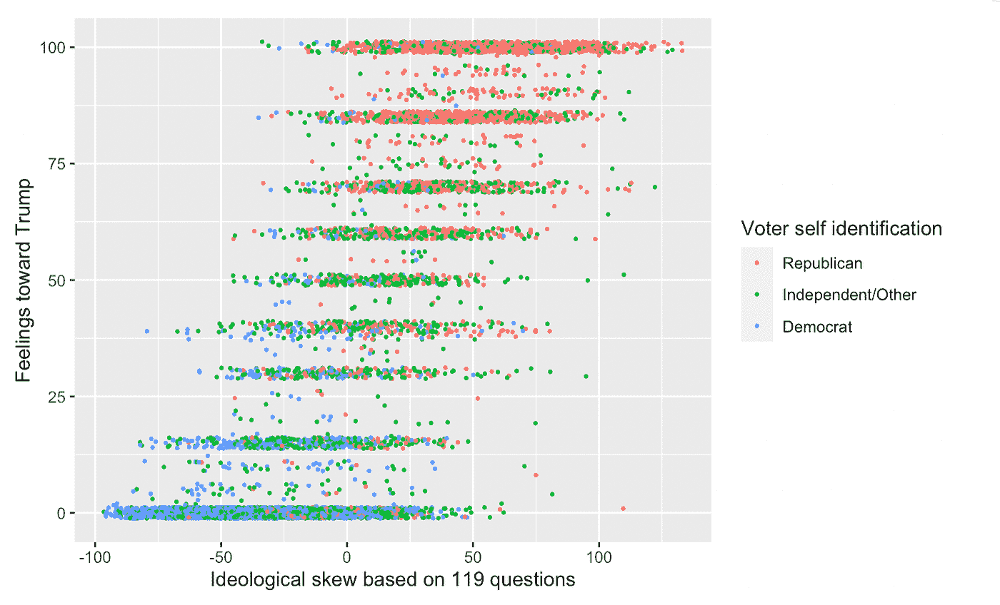

当我们跨群组查看我们的调查受访者的人口统计数据时，一些清晰的模式浮现出来。

拜登的温和派不太可能是白人，而更有可能是黑人、西班牙裔、亚裔或印第安人。特朗普温和派和保守派之间的种族差异不太明显。

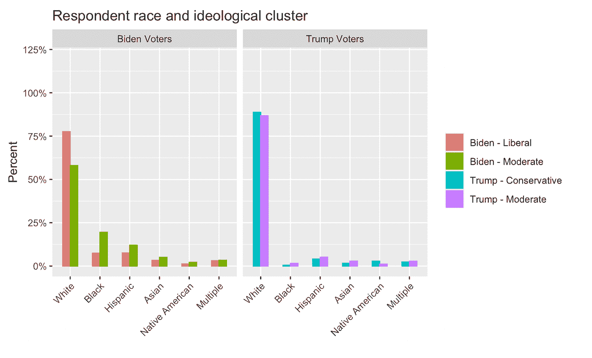

拜登自由派往往比拜登温和派(或特朗普选民)受教育程度更高。同样，特朗普保守派和温和派之间的差异很小。

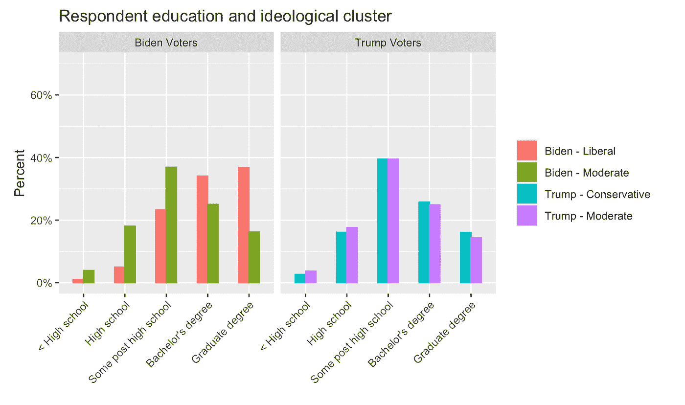

特朗普选民中认为自己有宗教信仰的比例高于拜登选民，尤其是新教徒。对于拜登和特朗普阵营来说，罗马天主教徒构成的温和派比例高于极端分子。事实上，拜登温和派的宗教形象比拜登自由派更接近特朗普温和派。自由主义者比其他任何群体都更有可能被视为无神论者或不可知论者。

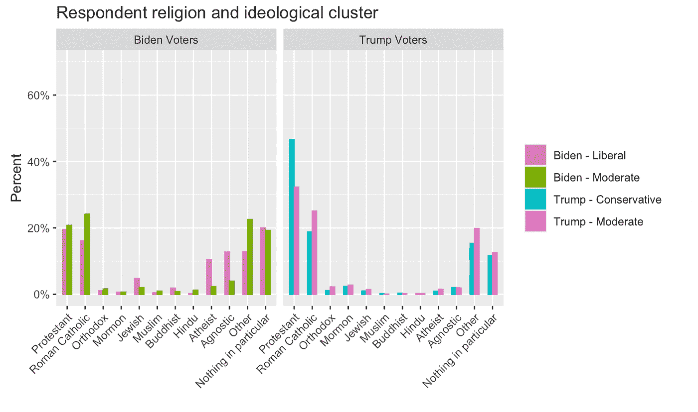

拜登的选民更有可能是女性而不是男性，但女性和男性都不一定更自由。特朗普选民则不同。男性更倾向于保守而非温和，女性则相反。将这些放在一起，特朗普的定位(或者可能是今天政治辩论的意识形态战场，经常包括社会正义和关于性别和种族的政策问题)似乎将共和党和民主党人都拉得更右了。另一种可能性是，不管政治倾向如何，男性只是更倾向于保守。

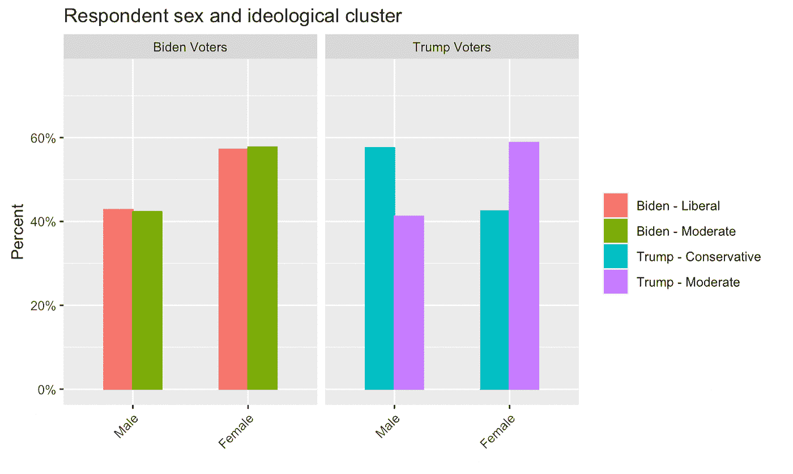

某些因素在各个细分市场之间没有差异。例如，一个家庭成员在一个联盟中似乎在决定整体政治世界观方面起不到什么作用。

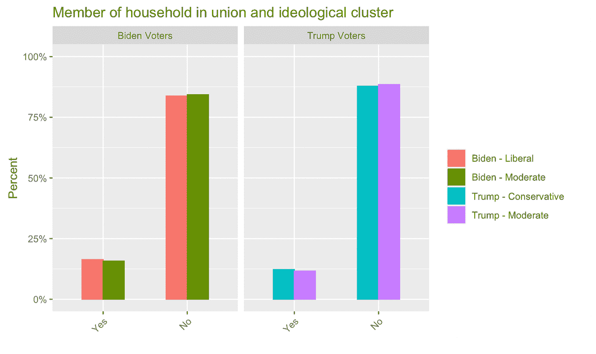

拜登的自由派倾向于比温和派年轻得多。这是真的，直到 40 岁多一点。尽管年龄对特朗普选民的影响不那么明显，但保守派比温和派更倾向于老年人，特别是 60 岁以上的人。

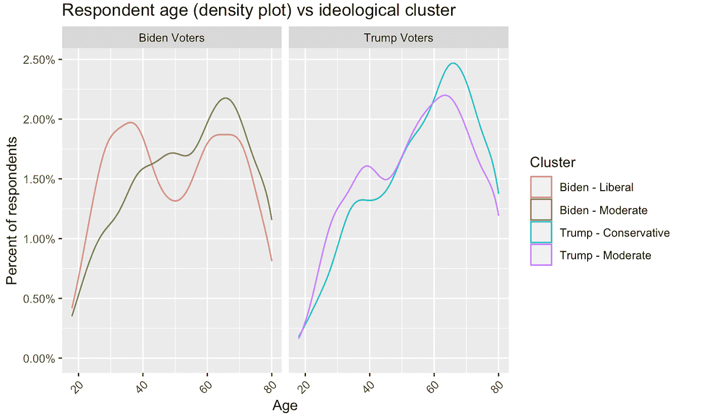

**用意识形态预测投票**

如果你知道某人对世界的看法，你能预测他的投票吗？上面的图表表明，答案是…某种程度上。诚然，自由派和保守派生活在不同的世界，很少会投票反对他们的政党，但温和派有所重叠。让我们回到之前讨论的综合意识形态分数。如果我们指定一个简单的测试，其中任何高于 0 的数字都可能是特朗普的选民，任何低于 0 的分数都可能是拜登的选民，我们可以预测人们投票的方式，准确率为 92%。

我们可以做得更好。机器学习中常用的两个工具是随机森林和极端梯度提升模型(XGBoost)。我们将在这里用几句话描述这些工具，但是网上有大量用户友好的和更好的介绍。一个特别好的可视化存在于[这里](http://www.r2d3.us/visual-intro-to-machine-learning-part-1/)。

树模型是随机森林和 XGBoost 的基础，它试图描述一些结果(例如，拜登投票者或特朗普投票者？)使用数据(例如，关于热点话题的 121 个问题)。一个单独的树将首先询问最相关的问题(例如，平价医疗法案的观点)，然后询问从该问题延伸出的其他问题(例如，平权行动的观点)。每个分支都包含新的信息，试图提高模型预测最终结果的准确性。这个问题网络最终看起来像一棵决策树(或者圣诞树)，随着节点之间的路径增加，顶部变窄，底部变宽。树的目标是在不过度拟合模型的情况下尽可能好地对结果进行分类。随机森林和 XGBoost 模型通过一套统计方法(装袋、减少每个节点上可用的预测器数量，以及重复将简单的树拟合到残差)极大地提高了建模的准确性。

那么，当我们向随机森林和 XGBoost 模型中输入 121 个问题时，会发生什么呢？答案是，我们可以更准确地预测选民的偏好。下面的两个表格叫做混淆矩阵。它们显示了我们的模型对“测试”数据的预测结果，这些数据是我们在用于训练模型的数据中忽略的。随机森林和 Boost 模型的总体准确率约为 94%。

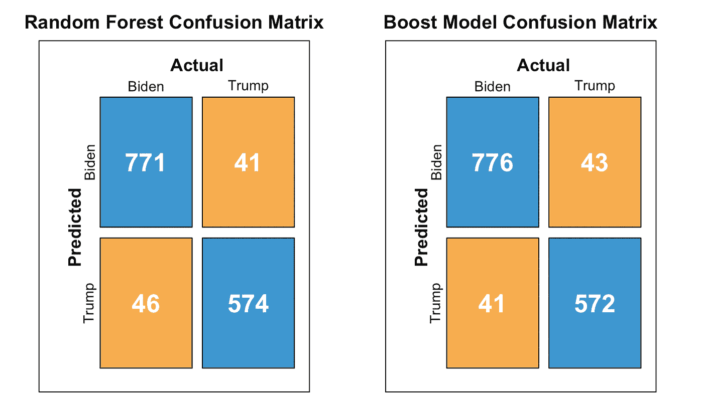

通过分析一长串问题，怎么可能比通过观察选民的整体意识形态倾向做得更好呢？答案是，有些问题比其他问题更能预示选民的偏好。

下面的两个图表显示了 XGBoost 模型如何评估两个个人受访者可能的投票行为。在这两种情况下，Y 轴显示了我们的模型分配给特朗普投票的概率。瀑布图从最有意义到最没有意义对回答进行排序，虽然 Y 轴的比例可能不直观(它使用了反 logit 函数)，但条形的大小准确地表示了每个回答对模型猜测特朗普投票可能性的相对影响。请注意，对于川普选民和拜登选民来说，最重要的问题是他或她对患者保护与平价医疗法案的看法。还要注意的是，一些问题包含一个简单的是/否问题(例如，你赞成平价医疗法案吗？)以及包含响应强度的版本(例如，批准大量、批准中等数量、批准少量等)。我们在我们的模型和随后的图表中包括了这两者，并给后者加上了前缀“加权”。

我们的 XGBoost 模型如何评估一位特朗普受访者(Y 轴是投票给特朗普的概率)。开头的问题(例如，对患者保护与平价医疗法案的看法)在我们的预测中起最大作用，而结尾的问题影响最小(例如，美国比大多数其他国家更好还是更差)。

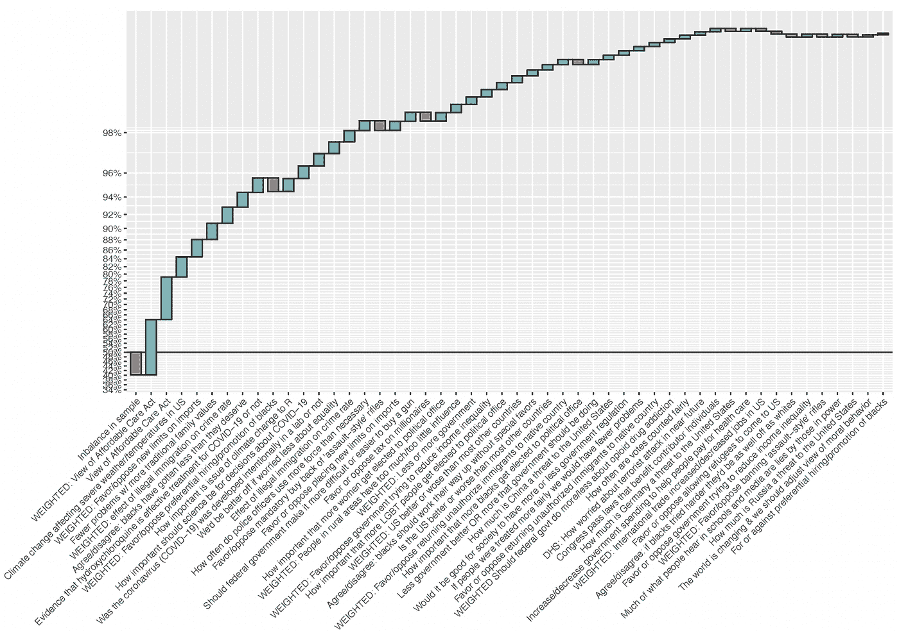

我们的 XG Boost 模型如何评估一位拜登选民(Y 轴是投票给特朗普的概率)。虽然这个人的许多偏好是左倾的，但也有一些不是(例如，反对强制回购突击式步枪)。

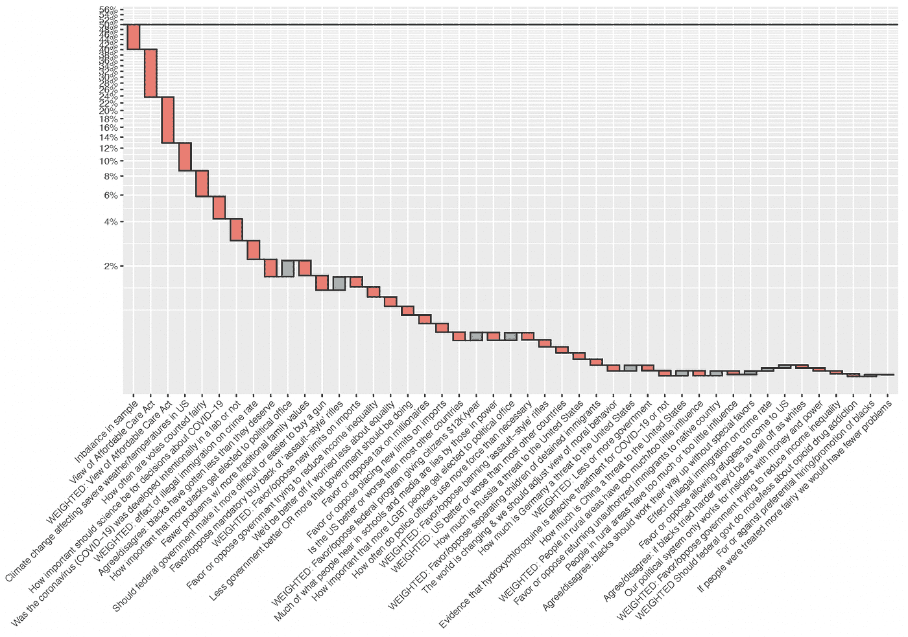

下面的图表总结了共和党人来自火星，民主党人来自金星的许多这些问题的性质。我们使用 [Shapley 附加解释](https://christophm.github.io/interpretable-ml-book/shap.html)展示了十个最有影响力的特征或问题。在没有详细说明方法的情况下，每个点都是一个选民，它们落在中间值右侧或左侧的程度决定了该模型将它们作为可能的特朗普或拜登选民的程度。最具影响力的两个问题是询问受访者对患者保护与平价医疗法案看法的变体。两个与新冠肺炎有关的问题出现在前十名中，其中一个与实验室起源有关，这个话题直到最近才在一家长期试图压制它的主流媒体上以血腥的力量引爆。ANES 的数据表明那枚炸弹有很长的引信。第三个最重要的问题是选票计算是否公平。鉴于 2020 年大选后对选举诚信的激烈辩论，这个问题的价值显著增加。当我们将这个问题排除在我们的模型之外，用一个在选举前提出的类似问题来代替它时，模型将这个问题列为大约 60 个有用问题中的第 30 个最重要的问题。换句话说，这远不是后来成为的严峻考验。当我们从数据集中排除这两个问题时，我们的模型的准确性只会略微下降。

标题:XGBoost (SHAP 汇总图)中的特征重要性

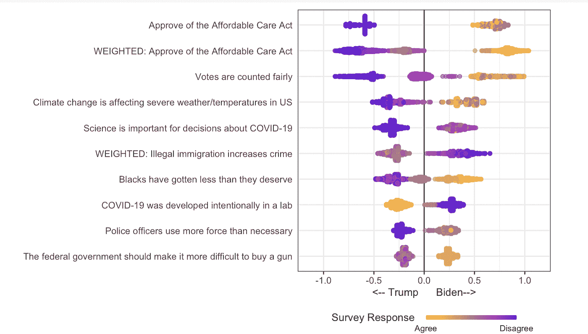

我们还能做得更好吗？我们运行了该模型的几个变体，其中包括了上面讨论的总体综合意识形态得分。我们还不同程度地包括政党登记和一些与意识形态无关的问题，如种族、宗教、教育、性别、年龄以及受访者家中是否有人是工会成员。总的意识形态分数总是唯一最重要的变量。政党的自我认同(而非注册)也很重要，通常排在患者保护与平价医疗法案观点或整体意识形态(如果可以选择的话)之后的第二或第三位。非意识形态因素并不重要。有了来自这些变量的额外信息，XGBoost 模型的总体准确性提高到了 96%。相比之下，仅使用政党身份和前面引用的六个人口统计因素的模型产生的模型具有 84–85%的准确性。意识形态真的很重要。

**团结和分裂的问题**

随机森林和 XGBoost 模型很复杂，一个变量的重要性依赖于另一个变量的重要性。了解拜登和特朗普选民如何看待世界的另一种方式是看看保守派和自由派回答最不同的问题。下表中的第一列是根据自由派和保守派，而不是温和派，回答给定问题的差距大小排序的。表中的数字是正态分布中标准化分数之间的差值。我们在删除信息高度相似的行(例如，支持跨性别者在军队服役，有体重和无体重)以及在每个表格中包含患者保护与平价医疗法案问题方面做了一些改动。出于篇幅的考虑，黑线是一个任意的截止线，在它下面你会发现保守派和自由派意见最不一致的变量。《平价医疗法案》、对气候变化、种族、性别、枪支和移民的看法都占据了重要位置。

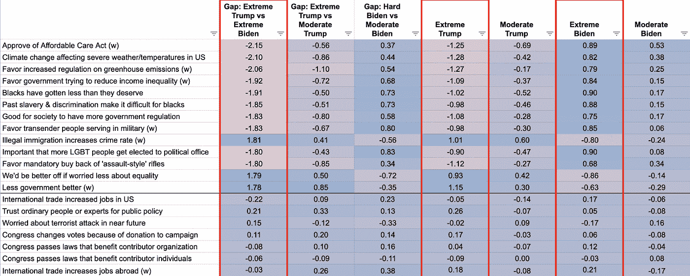

对我们来说，特别有趣的是温和派和极端派最不一致的问题。下表显示了特朗普保守派和特朗普温和派之间的差距。例如，温室气体排放在这里占有重要地位。富人税、最低工资、大政府、枪支管制和拘留移民儿童也是如此。

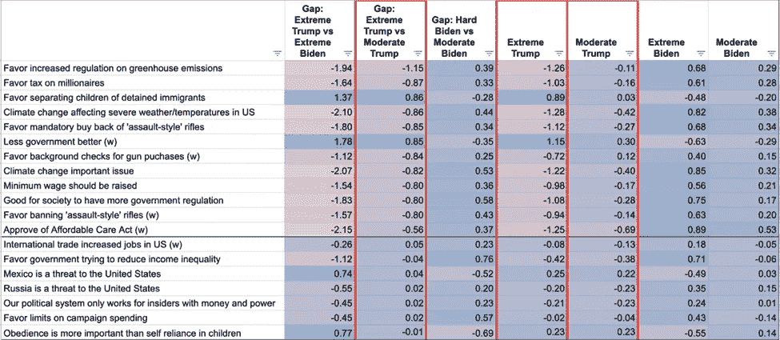

对于拜登的温和派和自由派来说，最有分歧的问题与种族、偏好、移民和传统价值观有关——这些都是传统上被视为保守派不满的焦点。在这些问题上，拜登的温和派显然不温不火。然而，这是平均值。温和派中有大量思想保守的民主党人。我们推测，有相当数量的相当保守的民主党人可能容易受到共和党在文化问题上的信息的影响，这是我们在过去十年中看到的趋势。不清楚这些选民是否都是白人。

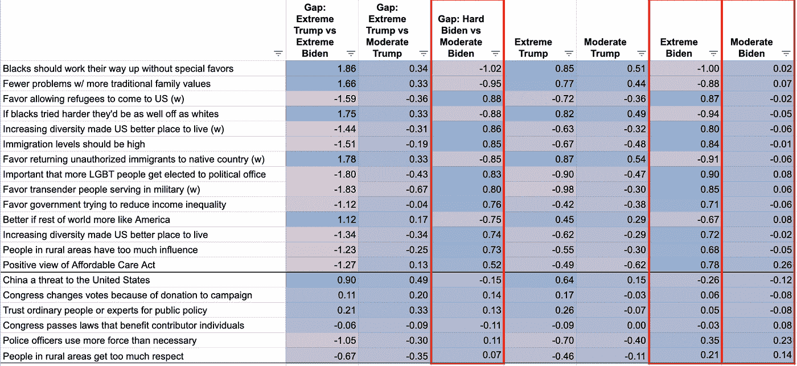

**结论**

特朗普总统在短短四年内大幅重新定义了共和党的信息，从文化保守、支持自由贸易和支持商业到文化保守、本土主义和保护主义。许多共和党人同意这一旅行方向，但相当大一部分人，包括基本上整个共和党机构，可能不同意，但为了权宜之计，还是顺其自然。这似乎是部落主义的有力证据。如果特朗普将格陵兰岛作为他的决定性问题，美国的犬儒主义者可以想象，共和党人会在他的集会上高呼这一点，而不是对他修建隔离墙的劝诫感到兴奋。

然而，愤世嫉俗的分析是正确的吗？特朗普确实重新定义了他的政党，但大多数共和党人和相当多的民主党人已经为他的信息做好了准备。保护主义相当受欢迎，而非法移民则不受欢迎。文化保守主义的核心问题，有争议，有分歧，有决定性，但在某种程度上受到公民道德的压制，以一种我们大多数人都无法想象的方式爆发到全国的对话中。

人们似乎以一种超越政治忠诚的方式投票给自己的良心。毕竟，意识形态也左右着无党派人士的投票。即使是特朗普最狂热的批评者也会承认，他散发出某种魅力。唐纳德·特朗普(Donald Trump)可以说是通过让他的政党转向意识形态上有利的政治来赢得更多选票，而不是利用他作为商业大亨的名声。是的，我们可能是，而且事实上很可能至少有些错误。这一分析的下一步将是监测意识形态在每个选举周期中是如何变化的。全国性的谈话确实会改变，对于大多数党派来说，游行的原因没有游行本身重要。

如果政治是一场思想的战争，那么民主党人在讨论不满、移民和社会正义等问题时，会将自己置于战术劣势。这些问题得到了自由主义者的支持，只有一部分民主温和派容忍这些问题，而那些观点更为保守的人则经常鄙视这些问题。诉诸基础的优点和缺点已经说得很多了，我们在这里不能添加任何有趣的东西。我们只想指出，从表面上看，这些数字表明支持力度较弱，这与直觉相反，在少数族裔中最为明显。同样，当共和党人愤怒反对气候变化、大政府和枪支管制时，他们处于最弱势的地位。然而，与民主党人不同，共和党人的优势在于，在这些问题上，他们只需放缓进展，而不是用持久的政治资本为有争议的变革买单。当然，亲爱的读者，你对社会契约有自己独特的看法，会对任何这样的花费是否值得付出有自己的看法。尽管如此，似乎相当清楚的是，大量美国人存在于美国党派分歧的边缘，他们在不同程度上属于社会保守主义者，在经济上属于进步主义者，并且在气候变化等问题上接受现代情感。我们最大的希望是，我们已经让这个国家意识形态差异的轮廓更加清晰了。

FiveThirtyEight 就此主题撰写了大量文章:

[https://fivethirtyeight . com/features/the-5-key-consumptions-of-the-2020-democratic-primary/](https://fivethirtyeight.com/features/the-5-key-constituencies-of-the-2020-democratic-primary/)

[https://fivethirtyeight . com/features/what-definites-the-Sanders-Coalition/](https://fivethirtyeight.com/features/what-defines-the-sanders-coalition/)

[https://fivethirtyeight . com/features/why-kamala-and-beto-have-more-up-than-Joe-and-Bernie/](https://fivethirtyeight.com/features/why-kamala-and-beto-have-more-upside-than-joe-and-bernie/)

[https://fivethirtyeight . com/features/why-the-progressive-left-fits-so uncomfortable-in-the-democratic party/](https://fivethirtyeight.com/features/why-the-progressive-left-fits-so-uncomfortably-within-the-democratic-party/)

[https://fivethirtyeight . com/features/the-six-wings-of-the-democratic-party/](https://fivethirtyeight.com/features/the-six-wings-of-the-democratic-party/)

[https://fivethirtyeight . com/features/the-five-wings-of-the-Republican-party/](https://fivethirtyeight.com/features/the-five-wings-of-the-republican-party/)

美国国家选举研究。2021.ANES 2020 时间序列研究初步发布:选举前和选举后的综合数据[数据集和文档]。2021 年 3 月 24 日版本。[www.electionstudies.org](http://www.electionstudies.org)

这些材料基于美国国家科学基金会(www.nsf.gov)资助密执安大学的 SES-1835721 和斯坦福大学的 SES-1835022。这些材料中表达的任何观点、发现和结论或建议都是作者的，不一定反映国家科学基金会的观点。

 [## Mlearning.ai 提交建议

### 如何成为 Mlearning.ai 上的作家

媒介](/mlearning-ai/mlearning-ai-submission-suggestions-b51e2b130bfb)