# 基于 BERT 的灾难性推文分类

> 原文：<https://medium.com/mlearning-ai/disastrous-tweets-classification-using-bert-ceb8e7be6c36?source=collection_archive---------1----------------------->


[source](https://www.google.com/search?q=trees&rlz=1C1CHBD_enIN956IN956&sxsrf=ALeKk00a1i4Yr3ps-Ry__s7DrhfWiwB8uw:1630002116227&source=lnms&tbm=isch&sa=X&ved=2ahUKEwiEqPuIp8_yAhVJzjgGHXrOAkYQ_AUoAXoECAIQAw&biw=1280&bih=577#imgrc=QzhuPn-k-uepRM)

> **概述**

在这篇文章中，我将使用最先进的模型来区分推文是灾难性的还是非灾难性的。我将使用 BERT 在 KTrain 的 keras API 的帮助下对推文进行分类。如果您以前使用过 tensorflow，那么您可能已经知道 keras 是 tensorflow 的包装器，就像 KTrain 是 keras 和 tensorflow 的包装器一样。KTrain 内部包含各种预处理模块，使 NLP 任务更加简单。如果你对 KTrain 比较好奇那就别忘了访问 [**这个链接**](https://github.com/amaiya/ktrain) **。**我采集的数据集由各种推文评论组成，并被分为两个标签，其中**标签 1** 描述推文是灾难性的，而**标签 0** 表明推文不是灾难性的。

**步骤 1:导入必要的库**

```
import pandas as pd
import numpy as np
from tensorflow.keras.preprocessing.text import Tokenizer
from tensorflow.keras.layers import
                            Embedding,Dense,SpatialDropout1D,Dropout
from tensorflow.keras.preprocessing.sequence import pad_sequences
from tensorflow.keras.models import Sequential
from tensorflow.keras.optimizers import Adam
import seaborn as sns
import matplotlib.pyplot as plt
```

**步骤 2:-数据理解**

在这一步中，我们将清楚地了解数据集的不同方面。如空值、类的数量(是二进制类还是多类)、数据集的形状等。

打印数据帧中的所有列

```
data.columns [out]>>Index(['id', 'keyword', 'location', 'text', 'target'],  dtype='object')
```

数据集的形状，即:-数据集中有多少行和列

```
data.shape 
[out]>> (7613, 5)  #dataset has 7613 rows and 5 columns
```

获取与数据集相关的所有信息，如有多少空值。每列的数据类型是什么等等。

```
data.info [out]> <class 'pandas.core.frame.DataFrame'> RangeIndex: 7613 entries, 0 to 7612 Data columns (total 5 columns):  #   Column    Non-Null Count  Dtype  ---  ------    --------------  -----   
0   id        7613 non-null   int64   
1   keyword   7552 non-null   object  
2   location  5080 non-null   object  
3   text      7613 non-null   object 
4   target    7613 non-null   int64  dtypes: int64(2), object(3) memory usage: 297.5+ KB
```

数字和分类数据的统计描述。通过使用`data.describe()`,我们将获得数据集的统计描述，如平均值、中位数、众数、百分位等。

```
data.describe() #description of numerical data
```

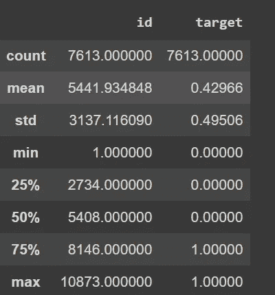

figure 1

```
cat_data=(data.dtypes[data.dtypes=='object']).describe()
cat_data #description of categorical features
```

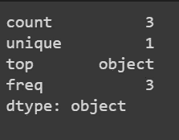

figure 2

统计**灾难性(1)** 和**非灾难性(0)** 推文的数量。

```
daat['target'].value_counts()[out]>>    0    4342 
           1    3271
           Name: target, dtype: int64
```

**第三步:-探索性数据分析**

绘制灾难性和非灾难性推文的分布。

```
plt.figure(figsize=(8,6))
sns.set_style(style='darkgrid')
sns.countplot(data['target'])
plt.title('Disastrous and Non-Disastrous Tweets')
plt.show()
```

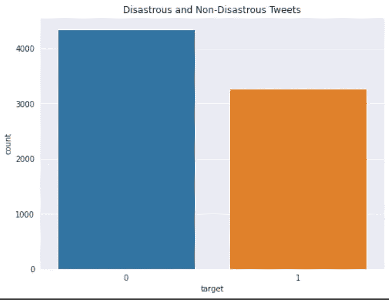

figure 3

让我们用饼状图看看灾难性和非灾难性推文的百分比贡献。

```
plt.figure(figsize=(6,8))
sns.set_style("darkgrid")data['target'].value_counts().plot.pie(autopct='%0.2f%%')
plt.title("Percentage Contribution")
plt.xlabel("percent contribution")
plt.ylabel("target")
plt.show()
```

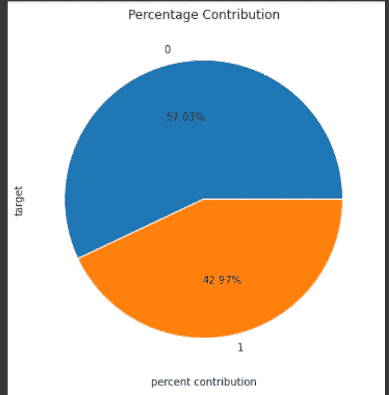

figure 4

让我们看看推文中的字符分布数量，在此之前，我们需要对推文进行预处理。我们将删除不需要的文本，即:- url，特殊符号，如@，！、#等。我们还将计算字数，字符数，平均单词长度等。为此，我在这里导入了预处理文件[。](https://github.com/laxmimerit/preprocess_kgptalkie)

```
import preprocess_kgptalkie as akhil
df=akhil.get_basic_features(data)
df.head()
```

让我们做更多的绘图来理解数据框中文本的本质

```
sns.kdeplot(df['char_counts'],shade=True,color='green')
plt.show()
```

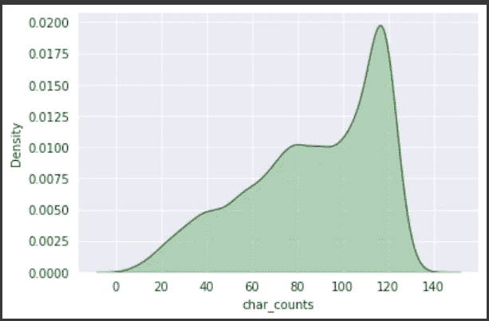

figure 5

让我们来看看推文的长度是如何根据它们的性质而变化的。即:-对 tweet 字符进行计数，并将它们与灾难性和非灾难性 tweet 进行比较，并将比较哪种情况下 tweet 的长度更长。

```
plt.figure(figsize=(6,8))
sns.kdeplot(df[df['target']==1]
            ['char_counts'],color='red',shade=True)
sns.kdeplot(df[df['target']==0]
            ['char_counts'],color='green',shade=True)
plt.show()
```

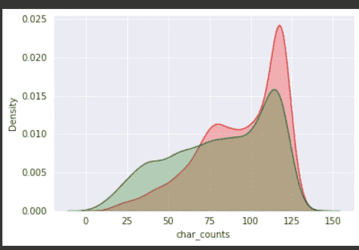

Figure 6

灾难性的推文比非灾难性的推文更长。因此，如果推文很长，那么这些推文可能与抱怨或不满有关。

```
#Distribution of stop words on both the classes
sns.boxplot(data['target'],y=data['stopwords_counts'])
plt.show()
```

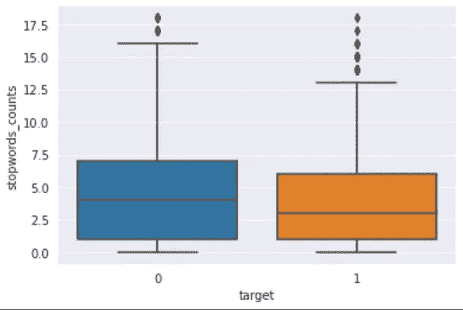

figure 7

```
 #let's see how random the hastag has been used in both the situaton
sns.violinplot(x=data['target'],y=data['hastag_counts'])
plt.show()
```

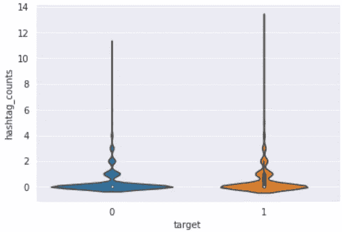

figure 8

如果我们看到上图，我们会发现在灾难性的推文中使用的标签会稍微多一点。

让我们看看数据集中最常用和最不常用的单词是什么。基于这些常用词，我们可以了解推文的整体性质。

```
freq_occuring=akhil.get_word_freqs(data,'text')
top_20=freq_occuring[:20]
sns.barplot(top_20.index,top_20.values)
plt.xticks(rotation=70)
plt.show()
```

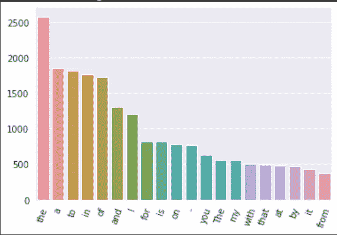

figure 9

```
#least 20 occurring words
least_20=freq_occuring[:20]
sns.barplot(least_20.index,least_20.values)
plt.xticks(rotation=70)
plt.show()
```

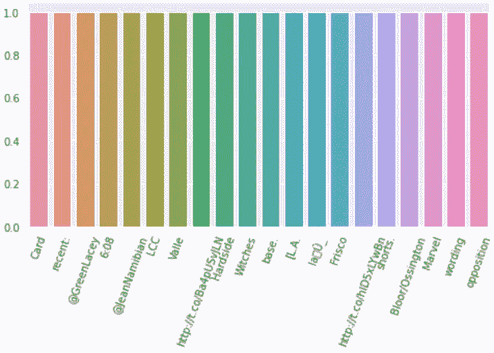

figure 10

**步骤 4:-数据清理**

众所周知，tweets 包含标签，特别 symbols(@,#,$,%,^,&,*！)，网址，号码等。我们需要清除所有那些不需要的文字。因此，在这一节中，我们将对文本进行分类，以便它可以是人类可读的格式，没有任何特殊字符。

导入必要的文本清理库

```
import re
import nltk
from nltk.corpus import stopwords
from nltk.stem.porter import PorterStemmer
ps=PorterStemmer()
nltk.download('stopwords')
stopwords=set(stopwords.words('english'))
```

让我们清理数据…

```
def cleaner(text):
    cleaned=text.replace("//"," ").replace("."," ")
    cleaned=re.sub(r'[^a-zA-Z]'," ",cleaned)
    cleaned=cleaned.strip() #removing whitespace
    cleaned=cleaned.lower() #converting into lower case words
    cleaned=re.sub(r'\w+\d+'," ",cleaned)#remove alphanumeric words
    cleaned=ps.stem(cleaned) #stemming 
    cleaned=[word for word in cleaned.split if len(word)>2]
    cleaned=" ".join(cleaned)
    return cleaned
data['text']=data['text'].apply(lambda text:cleaner(text))
#let's check for some text
data['text'][0:10]
```

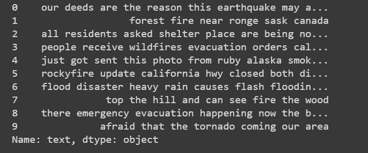

figure 11

现在我们将进行最常见的可视化，即:类 **0** 和类 **1** 的文字云可视化。

```
from wordcloud import WordCloud,STOPWORDS
dataset=akhil.get_word_freqs(data[data['target']==1],'text')
print(dataset.index)
dataset=" ".join(dataset.index)
word_cloud=WordCloud(max_font_size=60,background_color='white').generate(dataset)
plt.imshow(word_cloud)
plt.axis('off')
plt.show()
```


figure 12

```
from wordcloud import WordCloud,STOPWORDS
dataset=akhil.get_word_freqs(data[data['target']==0],'text')
print(dataset.index)
dataset=" ".join(dataset.index)
word_cloud=WordCloud(max_font_size=60,background_color='white').generate(dataset)
plt.imshow(word_cloud)
plt.axis('off')
plt.show()
```


figure 13

**步骤 5:-微调 BERT 模型**

```
import ktrain
from ktrain import text
(x_train, y_train),
   (x_test,y_test),preprocess=text.texts_from_df(data,  
                                text_column='text'
                                ,label_columns='target',maxlen=50,
                                 preprocess_mode='bert')
```

让我们一点一点地理解上面的代码…

ktrain 将对数据帧中的数据进行预处理，并从中返回五个变量，它们是`(x_train,y_train)(x_test,y_test)`和`preprocess`。`text_from_df`里面的参数是:

`data`已经进行运算的数据集。`text_column`数据帧/数据集中存在文本列。`label_columns`数据集中存在目标/输出列。`maxlen`一个句子中可以出现的单词的最大长度在 BERT 的情况下，我们可以取最大长度`512`，如果我们取超过`512`的句子长度，就会产生错误。`preprocess_mode`这说明了预处理是如何完成的，在我的例子中，我已经使用 BERT 预处理了文本数据。

```
model=text.text_classifier('bert',train_data=(x_train,y_train) 
                                             ,preproc=preprocess)
```

现在我们将使用`get_learner`,这将包装模型和数据，然后进一步用于结果的最终预测。

```
learner=ktrain.get_learner(model,train_data=
         (x_train,y_train),val_data=(x_test,y_test),batch_size=64)
```

我们将为模型给出一些学习速率和时期，以预测可能的最佳结果。

```
learner.for_onecycle(lr=1e-5,epochs=4)
```

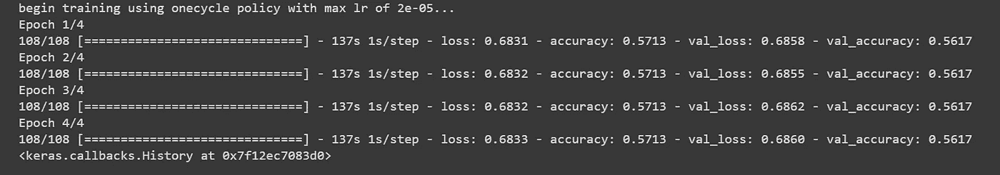

Figure 14

我得到了大约 58%的准确率。我可能需要更多地关注预处理和清理方面，以提高模型的准确性。让我们预测热门推文的结果。

```
prediction=ktrain.get_predictor(learner.model,preprocess)
data=["US did this! Loudly crying faceLoudly crying face"]
prediction.predict(data)[out]>> 'not-Disastrous'
```

结论:-

这是一个关于如何解决 NLP 模型的基本介绍性方法，请耐心等待，稍后会有更多使用张量流和 Pytorch 进行 BERT 微调的博客。请在评论框中提出你的宝贵意见。