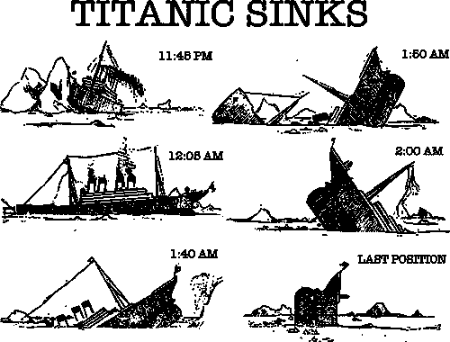

# 当我使用 PyTorch 参加 Kaggle 的泰坦尼克号比赛时，发现我的分数

> 原文：<https://medium.com/mlearning-ai/discover-my-score-when-i-entered-kaggles-titanic-competition-using-pytorch-7415011693f3?source=collection_archive---------6----------------------->

PyTorch 是基于 Torch 库的计算机软件的一小部分。它是 2016 年推出的深度学习框架，使其成为一项新技术，相对而言。PyTorch 提供的高级功能是图形处理单元(GPU)和深度神经网络。