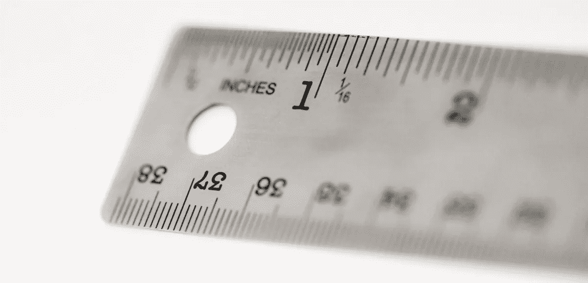
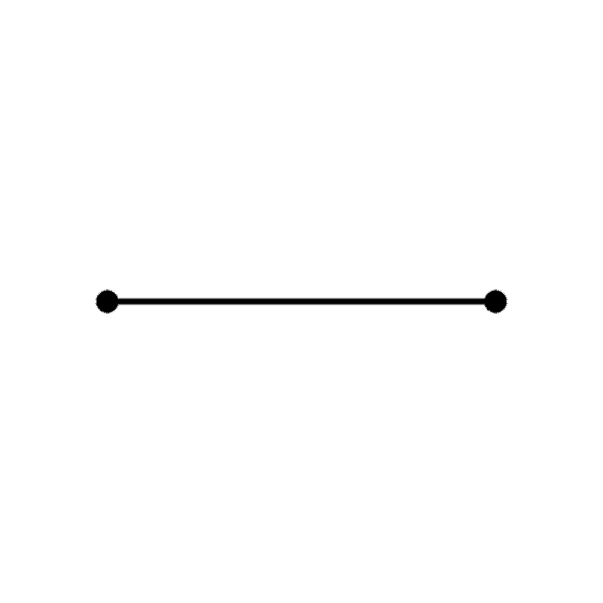
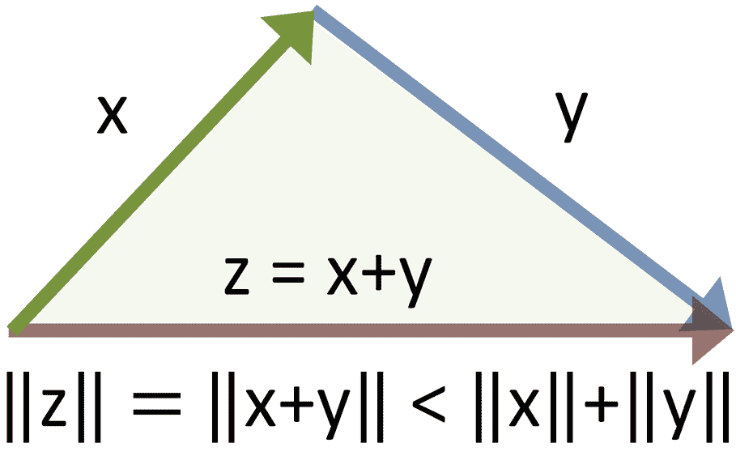

# 距离度量

> 原文：<https://medium.com/mlearning-ai/distance-metrics-9f5830322dee?source=collection_archive---------1----------------------->

距离是许多机器学习算法中的一个关键指标。我们对监督和非监督技术都使用距离。其中每一个的例子是 KNN 和 K-Means 算法。

在本文中，我们将定义为什么要定义距离，并继续讨论什么是非技术受众的距离度量。在定义了距离度量需要具备的属性之后，我还将尝试提供足够多的例子。

在以后的文章中，我将深入研究许多常见的和一些不常见的距离度量，评估每个度量的技术方面和属性。

*PS:这是我的第一篇文章。非常感谢所有建设性的反馈。*

Copyrights under Creative Commons CC0

# **为什么要定义和研究距离？**

(毕竟挺直观的吧？)

如果在一张纸上给你两个点，如果你有标尺，你可以精确计算距离，如果没有标尺，你可以估计距离。

然而，如果你被要求计算两条街道之间的距离，你可能最终会在谷歌上搜索或给出一个估计值，这往往会出错，除非你很好地适应了这个地方。

更进一步，如果你被要求找出芝加哥和东京之间的距离，即使是用一个按比例缩小的地球仪，问题是距离意味着什么？我是在问地球上的距离吗？我是在问星球表面的距离吗？是飞机航线上的距离吗？等等。

观察最后一个假设，我们仍然在处理一个三维空间，并最终在我们知道的多个选项之间困惑，天知道，有多少我们不知道。

用数学术语定义距离有助于我们回答生活的许多方面和科学的各个领域中的复杂问题

InsuranzeTankist-777, CC0, via Wikimedia Commons

# 距离是什么？

距离度量是具有以下属性的函数:

**。反身性**

**。非负性**

**。对称性**

**。三角形不等式**

我们将在下一节深入研究这些属性。

此外，请注意，并非所有距离度量都符合上述所有属性。

# 自反性

反身性，也就是不可分辨事物的同一性，是所有事物中最容易理解的，因为它是最直观的。在某种程度上，甚至给它下定义都感觉有些过分。但是现在请容忍我。我们将学习当我们处理个体距离度量时，为什么反身性很重要。

形式上的反身性如下，

> 如果两点相同，它们之间的距离为零。
> 
> 和
> 
> 如果两点之间的距离为零，则它们是同一点。

在数学上，这被表示为如下:

> d(x，y) = 0 <=> x=y

对于空间中任意两点 *x* 和 *y*

# 非否定性

非否定性也是一个需要正式定义的直觉概念。然而，它不必总是正确的。例如，在许多物理问题中，我们处理负距离取决于我们从哪里开始计数。或者，在银行业，信贷对银行的底线是负值。

对于本文和后续距离文章的范围，将距离视为一个假想点需要在一条直线上移动的距离，而不考虑它移动的方向。

形式上，非负性质如下:

> 两点之间的任何距离都不能是负值

从数学上来说，非负如下，

> d(x，y) ≥ 0

对于空间中任意两点 *x* 和 *y*

# 对称

现在我们要进入的属性表面上看起来很直观，但实际上要复杂一些。

考虑一个月 1 日到下一个月 30 日之间的距离。很明显，对吧。29 天(如果不算第一天的话)。但是这个月的 30 号和下一个 1 号之间的距离是多少呢？看见..我们最终得到 1、2，甚至是未定义的(以二月为例)。这是一个不对称距离的例子。

那么，现在我们看到了什么不是对称，让我们试着定义它是什么。

形式上，距离的对称性表示，

> 无论我们以哪种方式开始计数，两点之间的距离都是一样的

从数学上来说，相同的表示如下:

> d(x，y) = d(y，x)

对于空间中任意两点 *x* 和 *y*

# **三角形不等式**

在我后面的文章中，我们将涉及的一些距离不会遵循这个属性。然而，我们仍然会经历这一点，因为大多数人会遵循这一属性，这似乎足够直观地谈论。

形式上，三角形不等式陈述如下

> 从三个点绘制的两条直线之间的距离之和不能大于第三条直线

Creative Commons Attribution-Share Alike 3.0 Unported

考虑您需要计算和评估以下 3 组之间的“距离”。

集合 1: {1，1，1，1}

集合 2:{1，2，3，4}

集合 3:{0，0，0，0}

在没有任何正式定义的情况下，我们通常可以看到集合 3 比集合 2 更接近集合 1。然而，如果我定义一个距离度量来表示一个集合中的数字与另一个集合中的数字的不同程度，这就有点复杂了。让我们看看

假设我们对两个集合之间的距离(D)的定义是它们的平均值之差。

很容易观察到，这些集合的平均值分别是(1，2.5 和 0)。

之间的距离

*D(设置 1，设置 2) = 1.5*

*D(设置 1，设置 3) = 1*

*D(第 2 组，第 3 组)= 2.5*

在这里，我们可以清楚地看到，我之前定义的距离度量并不遵循三角形不等式。

尽管有人可能会说我故意让度量不遵循属性，但很明显，当我们处理数据的集合或分布时，我们使用的许多方法，即平均值、中值，可能不遵循三角形不等式。

然而，我们将在接下来的文章中看到的许多度量都遵循三角形不等式的性质。从数学上来说，它如下:

> d(x，y) + d(x，z) ≥ d(y，z)

在比较各种常用的距离度量时，这些属性会派上用场。此外，当一些距离不符合一个或多个上述属性时，用户需要认识到选择和使用选择的影响。

在下一篇文章中，我将讨论最常见、最著名、也可能是最古老的距离度量之一的 ***欧几里德距离。***