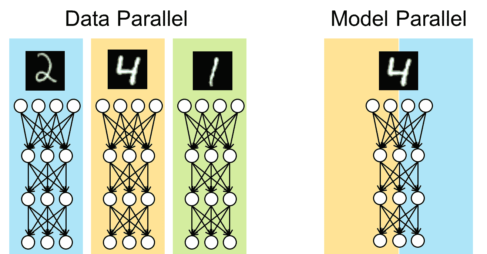
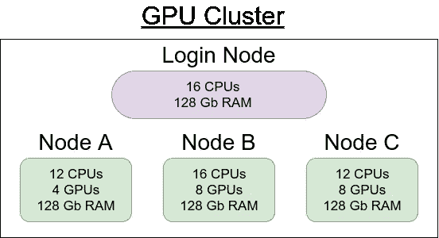
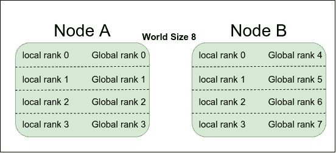

# 与 Slurm、Submitit & PyTorch 并行的分布式数据

> 原文：<https://medium.com/mlearning-ai/distributed-data-parallel-with-slurm-submitit-pytorch-168c1004b2ca?source=collection_archive---------0----------------------->

PyTorch 提供了多种方法来将您的训练分布到多个 GPU 上，无论 GPU 是在您的本地机器上、集群节点上，还是分布在多个节点上。作为一名人工智能研究人员，您可能有机会访问一个或多个 GPU 集群，并且您想知道如何修改您的单个 GPU 脚本以利用可用资源并加快您的训练。本文将介绍如何在具有多个 GPU 的本地机器上以及使用 Slurm 调度作业的 GPU 集群上使用分布式数据并行。

由于您不必为每个新项目重新编写分布式培训的代码，我已经编写了一个[模板库](https://github.com/ramyamounir/Template)，其中包含所有已设置的 DDP 代码。要使用存储库，您所要做的就是用您的模型切换出架构，添加数据集并定义损失函数。无论您是向 Slurm 提交作业，还是在本地(或通过 ssh 远程)的几个 GPU 上运行代码，存储库都会自动处理所有分布式的训练代码。如果需要，代码也可以在单个 GPU 上运行。也就是说，我建议通读这篇文章，以了解幕后发生的事情以及每一行代码的目的。

# 数据并行与模型并行

当考虑分布式训练时，您必须考虑您希望在 GPU 上分配什么。你有两个选择:*数据并行*和*模型并行。*如果您的模型适合一个 GPU，但您希望通过增加批处理大小来加快训练速度，那么您希望通过使用数据并行方案将批处理分布在多个 GPU 上。但是，如果您的模型参数不适合单个 GPU，那么您需要在不同的 GPU 上分配您的架构的不同部分，也称为模型并行。本文只讨论数据并行，假设您的模型适合单个 GPU。



Data Parallel vs. Model Parallel. (Image Source: [ChainerMN](https://docs.chainer.org/en/stable/chainermn/model_parallel/overview.html))

# 数据并行与分布式数据并行

正如我之前提到的，PyTorch 提供了许多工具来帮助您快速将单 GPU 训练脚本转换为多 GPU 脚本。由于 DataParallel 简单，大多数人都是从它开始尝试的。你可以很容易地用神经网络包装你的模型。DataParallel 类，它将自动处理 cuda _ visible _ devices(GPU)上的模型克隆，并在其上拆分(分批)数据。虽然 DP 类提供了一种简单的方法，但是您必须意识到它既不高效也不可伸缩(否则您不会在这里:P)。DP 使用多线程和单个进程在 GPU 上分配训练，这不如为每个 GPU 使用单独的进程并在需要时传递结果(或参数梯度)高效。此外，因为 DP 使用单个进程，所以它不能跨多个机器/节点使用。所以，如果你需要在两个或更多的节点上训练，每个节点有 4 个 GPU，你必须使用 DDP。

# 分布式数据并行

正如您可能已经猜到的，DDP 不像 DP 那样容易设置，主要是因为 GPU 之间的通信需要初始化代码(可能在多个节点上)。尽管如此，这比你想象的要容易得多。我们先来定义一些术语。当使用 GPU 集群时，节点是具有可变数量的 GPU(或者没有)、CPU、RAM 等的单个机器。集群连接这些节点，并使用一些调度软件(如 Slurm 或 SGE)在一个或多个节点上调度作业。



Example of a 3-nodes cluster

当您的训练脚本利用 DDP 在单个或多个节点上运行时，它将产生多个进程；每个都将在不同的 GPU 上运行。每个进程都需要知道有多少其他进程在做同样的工作(**世界大小**)以及如何到达主进程。每个进程都需要有一个本地等级和一个全局等级。**局部等级**在其运行的节点内定义其顺序*，而**全局等级**在*所有进程*内定义其顺序。*



Example of communication arguments on 2-nodes cluster.

在生成多个进程并为每个进程提供主进程的 world_size、local_rank、global_rank 和 address 的副本后，您需要将数据集分割成 world_size 块，以便每个 GPU 获得数据集的不同部分。然后你可以用 nn . parallel . distributed data parallel 类包装你的模型，基本就完成了。在本文的其余部分，我们将更详细地介绍如何执行上述每个步骤，以及一些用于检查点、Tensorboard 可视化、使用 Submitit 在 Slurm 上调度等等的帮助函数。

# 在单个节点上初始化

让我们从尝试在同一个节点上生成多个流程开始。我们将需要 torch.multiprocessing.spawn 函数来生成 args.world_size 进程。为了保持事物的组织性和可定制性，我们可以使用 argparse。

区分运行在主进程上的代码和运行在子进程上的代码是非常重要的。例如，在 GPU 上生成 train 函数之前，我们必须在主进程上定义 CUDA_VISIBLE_DEVICES。我们还为所有 GPU 定义了 dist_url，以便与主进程进行通信。因为我们在单个节点上本地运行，所以 URL 可以是 localhost 和一个随机端口。这个 URL 将提供给所有的 GPU，这样任何进程都可以访问主进程。

在子进程(在 GPU 上)上运行的代码将有特定的初始化变量，比如局部秩。torch . distributed . init _ process _ group 做所有繁重的工作；它初始化进程之间的通信，并等待，直到它确定它们可以互相交谈。对于参数的随机初始化，我们将所有 GPU 上的种子设置为相同。剩下的就是获取数据集加载器、模型、损失函数，并将它们传递给训练器函数。

可以很容易地修改这段代码，以便在多个节点上运行这种训练，而不一定是在同一个集群上。您需要手动将 args.dist_url 中的“localhost”更改为 Noda 地址，并将 args.world_size 设置为您打算从所有节点使用的 GPU 总数。您还需要将节点秩传递给 train 函数，该函数可以添加到局部秩中以获得 GPU 的全局秩，如下所示。

```
args.rank = args.node_rank + gpu
```

就是这样；现在，您可以在不同的节点上运行该脚本的多个副本，并查看所有 GPU 上同时发生的训练。

# 数据加载器

正如我们之前提到的，数据集需要分割成块，其中块的总数应该等于 args.world_size。分布式 Sampler 类可以很容易地为我们做到这一点。您只需要定义您的数据集，并将其作为参数与其他参数(如当前进程的 world_size 和 global_rank)一起传递给 DistributedSampler 类。输出将是一个 sampler 对象，您可以将其传递给 DataLoader 类。

# 获取模型、损耗和训练师！

剩下的就像定义你的架构，把它包装在 nn . parallel . distributed data parallel 类中，定义你的损失函数，开始训练一样简单！:)

# Slurm

Slurm 是集群上使用的一个作业调度器，用于接受作业提交文件，并在请求的资源可用时对它们进行调度。通常的过程是用特定于 Slurm 的参数创建一个单独的脚本文件:

```
#!/bin/bash
#SBATCH -w "[node_name]"
#SBATCH -p [partition]
#SBATCH --mem=100GB
srun python train.py
```

并使用 sbatch“提交”，如下所示:

```
sbatch script.sh
```

虽然你可以按照上面的步骤让它做你想做的事情，但有一种更简单的方法，那就是利用一个名为“ [Submitit](https://github.com/facebookincubator/submitit) 的库，它最近由脸书人工智能研究所(FAIR)开源。这个想法是使用 Submitit 为我们生成并提交作业脚本。我们可以很容易地定义有多少个节点以及每个节点上的 GPU 数量。我们甚至可以定义一个函数，在作业由于某种原因被抢占时重新提交。

# 提交它

要使用 Submitit 生成作业并提交给 Slurm，我们需要获得一个 submitit。自动执行程序对象。我们可以使用 submitit 函数。AutoExecutor.update_parameters 提供特定于 Slurm 的参数。Submitit 将负责在 GPU 上生成不同的进程(即使在不同的节点上)。

如上面的代码所示，我们可以定义一个 slurm_trainer 类，并将该类的一个实例传递给 executor.submit 函数。这个提交函数将在 executer 参数中定义的多个 GPU 上产生 slurm_trainer 实例的 __call__ 函数。slurm_trainer 仍然调用 train 函数，该函数获取数据集、模型、损失函数，并开始训练。注意:您不再需要在 train 函数中定义 args.gpu 和 args.rank，因为它们现在已经在第 44 和 45 行中定义了。提供的[模板](https://github.com/ramyamounir/Template)在一个脚本中结合了 Slurm 训练和本地训练。

# 张量板

模板中的 utils 目录为自动启动 Tensorboard writer 和 server 提供了一些帮助函数。当在远程服务器上运行脚本时，我建议启动一个 Ngrok 服务器，将端口 6006 转发到一个 Ngrok 域。Ngrok 域可以从任何地方访问，甚至在你的智能手机上，以检查你的训练进度。

# 使用模板

该模板遵循模块化方法，其中代码的主要组件(架构、损耗、调度器、训练器等。)被组织到子目录中。

*   [train.py](https://github.com/ramyamounir/Template/blob/main/train.py) 脚本包含所有参数(由 argparse 解析)和节点/GPU 初始化器(slurm 或 local)。它还包含用于导入数据集、模型、损失函数并将它们传递给训练器函数的代码。
*   lib/trainer/trainer.py 脚本定义了训练过程的细节。
*   lib/dataset/[args.dataset]。py 导入数据并定义数据集函数。建议创建一个带有到数据集的软链接的数据目录，尤其是在多个数据集上进行测试时。
*   lib/core/ directory 包含丢失、优化器、调度器函数的定义。
*   lib/utils/目录包含按文件名组织的帮助函数。(即，用于分布式训练的帮助器函数被放置在 lib/utils/distributed.py 文件中)。

**对于单节点，单 GPU 训练，试试:**

```
python train.py -gpus 0
```

**对于单节点、多 GPU 训练，尝试:**

```
python train.py -gpus 0,1,2
```

**对于 SLURM 上的单节点、多 GPU 训练，尝试:**

```
python train.py -slurm -slurm_nnodes 1 -slurm_ngpus 4
-slurm_partition general
```

**对于 SLURM 上的多节点、多 GPU 训练，请尝试:**

```
python train.py -slurm -slurm_nnodes 2 -slurm_ngpus 8 
-slurm_partition general
```

**温馨提示:**

*   要获得关于可用参数的更多信息，请运行:`python train.py -h`
*   要将 Tensorboard 服务器作为不同的线程自动启动，请添加参数:`-tb`
*   要覆盖模型日志文件并从头开始，添加参数:`-reset`，否则，它将使用最后的权重作为检查点，并继续写入相同的 tensorboard 日志文件-如果使用相同的模型名称。
*   要在 SLURM 上选择特定的节点名，可以使用参数:`-slurm_nodelist GPU17,GPU18`作为例子。
*   如果在带张量核的 GPU 上运行，使用混合精度模型可以加快你的训练速度。添加参数`-fp16`进行试验。如果因为精度损失而使训练不稳定，就不要用:)
*   该模板允许您通过传递不同的参数来轻松切换架构、数据集和训练器。例如，不同的架构可以添加到 lib/arch/[arch-name]中。py 目录，并将参数作为`-arch [arch-name]`或`-trainer [trainer-name]`或`-dataset [dataset-name]`传递
*   stdout 和 stderr 将打印在共享目录中。我们只打印第一个 GPU 输出。确保根据您使用的集群更改 lib/utils/distributed.py 中的共享目录。

# 结论

在本文中，我们介绍了如何通过几个简单的步骤在多个 GPU 上使用 DDP 分发您的培训。DDP 和 DP 的主要区别在于定义了通信参数，比如 world_size、ranks 和 URL。我们还讨论了 Slurm 以及如何使用 Submitit 自动化脚本生成过程。基于 Slurm 的工作和本地培训的工作都合并在一个易于使用的模板下。如果您遇到问题，请在此处发表评论或在[模板](https://github.com/ramyamounir/Template)存储库中提出问题，让我知道。

快乐编码:)