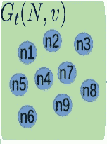
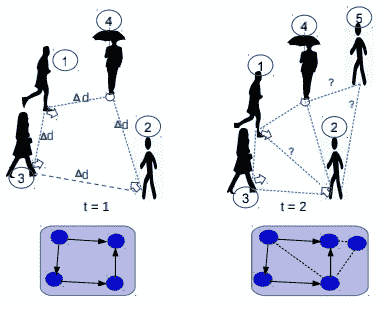
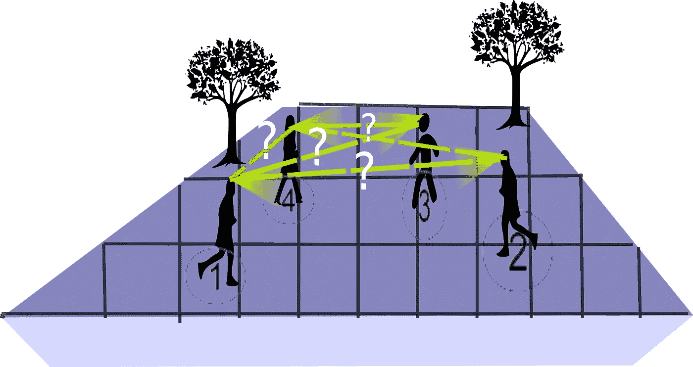
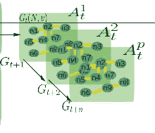
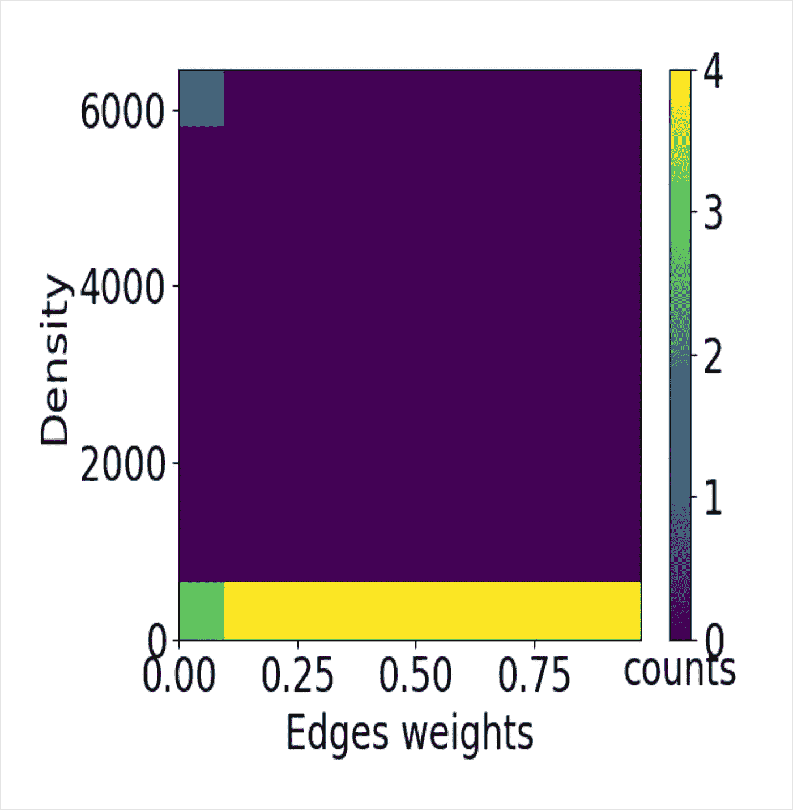

# 无分布图核和空间图神经网络

> 原文：<https://medium.com/mlearning-ai/distribution-free-graph-kernels-and-spatial-graph-neural-networks-350ea434ad06?source=collection_archive---------9----------------------->

图表的真正力量在于其灵活的结构，可以随着时间的推移而调整。然而，为了适应节点和边，必须有一些原则性的机制来决定图形的未来版本。通过评估适应性拟合优度。

通常，图同构测试用于挑选具有近似甚至精确结构属性的相似图，这些图最终具有近似嵌入。这种测试在计算机视觉检测和识别应用中具有各种应用。基于机器学习的时间过程建模和状态预测系统。

任何任意结构都可以被建模为一组节点和边。这些可以代表任何粒度级别的任何概念建模。例如，节点可以表示系统中任何可识别的实体及其特征。这种实体可以处于任何模块化水平，从单个人类细胞及其与邻近细胞的生理相互作用到细胞本身内部的分子相互作用。然后，我们可以看到基于图形的复杂世界的表现是多么普遍。

在这种情况下，概率评估作为传达所有未来选项的工具出现，作为评估适应有效性的一种方式。因此，存在符合概率模型的可接受的(即，似是而非的)结构适应，并且那些是应该由预测模型生成的结构适应。提及行人关系推理系统，并将图形内核引入基于图形的表示。

给定动态系统中的 *G* = *(V，E)* 是具有 *V* 个节点和 *E* 条加权边的无向图，在节点的属性随时间变化的动态复杂系统中，寻找最优边集来建模节点之间的交互(即关系)的问题是 NP-Hard 问题。节点描述了系统的对象或主要组件，而边表示了涉及相同类别或具有共享属性的对象的关系。

我们将把建议的问题先验地归结为'**寻找最佳邻接矩阵**'，并且因为我们正在处理加权边，所以解空间**ω**是无限的；因此，可能存在多个最优解，而在有生之年找到它们是不可行的。作为问题的放松，我们将依赖于寻找次优的解决方案，其中邻接矩阵的估计是合理的和现实的，以反映节点之间的相互作用。

我们定义邻接矩阵( *A* )使得*A*∈**ω***并且大小为*n×n*，描绘了对应于图中节点之间所有可能边对的方阵。寻找次优矩阵的目标与误差最小化和期望的结果相关联。*

**

*在深度学习中，图可以形成许多建模应用的底层结构。使得深度网络变成深度图，而不是规则形状的层。这被称为*图形神经网络(GNN)，*可以直接利用任意形状的输入作为图形结构数据(即节点和边)。GNN 可以最终产生预测或分类输出，并且在给定的时间实例增强空间建模将反映动力系统的更好的表示，从而产生更高精度的结果。*

*为了达到这样的结果，GNN 依靠聚集和更新操作来替代图遍历作为测试解决方案空间的手段。在我们的例子中，GNN 需要添加新的边或指定边集，以便在真实场景中相互交互的节点之间生成合理的关联。对节点和边的访问时间可以在 O(1)中完成，然而，GNN 本地函数并不清楚地支持遍历图和分配似是而非的关联的机制，所以这里我们建议两种可能的方式来呈现该机制:*

*(1)使用 *n x n* 遍历来检查每一个一对一关联的回归问题，这种方法是 GNN 及其内部函数所固有的。*

*(2)图核方法，将整个图的边映射到邻接矩阵(a ),并将多个矩阵同时分解为一组建议 Aᴾ。在本文中，我们考虑第二种方法，并介绍了非负矩阵分解(NMF)。NMF 执行推荐系统部分，该部分立即推荐 *P* 邻接提议，并在现有图上逐一部署它们以验证准确性。此外，我们提出了基于无监督核方法的边集部分搜索，以可行的时间方式估计边集权重，而不是强制所有可能的边集。*

*作为对 NMF 的放松，我们假设初始矩阵都是 1*n×n*，这意味着所有节点都有相互关联。*

*后来，NMF 将估计渗透关系，使得 *w* (i，j)和 *w* (j，I)可以具有不同的估计，并且结果 A 不一定是对称的。其中 A = { *w* (1，2)， *w* (1，3)，… *w* (i，j)}，这样有 N 个节点，w(n，m)是图中的最后一对，i∈n 和 j∈m，|n| = |m|和{n，m}∈ *V* 。*

**

*NMF 现在将重构传入的深度特征，并且基于特征矩阵 *W* 和分量矩阵 *H，s.t. W* 被分配了边缘嵌入表示向量**(**)并且 *H* 被分配了整个图 H 的隐藏状态:*

**A* = *NMF* (W，H)*

*基于 NMF 的估计不依赖于先验分布假设，但是，从统计角度来看，超过 400 次运行后，结果似乎大多是稀疏矩阵，其中大多数估计权重接近于零，黄色条覆盖的估计范围反映了较高的权重。从下图的密度图来看，这种表示可以很好地符合标准高斯分布 **μ = 0** 和 **σ = 1** 。这使我们可以开发在设计和性能上更少定制的自治模型，这样该模型可以扩展到各种动态系统，而不是在某些条件或环境下使用。*

**

*总之，本文讨论了寻找最佳邻接矩阵的实际应用。为此，本文提出了一种无监督图核，它依靠非负矩阵分解(NMF)来分解加权有向图的边，以取代穷举的经典搜索方法，并且仍然可以在搜索空间中找到次优解。内核可以被扩展到多种目的，其中图是底层建模架构，并且不需要太多的统计表征工作，内核可以从断开的图开始，并且以无分布的方式运行，这使得方法不太倾向于上下文定制，并且在建模中给出更高的自由度。*

*来源和相关参考资料:*

***图形神经网络综述:**[https://arxiv.org/pdf/1901.00596.pdf](https://arxiv.org/pdf/1901.00596.pdf)*

***上下文感知行人轨迹预测的自生长空间图网络:【https://arxiv.org/pdf/2012.06320.pdf】T22***

***用图形神经网络进行组合优化和推理:**[https://arxiv.org/pdf/2102.09544.pdf](https://arxiv.org/pdf/2102.09544.pdf)*