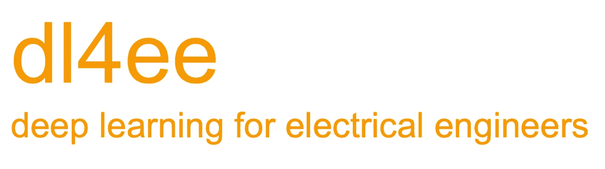
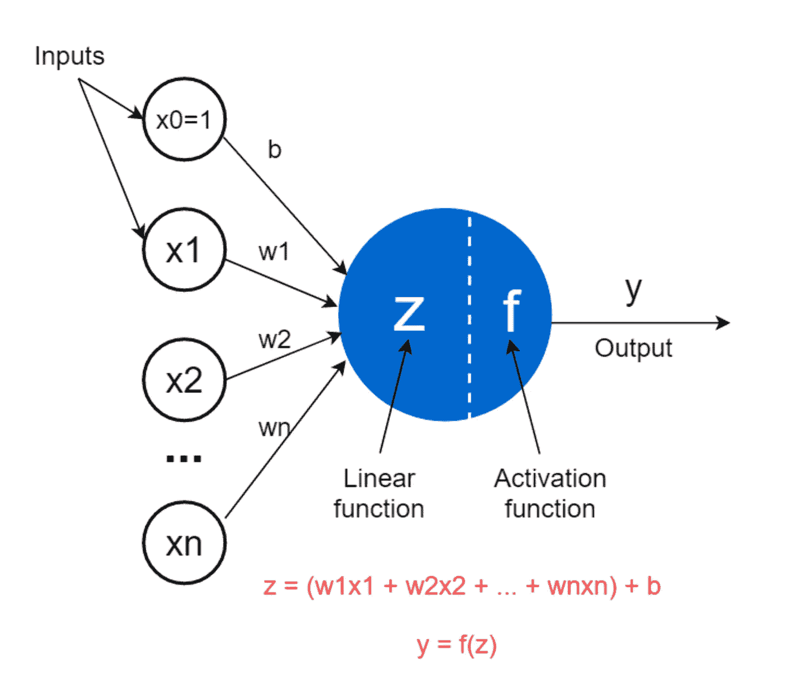
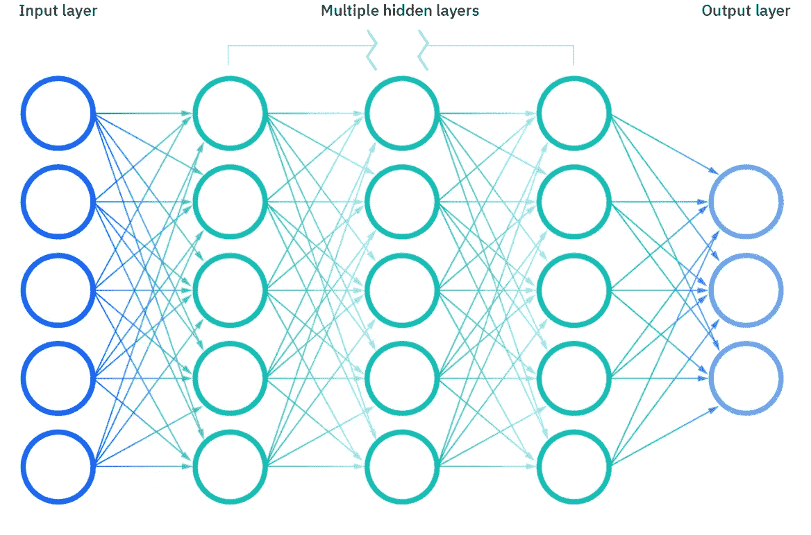
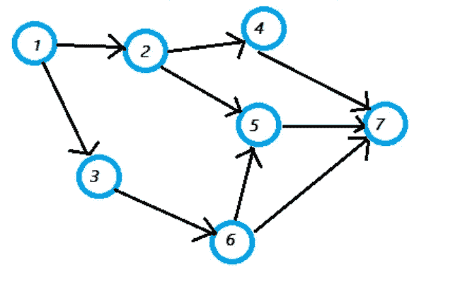
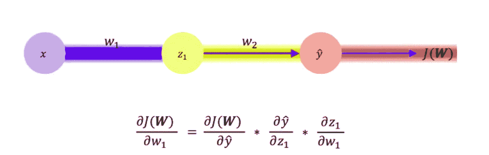
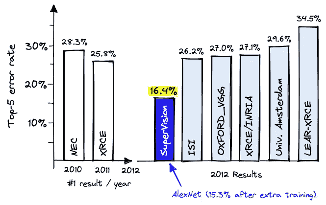

# dl4ee:面向电气工程师的深度学习

> 原文：<https://medium.com/mlearning-ai/dl4ee-deep-learning-for-electrical-engineers-4ba713f214bf?source=collection_archive---------11----------------------->

## 1.深度学习简介及其重生简史

你有电气工程的大学学位吗？你是否觉得在人工智能的宣传中被冷落了，但不知道从哪里开始？也许你每次试图在 YouTube 上阅读一篇文章或观看一个视频时，都会感到被软件术语轰炸？

如果是，dl2ee 适合你。这正是我在 2016 年拿起这个的时候的感受。

简单介绍一下我自己以及我为什么要写这篇文章。

我在大学的专业是控制工程。在我 1991-92 年的高年级，我申请了一份运行神经网络(NNs)模拟的工作，以资助我为期一周的毕业旅行。在那段时间里，我研究了 LeCun 关于反向传播的论文[1]以及 NNs 如何用于识别手写的邮政编码[2]。因为我拥有的最好的计算机是 Sun 和 HP 的工作站，一个有数千个神经元的简单神经网络需要一周的时间来训练。(有趣的是，我从今天的首席研究员那里听说，一周仍然是最受欢迎的训练时间。我想这只是人的本性。)

由于没有看到这个行业有太大的进步，当我们大多数人还在使用双绞线电话或以太网连接的个人电脑时，我就开始了我的无线通信职业生涯。我是 2000 年成立 IEEE 802.11n 研究小组的第一批工程师之一，可能有 15 名工程师。我们的工作基于 MIMO 技术，产生了今天每个人都在使用的数百亿个 WiFi 设备。作为一名系统工程师，我还带领一个团队建立了从 WiFi 发射器到室内无线信道模型再到 WiFi 接收器的端到端模拟。基带算法从浮点转换到定点，以便硬件工程师和固件工程师可以分别在 RTL 和固件中实现它们。然后，RF 通带在线性系统方程中建模，以指导 CMOS RF 工程师进行电路设计。

2016 年我看深度学习的时候，有两件事让我很惊讶。首先，基本理论根本没有改变。这是同一个旧的反向预测神经网络(BPNN)，我曾在 25 年前短暂涉猎过。然而，计算能力已经提高了这么多。ImageNet 上的图像分类性能已经非常接近人类的能力。随后几年，我在 TensorFlow 中实现了 ResNet、MobileNet、Yolo v3 等几个流行的 CNN。我还在 2020 年使用 AWS cloud [3]升级了我的家庭安全摄像头。

在 dl4ee 中，你可能会看到过于简化的直觉来解释一些概念。所以可以考虑一边喝意式浓缩咖啡和奶油蛋卷，一边阅读 dl4ee 文章作为科普。事实上，这个项目的部分灵感来自 YouTube 上的一个过于简化的系列，它用有趣的动画在 30 分钟内总结了一个具有历史意义的事件。也许有一天我会拿起那个动画技能来创造类似深度学习的东西。现在，你只能看我写的英文很差的文章。

那么深度学习(DL)在解决什么问题呢？先说非 DL 理论没有解决的问题。基本上，电气工程使用工程数学来分析解决物理世界中的问题。如果你和我一样，你应该学过微积分，线性代数，微分方程，复变函数，概率。我们创建并使用物理问题的数学模型。该模型必须正确地表示问题，同时在数学上获得牵引力。两者都很关键；缺少任何一个都会使模型变得无用。

但是分析方法显然有其局限性。在图像处理中，从猫和狗中识别出一只狗是不可能的。如果你还记得 10 年前自动电话服务是什么样的，即使任务像识别信用卡号码一样简单，语音处理也是可怕的。一个 12 岁的孩子只要有足够的游戏时间，就可以轻松地在诸如国际象棋和围棋这样的百年棋盘游戏中击败电脑。所以回到 80 年代，研究人员开始尝试不同的策略。模糊逻辑、混沌理论和神经网络都是在那个时候出现的。

现在我们有了一个赢家——神经网络。你可以找到许多文章谈论自 50 年代以来大脑是如何被解剖分析，然后被数学建模的。本质上，它的数学模型是以网络的方式连接这些神经元，输入和输出代表我们试图解决的问题。计算进行“向前”，这意味着它从输入传播到输出，没有反馈回路。所以神经网络通常用有向无环图(DAG)格式来表示。

A mathematical model of neuron ([source](https://towardsdatascience.com/the-concept-of-artificial-neurons-perceptrons-in-neural-networks-fab22249cbfc))

Neural Network ([source](https://www.ibm.com/cloud/learn/neural-networks))

Directed Acyclic Graph (DAG) (s[ource](https://www.statisticshowto.com/directed-acyclic-graph/))

然而，就像任何有用的模型一样，当我们把这样的网络放在一起时，数学牵引力是什么？虽然每个神经元的输入是仿射函数，但激活函数总是非线性的。正如每个电气工程师都知道的那样，非线性函数只能通过逼近来解决，要么通过分段线性函数，要么通过将范围限制到线性域(如其导数)来解决。

答案是使用链式法则的反向传播[1]。链式法则来源于微积分。它是将一个变量的偏导数与其他变量联系起来。如你所知，导数意味着变化率。因此，链式法则揭示了模型中的一个变量对输出值的改变程度。因为模型被构造成以“向前”的方式从输入计算输出。为了知道相对变化，链规则从输出以向后的方式一个接一个地计算。一旦知道了变化率，就可以根据期望的输出相应地更新变量。这个过程称为训练，因为这个迭代过程需要时间来“训练”神经网络。

Chain Rule ([source](/analytics-vidhya/neural-networks-part-3-understanding-back-propagation-learning-rates-3482a981a2f0))

2006 年，当时来自 UIUC 的费-李非看到了神经网络的潜力，并意识到它需要大量的数据来训练这些数百万的变量[4]。然而，它的成本过高。2009 年，在普林斯顿大学时，她终于收集了一个数据集，并开始举办一个名为 ImageNet 的图像分类比赛。大约在同一时间，Nvidia 的 Jensen 在 2006 年推出了 CUDA，旨在将他的 GPU 从处理图形转向通用计算。大数据集和高性能计算的结合最终结出了果实。由多伦多大学的长期神经网络研究人员构想的，Krizhevsky 的开创性 AlexNet 在 2012 年赢得了 ImageNet 竞赛，比第二名高出 40%以上。AlexNet 通过将其架构映射到 Nvidia 当时的顶级 GTX 580 GPU，基本上最大限度地提高了其计算能力。这三个事件正式开启了神经网络的新时代，现在称为深度学习。

First breakthrough at ImageNet ([source](https://www.pinecone.io/learn/imagenet/))

下一篇文章:你知道在你的电子工程教育或电子工程职业生涯中，你最有可能已经建立了一个神经网络吗？你会惊讶于你对深度学习的了解程度！

[1] Y. LeCun，“反向传播的理论框架”，载于 Touretzky，d .和 Hinton，g .和 Sejnowski，t .(编辑)，《1988 年联结主义模型暑期学校会议录》，21-28 页，摩根·考夫曼，CMU，宾夕法尼亚州匹兹堡，1988 年

[2] Y. LeCun，B. Boser，J. S. Denker，D. Henderson，R. E. Howard，W. Hubbard 和 L. D. Jackel:应用于手写邮政编码识别的反向传播，神经计算，1(4):541–551，1989 年冬季

[3] Pen C Li，[为家庭监控摄像机系统增加基于云的深度学习对象检测能力](https://towardsdatascience.com/adding-cloud-based-deep-learning-object-detection-capability-to-home-surveillance-camera-systems-df797a0dd6f)，Medium，2020

[4] [改变人工智能研究的数据——可能也改变了世界](https://qz.com/1034972/the-data-that-changed-the-direction-of-ai-research-and-possibly-the-world)

 [## Mlearning.ai 提交建议

### 如何成为 Mlearning.ai 上的作家

medium.com](/mlearning-ai/mlearning-ai-submission-suggestions-b51e2b130bfb)