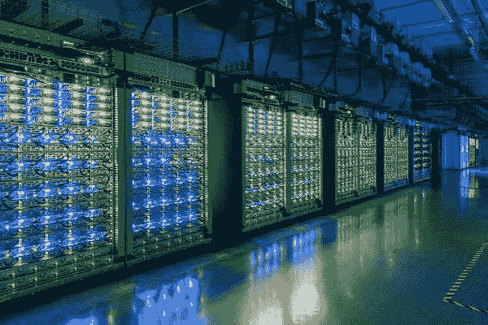
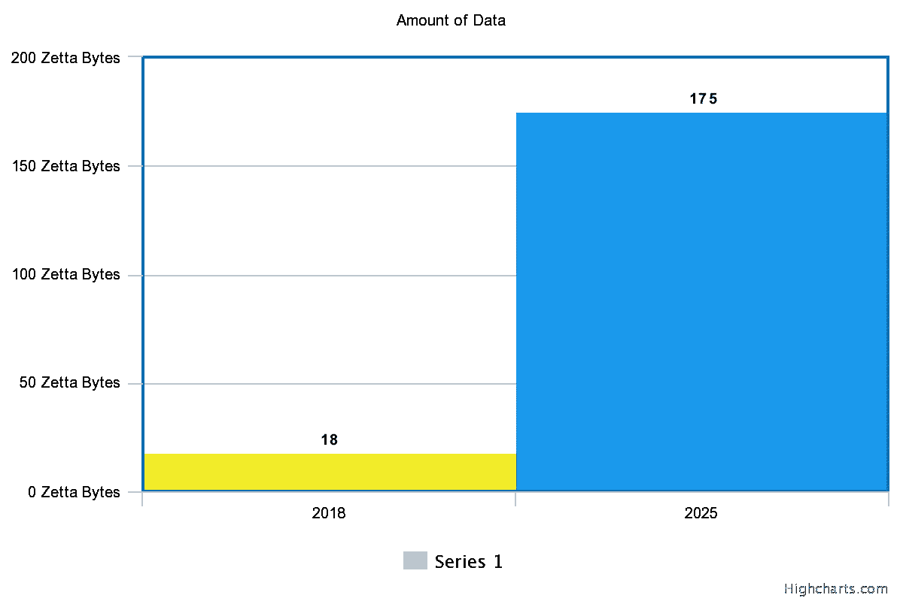
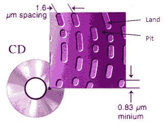
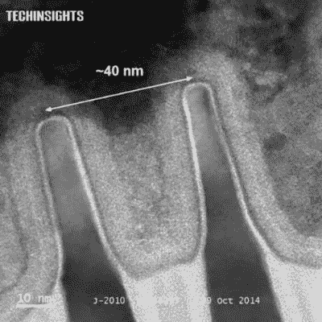
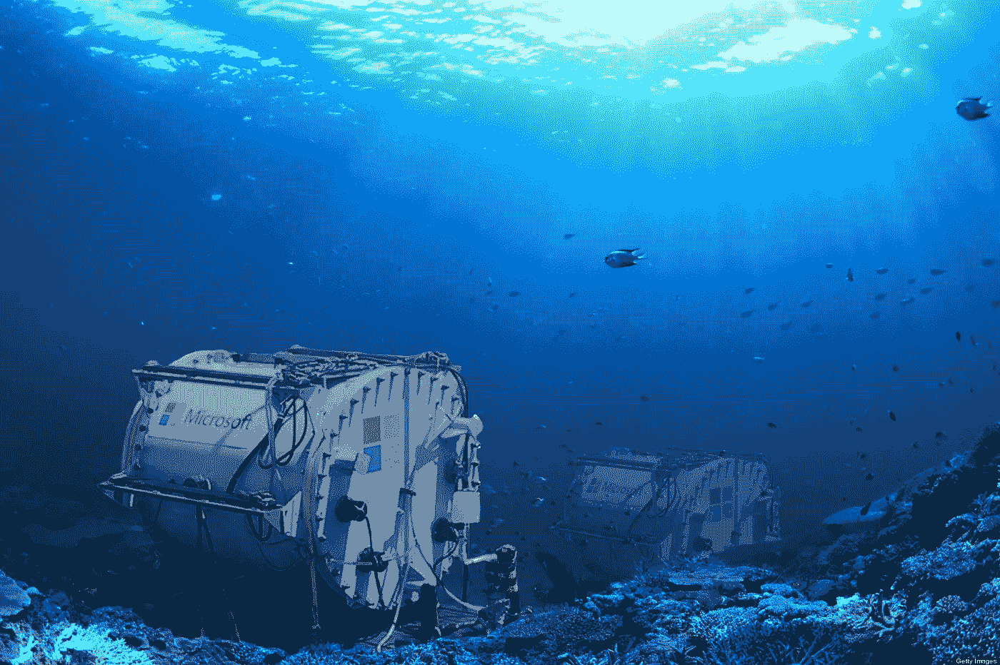

# DNA——数据存储的未来？

> 原文：<https://medium.com/mlearning-ai/dna-the-future-of-data-storage-b6577cd596c2?source=collection_archive---------3----------------------->

数据是新的黄金。每年产生的数据量几乎每年翻一番。这意味着，去年我们产生了比去年更多的数据。这是指数膨胀，数据爆炸。

数据也需要存储。我们以各种形式存储数据，比如我们写在笔记本或日记中，或者以数字形式存储在我们的数字设备中。现在我们使用云来存储我们的数据，但是这个所谓的云只是远程放置的数据中心或服务器，它们有巨大的容量来存储数据。

A google cloud data center, which is just a glorified stacked up hard drives, RAMs and CPUs.

在短短的一秒钟内，我们正在做以下事情。

*   发了 9000 多条推文
*   在 Instagram 上上传 1000 多张图片
*   发布 1800 多条 Tumblr 帖子
*   拨打 5476 次 Skype 电话
*   消耗 113623 GB 互联网
*   用 90000 多个查询搜索谷歌
*   观看 88000 多个 YouTube 视频
*   发送 300 万封邮件
*   发送 70 万条 WhatApp 消息。
*   制造 54000 个脸书职位

我根本没有包括每秒钟的网上购物统计，或银行交易的数量，或在 Reddit、Quora、Stackoverflow、wiki、博客和数百万其他网站和服务上发表的帖子。

# 世界上的数据量

让我们先和单位结算。我们都知道，我们是以字节为单位引用和推断数据量的。1 GB 代表 1gb，也就是 1024 兆字节。1024 GB 等于 1 TB 或太字节。通常我们会购买容量为 1 TB 或 2 TB 的外置硬盘。

1024 TB 相当于 1 PB 或 1pb。相当于 1024 个 1 TB 的外置硬盘。

1024 PB 是 1 EB 或 EB，1024 EB 意味着 1 ZB 或 zettabytes。

根据思科的数据，2016 年全球互联网总使用量为一个 ZB。这相当于超过 10 亿个 1TB 容量的外置硬盘。

根据希捷发布的白皮书([https://www . Seagate . com/files/www-content/our-story/trends/files/IDC-Seagate-data age-white paper . pdf](https://www.seagate.com/files/www-content/our-story/trends/files/idc-seagate-dataage-whitepaper.pdf))，截至 2018 年**创建的总数据为 18 Zettabytes** 。而预估的数据增长预测 2025 年数据量将达到 **175 zeta 字节。这就是指数增长。**

Comparison of amount of data in year 2018 and 2025

这几乎是数据的 10 倍。这意味着从 2019 年到 2025 年(7 年)，我们将产生比 2018 年多 10 倍的数据。

为了形象化这些海量数据，想象一下如果所有这些数据都被写入 DVD，那么 DVD 的**堆将有 120，000 公里长**，这几乎是地球周长的**三倍。**

# 问题

**存储密度**

当今世界的数据存储不是基于光学就是基于磁性。在光盘驱动器中以平台和凹坑形式的 1 和 0 的开槽，或者在磁盘驱动器的情况下类似的机制。

Microscopic view of grooves and pattern on a compact disc

当然，我们现在有固态硬盘，它没有任何移动部件。十多年来，我们一直使用笔式驱动器或拇指驱动器。这些记忆存储设备不是光学或磁性的，而是完全基于电子学的。0 和 1 作为电荷存储在由半导体逻辑门制成的触发器中。

关于某个区域可以容纳多少数据，有了显著的改进。例如，一张 CD 可以存储 700 MB 的数据，而相同物理大小的 DVD 可以存储 4 GB 的数据，而蓝光光盘最少可以存储 25 GB 的数据。这被称为数据密度。

数据密度也有了指数级的提高，从 CD 到蓝光的发展就很明显。或者在固态存储的情况下，根据摩尔定律，通过增加硅芯片上晶体管的密度，存储容量已经增加。

Nano scale view of a transistor.

但是，摩尔定律有一个极限。人们不能简单地永远增加晶体管的密度。今天晶体管的宽度是 22 纳米，这意味着单个晶体管的宽度大约是 50 个原子。如果密度继续增加，如果晶体管继续变得越来越窄，那么总有一天晶体管会变得无用。

当晶体管宽度达到 5 纳米时，量子效应将开始显现。电子将能够容易地从一端隧穿到另一端。如果电子因为量子隧道效应而流动，那么所有的晶体管将总是处于导通状态，或二进制 1 状态。或者换句话说，你可以说，在二进制的世界里只有 1，没有 0。

如果你想直观地理解，并了解更多关于摩尔定律或量子隧道如何阻止我们增加存储密度的进展，那么我建议观看这个视频—[https://www.youtube.com/watch?v=IcrBqCFLHIY](https://www.youtube.com/watch?v=IcrBqCFLHIY)

如果你想了解更多关于量子隧道的信息，请点击此链接—[https://www . quora . com/What-is-quantum-tunneling-How-is-it-use/answer/Vivek-ke shore](https://www.quora.com/What-is-quantum-tunneling-How-is-it-used/answer/Vivek-Keshore)

**可持续发展**

*   需要更多的半导体和金属材料来生产更多的存储设备，这给采矿公司带来了更多的负担，从而导致不可持续的采矿作业。
*   电子垃圾是另一个大问题，它以难以想象的方式影响着环境和生态系统:
*   有毒气体污染大气
*   导致居住在电子垃圾堆放场附近的人发生严重变异
*   水资源和海洋酸化，从而损害珊瑚和海洋生物
*   功耗是阻碍可持续发展的最大因素。一个普通的数据存储消耗大约 100 兆瓦的电力，这足以为 7 万个普通家庭供电。
*   发电是通过燃烧煤炭或柴油发电机使用化石燃料完成的，这增加了大气中的二氧化碳含量，从而加速了全球变暖。
*   将近 50%的电力消耗在冷却服务器或存储设备上。因此，很少有公司开始在水下或极地建立他们的数据中心。
*   这些水下或极地数据中心使当地环境升温，并对当地生态系统造成破坏。

An underwater data center of Microsoft.

因此，简而言之，问题是存储设备的指数级生产，这反过来要求指数级的功耗，从而以难以想象的方式对地球造成指数级的破坏。这是不可持续的。

# 解决办法

摩尔定律有局限性，由于上面提到的许多原因，数据存储的指数级生产肯定是不可持续的。这种模式可能会持续 50 年，但不会超过 50 年。这个问题是显而易见的，并且将在几年内面临。所以，现在是开始寻找解决方案的时候了。

仅仅通过使用可再生能源来实现环保是不够的。通过消耗太阳能、风能、地热、海浪、核能、水电等可再生能源产生的电力，将减少碳足迹，但仍需要储存设备的指数生产。而且，这最终会使可再生能源的使用在未来几年变得不可持续。

**解决办法是找到非常规的数据存储设备。**

一个这样的非常规数据存储解决方案可以在自然界中找到。每一个有机体无论是单细胞细菌还是植物，还是动物，每个人都拥有以 DNA 形式存在的编码数据或信息。DNA 由 4 个核苷酸组成，分别称为腺嘌呤、鸟嘌呤、胸腺嘧啶和胞嘧啶。这些核苷酸可以表示为 A、T、G 和 c。整个 DNA 可以表示为一串 ATGC，就像二进制数据可以表示为 0 和 1 的字符串一样。

DNA 可以用来存储数据，其中来自任何数字系统的数据可以从任何其他基数转换为基数 4。如果我们想将数据存储为二进制，那么也是可能的，因为 A & G 被归类为嘌呤，而 C & T 被归类为嘧啶。所以，A & G 可以被认为是 1，C & T 可以被认为是 0，反之亦然。

DNA 数据存储的容量令人难以置信。一个**单克 DNA** 至少可以存储**200 Pb**，这几乎**相当于 100 万个**1tb 容量的外置**硬盘。**

1 克 DNA 对抗 100 万个 HDD，没有匹配的数据存储密度。

世界上任何形式的数据都可以储存在 1 立方米的 DNA 中。想象一下，一个只有一米大小的立方体与世界上所有的数据中心相对。

**DNA 储存的优势**

*   DNA 高度稳定。古生物学家在数百万年来保持完整的化石中发现了 DNA。
*   可以在几分钟内复制数百万份。PCR 或聚合酶链式反应是一种可以在几分钟内复制数百万份 DNA 的技术。
*   与之相反，如果你想以平均网速复制 100 的数据，那么你需要一百万年。
*   存储密度高。一个简单的大肠杆菌 DNA 的存储密度为每立方厘米 10^19 比特。
*   冷却或加热设备不需要浪费能量。

**实用吗？**

2017 年，哈佛大学的丘奇团队采用 CRISPR DNA 编辑技术将人手的图像记录到*大肠杆菌*的基因组中，并以高于 90%的准确率读出。

华盛顿大学和微软研究院的研究人员开发了一种全自动系统，用于编写、存储和读取 DNA 编码的数据。包括微软和 Twist 生物科学在内的许多公司都在致力于推进 DNA 存储技术。

**未来**

在传统方法变得不可持续之前，我们至少还有 50 年的时间。50 年是投资和加速研发 DNA 存储技术的大好时光。

读取和写入 DNA 数据的速度和成本应该会下降，然后只有它才能与传统的电子存储设备竞争。DNA 可以用来在新的尺度上存储信息，并且可以用来在几千年甚至几百万年的时间内保存数据。DNA 可以被用作时间胶囊，在那里我们可以为后代存储数据。

如果我们将所有数据存储在一立方米的 DNA 中，并将其放入一颗卫星中，并将卫星建立在地球静止轨道上，卫星将在地球上运行数百万年，会怎么样？因此，即使任何灾难性或大规模灭绝事件影响地球，所有数据在地球表面 35000 公里以上的数百万年内都是安全的。