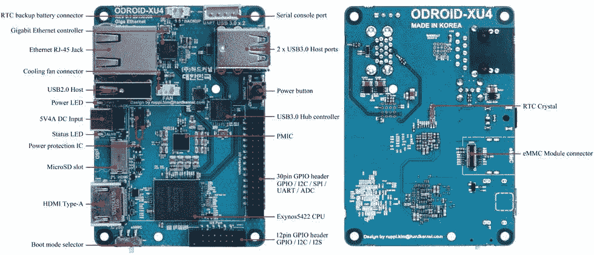
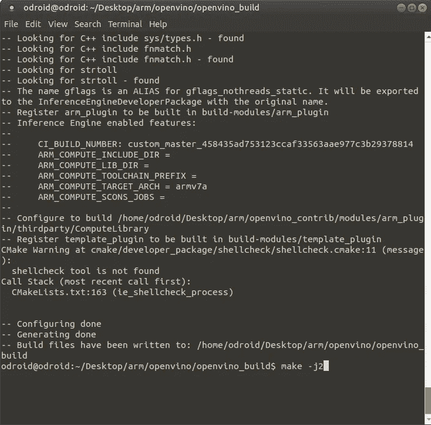
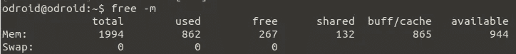
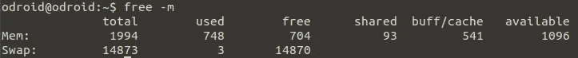
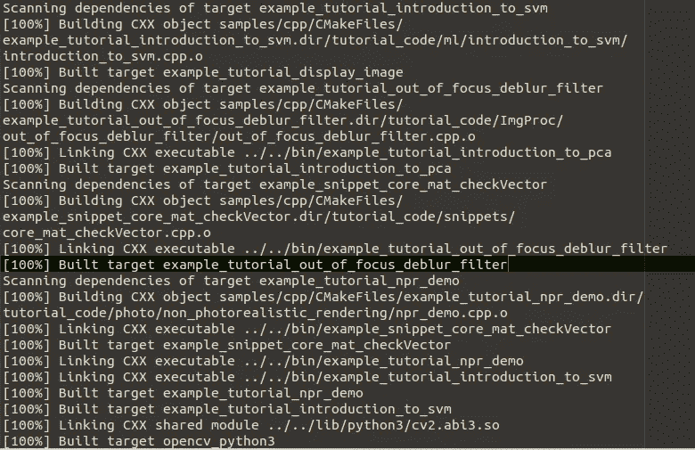
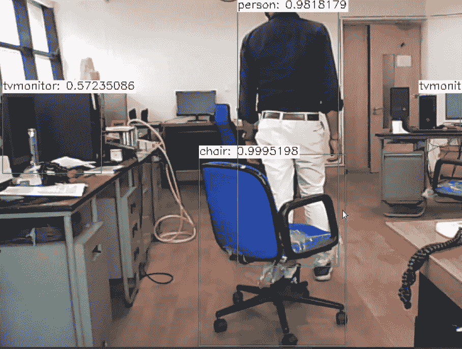

# 利用 OpenVINO ARM 插件和 OpenCV DNN 在 Odroid XU4 上进行 DNN 模型推理

> 原文：<https://medium.com/mlearning-ai/dnn-model-inference-on-odroid-xu4-using-openvino-arm-plugin-and-opencv-dnn-fcac932471e4?source=collection_archive---------5----------------------->


Photo by [ray rui](https://unsplash.com/@ray30?utm_source=medium&utm_medium=referral) on [Unsplash](https://unsplash.com?utm_source=medium&utm_medium=referral)

最近，我接到一个任务，在移动机器人上部署一个用于物体检测的 DNN 模型。由于空间和功耗是我们最关心的问题，我们决定使用小型低功耗单板计算机(SBC) Odroid XU4。对于对象检测任务，我们决定使用免费可用的流行预训练模型。为了执行推理，我们正在寻找一个平台，它可以支持来自各种 DNN 框架的模型，如 tensorflow、caffe、keras、onnx 等。我们决定使用 OpenCV 来完成这项任务。它有 dnn 模块，可以使用流行的 dnn 框架中的模型来加载和执行推理。OpenCV 默认使用自己的 dnn 后端进行推理，但是如果它是用 OpenVINO 支持构建的，我们可以使用 OpenVINO 推理引擎后端来实现更快的推理。OpenVINO 最近通过专用的 [ARM cpu 插件](https://github.com/openvinotoolkit/openvino_contrib/tree/master/modules/arm_plugin)增加了 ARM cpu 支持。因此我们决定在我们的项目中使用 OpenVINO toolkit 和 OpenCV dnn 框架。现在我们的任务是构建并安装带有 ARM cpu 插件的 OpenVINO 工具包，然后构建带有 OpenVINO 支持的 OpenCV。

# Odroid XU4

Odroid XU4 是一款 SBC [硬核](https://www.hardkernel.com/)。它的大小相当于一张信用卡。其基于 ARM 的主板配有 Mali GPU。它有 2 GB 的内存，支持 MicroSD 卡或 eMMC 来启动操作系统。它支持 android 和 linux 操作系统。更多细节可以在[这里](https://wiki.odroid.com/odroid-xu4/odroid-xu4)找到。



# 奥本维诺


[**OpenVINO toolkit**](https://docs.openvinotoolkit.org/latest/index.html) (开放式视觉推理和神经网络优化)是英特尔开发的免费工具包，用于加速深度学习模型在英特尔硬件上的部署。OpenVINO 是一个跨平台工具，支持“一次编写，随处部署”的方法。因此，使用 OpenVINO toolkit 编写的代码与硬件无关。它可以部署在英特尔平台上，包括 CPU、集成 GPU、英特尔 Movidius VPU 和 FPGAs。最近 OpenVINO 发布了 [ARM cpu 插件](https://github.com/openvinotoolkit/openvino_contrib/tree/master/modules/arm_plugin)。这使得在使用 OpenVINO API 的 ARM 设备上能够进行 dnn 推理。

# OpenCV DNN 模块


**OpenCV** ( *开源计算机视觉库*)是广泛流行的计算机视觉开源库。除了传统的计算机视觉模块，它现在还有一个用于 DNN 模型推理的 [DNN 模块](https://docs.opencv.org/4.5.2/d2/d58/tutorial_table_of_content_dnn.html)。在 DNN 模块中，OpenCV 提供了使用 OpenVINO 推理后端而不是 OpenCV 后端的规定。更多细节可以在这里找到[。](https://docs.opencv.org/4.5.2/db/d30/classcv_1_1dnn_1_1Net.html#a7f767df11386d39374db49cd8df8f59e)

# Odroid-XU4 上的 OpenVINO 和 OpenCV 安装

OpenVINO 的预构建二进制文件不可用于 Odroid XU4，ARM CPU 插件也不可作为 OpenVINO 工具包的一部分，它需要从源代码构建。此外，为了将 OpenVINO 后端集成到 OpenCV dnn 中，OpenCV 需要从源代码构建。因此，我们需要按照这个顺序从 Odroid-XU4 的源代码中构建 OpenVINO 和 OpenCV。

我们使用的是为 Odroid XU4 定制的 Ubuntu mate 18.04 的最新版本。这个操作系统镜像可以从[这里](https://odroid.in/ubuntu_18.04lts/XU3_XU4_MC1_HC1_HC2/ubuntu-18.04.3-4.14-mate-odroid-xu4-20190929.img.xz)下载。可以使用[蚀刻机](https://www.balena.io/etcher/)或[win32 disk manager](http://dn.odroid.com/DiskImager_ODROID/Win32DiskImager-odroid-v1.3.zip)等工具在存储卡上刷新操作系统映像，如此处[所示](https://wiki.odroid.com/odroid-xu4/getting_started/os_installation_guide?redirect=1#installation)。

更新源列表和升级包。

```
*sudo apt-get update
sudo apt-get upgrade*
```

## 从源代码打开 VINO building

我们将通过安装它的依赖项来开始构建 Openvino。我广泛参考了[这篇文章](https://opencv.org/how-to-run-yolov4-using-openvino-and-opencv-on-arm/)作为参考。OpenVINO 的安装说明也在其 Github 页面[这里](https://github.com/openvinotoolkit/openvino/wiki/BuildingForLinux#build-on-linux-systems)提供。

```
sudo apt-get install -y --no-install-recommends build-essential python3-dev python3-pip git git-lfs scons wget xz-utils cmake libusb-1.0-0-dev libgtk-3-dev libavcodec-dev libavformat-dev libswscale-dev libgstreamer1.0-dev libgstreamer-plugins-base1.0-dev libpython3-dev
```

现在，为了构建 OpenVINO，我们需要 cmake 或更高版本，如这里的[所示](https://github.com/openvinotoolkit/openvino/wiki/BuildingForLinux#software-requirements)，但它的二进制文件不可用，因此我们从源代码构建它。

```
wget [https://www.cmake.org/files/v3.14/cmake-3.14.3.tar.gz](https://www.cmake.org/files/v3.14/cmake-3.14.3.tar.gz)
tar xf cmake-3.14.3.tar.gz
make -j2
sudo make install
```

现在我们从 github 获取 OpenVINO 及其 ARM 插件源代码。在此之前，我们将做一个单独的目录，使我们的工作在同一个地方。

```
cd /home/odroid/Desktop
mkdir arm
cd arm
```

克隆 openvino 和 openvino_contrib github repos。Arm 插件源代码位于 openvino_contrib 下。

```
git clone --recurse-submodules --shallow-submodules --depth 1 [https://github.com/openvinotoolkit/openvino.git](https://github.com/openvinotoolkit/openvino.git)git clone --recurse-submodules --shallow-submodules --depth 1 [https://github.com/openvinotoolkit/openvino_contrib.git](https://github.com/openvinotoolkit/openvino_contrib.git)
```

创建构建和安装目录。

```
cd openvino
mkdir openvino_build
mkdir openvino_install
```

使用 cmake 指定项目生成选项。

```
cmake -DCMAKE_BUILD_TYPE=Release \
      -DCMAKE_INSTALL_PREFIX="/home/odroid/Desktop/arm/openvino/openvino_install" \
      -DTHREADING=SEQ \
      -DIE_EXTRA_MODULES=/home/odroid/Desktop/arm/openvino_contrib/modules/arm_plugin \
      -DTHREADS_PTHREAD_ARG="-pthread" .. \
      -DCMAKE_INSTALL_LIBDIR=lib \
      -DCMAKE_CXX_FLAGS=-latomic \
      -DENABLE_TESTS=OFF \
      -DENABLE_BEH_TESTS=OFF \
      -DENABLE_FUNCTIONAL_TESTS=OFF
```

注意 CMAKE_INSTALL_PREFIX 指定安装目录。IE_EXTRA_MODULES 选项非常重要，因为它指定了附加 openvino 模块的位置。我们将 **arm_plugin** 目录路径的路径指定为额外模块。这将强制构建 arm_plugin 源代码，并将 arm_plugin 与 OpenVINO 推理引擎连接起来。

以上命令将配置项目。配置完成后，我们会看到消息“配置完成”，“生成完成”，如下所示。



**创建交换空间**

一旦 OpenVINO 构建的配置完成，下一步就是实际构建。现在 Odroid XU4 是一个单板机，它的资源有限，只有 2 GB 内存。正如我们所知，在构建 make 项目时，我们可以使用'-j '选项来指定作业的数量。给 1 个以上的工作压倒了 XU4 它卡住了，而建设。这主要是因为耗尽了整个 RAM。补救措施是为 XU4 提供一个交换空间。我们将 XU4 配置为使用一个 u 盘作为 SWAP ( [参考博客](https://hackviking.com/2016/03/09/odroid-swap-on-usb-stick/))。

检查交换空间。



连接 u 盘，使用 **dmesg 查找设备名称。**它有 form /dev/sd*。对我们来说是 **/dev/sda** 。现在将 usb 配置为交换空间，如下所示。

```
odroid@odroid:~$ sudo fdisk /dev/sda
[sudo] password for odroid:Welcome to fdisk (util-linux 2.31.1).
Changes will remain in memory only, until you decide to write them.
Be careful before using the write command.Command (m for help): d
Selected partition 1
Partition 1 has been deleted.Command (m for help): n
Partition type
   p   primary (0 primary, 0 extended, 4 free)
   e   extended (container for logical partitions)
Select (default p):Using default response p.
Partition number (1-4, default 1): 
First sector (2048-30463999, default 2048): 
Last sector, +sectors or +size{K,M,G,T,P} (2048-30463999, default 30463999):Created a new partition 1 of type 'Linux' and of size 14.5 GiB.
Partition #1 contains a swap signature.Do you want to remove the signature? [Y]es/[N]o: YThe signature will be removed by a write command.Command (m for help): w
The partition table has been altered.
Calling ioctl() to re-read partition table.
Syncing disks.odroid@odroid:~$ mkswap /dev/sda1
Setting up swapspace version 1, size = 14.5 GiB (15596515328 bytes)
no label, UUID=4ceb01f1-e4b3-4928-96ab-743779ba65d9
```

**/dev/sda1** 是我们创建的分区。您可以使用 **fdisk** 中的**p’**命令来检查它的名称

注 **UUID。**现在用 root 权限打开**/etc/fstab**(sudo pluma/etc/fstab)并添加以下行。

```
UUID=4ceb01f1-e4b3-4928-96ab-743779ba65d9   none    swap    sw    0   0
```

您可以使用任何其他编辑器来编辑/etc/fstab。

最后启用交换。

```
sudo swapon /dev/sda1
```

我们可以检查是否启用了交换，如下所示。



这里的解释了创建交换的过程[。](https://hackviking.com/2016/03/09/odroid-swap-on-usb-stick/)

现在我们已经准备好构建我们的项目了。

**构建 OpenVINO**

```
make -j2
```

建筑将持续一段时间。它将以下列消息结束。

```
[100%] Building CXX object docs/snippts/CMakeFiles/ie_docs_snippets.dir/movidius-programming-guide.cpp.o
[100%] Building CXX object docs/snippets/CMakeFiles/ie_docs_snippets.dir/nGraphTutorial.cpp.o
[100%] Building CXX object docs/snippets/CMakeFiles/ie_docs_snippets.dir/protecting_model_guide.cpp.o
[100%] Linking CXX static library ../../../bin/armv7l/Release/lib/libie_docs_snippets.a
[100%] Built target ie_docs_snippets
Scanning dependencies of target onnx_custom_op
[100%] Building CXX object docs/onnx_custom_op/CMakeFiles/onnx_custom_op.dir/onnx_custom_op.cpp.o
[100%] Linking CXX static library ../../../bin/armv7l/Release/lib/libonnx_custom_op.a
[100%] Built target onnx_custom_op
Scanning dependencies of target template_extension
[100%] Building CXX object docs/template_extension/CMakeFiles/template_extension.dir/cpu_kernel.cpp.o
[100%] Building CXX object docs/template_extension/CMakeFiles/template_extension.dir/extension.cpp.o
[100%] Building CXX object docs/template_extension/CMakeFiles/template_extension.dir/op.cpp.o
[100%] Building CXX object docs/template_extension/CMakeFiles/template_extension.dir/fft_kernel.cpp.o
[100%] Building CXX object docs/template_extension/CMakeFiles/template_extension.dir/fft_op.cpp.o
[100%] Linking CXX shared module ../../../bin/armv7l/Release/lib/libtemplate_extension.so
[100%] Built target template_extension
```

**安装 OpenVINO**

安装 OpenVINO 并复制 **libarmPlugin.so** 文件

```
make installcp /home/odroid/Desktop/arm/openvino/bin/armv7l/Release/lib/libarmPlugin.so \
   /home/odroid/Desktop/arm/openvino/openvino_install/deployment_tools/inference_engine/lib/armv7l/
```

搞定了。！！！！！

我们已经用 ARM 插件完成了 OpenVINO 的构建。现在我们需要构建 OpenCV，同时通知 OpenCV 关于 ARM 推断插件。

# 使用 OpenVINO 后端构建 OpenCV

安装生成依赖项。

```
sudo add-apt-repository "deb [http://ports.ubuntu.com/ubuntu-ports](http://ports.ubuntu.com/ubuntu-ports) xenial-security main"sudo apt -y install build-essential cmake gfortran pkg-config unzip software-properties-common doxygen
sudo apt -y install libblas-dev libblas-test liblapack-dev libatlas-base-dev libopenblas-base libopenblas-devsudo apt -y install libblas-dev libblas-test liblapack-dev libatlas-base-dev libopenblas-base libopenblas-dev
sudo apt -y install libjpeg-dev libpng-dev libtiff-dev libavcodec-dev libavformat-dev libswscale-dev libv4l-dev
sudo apt -y install libxvidcore-dev libx264-dev
sudo apt -y install libgtk2.0-dev libgtk-3-dev libcanberra-gtk*
sudo apt -y install libtiff5-dev libeigen3-dev libtheora-dev libvorbis-dev sphinx-common libtbb-dev yasm libopencore-amrwb-dev
sudo apt -y install libopenexr-dev libgstreamer-plugins-base1.0-dev libgstreamer1.0-dev libavutil-dev libavfilter-dev
sudo apt -y install libavresample-dev ffmpeg libdc1394-22-dev libwebp-dev
sudo apt -y install libjpeg8-dev libxine2-dev libfaac-dev libmp3lame-dev libopencore-amrnb-dev libprotobuf-dev
sudo apt -y install protobuf-compiler libgoogle-glog-dev libgflags-dev libgphoto2-dev libhdf5-dev
sudo apt -y install qt5-default v4l-utils
sudo apt -y install libtbb2
```

克隆 OpenCV Github repos。

```
cd /home/odroid/Desktop/armgit clone --recurse-submodules --shallow-submodules --depth 1 [https://github.com/opencv/opencv.git](https://github.com/opencv/opencv.git)git clone --recurse-submodules --shallow-submodules --depth 1 [https://github.com/opencv/opencv_contrib.git](https://github.com/opencv/opencv_contrib.git)
```

创建构建、安装和 python 目录。

```
cd opencv
mkdir opencv_build
mkdir opencv_install
mkdir opencv_python
```

使用 cmake 配置生成项目

```
cd opencv_buildcmake -DCMAKE_BUILD_TYPE=Release \
      -DCMAKE_INSTALL_PREFIX="/home/odroid/Desktop/arm/opencv/opencv_install" \
      -DOPENCV_CONFIG_INSTALL_PATH="cmake" \
      -DOPENCV_ENABLE_NONFREE=ON \
      -DOPENCV_EXTRA_MODULES_PATH=/home/odroid/Desktop/arm/opencv_contrib/modules \
      -DWITH_IPP=OFF \
      -DBUILD_TESTS=OFF \
      -DBUILD_PERF_TESTS=OFF \
      -DOPENCV_ENABLE_PKG_CONFIG=ON \
      -DOPENCV_GENERATE_PKGCONFIG=ON \
      -DPYTHON3_PACKAGES_PATH="/home/odroid/Desktop/arm/opencv/opencv_install/python" \
      -DPKG_CONFIG_EXECUTABLE="/usr/bin/arm-linux-gnueabihf-pkg-config" \
      -DBUILD_opencv_python2=OFF \
      -DBUILD_opencv_python3=ON \
      -DOPENCV_PYTHON3_INSTALL_PATH=/home/odroid/Desktop/arm/opencv/opencv_python \
      -DPYTHON_EXECUTABLE=/usr/bin/python3.6 \
      -DPYTHON2_EXECUTABLE=/usr/bin/python2.7 \
      -DPYTHON3_EXECUTABLE=/usr/bin/python3.6 \
      -DPYTHON_PACKAGES_PATH=/usr/lib/python3/dist-packages \
      -DPYTHON_LIBRARY=/usr/lib/python3.6/config-3.6m-arm-linux-gnueabihf/libpython3.6m.so \
      -DPYTHON3_INCLUDE_PATH="/usr/include/python3.6" \
      -DINSTALL_PYTHON_EXAMPLES=ON \
      -DBUILD_DOCS=ON \
      -DBUILD_TIFF=ON \
      -DWITH_FFMPEG=ON \
      -DWITH_GSTREAMER=ON \
      -DWITH_TBB=ON \
      -DBUILD_TBB=ON \
      -DWITH_V4L=ON \
      -DWITH_PNG=ON \
      -DWITH_JPEG=ON \
      -DWITH_WEBP=ON \
      -DWITH_GTK=ON \
      -DWITH_QT=ON \
      -DWITH_LIBV4L=ON \
      -DWITH_VTK=OFF \
      -DWITH_OPENGL=OFF \
      -DBUILD_NEW_PYTHON_SUPPORT=ON \
      -DBUILD_TESTS=OFF \
      -DBUILD_EXAMPLES=ON \
      -DPYTHON3_NUMPY_INCLUDE_DIRS="/usr/local/lib/python3.6/dist-packages/numpy/core/include" \
      -DPYTHON3_LIMITED_API=ON \
      -DOPENCV_SKIP_PYTHON_LOADER=ON \
      -DENABLE_NEON=ON \
      -DCPU_BASELINE="NEON" \
      -DWITH_INF_ENGINE=ON \
      -DWITH_NGRAPH=ON \
      -Dngraph_DIR="/home/odroid/Desktop/arm/openvino/openvino_build/ngraph" \
      -DINF_ENGINE_RELEASE=2021030000 \
      -DInferenceEngine_DIR="/home/odroid/Desktop/arm/openvino/openvino_build" \
      -DINF_ENGINE_LIB_DIRS="/home/odroid/Desktop/arm/openvino/bin/armv7l/Release/lib" \
      -DINF_ENGINE_INCLUDE_DIRS="/home/odroid/Desktop/arm/openvino/inference-engine/include" \
      -DCMAKE_FIND_ROOT_PATH="/home/odroid/Desktop/arm/openvino" \
      -DENABLE_CXX11=ON ..
```

一些值得注意的选项是

CMAKE_INSTALL_PREFIX:构建的二进制文件的安装目录

OPENCV _ EXTRA _ MODULES _ PATH:OPENCV 额外模块的路径。DNN 模块驻留在 opencv_contrig repo 中，因此我们指定了它。

BUILD_opencv_python3:是否构建 opencv python3 绑定

OPENCV _ python 3 _ INSTALL _ PATH:OPENCV python 二进制文件的安装路径

OpenVINO 的特定选项是将其与 opencv 链接的关键。WITH_INF_ENGINE，WITH_NGRAPH，ngraph_DIR，INF_ENGINE_RELEASE，INF _ ENGINE _ LIB，INF_ENGINE_LIB_DIRS，INF_ENGINE_INCLUDE_DIRS，CMAKE_FIND_ROOT_PATH。

这将给出以下配置。

```
-- General configuration for OpenCV 4.5.3-pre =====================================
--   Version control:               438e2dc
-- 
--   Extra modules:
--     Location (extra):            /home/odroid/Desktop/arm/opencv_contrib/modules
--     Version control (extra):     8eec886
-- 
--   Platform:
--     Timestamp:                   2021-06-13T20:51:26Z
--     Host:                        Linux 4.14.180-178 armv7l
--     CMake:                       3.14.3
--     CMake generator:             Unix Makefiles
--     CMake build tool:            /usr/bin/make
--     Configuration:               Release
-- 
--   CPU/HW features:
--     Baseline:                    NEON
--       required:                  NEON
-- 
--   C/C++:
--     Built as dynamic libs?:      YES
--     C++ standard:                11
--     C++ Compiler:                /usr/bin/c++  (ver 7.5.0)
--     C++ flags (Release):         -fsigned-char -W -Wall -Werror=return-type -Werror=non-virtual-dtor -Werror=address -Werror=sequence-point -Wformat -Werror=format-security -Wmissing-declarations -Wundef -Winit-self -Wpointer-arith -Wshadow -Wsign-promo -Wuninitialized -Wsuggest-override -Wno-delete-non-virtual-dtor -Wno-comment -Wimplicit-fallthrough=3 -Wno-strict-overflow -fdiagnostics-show-option -pthread -fomit-frame-pointer -ffunction-sections -fdata-sections  -mfpu=neon -fvisibility=hidden -fvisibility-inlines-hidden -O3 -DNDEBUG  -DNDEBUG
--     C++ flags (Debug):           -fsigned-char -W -Wall -Werror=return-type -Werror=non-virtual-dtor -Werror=address -Werror=sequence-point -Wformat -Werror=format-security -Wmissing-declarations -Wundef -Winit-self -Wpointer-arith -Wshadow -Wsign-promo -Wuninitialized -Wsuggest-override -Wno-delete-non-virtual-dtor -Wno-comment -Wimplicit-fallthrough=3 -Wno-strict-overflow -fdiagnostics-show-option -pthread -fomit-frame-pointer -ffunction-sections -fdata-sections  -mfpu=neon -fvisibility=hidden -fvisibility-inlines-hidden -g  -O0 -DDEBUG -D_DEBUG
--     C Compiler:                  /usr/bin/cc
--     C flags (Release):           -fsigned-char -W -Wall -Werror=return-type -Werror=address -Werror=sequence-point -Wformat -Werror=format-security -Wmissing-declarations -Wmissing-prototypes -Wstrict-prototypes -Wundef -Winit-self -Wpointer-arith -Wshadow -Wuninitialized -Wno-comment -Wimplicit-fallthrough=3 -Wno-strict-overflow -fdiagnostics-show-option -pthread -fomit-frame-pointer -ffunction-sections -fdata-sections  -mfpu=neon -fvisibility=hidden -O3 -DNDEBUG  -DNDEBUG
--     C flags (Debug):             -fsigned-char -W -Wall -Werror=return-type -Werror=address -Werror=sequence-point -Wformat -Werror=format-security -Wmissing-declarations -Wmissing-prototypes -Wstrict-prototypes -Wundef -Winit-self -Wpointer-arith -Wshadow -Wuninitialized -Wno-comment -Wimplicit-fallthrough=3 -Wno-strict-overflow -fdiagnostics-show-option -pthread -fomit-frame-pointer -ffunction-sections -fdata-sections  -mfpu=neon -fvisibility=hidden -g  -O0 -DDEBUG -D_DEBUG
--     Linker flags (Release):      -Wl,--gc-sections -Wl,--as-needed  
--     Linker flags (Debug):        -Wl,--gc-sections -Wl,--as-needed  
--     ccache:                      NO
--     Precompiled headers:         NO
--     Extra dependencies:          dl m pthread rt
--     3rdparty dependencies:
-- 
--   OpenCV modules:
--     To be built:                 alphamat aruco barcode bgsegm bioinspired calib3d ccalib core cvv datasets dnn dnn_objdetect dnn_superres dpm face features2d flann freetype fuzzy hdf hfs highgui img_hash imgcodecs imgproc intensity_transform line_descriptor mcc ml objdetect optflow phase_unwrapping photo plot python3 quality rapid reg rgbd saliency sfm shape stereo stitching structured_light superres surface_matching text tracking video videoio videostab wechat_qrcode xfeatures2d ximgproc xobjdetect xphoto
--     Disabled:                    world
--     Disabled by dependency:      -
--     Unavailable:                 cudaarithm cudabgsegm cudacodec cudafeatures2d cudafilters cudaimgproc cudalegacy cudaobjdetect cudaoptflow cudastereo cudawarping cudev gapi java julia matlab ovis python2 ts viz
--     Applications:                examples apps
--     Documentation:               doxygen
--     Non-free algorithms:         YES
-- 
--   GUI: 
--     QT:                          YES (ver 5.9.5)
--       QT OpenGL support:         NO
--     GTK+:                        YES (ver 3.22.30)
--       GThread :                  YES (ver 2.56.4)
--       GtkGlExt:                  NO
-- 
--   Media I/O: 
--     ZLib:                        /usr/lib/arm-linux-gnueabihf/libz.so (ver 1.2.11)
--     JPEG:                        /usr/lib/arm-linux-gnueabihf/libjpeg.so (ver 80)
--     WEBP:                        /usr/lib/arm-linux-gnueabihf/libwebp.so (ver encoder: 0x020e)
--     PNG:                         /usr/lib/arm-linux-gnueabihf/libpng.so (ver 1.6.34)
--     TIFF:                        build (ver 42 - 4.2.0)
--     JPEG 2000:                   build (ver 2.4.0)
--     OpenEXR:                     /usr/lib/arm-linux-gnueabihf/libImath.so /usr/lib/arm-linux-gnueabihf/libIlmImf.so /usr/lib/arm-linux-gnueabihf/libIex.so /usr/lib/arm-linux-gnueabihf/libHalf.so /usr/lib/arm-linux-gnueabihf/libIlmThread.so (ver 2_2)
--     HDR:                         YES
--     SUNRASTER:                   YES
--     PXM:                         YES
--     PFM:                         YES
-- 
--   Video I/O:
--     DC1394:                      YES (2.2.5)
--     FFMPEG:                      YES
--       avcodec:                   YES (57.107.100)
--       avformat:                  YES (57.83.100)
--       avutil:                    YES (55.78.100)
--       swscale:                   YES (4.8.100)
--       avresample:                YES (3.7.0)
--     GStreamer:                   YES (1.14.5)
--     v4l/v4l2:                    YES (linux/videodev2.h)
-- 
--   Parallel framework:            pthreads
-- 
--   Trace:                         YES (with Intel ITT)
-- 
--   Other third-party libraries:
--     Lapack:                      NO
--     Inference Engine:            YES (2021030000 / 0.0.0)
--         * libs:                  /home/odroid/Desktop/arm/openvino/bin/armv7l/Release/lib/libinference_engine.so
--         * includes:              /home/odroid/Desktop/arm/openvino/inference-engine/include
--     nGraph:                      YES (0.0.0+458435a)
--         * libs:                  /home/odroid/Desktop/arm/openvino/bin/armv7l/Release/lib/libngraph.so
--         * includes:              /home/odroid/Desktop/arm/openvino/ngraph/core/include
--     Eigen:                       YES (ver 3.3.4)
--     Custom HAL:                  YES (carotene (ver 0.0.1))
--     Protobuf:                    build (3.5.1)
-- 
--   OpenCL:                        YES (no extra features)
--     Include path:                /home/odroid/Desktop/arm/opencv/3rdparty/include/opencl/1.2
--     Link libraries:              Dynamic load
-- 
--   Python 3:
--     Interpreter:                 /usr/bin/python3.6 (ver 3.6.9)
--     Libraries:                   /usr/lib/python3.6/config-3.6m-arm-linux-gnueabihf/libpython3.6m.so (ver 3.6.9)
--     numpy:                       /usr/local/lib/python3.6/dist-packages/numpy/core/include (ver 1.19.5)
--     install path:                /home/odroid/Desktop/arm/opencv/opencv_python
-- 
--   Python (for build):            /usr/bin/python3.6
-- 
--   Java:                          
--     ant:                         NO
--     JNI:                         NO
--     Java wrappers:               NO
--     Java tests:                  NO
-- 
--   Install to:                    /home/odroid/Desktop/arm/opencv/opencv_install
-- -----------------------------------------------------------------
-- 
-- Configuring done
-- Generating done
-- Build files have been written to: /home/odroid/Desktop/arm/opencv/opencv_build---------------------------------------------------------------------------------------
```

构建 opencv

```
make -j2
```

这将启动构建过程。这需要一段时间。最后，您将收到类似如下的消息。



安装 opencv

```
make install
```

Opencv 构建完成！！！

现在为了使用 opecv 和 openvino 库，我们必须导出它们的路径。遵循两行就可以了。

```
export PYTHONPATH=$PYTHONPATH:/home/odroid/Desktop/arm/opencv/opencv_install/pythonexport LD_LIBRARY_PATH=$LD_LIBRARY_PATH:/home/odroid/Desktop/arm/opencv/opencv_install/lib/:/home/odroid/Desktop/arm/openvino/openvino_install/deployment_tools/ngraph/lib/:/home/odroid/Desktop/arm/openvino/openvino_install/deployment_tools/inference_engine/lib/armv7l
```

# 对象检测示例

现在让我们用一个简单的对象检测例子来测试我们的安装。关注[这篇](https://ebenezertechs.com/mobilenet-ssd-using-opencv-3-4-1-deep-learning-module-python/)博客。代码可以从[这里](https://github.com/djmv/MobilNet_SSD_opencv)下载。博客很好地解释了代码。默认情况下，这段代码使用 opencv 后端进行模型推断。为了使用 OpenVINO，我们在加载模型后添加了下面一行。

```
net.setPreferableBackend(cv2.dnn.DNN_BACKEND_INFERENCE_ENGINE)
```

我们运行对象检测应用程序的样本测试代码可以在[这里](https://github.com/GauravPatel89/MobilNet_SSD_opencv)找到。下载这个[库](https://github.com/GauravPatel89/MobilNet_SSD_opencv)中的文件，并按照自述文件中所示运行。以下是网络摄像头输入的输出。



这只是一个例子。一旦建立了 DNN 框架，就可以在 OpenCV 和 OpenVINO 框架上运行各种 dnn 模型。样品可以在[这里](https://github.com/opencv/opencv/tree/master/samples/dnn)和[这里](https://docs.openvino.ai/latest/openvino_docs_IE_DG_Samples_Overview.html)找到。

# 参考

1.  [https://opencv . org/how-to-run-yolov 4-using-open vino-and-opencv-on-arm/](https://opencv.org/how-to-run-yolov4-using-openvino-and-opencv-on-arm/)
2.  [https://github . com/openvinotoolkit/open vino _ contrib/tree/master/modules/arm _ plugin](https://github.com/openvinotoolkit/openvino_contrib/tree/master/modules/arm_plugin)
3.  [https://www . pyimagesearch . com/2019/09/16/install-opencv-4-on-raspberry-pi-4-and-raspbian-buster/](https://www.pyimagesearch.com/2019/09/16/install-opencv-4-on-raspberry-pi-4-and-raspbian-buster/)
4.  [https://ebenezer techs . com/mobilenet-SSD-using-opencv-3-4-1-deep-learning-module-python/](https://ebenezertechs.com/mobilenet-ssd-using-opencv-3-4-1-deep-learning-module-python/)
5.  https://github.com/sclable/openvino_opencv
6.  【https://hackviking.com/2016/03/09/odroid-swap-on-usb-stick/ 

[](/mlearning-ai/mlearning-ai-submission-suggestions-b51e2b130bfb) [## Mlearning.ai 提交建议

### 如何成为 Mlearning.ai 上的作家

medium.com](/mlearning-ai/mlearning-ai-submission-suggestions-b51e2b130bfb)