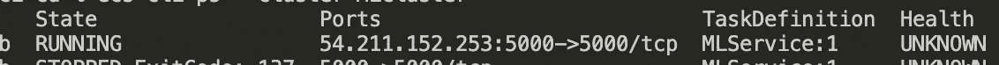
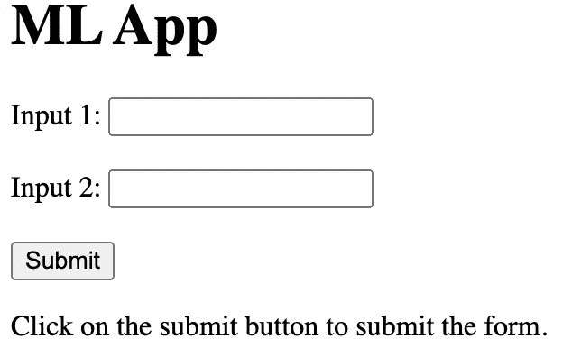

# 数据科学家需要学习 CICD 吗？AWS ECS 上的 Gitlab Python 代码

> 原文：<https://medium.com/mlearning-ai/do-data-scientists-need-to-learn-cicd-gitlab-python-code-on-aws-ecs-be4cf97db375?source=collection_archive---------9----------------------->

F 继[一节最后一条之后**数据科学家需要学习 CICD 吗？AWS 无服务器 Lambda 服务**](/@peiyuan67/do-data-scientists-need-to-learn-cicd-gitlab-python-code-on-aws-serverless-lambda-service-13a11f5df4a0) 上的 Gitlab Python 代码，这篇文章关注的是在将机器学习模型部署到服务时非常常见的容器化技术。我们将使用 AWS ECS(弹性容器服务)来运行我们的 docker 映像。我们在 ECS 上运行 docker 映像的原因包括:

*   可扩展性:其集群服务支持可扩展的计算资源。
*   兼容性:容器管理可以清楚地定义我们的运行环境。


Photo by [Ian Battaglia](https://unsplash.com/@ianjbattaglia?utm_source=medium&utm_medium=referral) on [Unsplash](https://unsplash.com?utm_source=medium&utm_medium=referral)

在 ECS 上运行 docker 映像的架构如下，我们将其分为 4 个主要步骤:

*   **第一步。编写一个应用程序——Python Flask**:为我们的应用程序构建大脑
*   **第二步。构建 Docker 映像并将其推送到 ECR** :为我们的应用程序构建运行环境
*   **第三步。设置 ECS** :让我们的应用程序运行
*   **第四步。定义。gitlab-ci.yml 运行 CICD** :自动更新一切


CICD Workflow

## 第一步。编写一个应用程序— Python Flask

这是我们运行机器学习模型服务的地方，例如在大多数情况下运行模型推理。为了简单起见，我们在这里使用一个 flask 应用程序(application.py)作为例子。

```
from flask import Flask
from flask import render_templateapplication = Flask(__name__)[@application](http://twitter.com/application).route('/')
def hello_world():
    return render_template('run_ml_model_inference.html')if __name__ == '__main__':
    application.run(host='0.0.0.0')
```

## 第二步。构建一个 Docker 映像并将其推送到 ECR

这里，我们需要完成三个小步骤来为我们的应用程序构建一个在 ECS 上运行的环境。

**2.1 在 ECR 上创建一个存储库**

ECR 是一项 AWS 服务，我们在其中存储我们的 docker 图像。就像我们在 Github 上做的一样，我们在 ECR 上构建一个存储库来保存我们的 docker 映像并跟踪它的版本。我们通过使用 [aws-cli](https://pypi.org/project/awscli/) python 包来完成这一步。记住授权 IAM 用户凭证有权访问 ECR。(为简单起见，出于测试目的，附加管理员访问权限。)

```
# log in to aws ecr service
**aws ecr** get-login-password --region us-east-1 | docker login --username AWS --password-stdin **{aws_account_id}**.dkr.ecr.us-east-1.amazonaws.com# create an ecr repository
**aws ecr** create-repository --repository-name **mlapp** --region us-east-1
```

**2.2 编写 Dockerfile**

知道了在哪里可以保存我们的 docker 形象，是时候建立我们的 docker 形象了。我们在 Dockerfile 中定义环境。但是在编写 Dockerifle 之前，让我们首先定义 python requirements.txt，以包含运行机器学习应用程序所需的任何包。在这种情况下，我们只需要烧瓶。因此，在 requirements.txt 中，添加 flask。

```
flask
```

Dockerfile 如下:

```
# define base image: the current image has installed python 3
FROM python:3# define container working directory: we start our under this directory
WORKDIR /usr/src/app# copy our requirements.txt to container WORKDIR and then install required pacakges
COPY ./requirements.txt ./
RUN apt-get -y update
RUN pip install --no-cache-dir -r requirements.txtCOPY . .# define the entrypoint of container and run the commands (to run a python file, we need to set an entry point of python): python applications.py
ENTRYPOINT [ "python" ]
CMD ["application.py"]
```

**2.3 构建映像并将其推送到 ECR**

一旦定义了 Dockerfile，我们就构建一个 docker 映像，并将其推送到我们在步骤 2.1 中构建的 ECR。

```
# build an image
**docker build** -t local/mlapp .# rename the image so that it is same as the repository on ECR
**docker tag** local/mlapp **{aws_account_id}**.dkr.ecr.us-east-1.amazonaws.com/mlapp# push the docker image to ECR repository
**docker push** **{aws_account_id}**.dkr.ecr.us-east-1.amazonaws.com/mlapp
```

## 第三步。设置 ECS

好吧，我们在旅程的中间。我们有六个小步骤来完成第三步。

**3.1 安装 ECS CLI**

按照以下链接安装 ecs-cli。这样，我们就可以利用设置 ECS 服务的优势。

[](https://docs.aws.amazon.com/AmazonECS/latest/developerguide/ECS_CLI_installation.html) [## 安装 Amazon ECS CLI

### Amazon ECS 发布了 AWS Copilot，这是一个命令行界面(CLI)工具，可以简化构建、发布和…

docs.aws.amazon.com](https://docs.aws.amazon.com/AmazonECS/latest/developerguide/ECS_CLI_installation.html) 

**3.2 配置 ECS**

从 AWS IAM 用户处获得凭证(AWS _ ACCESS _ KEY _ ID & AWS _ SECRET _ ACCESS _ KEY)后，我们将其设置为环境变量。接下来，使用 *ecs-cli 配置文件*授权我们的 ecs-cli 命令使用 AWS 服务。然后，使用 *ecs-cli configure* ，定义集群的名称、启动计算资源的机制、服务运行的区域及其配置名称。关于 launch type 中的 *FARGATE* ，它是一个运行我们的应用程序的无服务器服务，这与使用 EC2 相反。

```
export AWS_ACCESS_KEY_ID="xxx"
export AWS_SECRET_ACCESS_KEY="xxx"**ecs-cli configure** **profile** --profile-name aws_ecs_cli_profile_name --access-key $AWS_ACCESS_KEY_ID --secret-key $AWS_SECRET_ACCESS_KEY**ecs-cli configure** --cluster MLCluster --default-launch-type FARGATE --region us-east-1 --config-name MLConfigName
```

**3.3 为 ECS 创建 IAM 角色**

当一个 AWS 服务需要访问另一个 AWS 服务时，需要 IAM 角色。让我们使用 ecs-trust-policy.json 来创建一个角色。

```
{
    "Version": "2012-10-17",
    "Statement": [
        {
            "Effect": "Allow",
            "Principal": {
                "Service": "ecs-tasks.amazonaws.com"
            },
            "Action": "sts:AssumeRole"
        }
    ]
}
```

创建一个 IAM 角色并附加另一个策略来授权 ECS。

```
**aws iam create-role** \
--role-name **ecsMLTaskExecutionRole** \
--assume-role-policy-document **file://ecs-trust-policy.json****aws iam** **attach-role-policy** \
--role-name ecsMLTaskExecutionRole \
--policy-arn arn:aws:iam::aws:policy/service-role/AmazonECSTaskExecutionRolePolicy
```

**3.4 创建一个 ECS 集群**

是时候创建 ECS 集群了。请保留 VPC 和子网信息，因为我们稍后会用到它们。

```
**ecs-cli up** \
--cluster MLCluster \
--region us-east-1 \
--launch-type FARGATEoutput:
VPC created: **vpc-123456789**
Subnet created: **subnet-xxxx1**
Subnet created: **subnet-xxxx2**
Cluster creation succeeded.
```

**3.5 根据步骤 1，更改安全组入口规则**

出于安全原因，我们只公开运行应用程序所需的端口。通过填充步骤 3.4 中的 VPC 值，我们得到了安全组值(GroupId)。

```
**aws ec2 describe-security-groups** \
--filters Name=vpc-id,Values=**vpc-123456789** \
--region us-east-1output:
“GroupId”: “**sg-123**”,
“UserId”: “xxxxxxxx”
```

然后，我们授权公众访问我们的端口 5000，这是我们运行 flask 应用程序的地方。

```
**aws ec2 authorize-security-group-ingress** \
--group-id **sg-123** \
--protocol tcp \
**--port 5000 \
--cidr 0.0.0.0/0 \** --region us-east-1
```

**3.6**运行服务

最后一小步是开始在 ECS 上运行服务。这里要定义两个文件:

1.  **docker-compose.yml:**

*   图像是我们在步骤 2 中在 ECR 上创建的图像。
*   端口意味着容器端口 5000 连接到 ECS 端口 5000。还记得我们在步骤 3.5 中刚刚授权公众访问的端口吗？那是端口 5000。

```
version: "3"
services:
    web:
        image: **{aws_account_id}**.dkr.ecr.us-east-1.amazonaws.com/mlapp:latest
        ports:
            - 5000:5000
```

**2。ecs-params.yml**

*   对于 task_execution_role，为其分配我们创建的 IAM 角色。
*   根据我们在步骤 3.4 和 3.5 中创建的内容替换子网和安全组。

```
version: 1
task_definition:
  task_execution_role: **ecsMLTaskExecutionRole**
  ecs_network_mode: awsvpc
  task_size:
    mem_limit: 0.5GB
    cpu_limit: 256
run_params:
  network_configuration:
    awsvpc_configuration:
      subnets:
        - "**subnet-xxxx1**"
        - "**subnet-xxxx2**"
      security_groups:
        - "**sg-123**"
      assign_public_ip: ENABLED
```

完成 docker-compose.yml 和 ecs-params.yml 的定义后，让我们启动服务来运行我们的应用程序。

```
**ecs-cli compose** \
--project-name MLService \
--cluster MLCluster \
service up \
--launch-type FARGATE \
--timeout 6.5
```

## 第四步。定义。gitlab-ci.yml 运行 CICD

为了自动更新我们的应用程序，我们必须定义。gitlab-ci.yml，这样下次我们向应用程序推送新的更改时，Gitlab runner 可以帮助我们构建和映像，将其推送到 ECR 并更新 ECS 服务。

```
docker-build-master:
  image: **docker:latest**
  stage: build
  services:
    - docker:dind
  before_script:
    - **apk add py3-pip**
    - **pip install awscli**
  script:
    - aws ecr get-login-password --region us-east-1 | docker login --username AWS --password-stdin {aws_account_id}.dkr.ecr.us-east-1.amazonaws.com
    - **docker build -t** $CI_REGISTRY_IMAGE .
    - **docker push** "$CI_REGISTRY_IMAGE"
    - **aws ecs update-service** --cluster MLCluster --service MLService --force-new-deployment
  only:
    - master
```

在终端中，通过键入以下内容，我们可以获得访问服务的 IP 地址。例如，我们可以在 54.211.152.253:5000 看到我们的 Flask 网页。因为我们在这个架构中没有使用弹性 IP，所以每次我们更新服务时，IP 地址都会改变。

```
ecs-cli ps — cluster MLCluster
```



通过在浏览器中搜索链接，可以看到下面的页面。



实现这个架构的示例代码可以在 Github 上的[这里](https://gitlab.com/chrissmart/ecs-ci-cd)找到。

[](/mlearning-ai/mlearning-ai-submission-suggestions-b51e2b130bfb) [## Mlearning.ai 提交建议

### 如何成为 Mlearning.ai 上的作家

medium.com](/mlearning-ai/mlearning-ai-submission-suggestions-b51e2b130bfb)