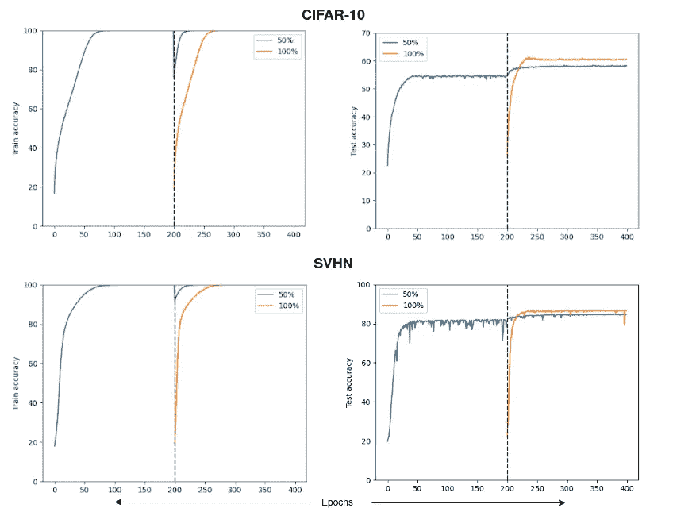
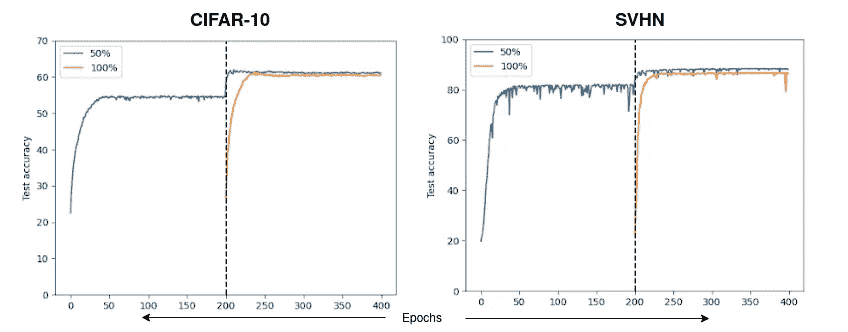
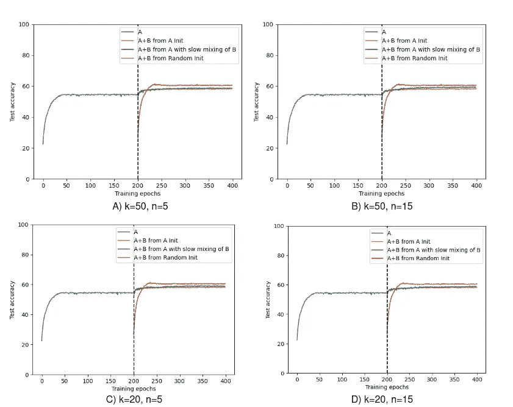
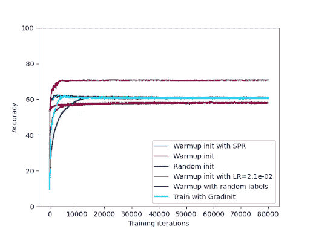

# 随机初始化与预训练权值的泛化能力

> 原文：<https://medium.com/mlearning-ai/do-randomly-initialized-network-parameters-generalize-better-than-pre-trained-ones-80a649a23cd9?source=collection_archive---------4----------------------->

*TLDR；问:“用随机初始化的权重训练神经网络比用预训练的权重训练神经网络能产生更好的泛化能力吗？”答:可以。然而，了解培训的动态可以帮助弥合差距。*

Image Source: Unsplash

众所周知，用预训练模型的参数来初始化神经网络参数，可以找到凸优化问题和非凸优化问题的有效解决方案。然而，最近的工作表明，这种神经网络训练的热启动可能导致性能落后于从随机初始化的参数训练的性能。在这篇博客文章中，我打算在研究一些缓解这种滞后的措施的同时，沿着这条工作路线复制最近的论文的结果。

## 热启动训练导致概括能力下降

Ash & Adams (2020)的基础工作显示了热启动如何损害深度神经网络中的泛化，而不损害训练精度。在我称为 *A+B* 的训练设置中，他们在训练数据的前 50%*即*A 上预训练他们的模型，并使用它来热启动训练，也称为*在 100%的训练数据上调整*，*即*，B。下面的图再现了这种热启动训练对 CIFAR-10 和 SVHN 数据集的影响，并将它们与训练随机初始化的模型进行对比

对于诸如任务增量连续学习之类的领域，其中大多数设置依赖于用从先前时间步长任务的优化中获得的参数来初始化主干网络的参数，这种泛化能力的下降尤其糟糕，因为它会对可行性能造成上限。

The training and test accuracy (averaged over 3 runs) of pre-trained (first 200 epochs), warm-started (Blue), and randomly initialized (Orange) ResNet18 models (200–400 epochs) on CIFAR-10 and SVHN datasets. Training setting uses SGD optimizer with zero weight decay, an initial LR of 0.001 without scheduling and no data augmentation.

## 补救措施

Ash & Adams (2020)提出了收缩、扰动和重复(SPR)初始化算法，作为使用从预训练模型初始化的参数在每轮对新的、看不见的数据进行训练时产生的梯度不平衡的补救措施。即如果*θ_i^t*是第 *t* 训练轮的第 *i* 个训练参数，那么 SPR 初始化可以表述为:*θ_i^t*=*θ_i^(t-1)*+*p^t*，*即*， 在前一轮训练中找到的参数值首先通过因子*λ****∈****(0，1)* 向零收缩，然后通过添加从均值零和标准偏差****∈****【0，1】*的分布中提取的噪声 *p^t* 来扰动。 下图显示了在 CIFAR-10 和 SVHN 测试集上 SPR 优于随机初始化的结果。*

**

*Figures showing the effect of SPR technique when initializing the warm-start training of neural networks (Blue) in contrast to random initialization (Orange).*

## *理解泛化差距*

*最近，Berariu *等人* (2021)提出在调谐期间将学习速率提高一个数量级，作为上述设置中 SPR 的替代方案。为了理解这背后的动机，让我们首先调查为什么热启动训练的推广滞后。*

*在他们的论文中，Berariu *等人* (2021)使用 Ash & Adams (2020)的设置来研究热启动泛化差距的发生。特别是，他们的推理基于神经网络学习的两个阶段:(a)*探索*阶段有助于参数找到损耗最小值的吸引盆地，这些盆地足够宽以捕获优化，(b)*细化*阶段然后有助于参数在基于梯度流的盆地中收敛到临界点。作者推测，预训练阶段主要通过减少梯度中的噪音量来影响学习的探索阶段，这些噪音是搜索更广泛的吸引区域所必需的。这反过来增加了收敛到更窄的最小值的机会，从而导致更差的泛化能力。在调谐期间增加学习速率可以被视为等同于在参数更新期间重新引入噪声。*

*具有较高学习速率的调谐的有效性也可以从到达条件良好的损失表面区域的角度来解释。Jastrzebski *等人* (2020)表明，在神经网络的早期优化轨迹中存在盈亏平衡点，超过该点，梯度下降沿曲率最大的损失面方向振荡。因此，在达到这样的盈亏平衡点之前使用较大的学习率导致小批量梯度的方差减小，这又改善了它们的协方差以及损失面的调节。*

## *通过检查先前看到的数据的重放来弥补归纳差距*

*从前面提到的*两阶段学习*机制中汲取灵感，我尝试将看到的例子稳定地重新引入模型的训练数据*，而不是立刻从 100%的训练数据开始*。*

*形式上，调整阶段现在开始于在第一个 *N 个*时期的不可见的*(剩余的 50%)* 数据上训练模型，随后在每个 *n 个*时期将可见的示例的 *k%* (从第一个 *50%* 开始无替换地采样)混合到训练数据中。这里的假设是，这种在训练期间部分但稳定地重新引入已见过的例子可以帮助延长模型的探索阶段。尽管培训受到相同的资源预算，但这可以提供更多的机会来发现更广泛的吸引力。*

*上述设置要求从一开始就将在所有可用训练数据上训练的模型标记为原始基线，而使用参数的随机初始化获得的性能作为上限。下面的结果表明，如此稳定地重新引入已看过的训练示例确实有助于实现超过基线的优异表现。*

*然而，精度根据 *k.* 的值而变化。即使对于相同的*k*,*n*的值也会进一步影响性能。一般来说，当模型在看到下一批新的重放数据之前获得充足的训练时期时，相对于基线的性能增益提高。然而，将 *n* 增加到更大的值会对性能产生负面影响。对此的一种可能解释是，较大的 *n* 值允许训练很好地进展到*细化*阶段，因此在两个阶段之间反复切换导致随着时间的推移有效勘探所需的噪声衰减。*

**

## *我们是否应该超越弥合概括差距？*

*由于来自随机初始化的训练可能导致参数学习较慢，检查热启动训练性能的另一种方式可以是优先考虑*收敛速度*而不是*性能*。我研究了使用一些这样的技术来达到更快收敛的最终目标。*

*其中第一个是由 Maennel *等人* (2020)提出的，它基于使用随机标签的预训练，以便于在调整期间更快地收敛，而不是从头开始训练。他们将网络参数和数据的主要成分之间的一致性归因于观察到的速度提高背后的主要原因。第二种方法使用由 Zhu *等人* (2021)提出的 GradInit 技术，该技术找到用于缩放每个网络层的范数的调整乘数因子。这是通过在训练开始之前在训练数据上添加具有指定超参数的单个 SGD 步骤的最小开销来实现的。*

*下面的线图显示了上述 SPR 初始化替代方案的效率比较。为了更好地描述模型的收敛速度，我选择绘制调优迭代与精度的关系图。很明显，从零开始的初始化导致了最慢的收敛(也在马内尔*等人* 2020 中报道)。这里的要点在于决定正确的度量来评估热启动训练的效率:有效的初始参数空间不仅应该以获得更好的泛化能力为目标，还应该更快地获得它。*

**

*Figure showing the effect of various parameter initialization techniques on the convergence speed of the model during tuning. Warm-started models (even when pre-trained with random labels) tend to converge faster.*

## *摘要*

*作为读者，您应该已经了解，在训练之前用预训练模型的参数进行初始化时，是什么对模型的泛化能力施加了限制。我试图通过更好地利用以前看到的数据来调查热启动训练的局限性。最后，虽然与使用随机初始化参数训练的神经网络相比，神经网络训练的简单热启动可能提供次优的泛化能力，但是它们确实导致更快的训练收敛。问题在于根据手头的问题决定什么是更好的评估标准。*

## *参考*

*乔丹·阿什和瑞安·P·亚当斯。热启动神经网络训练研究。在 2020 年。*

*Tudor Berariu、Wojciech Czarnecki、Soham De、Jorg Bornschein、Samuel Smith、Razvan Pas-canu 和 Claudia Clopath。神经网络的可塑性研究。 *arXiv* ，2021。*

*斯坦尼斯劳·亚斯特日布斯基、马切伊·申扎克、斯坦尼斯拉夫·福特、德万什·阿尔皮特、亚采克·塔博尔、京云朝和克日什托夫·革剌斯。深度神经网络优化轨迹上的平衡点。在 *ICLR* ，2020 年。*

*Justin Gilmer、Behrooz Ghorbani、Ankush Garg、Sneha Kudugunta、Behnam Neyshabur、David Car-doze、George Dahl、Zachary Nado 和 Orhan Firat。深度学习中训练不稳定性的损失曲率视角。 *arXiv* ，2021 年。*

*Hartmut Maennel、Ibrahim Alabdulmohsin、Ilya Tolstikhin、Robert JN .鲍多克、Olivier Bousquet、Sylvain Gelly 和 Daniel Keysers。神经网络在用随机标签训练时会学到什么？ *arXiv* ，2020 年。*

*、倪仁坤、、孔克志、黄伟龙尼和汤姆·戈尔茨坦。Gradinit:学习初始化神经网络以进行稳定高效的训练。 *arXiv* ，2021 年*

## *确认*

*巴塞罗那自治大学[学习和机器感知团队](http://www.cvc.uab.es/LAMP/)完成的工作。*

* [## Mlearning.ai 提交建议

### 如何成为 Mlearning.ai 上的作家

medium.com](/mlearning-ai/mlearning-ai-submission-suggestions-b51e2b130bfb) 

🟠成为一名 [**作家**](/mlearning-ai/mlearning-ai-submission-suggestions-b51e2b130bfb)*