# 机器学习中的 Docker

> 原文：<https://medium.com/mlearning-ai/docker-in-machine-learning-388cf1a34724?source=collection_archive---------0----------------------->

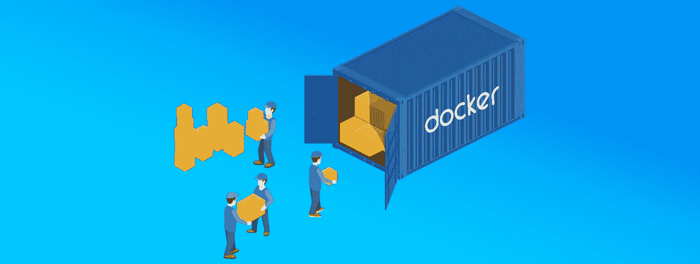

今天我们要看一个非常有趣的话题。在现代世界，人工智能在每个领域都扮演着重要的角色。比如说，零售业在传销中有着巨大的作用。像沃尔玛、亚马逊、Flipkart 这样的大巨头拥有关键功能，使产品能够被使用机器学习的客户很好地接触到。

这种东西怎么可能到达顾客手中呢？是的，这里有一个例子，如果 X 从 XYZ 品牌买了一件新衬衫。经过一个月的市场推广，新设计的新衬衫上市了。从门户网站了解到那些基于用户购买的推荐。这是一个使用机器学习实现的例子。为了让每个人都可以访问它，我们需要将模型部署在一个集中的地方。

**单独部署云有必要吗？**

从部署的角度来看，我们需要使用任何云服务，如 AWS，Azure，GCP。那么，这个应用程序看起来怎么样呢？我们直接从 Jupyter 笔记本上部署吗？这些都是部署的问题。我们需要通过管道输送产品。对于 ML 项目中的每项任务，都需要实现自动化。从数据集到保存预测结果。所以最终我们可以把它看作一个产品模型。这可以交付给许多使用任何云服务的客户。


考虑这个例子，如果这个家庭把房子搬到另一个地方。他们首先想到的是打包家庭用品。让我们考虑两种换档方式，

**单独包装:**考虑这里的情况，这里包装的物品分开放置。需要确保所有包裹项目都被移动到各自的搬运工。一旦一家人搬到另一个地方，这些事情就会发生‘嘿！“我忘了把我的私人物品放在哪里了，”，‘我把我的工作资料放在老房子里了’，‘终于！我用另一个把厨房的东西弄乱了。。如何避免那些情况，第二个场景帮你。

**集装箱:**考虑一下这里的情况，把包装好的东西放在一个单独的集装箱里。最后，我们终于知道哪些项目是错过了。在一天结束时，我们会很高兴地转移到另一个位置，并轻松地放置各自的项目。

考虑机器学习部署，产品需要部署在另一个客户位置。如果我们将单个文件转移到另一个云位置。某些文件可能会丢失。终于！客户报告说“为什么应用程序在一个地方可以工作，而在一个新的地方却不行？”此外，将会有大量的门票从客户端提出。为了解决这个问题，我们需要将应用程序容器化。这就出现了“Docker”实现的画面。

**Docker 是什么？**

Docker 是一个工具，旨在使使用容器创建、部署和运行应用程序变得更加容易。容器用于打包应用程序，所有依赖关系都集中在一个地方。

**架构**

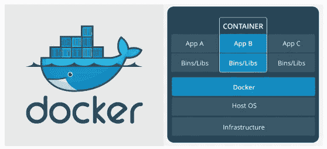

*   基础架构是用于托管多个虚拟机的物理服务器。
*   主机操作系统是基础机器，如 Linux 或 Windows。所以这一层保持不变。
*   现在是新一代的 Docker 引擎。这用于运行操作系统，该操作系统以前是作为 Docker 容器的虚拟机。
*   所有的应用程序现在都作为 Docker 容器运行。

**对接器安装**

对于操作系统的安装，需要遵循特定的步骤。

[](https://docs.docker.com/docker-for-windows/install/#system-requirements) [## 在 Windows 上安装 Docker 桌面

### 预计阅读时间:6 分钟欢迎来到 Docker 桌面 Windows 版。本页包含关于 Docker 的信息…

docs.docker.com](https://docs.docker.com/docker-for-windows/install/#system-requirements) 

如果操作系统是 Microsoft Windows 10 Professional 或 Enterprise 64 位或 Windows 10 Home 64 位，请访问以下链接并下载

 [## Windows Docker 桌面- Docker Hub

### 在 Windows 上开始使用 Docker 的最快和最简单的方法

hub.docker.com](https://hub.docker.com/editions/community/docker-ce-desktop-windows/) 

一旦安装完成，我们可以看到下面的屏幕将有容器，图像和开发环境。

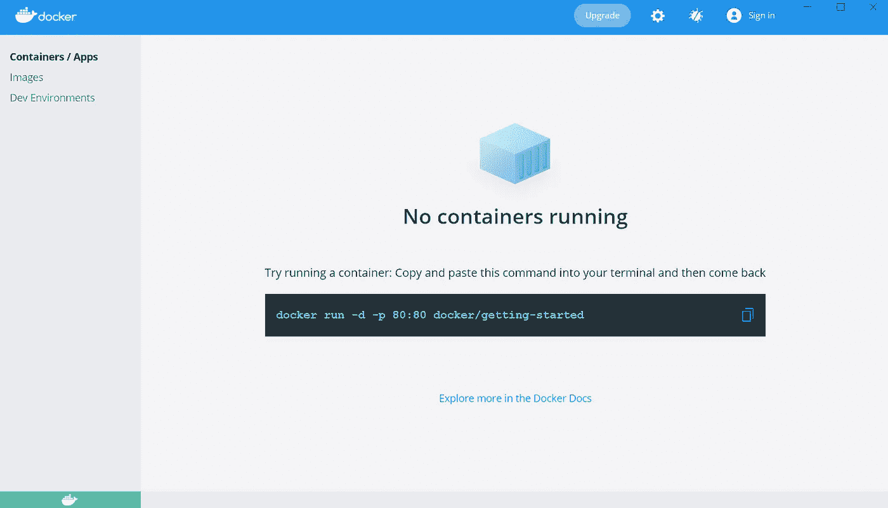

**Docker 文件的重要性**

如果应用程序需要 docker 化，需要为项目创建一个 docker 文件。让我们更深入地看看 docker 文件究竟是由什么组成的。

```
FROM

ENV

WORKDIR

ENTRYPOINT

CMD

COPY

ADD

RUN

EXPOSE
```

# 从

```
FROM <image> [AS <name>]
```

FROM 用于定义启动构建过程的基础映像。每个 Dockerfile 文件都必须以 FROM 指令开头。这背后的想法是，你需要一个起点来建立你的形象。

```
FROM ubuntu
```

这意味着我们的项目需要 ubuntu 作为父映像。

# 包封/包围（动词 envelop 的简写）

```
ENV <key> <value>
```

此命令用于设置运行项目所需的环境变量。

ENV 设置环境变量，这些变量可以在 Dockerfile 文件及其调用的任何脚本中使用。这些对于容器来说也是持久的，可以在任何时候被引用。

```
ENV HTTP_PORT="9000"
```

我们提供了 HTTP_PORT 作为环境变量。

# 工作方向

```
WORKDIR /path/to/workdir
```

**WORKDIR** 告诉 Docker 其余的命令将在映像中的`/app`文件夹的上下文中运行。

```
WORKDIR /app
```

它将在容器中创建 **app** 目录。

# 奔跑

跑步有两种形式:

*   `RUN <command>` ( *shell* 形式，命令在 shell 中运行，默认为 Linux 上的`/bin/sh -c`或 Windows 上的`cmd /S /C`
*   `RUN ["executable", "param1", "param2"]` ( *exec* 表单)

`RUN`指令将在当前图像之上的新层中执行任何命令，并提交结果。最终提交的图像将用于`Dockerfile`中的下一步。

**RUN**命令在构建时在容器内运行。

```
RUN /bin/bash -c 'source $HOME/.bashrc; echo $HOME'
```

# 入口点

入口点有两种形式:

*   `ENTRYPOINT ["executable", "param1", "param2"]` ( *执行*形式，首选)
*   `ENTRYPOINT command param1 param2` ( *外壳*形式)

一个`ENTRYPOINT`允许你配置一个作为可执行文件运行的容器。

ENTRYPOINT 设置容器运行时将首先执行的命令和参数。传递给`docker run <image>`的任何命令行参数都将被附加到 ENTRYPOINT 命令，并覆盖所有使用`CMD`指定的元素。例如，`docker run <image> bash`我们将把命令参数 **bash** 添加到 ENTRYPOINT 命令的末尾。

您可以使用`[docker run --entrypoint](https://docs.docker.com/engine/reference/run/#entrypoint-default-command-to-execute-at-runtime)`覆盖入口点指令

```
ENTRYPOINT [ "sh", "-c", "echo $HOME" ]
```

如果没有指定入口点，Docker 将使用/bin/sh -c 作为默认的执行器。

# 煤矿管理局

`CMD`指令有三种形式:

*   `CMD ["executable","param1","param2"]` ( *exec* 表单，这是首选表单)
*   `CMD ["param1","param2"]`(作为*入口点*的默认参数)
*   `CMD command param1 param2` ( *外壳*形式)

CMD 的主要目的是在执行容器时提供默认值。这些将在入口点之后执行。

在 Dockerfiles 中，您可以定义包含可执行文件的`CMD`默认值。

# 复制

复制有两种形式:

*   `COPY <src>... <dest>`
*   `COPY ["<src>",... "<dest>"]`(包含空格的路径需要此表单)

**COPY** 命令用于从源文件复制一个或多个本地文件或文件夹，并将它们添加到目标路径的容器的文件系统中。

它在层中构建图像，从父图像开始，使用`FROM`定义。Docker 指令 **WORKDIR** 为跟随其后的 **COPY** 指令定义了一个工作目录。

`<dest>`是一个绝对路径，或者是一个相对于`WORKDIR`的路径，源将被复制到目标容器中。

```
COPY test relativeDir/   # adds "test" to `WORKDIR`/relativeDir/
COPY test /absoluteDir/  # adds "test" to /absoluteDir/
```

# 注意缺陷障碍 (Attention Deficit Disorder)

添加有两种形式:

*   `ADD <src>... <dest>`
*   `ADD ["<src>",... "<dest>"]`

**ADD** 命令用于从源添加一个或多个本地文件或文件夹，并将它们添加到目标路径的容器的文件系统中。

它类似于复制命令，但有一些附加功能:

*   如果源文件是一个可识别压缩格式的 **local** **tar** 归档文件，那么它会作为一个目录自动解压缩到 Docker 映像中。
*   如果源文件是一个 URL，那么它将下载文件并将其复制到 Docker 映像中的目标位置。然而，Docker 不鼓励为此使用**添加**。

```
ADD rootfs.tar.xz /
ADD http://example.com/big.tar.xz /usr/src/things/
```

# 揭露

```
EXPOSE <port> [<port>/<protocol>...]
```

`EXPOSE`命令通知 Docker 容器在运行时监听指定的网络端口。您可以指定端口是侦听 TCP 还是 UDP，如果未指定协议，默认为 TCP。

但是 **EXPOSE 将不**允许通过定义的端口与同一网络之外的容器或主机进行通信。为了实现这一点，你需要*发布*端口。

**EXPOSE** 命令实际上并不发布端口。要在运行容器时实际发布端口，请使用`-p`标志`docker run`来发布和映射一个或多个端口，或者使用`-P`标志来发布所有公开的端口，并将它们映射到高阶端口。

**佐马托价格预测**

让我们看一个使用 docker 实现来预测餐馆 Zomato 价格的例子。

下面是为实现创建的 docker 文件。

```
#specify the parent base image which is the python version 3.7
FROM python:3.8

# This prevents Python from writing out pyc files
ENV PYTHONDONTWRITEBYTECODE 1
# This keeps Python from buffering stdin/stdout
ENV PYTHONUNBUFFERED 1

# install system dependencies
RUN apt-get update \
    && apt-get -y install gcc make \
    && rm -rf /var/lib/apt/lists/*

# install dependencies
RUN pip install --no-cache-dir --upgrade pip

# set work directory
WORKDIR /src/app

# copy requirements.txt
COPY ./requirements.txt /src/app/requirements.txt

# install project requirements
RUN pip install --no-cache-dir -r requirements.txt

# copy project
COPY . .

# Generate pikle file
#WORKDIR /src/app/ML_Model
#RUN python model.py

# set work directory
WORKDIR /src/app

# set app port
EXPOSE 8080

ENTRYPOINT [ "python" ]

# Run app.py when the container launches
CMD [ "app.py","run","--host","0.0.0.0"]
```

**码头工人确认**

要验证 docker 安装，请尝试在命令提示符下输入 docker-version

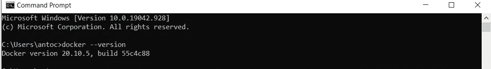

下一步是构建 docker 文件，如下所示。

**使用 Docker 文件构建**

打开命令提示符，将目录指向项目工作区，如下所示，

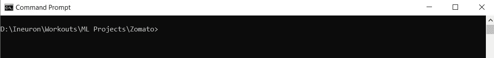

尝试使用“docker build -t <<name>>”命令一旦提供了命令，docker 就按照 DockerFile 实现生成构建。</name>

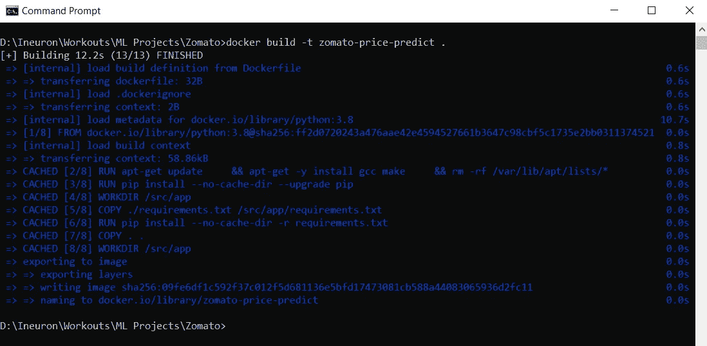

打开 docker 应用程序并导航到图像。验证创建的“zomato-price-predict”图像。

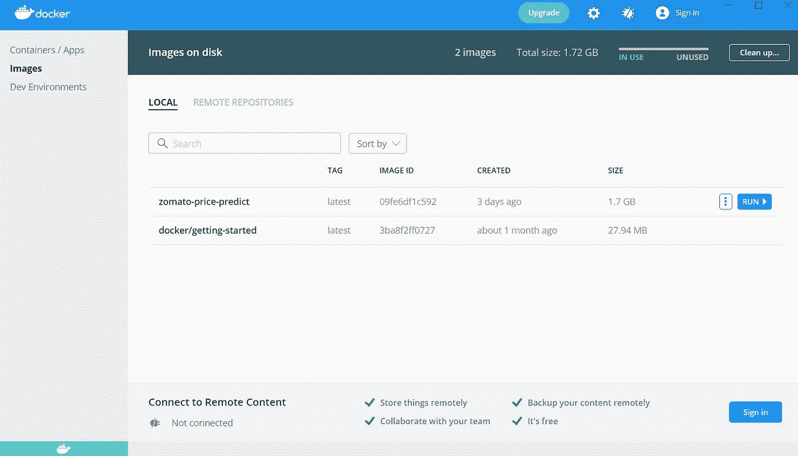

**运行 Docker**

尝试以下命令，该命令的名称代表对应用程序的引用。这将显示在 docker 容器部分。

```
docker run --name deployML -p 8080:8080 zomato-price-predict
```

执行命令后，应用程序正在运行。

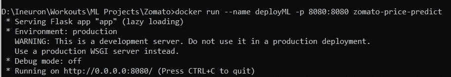

验证集装箱部分，如下所示:

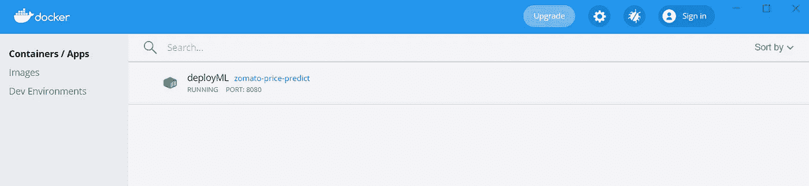

最后，我们可以看到应用程序正在运行

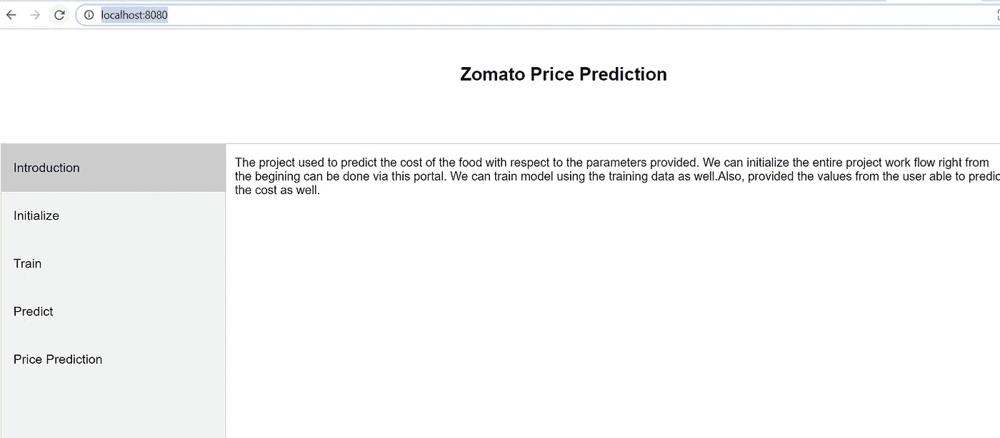

我们还可以看到应用程序日志。

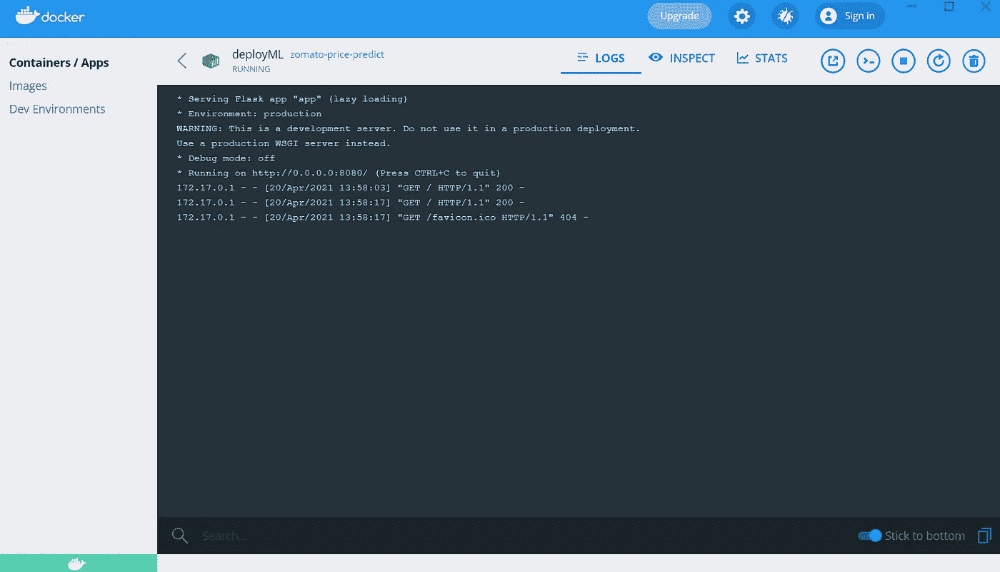

希望这篇文章给你一个在机器学习中实现 docker 的更好的想法。

希望你喜欢我的文章！！