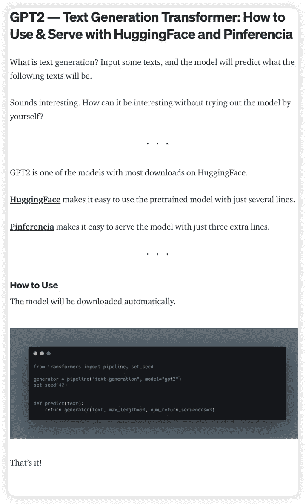
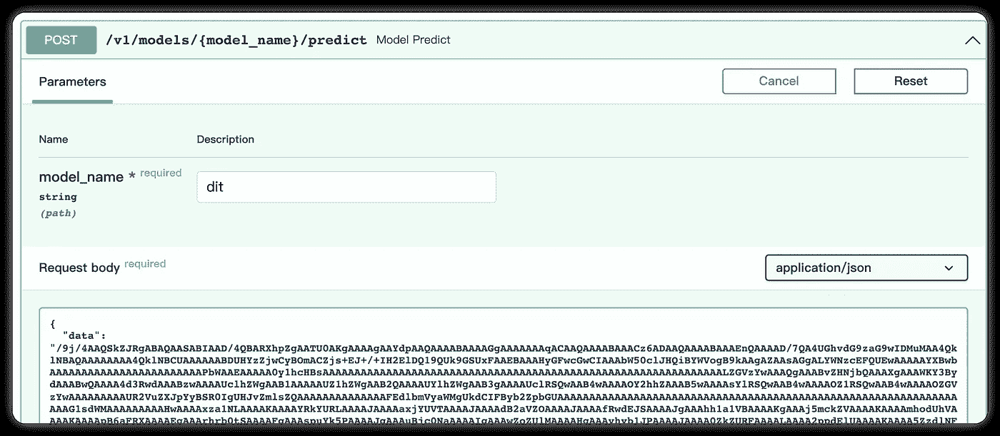
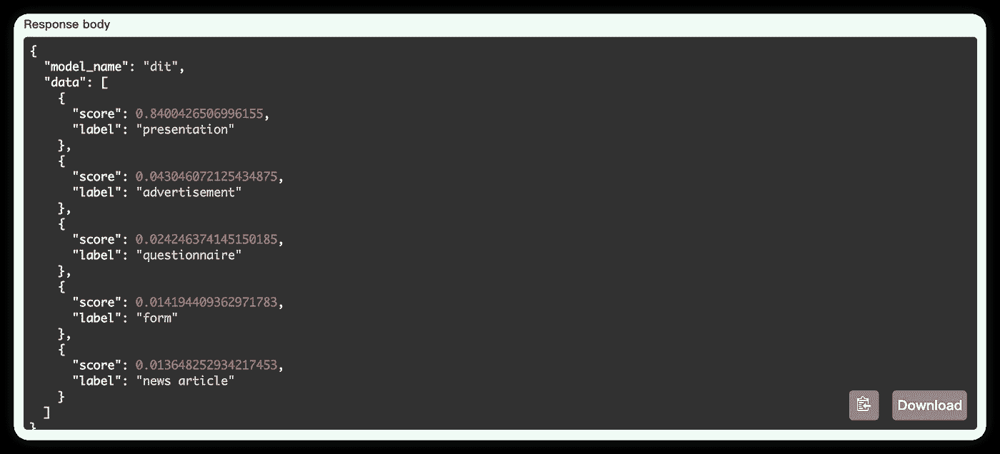

# 文档图像转换器:介绍、使用和部署

> 原文：<https://medium.com/mlearning-ai/document-image-transformer-introduction-usage-and-deployment-f8b007600b18?source=collection_archive---------5----------------------->

# 文档图像转换器

文档图像转换器(DiT)是一种转换器，它可以根据文档的图片对文档进行分类。

例如，您有一个如下所示的图像，将该图像提供给模型，模型将告诉您它是哪种类型的文档:



# 工具

我们将使用 huggingface 和 pinferencia

[**Pinferencia**](https://github.com/underneathall/pinferencia) 只需**三条**额外线路，即可轻松为任何模特服务。
[**hugging face**](https://huggingface.co/)只需几行就能轻松使用预先训练好的模型。

# 安装依赖项

## 拥抱脸

`pip install "transformers[pytorch]"`

如果不起作用，请访问[安装(huggingface.co)](https://huggingface.co/docs/transformers/installation)并检查他们的官方文件。

## 平费伦西亚

`pip install "pinferencia[uvicorn]"`

如果不行，请访问[Install—Pinferencia(under neat hall . app)](https://pinferencia.underneathall.app/install/)查看他们的官方文档。

# 模型的使用示例

```
import base64
from io import BytesIOfrom PIL import Image
from transformers import pipelineclassifier = pipeline(model="microsoft/dit-base-finetuned-rvlcdip")def classify(image_base64_str):
    image = Image.open(BytesIO(base64.b64decode(image_base64_str)))
    return classifier(images=image)
```

我们可以从: [Image to base64 converter 获取图像的 Base64 编码字符串，将图像转换为 Base64 字符串。(codebeautify.org)](https://codebeautify.org/image-to-base64-converter)

```
classify("/9j/4AAQSkZJRgABAQAASABIAAD/4QB...........")
```

输出是:

```
[{'score': 0.8400426506996155, 'label': 'presentation'},
 {'score': 0.043046072125434875, 'label': 'advertisement'},
 {'score': 0.024246374145150185, 'label': 'questionnaire'},
 {'score': 0.014194409362971783, 'label': 'form'},
 {'score': 0.013648252934217453, 'label': 'news article'}]
```

所以，它认为我们的图像很可能是一个演示。

# 部署模型

创建一个文件 app.py:

运行:

```
uvicorn app:service --reload
```

等待模型被下载。完成后，您会看到:


# 呼叫服务

你可以使用 T2 或者芬兰的 T3。

## 交互式 API 页面

打开你的浏览器，访问 [http://127.0.0.1:8000](http://127.0.0.1:8000) ，使用下面的 api 进行预测。



结果是



# 平费伦西亚

如果想了解更多关于 Pinferencia 的内容，请访问:[under neat hall/Pinferencia:Python+Inference—Python 中的模型部署库。史上最简单的模型推理服务器。(github.com)](https://github.com/underneathall/pinferencia)

[](/mlearning-ai/mlearning-ai-submission-suggestions-b51e2b130bfb) [## Mlearning.ai 提交建议

### 如何成为 Mlearning.ai 上的作家

medium.com](/mlearning-ai/mlearning-ai-submission-suggestions-b51e2b130bfb)