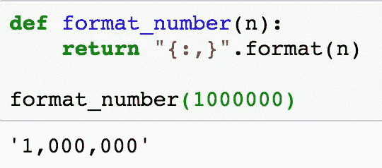

# 煮鸡蛋之前不要敲碎它！…以及其他数据方面的想法

> 原文：<https://medium.com/mlearning-ai/dont-crack-your-egg-before-you-boil-it-and-other-data-thoughts-a7fc8dd3b520?source=collection_archive---------11----------------------->

Photo by Annie Spratt via Unsplash

打破鸡蛋的方法不止一种。从生活的各个角度来看都是如此。不难相信，分析和编码也很适合这个领域。

为什么这是你应该考虑的事情？我的主要原因是提醒您，当解决业务问题或编写代码准备数据时，很可能不只有一条正确的路径可供您选择。这听起来可能有点吓人，但不应该如此。太刺激了！如果您是一名分析人员，您可能会非常喜欢移动小部件来查看结果的变化。

我们来看一个例题。问题表述为:写一个函数，以一个非负数为唯一参数，将数字转换为字符串，并添加逗号作为千位分隔符。例如，1000000 应返回“1，000，000”。你可能已经解决了这个问题。有一个非常简单的方法可以做到:

Photo by Author

这不是我想出来的。在以前的问题中，我在我的一个项目中使用了类似的代码。我想我没有格式化足够的数字来让这个概念坚持下去。我做了些更粗暴的事。成功了吗？该死的史基比！

说这不像第一段代码那么简单是一种保守的说法。有没有其他方法可以解决同样的问题？当然了。在上面的示例中，可以使用枚举来代替计数器。甚至可以不反转数字，仍然循环遍历每个字符，在需要的地方插入逗号:

Photo by Author

让我们重温一下这篇文章的主要焦点:打破鸡蛋的方法不止一种。那么，你什么时候打鸡蛋？听起来这取决于你要做的鸡蛋的类型和应该如何准备。

您所在的组织可能已经编写了业务规则，用于确定客户是什么，甚至定义交易。这听起来很疯狂，但像这些基本项目的规则是需要的。我不是告诉你去流氓，违背这些定义。我是说，在探索数据和诊断问题时，您可能需要在方法上有所创新。您可能需要以稍微不同的方式考虑客户或交易。发挥创造力，但仍然专注于主要问题，这是你将会看到重大收获的地方。

## 我不会过河的！

为了达到同样的结果，你需要走不同的路的另一个原因是什么？在第一个例子中，代码很短并给出了期望的结果。从 A 点到 B 点最快的方法是什么？一条直线。

Photo by GeoJango Maps vis Unsplash

当你在地图上画那条直线时会发生什么？你可能会遇到一条河，需要改变路线去寻找一座桥。你在商界会走弯路:‘我想让你搜集数据回答 _____，但你也需要考虑 _ _ _ _ _’。能够调整您的代码或过程以适应特殊的请求是非常重要的。倾听他人如何解决类似问题是很有用的，因为他们的想法可能对你以后试图解决的问题有所帮助。

## 给煎蛋卷添加一些配料

例如，您可能会被要求更新某个 SQL 查询，而其他人已经编写了该查询以包含一些新的数据。如果你不能理解代码以及如何加入新的表格/数据，你可能会得到一些疯狂的东西，比如净销售额显示了正常值的 400 倍。

修改别人的代码是另一个很好的例子，说明了为什么理解你正在处理的东西的基本块和移动这些块的能力是如此重要。分析师使用的工具在不断发展。一个功能被反复使用，有人会把它形式化。这是编码器的方式。只是不要依赖你需要别人创造的东西。想出一种方法，走你自己的路线，找到最终的解决方案。

## 寻找鸡蛋农场

事情变得有点奇怪。煎蛋卷里有一个煮鸡蛋，一张地图，还有太多的盐。

*   **学建:**复制粘贴有时候也管用。
*   **学会思考和改变:**有时候你想走的桥正在建设中。
*   **博采众长:**容易目光短浅。你周围的人知道令人惊奇的事情。
*   超越“我们/我一直是这样做的”:你买过灯泡吗？有很多选择，从根本上说，他们做同样的事情。每种类型都有自己的用途。
*   牢记大方向:把大问题分解成小问题是有帮助的。回到地图的例子，一旦找到了过河的桥，可能还需要再绕道。绕过那些弯路，但要时刻清楚最终目的地在哪里，这样你才不会开始倒退。
*   **解决问题！**