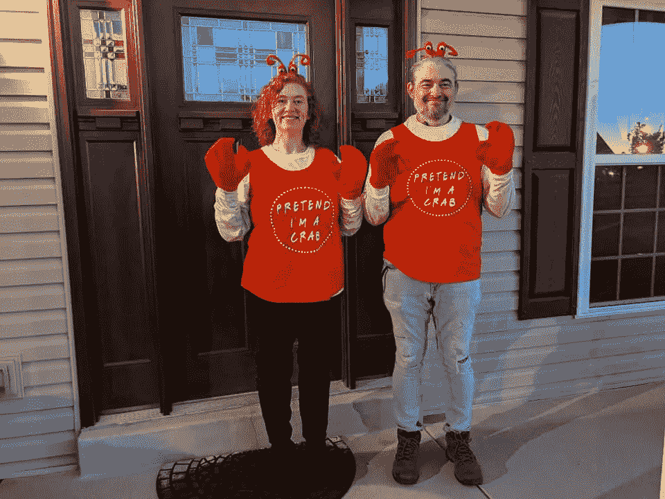
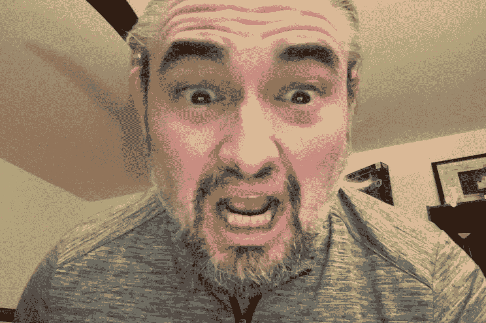
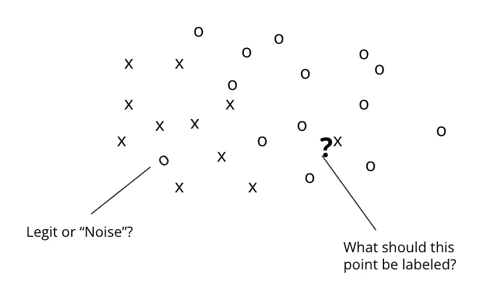

# 小声点！别让我过去！

> 原文：<https://medium.com/mlearning-ai/dont-make-me-come-over-there-440f7eece4f3?source=collection_archive---------3----------------------->

定义(和处理)噪声数据——万圣节风格！

快速问你一个问题:下面的图片包含一只螃蟹吗？

I’m completely safe unless someone pulls out some drawn butter, at which point, it’s been a great ride folks!

有很多方法可以看出什么是“正确的”答案，事实上，如果你有两个人在图像上贴上人工标签，“螃蟹”可能是你给这个图像贴上的标签之一。然而，这将是数据集中潜在“噪声”的一个很好的例子，它可能导致预测错误。

噪声可以被认为是导致不正确预测的数据中的错误或遗漏。例如，假设我们正在使用 k-最近邻算法，并且我们碰巧有包含两种图片的数据:螃蟹和人类。上图是数据集的一部分，已经被标注为“螃蟹”。现在，我们取另一个数据点，比如这张图:

IT’S HALLOWEEN AND I’M SCAAAAAAAAAARED!

我们的算法完全按照我们的预期运行，结果我们得到的与我们试图预测的图像最接近的图像是螃蟹的图像。那么预测是什么？

你可能还记得我们对 k-最近邻的介绍，这取决于你为 k 设置的值。让我们看一个直观的例子。在这个数据集中，我们用 X 表示螃蟹的图片，用 O 表示人类的图片。

It looks like a strategy board for Kindergarten football, don’t you think?

让我们从左边的图像开始，这个图像被标记为“人类”，并有一行询问它是“合法的还是‘噪音’？”你怎么想呢?如果是噪音，难道我们不应该把它从数据中剔除，让我们的预测更好吗？

要是这么简单就好了。

问题是我们实际上并不知道，仅仅基于上面的视觉，合法与噪音问题的答案。很可能有一张螃蟹的图片被贴错了标签，所以才会发出这种声音。或者这可能是一个人手臂上螃蟹纹身的图像，这是这个数据点的合法标签。同样，我们也不知道。除非你有时间检查数据中的每一点并验证它的准确性(不，你没有时间，也没有这方面的应用程序……)，否则你只能接受这样一个事实:几乎所有大规模的数据集都会包含标签错误的数据或输入错误的数据(例如，有人在某样东西的价格上省略或添加了一个数字，将报告的销售价格提高或降低了 10 倍)。)

有些人会试图通过简单地“删除数据中的异常值”来处理这种噪音。对于那些还记得著名的辛普森审判中一些流行细节的人来说:“如果数据不符合，你就删除它！”不幸的是，这通常是一个代价高昂的举措，因为数据错误并不是噪音的唯一来源。噪声还可能以数据集中未捕获的信息的形式出现，这些信息对预测有重大影响。例如，假设在你的数据中有许多房子每平方英尺的价格低得离谱，这实际上扭曲了你在该地区的房价数据。你决定删除离群值。后来，你知道那些房子在核废料堆放场附近，有污染该地区土壤/水/空气的危险，如果人们住在那里，他们会加速生病，等等。事实证明，这些数据点不是错误或异常值。它们是信号，表明附近地区出了严重的问题，而房价是合理的。

所以噪音很难处理。回到我们最初的问题:

Bobby, stop picking flowers and run with the football! Betty, stop trying to kill people on the other team! And would someone please bring me another juice box?

在我们的想象中，问号代表了我脸上的恐怖画面。呃，我惊恐脸的照片。与该测试图像最接近的数据点是 X(标记为 crab ),这是博文中的第一张图片。如果您还记得，k-Nearest Neighbors 计算从测试数据点到数据集中每个数据点的距离，然后找到 k 个最近的数据点。k 的值是数据科学家(或有抱负的数据科学家)在运行算法时设置的值。

因为我们已经为此创建了一个可视化，所以我们可以清楚地看到我们的测试数据点被 O 包围，所以如果我们有这个可视化的好处，我们显然希望预测这是一个 O，这意味着图像显然是一个人。然而，与我们的测试点最接近的图片是我穿着“假装我是一只螃蟹”服装的另一张照片。因此，如果我们将 k 值设置为 1，算法会错误地将我惊恐的脸解释为“螃蟹”

这就是为什么当我们运行最近邻算法时，我们通常不会将 k 设置为 1。我们希望将其设置为更高的值，这样，如果我们的数据点恰好落在将被归类为噪声的数据点旁边，这将通过下几个可能被正确标记的最近邻点得到缓解。因此，如果我们将 k 设置为 3 或 5，投票将是 2 或 4 个 O，只有 1 个 X，因此人类的标签将是(正确吗？)应用。

另一方面，这也可能走得太远。如果将 k 设置得太大，还会根据数据的形状产生问题，因此查找“金发女孩 k 值”(不要太小也不要太大，从而以最高的准确度返回正确预测的标注)是将最近邻类型算法投入生产的过程的一部分。

一句话:噪音可能意味着错误的标签、数据中的错误或数据中没有捕捉到的对预测有重大影响的因素。这是一个几乎不可避免的问题，因此假设它存在并找到减轻它的方法是构建预测模型时的一个重要目标。

 [## Mlearning.ai 提交建议

### 如何成为 Mlearning.ai 上的作家

medium.com](/mlearning-ai/mlearning-ai-submission-suggestions-b51e2b130bfb)