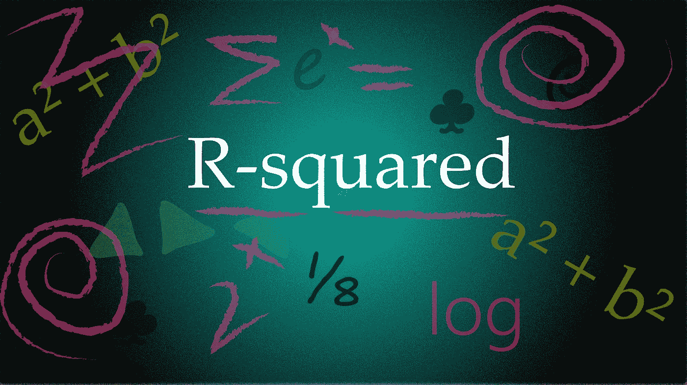

# 不要误用 R 平方(R)值

> 原文：<https://medium.com/mlearning-ai/dont-misuse-r-squared-r%C2%B2-value-6beecf123ce9?source=collection_archive---------5----------------------->

r 是一个广泛使用的标准，用来衡量线性回归中估计参数的准确性。r 的定义也是数据科学面试过程中经常被问到的问题。决定系数(r)是统计学中最常被误用的概念之一。这篇文章列出了关于 r 值的误解。

Source: Image by the author

> **r 对异常值敏感**