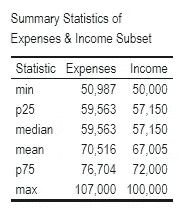
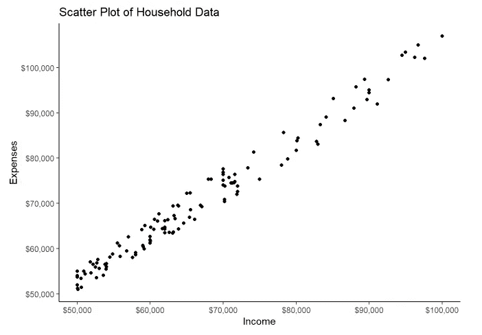
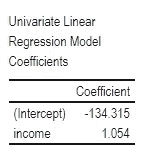

# 不要告诉任何人，一般来说，连续自变量的线性回归很容易理解

> 原文：<https://medium.com/mlearning-ai/dont-tell-anyone-but-linear-regressions-with-continous-independent-variables-are-on-average-d39ad5622efb?source=collection_archive---------5----------------------->

在之前的一篇文章中，[了解线性回归是如此简单，一个经理也能做到](/mlearning-ai/understanding-linear-regression-is-so-simple-a-manager-could-do-it-b8df36f9dc8c)，我描述了如何使用二元(0，1)变量的线性回归模型来按组寻找因变量的平均值。这篇文章将解释如何解释相似的模型，这些模型用连续变量代替二元独立变量。

对于这一讨论，考虑家庭收入(自变量)如何影响家庭支出(因变量)。我们假设家庭根据他们的预期收入决定他们将花费多少(即使一些家庭可以花费超过他们的收入)。相反，我们假设家庭的收入不是基于他们选择花费的多少。这种情况有时会发生，但我们认为这种情况发生的频率还不足以让我们对模型设计感到担忧。

理论上，我们可以使用二元方法来衡量支出，将每一美元的收入编码为二项式值。可以把这个过程想象成生成一个包含数千列的 Excel 电子表格，每一个独特的收入水平作为自己的一列。当有相应的支出时，这些列的值为“1”，当没有支出时，这些列的值为“0”。虽然理论上可行，但这种模式在实践中会产生很差的结果。几乎所有列都只包含几个“1 ”,这将导致大多数估计不可靠。即使有这么多独立变量，也会有许多美元价值没有信息来评估。

# 使用连续变量的好处

具有连续变量的线性回归模型允许我们克服这些问题，因为它使用所有现有数据来估计任何收入水平的家庭支出。我们可以考虑使用我们将要开发的模型来“填补空白”,以弥补缺失的收入或给出不可靠的结果。

# 了解连续数据，如家庭支出和收入

**在继续之前，在试图解释模型结果之前，理解数据的局限性是很重要的！**从汇总统计表中，请注意我将家庭收入限制在 50，000 美元到 100，000 美元之间。我也只选择了支出在收入的+-5%以内的家庭。这些限制使我们在全套调查的 9420 个家庭中只调查了 118 个家庭。下面的调查数据图表显示了支出和收入数据中的“漏洞”。它还显示了两个值之间的强线性关系。对数据的这些限制允许对线性模型结果的直接理解。

*注:所使用的数据是满足线性回归模型所需假设的原始数据的精选子集(参见*[*【https://www.statology.org/linear-regression-assumptions/】*](https://www.statology.org/linear-regression-assumptions/)*)。在这篇文章中，我不会深入讨论这些假设的细节，我只想说，在对一个完整的数据集进行建模时，这些假设往往无法实现。因为我选择子集是为了理解如何解释简单的线性回归模型，所以它不是整个数据集的可靠估计量。*

# 一个简单的单变量线性回归模型:家庭支出和收入

让我们看看来自上述数据子集的简单单变量模型结果:

我们可以类似于前一篇文章的二元模型来解释模型系数，但有一个重要的区别:因变量不必是 0 或 1 值。相反，我们将因变量视为连续变量，这使得它可以采用任何收入值。当前模型的简单单变量线性回归公式为:

其可以扩展到

模型的常数值代表自变量为 0 时估计的因变量值。因此，没有收入的家庭估计家庭支出为-134 美元。由于我将数据局限于收入在 5 万至 10 万美元之间的家庭，当收入超出这个范围时，该模型可能无法准确预测家庭支出。即使没有收入的家庭也可能会报告一些支出是由家庭储蓄、政府福利等支付的。β(收入)系数 1.05 告诉我们，平均而言，家庭收入每增加 1.00 美元，家庭支出就会增加 1.05 美元。请注意，该系数也仅适用于上述我们的数据限制。

# 可视化模型

在下面的图表中，黑点是为该模型选择的家庭子集的个人调查答复，如上面的模型所示。同样，有几个家庭收入和支出对不存在于由点与点之间的差距表示的数据中，并且有许多收入水平只有一个观察值。

用蓝线表示的线性回归模型允许我们 ***估算*** 任何收入水平的家庭支出。与我们将数据集中的每一笔收入都视为二项式数据点相比，这为我们提供了更多关于家庭的信息。

图表上的红线显示了实际数据对和模型估计值之间的距离。只要我们的数据满足线性回归模型所需的假设，线性回归算法就会最小化这些距离的总和。当这些假设得到满足时，模型系数生成给定家庭收入的家庭支出的最准确的**线性**估计。除了蓝线以外的斜率和/或截距值的任何组合都会产生不如线性回归模型精确的估计值。在统计学术语中，该模型是给定家庭收入的家庭支出的***【BLU】***最佳线性无偏估计量。

# 从平均值的角度理解模型

使用连续因变量的模型类似于为每个收入水平创建一个二元变量，并计算每个收入水平的平均值。将家庭收入作为一个连续变量而不是一系列二元变量的区别在于，具有连续因变量的线性回归模型导出了每个收入水平的 ***估计值*** 。这就是为什么在描述家庭收入为 75，000 美元的模型结果时，我们会将其描述为“*收入为 75，000 美元的家庭平均拥有***，*78，616 美元的家庭支出”。*

*概括地说，虽然具有独立二项式变量的线性回归模型可用于按组查找因变量的平均值，但具有连续因变量的模型可用于估计因变量的每个级别的因变量的平均值。因此，当使用二元或连续自变量对线性回归建模时，算法仍然基于定义因变量的平均值。*

* [## Mlearning.ai 提交建议

### 如何成为 Mlearning.ai 上的作家

medium.com](/mlearning-ai/mlearning-ai-submission-suggestions-b51e2b130bfb)*