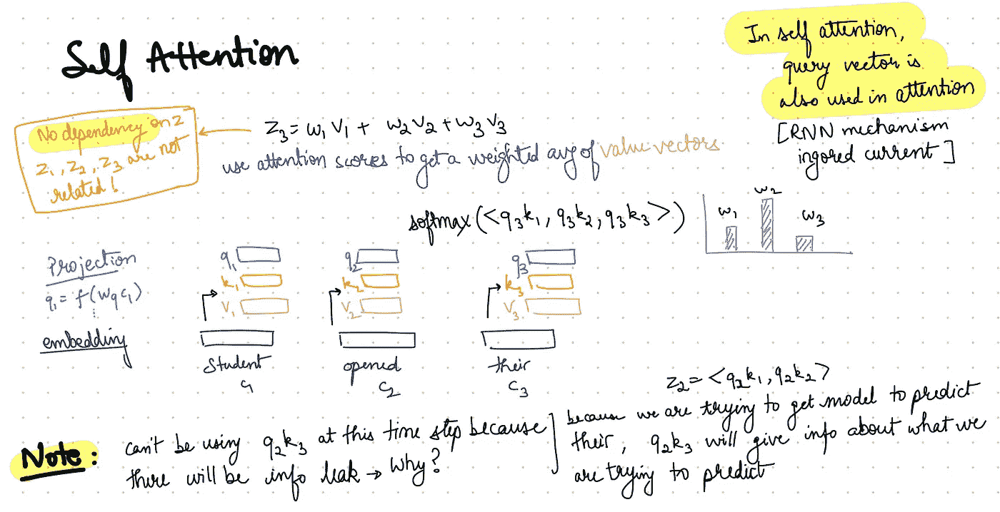
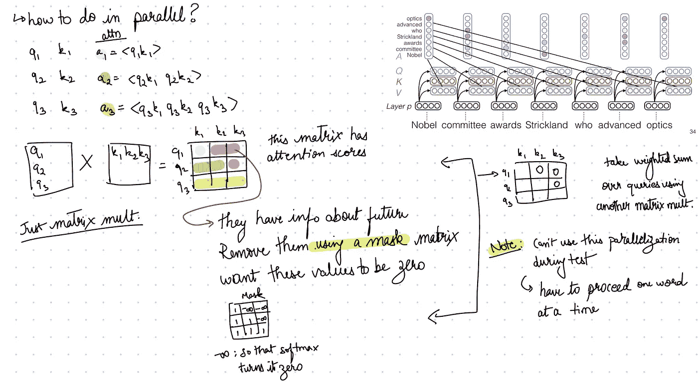
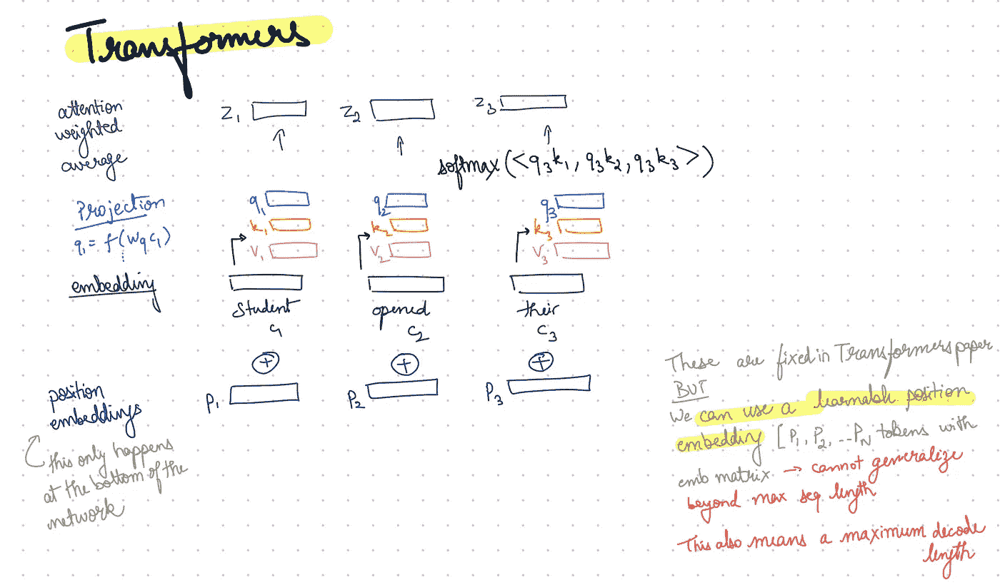
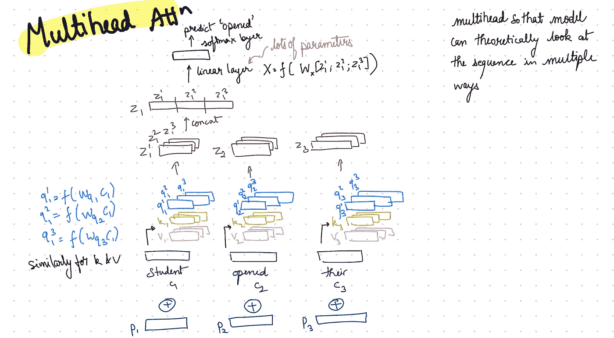
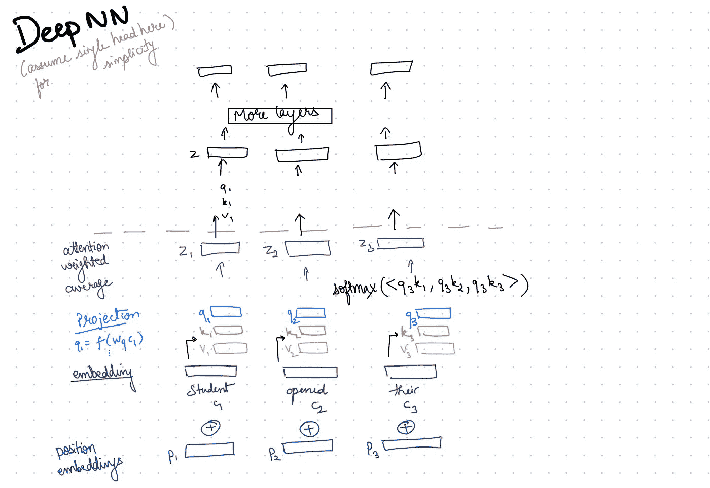
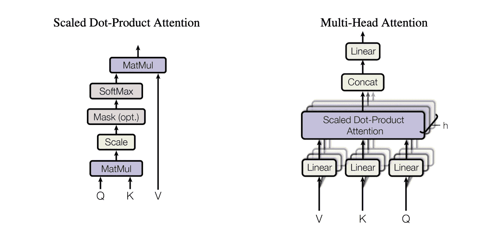

# 涂鸦人工智能:注意力是你所需要的

> 原文：<https://medium.com/mlearning-ai/doodling-ai-attention-is-all-you-need-8fc4fa4343d?source=collection_archive---------3----------------------->

我对我觉得有趣的 ML/AI 主题做了一个温和的概述。

今天的涂鸦是我从[莫希特·伊耶](https://people.cs.umass.edu/~miyyer/)教授的[高级自然语言处理](https://people.cs.umass.edu/~miyyer/cs685/index.html)讲座([视频](https://youtu.be/YaYELBT9Z0I))中得到的笔记。本文简要介绍了谷歌开创性论文中介绍的**变压器自我关注机制**—[关注是你所需要的全部](https://arxiv.org/abs/1706.03762)。

*请注意，这不是一篇详尽的综述，为了简单起见，本文省略了一些技术细节。详情请参考* [*论文*](https://arxiv.org/abs/1706.03762) *(或本惊人* [*博客*](https://jalammar.github.io/illustrated-transformer/) *)。*

**自我关注** 下面是对自我关注的简化描述。 *q3* 负责所有之前的嵌入。注意力权重用于创建值向量 *z3* 。

Self Attention

**注意并行** 我们可以把自我注意中的每一个操作表示为一个高度并行的矩阵操作。

Self-Attention and Masking. The image on top right is by Emma Strubell and taken from lecture slides.

介绍**位置嵌入
为什么？与 RNN 不同，变形金刚不知道任何记号在给定序列中的位置。此信息必须单独提供。**

Position embeddings in Transformers

**多头注意力** 另一个重要的创新是多头注意力将不同空间的向量独立投射到他们身上。

Multi-head attention in Transformers

**深层变压器神经网络** 直到现在，我们描述的只是单层变压器。要添加更多层，只需堆叠它们。每一层的输出都作为下一层的输入。下图显示了具有单个头的深度网络，但是相同的概念可以扩展到具有多个头的深度网络。

Deep Transformer NN

仅此而已。这就结束了我们对变形金刚中自我关注的概述。感谢阅读！

# 摘要

在这篇文章中，我只讲述了变形金刚的自我关注机制，如下图所示。

Image obtained from original Transformers [paper](https://arxiv.org/abs/1706.03762)

***注意*** *:查询-键矩阵相乘后的缩放很重要，避免权重过大。这可确保权重的 softmax 规格化不会将权重推向低梯度区域。*

接下来是变压器的实际编码器和解码器模块，将在另一篇文章中讨论。

*其他涂鸦 AI 帖子:* [涂鸦 AI:男人对于电脑程序员就像女人对于家庭主妇](https://shan101.medium.com/doodling-ai-man-is-to-computer-programmer-as-woman-is-to-homemaker-ce5e3e2cdf2e)？
[涂鸦 AI:乌鸦对挑战](https://shan101.medium.com/doodling-ai-crows-pairs-challenge-4c5d00c3f581)