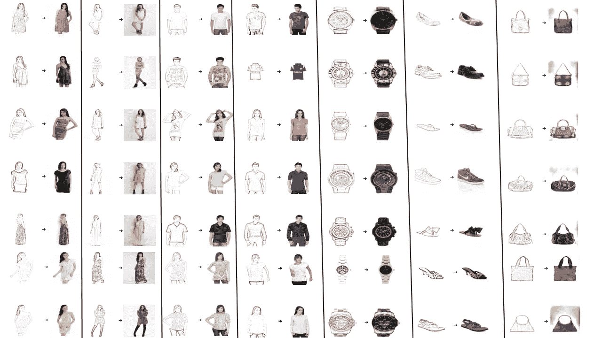

# 绘制欲望:使用深度学习将草图带入生活

> 原文：<https://medium.com/mlearning-ai/draw-the-desire-bringing-the-sketches-to-life-using-deep-learning-4a611b833738?source=collection_archive---------3----------------------->

在本文中，您将了解条件性 GAN(生成性对抗网络),并能够从头开始构建一个。之后，您将能够在时尚产品数据集上应用 cGAN 模型，将产品草图转换为彩色图像。如果你想了解什么是 GANs [1],你可以查看我们之前关于潜在空间的教程。

Figure 1: An example output of the GAN network trained on Fashion Products