# 使用 R 绘制多元正态分布的观察值

> 原文：<https://medium.com/mlearning-ai/drawing-and-plotting-observations-from-a-multivariate-normal-distribution-using-r-4c2b2f64e1a3?source=collection_archive---------1----------------------->

大多数人熟悉的第一个分布是正态分布，即高斯分布。这是有意义的，因为世界上的许多过程都可以用正态分布来近似，如果它们不能，那么它们肯定可以通过[中心极限定理](https://en.wikipedia.org/wiki/Central_limit_theorem)来近似。

正态分布如此吸引人的另一个方面是它由两个独立估计的参数组成——均值和方差。它们不是真正独立的，因为较大的平均值通常会导致较大的方差，但它们很容易构思和估计。

我已经发布了很多关于[混合模型](/@marc.jacobs012/introduction-to-mixed-models-in-r-9c017fd83a63)的内容，混合模型的一个关键部分是[方差-协方差矩阵](https://en.wikipedia.org/wiki/Covariance_matrix)，它被引入模型的随机部分。方差-协方差听起来令人印象深刻，但实际上并不新鲜，因为你们大多数人很早就已经了解了它最著名的变换——相关性。相关矩阵是缩放的方差-协方差矩阵。

如果你没记错的话，你知道相关性是两个或更多变量之间的关联，范围从-1 到 1，0 表示没有任何关联。因为变量不能与自身相关，所以这里的值为 0。所有这些使得相关矩阵非常吸引人，但是对于大多数算法来说，它一点帮助都没有。他们更喜欢方差-协方差矩阵。

多元正态分布是用方差-协方差矩阵来描述一组变量之间关系的正态分布。潜在的假设是每个变量都遵循正态分布&任何两个变量的组合也遵循正态分布。

在这个介绍性示例中，我将向您展示如何使用方差-协方差矩阵来创建多元正态分布，以及如何测试您是否真正拥有多元正态分布

Import the necessary libraries. Both MASS and mvtnorm can product multivariate normal observations

该分布最重要的部分是方差-协方差矩阵，这里描述为适马。在左下方的图中，您可以看到变量 1 和 2 的方差分别为 10 和 2。他们的协方差是 3。因此，变量 2 的值依赖于变量 1，反之亦然。

To create a multi-normal distribution, you need a mean (0), and variance-covariance matrix (Sigma)

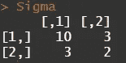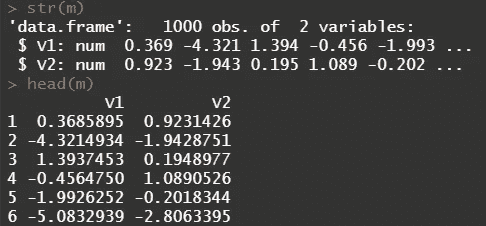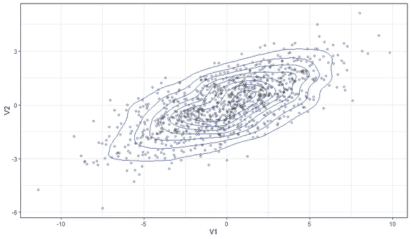

Left: the variance-covariance matrix. Middle is the dataset created by the MASS package based on the input. Right you will find a plot of what you produced.

[MVN 包](https://cran.r-project.org/web/packages/MVN/MVN.pdf)提供了一些很好的工具来测试你的数据集是否真正包含服从多元正态分布的数据。直方图，QQ，盒，散点图可以要求。还有多种测试可用于查看变量是单变量还是多变量正态分布。

Code is straightforward.

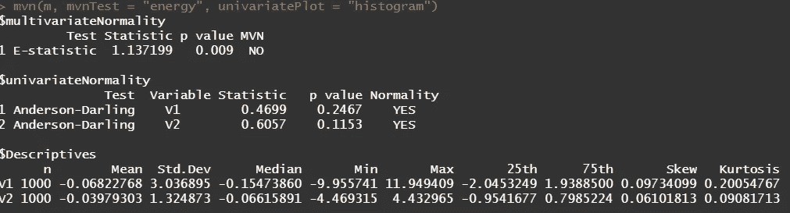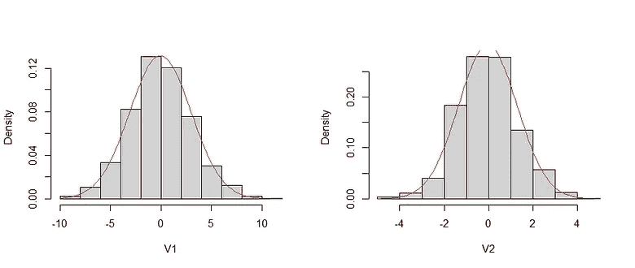

I requested a bootstrapped test, showing that the dataset is NOT multivariate normal, although both variables separately are normally distributed.

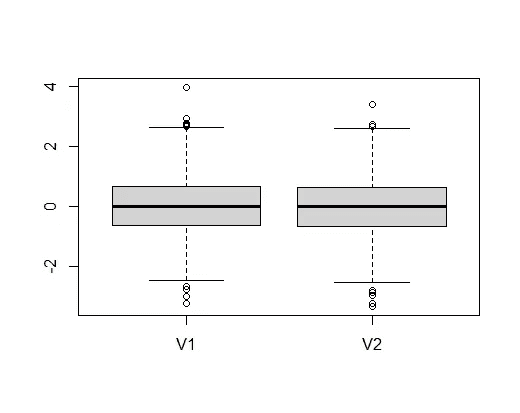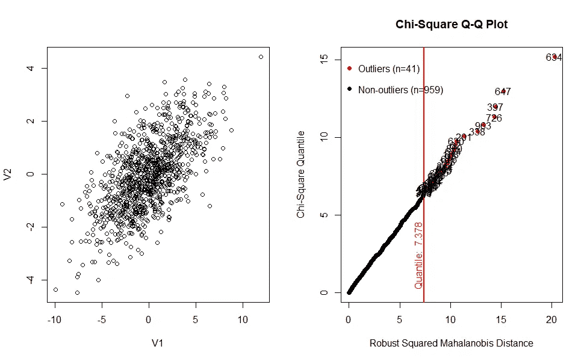

Boxplot shows nothing strange, but the scatterplot does. The correlation is too much. In an Multivariate Normal distribution, you do not expect observations to show a slope. I do not see outliers that worry me.

第二个例子，使用来自 [mvtnorm](https://cran.r-project.org/web/packages/mvtnorm/mvtnorm.pdf) 包的 rmvnorm 函数。

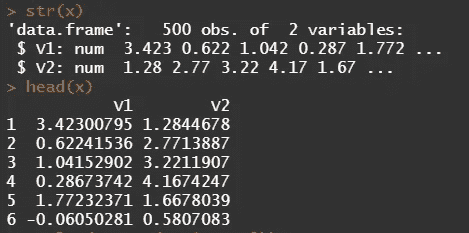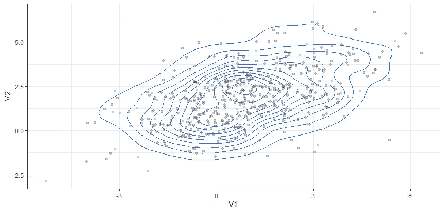

现在，让我们通过创建一个七变量方差-协方差矩阵来让事情变得更令人兴奋。你在下面看到的矩阵是通过一位科学家提供给我的。所以，最难的部分其实已经完成了。记住方差永远不会低于零，但是协方差可以是负的。

Create dataframe based on zero means and variance-covariance matrix. Then request assessments of univariate/multivariate normality and outliers.

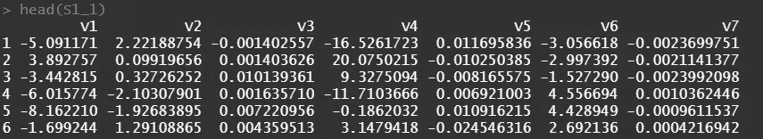

Observations coming from the Multivariate Normal distribution.

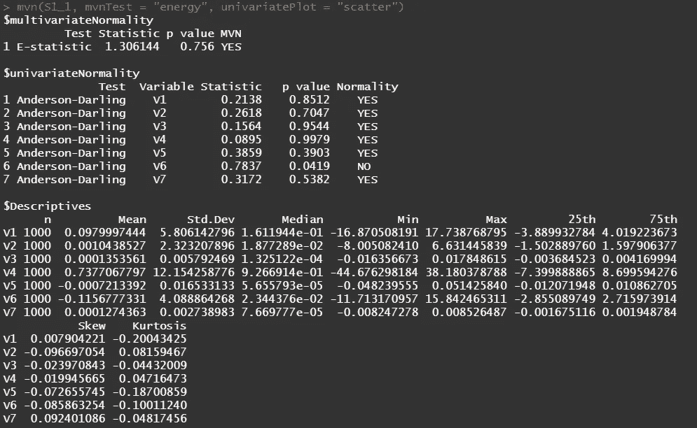

Test statistic shows that only variable 6 does not fit the specific for Normality, but that as a group it is Multivariate Normal.

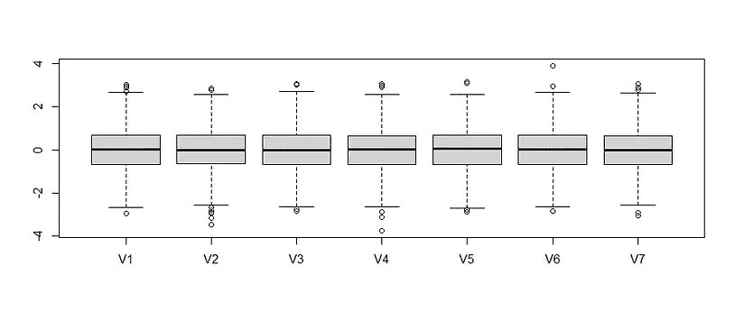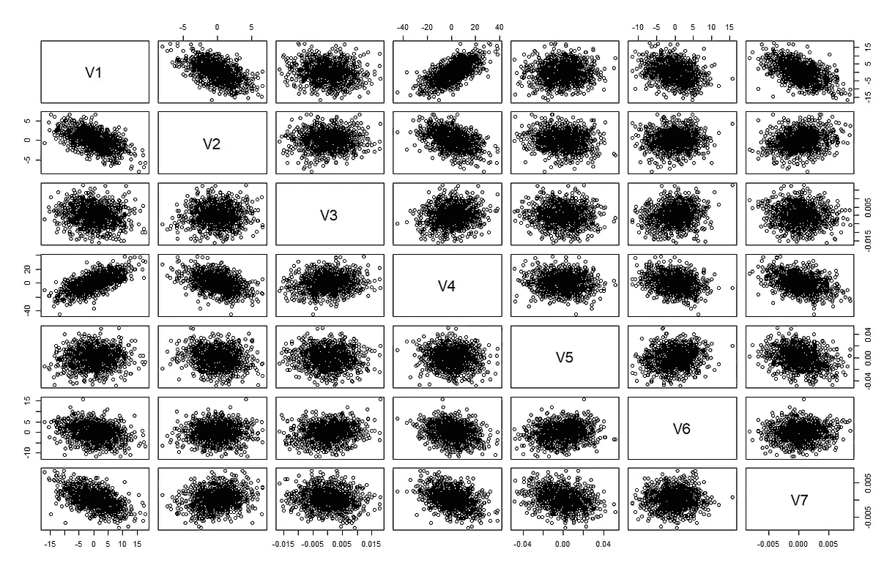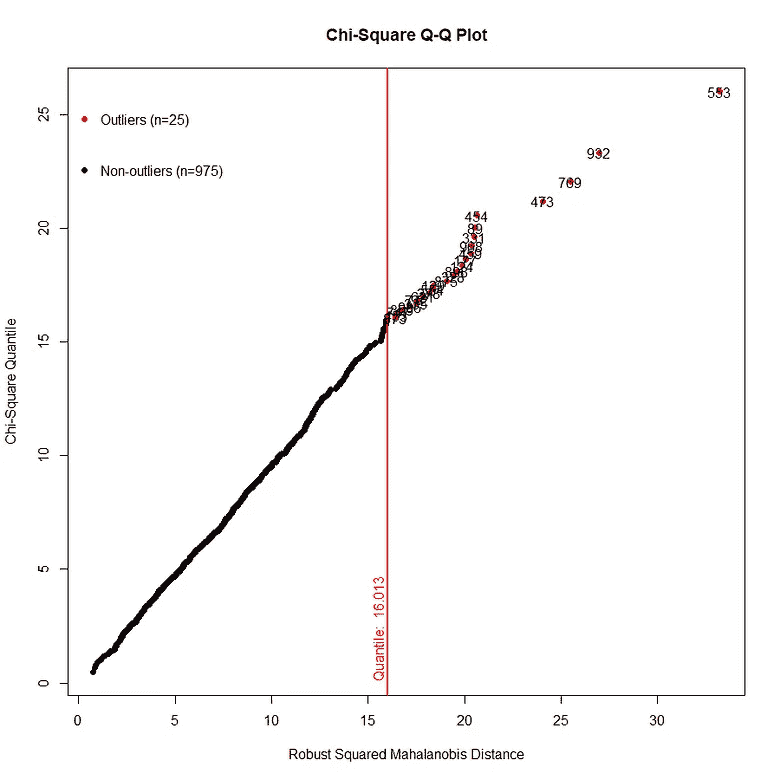

Plots confirm this.

现在，让我们进入最有趣的部分——绘制数据集中所有变量之间的关系，以及特定的组合。

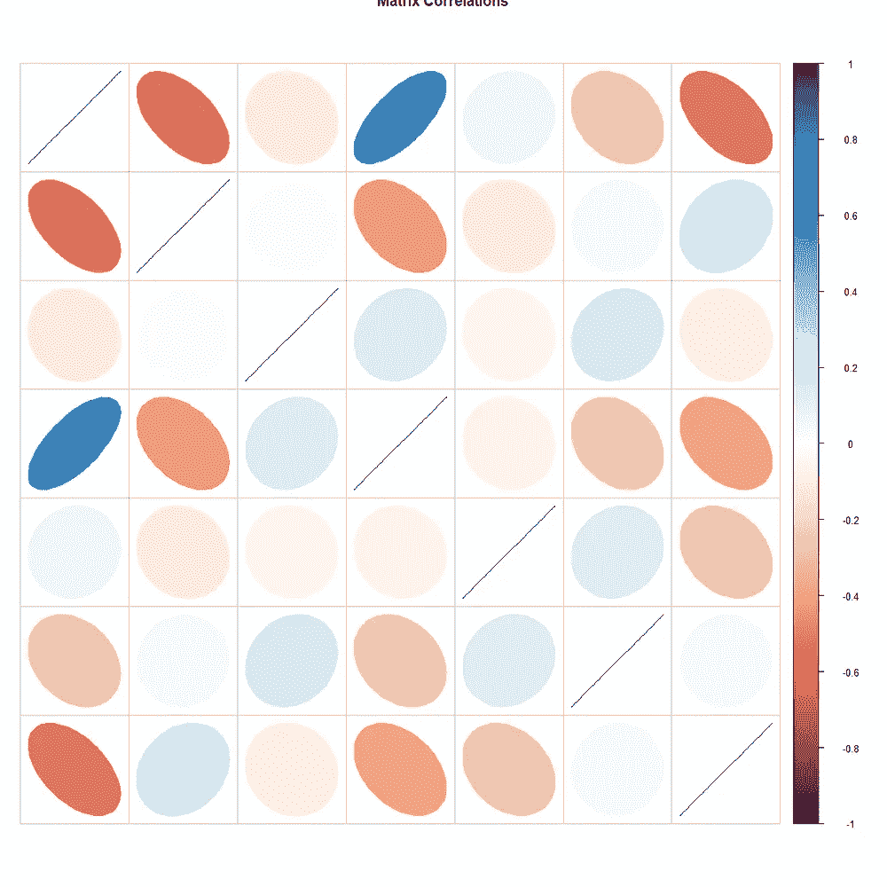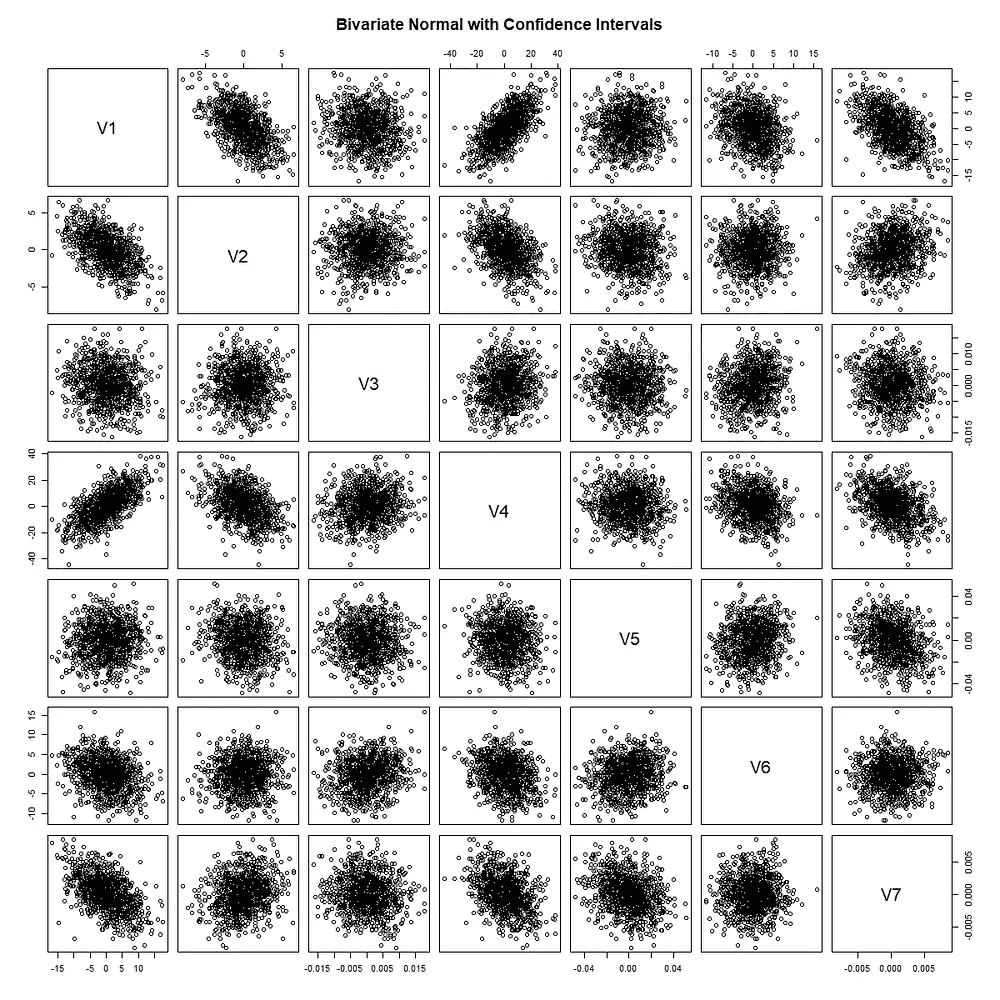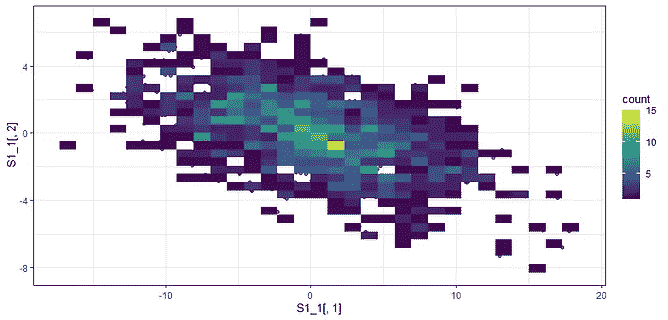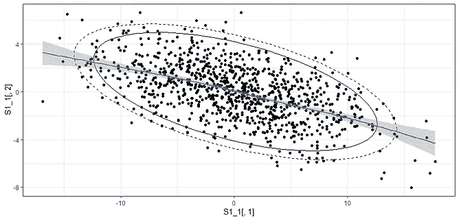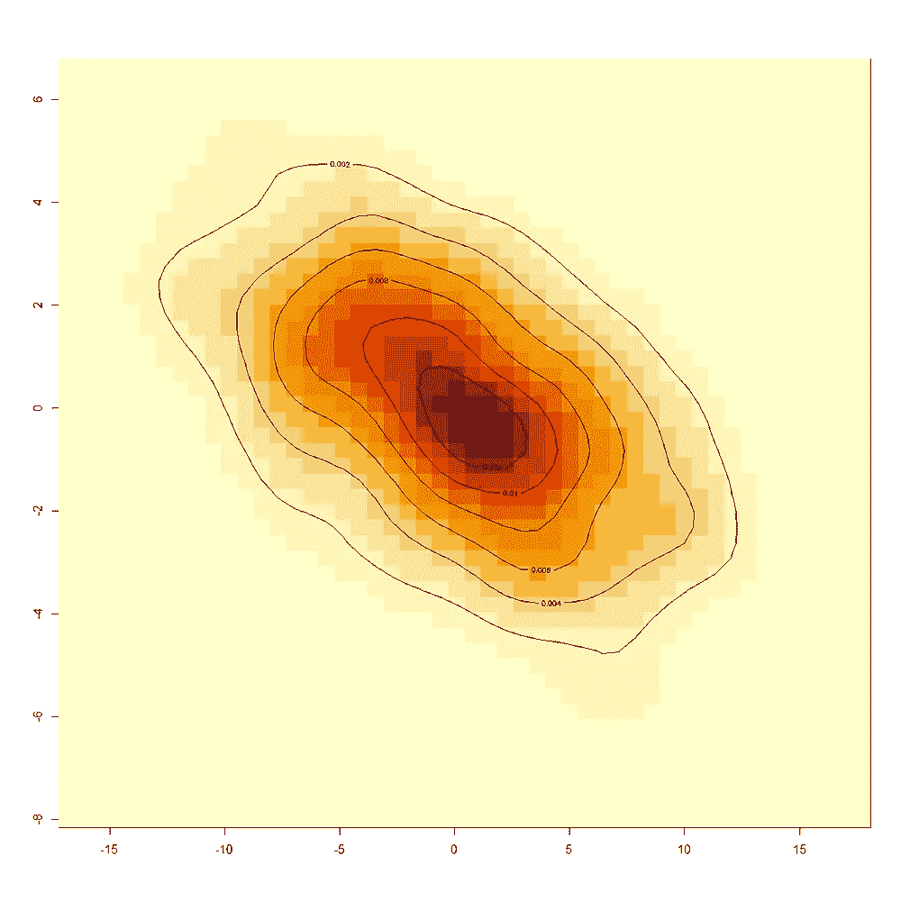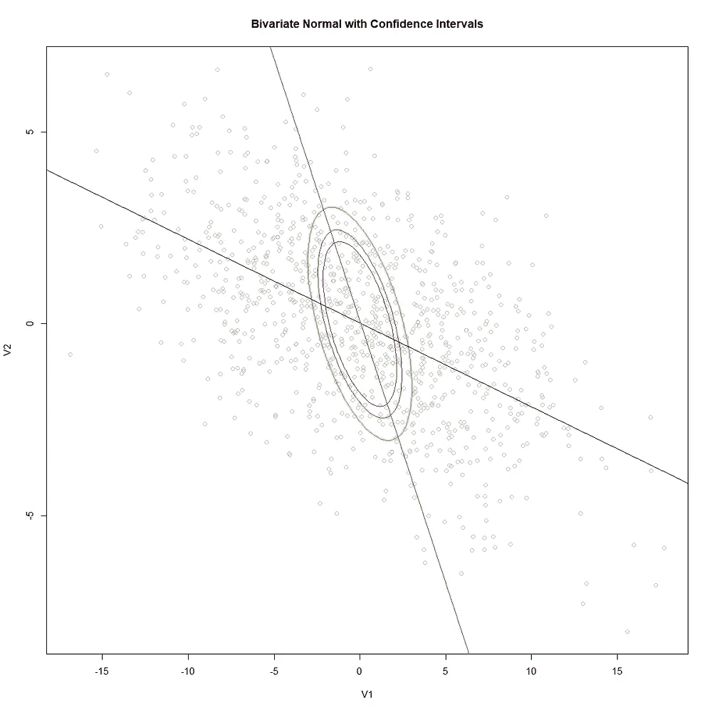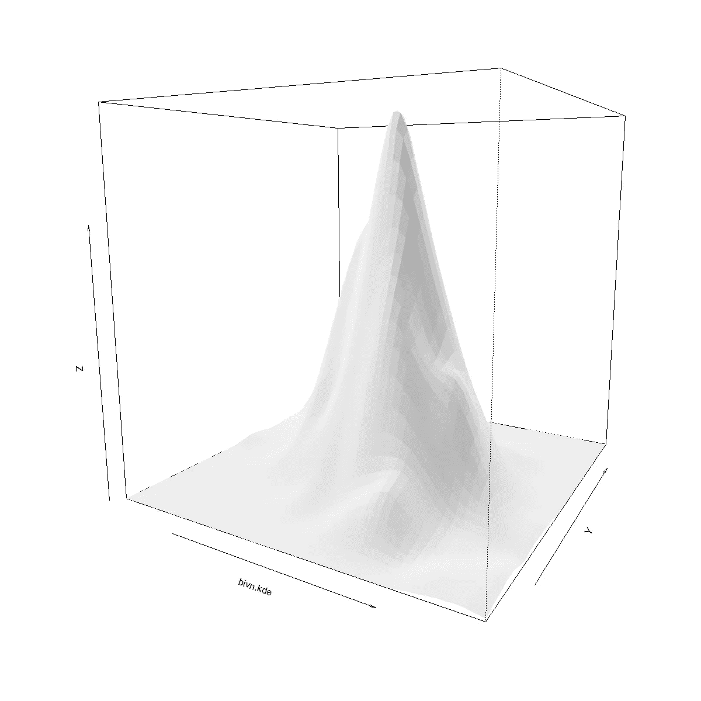

本质上，多元正态分布没什么可怕的。它只是一个正态分布与一个正态分布配对，从而产生一个多元分布，因为这两个变量不是独立的。生活中的许多变量都不是独立的，所以习惯这一点是有好处的。

 [## Mlearning.ai 提交建议

### 如何成为 Mlearning.ai 上的作家

medium.com](/mlearning-ai/mlearning-ai-submission-suggestions-b51e2b130bfb)