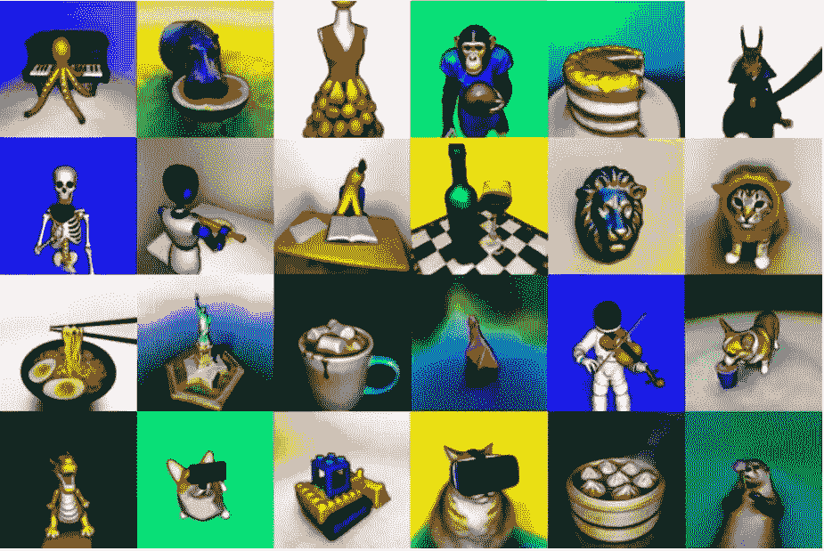
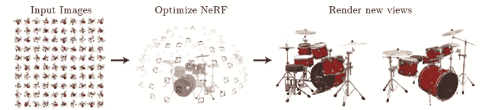
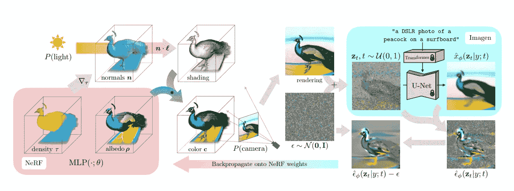
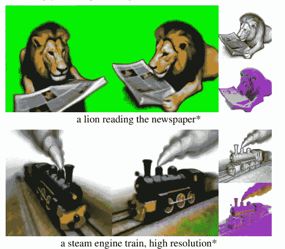

# DreamFusion:来自文本的 3D 模型

> 原文：<https://medium.com/mlearning-ai/dreamfusion-3d-models-from-text-561e8268a24c?source=collection_archive---------1----------------------->

一个新的谷歌扩散模型，允许从文本中获得 3D 图像。

image source: [here](https://dreamfusion3d.github.io/)

获得 3D 图像并不容易。事实上，正如作者所写的那样，有很多 2D 图像，而 3D 图像要少得多。所以很难收集到好的数据集。现在，谷歌和加州大学伯克利分校研究训练的一种新模型可以从文本中生成 3D 图像。让我们一起去发现它。

the first author announcing the model

另一方面，到目前为止，我们已经看到了能够从文本生成真实图像的模型([稳定扩散](https://arxiv.org/abs/2112.10752)，DALL-E，等等)。这表明扩散模型能够从文本描述中生成图像。那么为什么不从 2D 步骤开始，然后将图像转换成 3D 呢？

模型由两部分组成: [NERF](https://arxiv.org/abs/2003.08934) 和 [Imagen](https://arxiv.org/abs/2205.11487) 模型。简而言之，NERF 是一种用于通过从一个或多个对象的图像生成神经辐射场来渲染 3D 场景的模型。NERF 使用一组稀疏的输入来优化体积图像(而不是连续的)。从一组静态图像开始，这些图像覆盖了对象的各个角度，模型创建了一个 3D 表示。这种方法基本上不试图生成 3d 图像，而是从相机可能覆盖的所有可能角度创建图像。

Image Source: [*NeRF Paper (Mildenhall1, Srinivasan1, Tancik, et. al)*](https://arxiv.org/pdf/2003.08934.pdf)*. link to the project:* [*here*](https://www.matthewtancik.com/nerf)

然后，想法是采用已经用文本标题和图像训练的模型，该模型因此学习如何从文本提示图像生成([扩散模型](https://theaisummer.com/diffusion-models/))。扩散模型是 Imagen 一个类似于稳定扩散但由 Google 制作的模型(该模型不是开源的)。然后，该图像被转换成 3D 图像(NERF 组件)。

from the [original article](https://arxiv.org/pdf/2209.14988.pdf): Figure 3: “DreamFusion generates 3D objects from a natural language caption such as “a DSLR photo of a peacock on a surfboard.” The scene is represented by a Neural Radiance Field that is randomly initialized and trained from scratch for each caption. Our NeRF parameterizes volumetric density and albedo (color) with an MLP. We render the NeRF from a random camera, using normals computed from gradients of the density to shade the scene with a random lighting direction. Shading reveals geometric details that are ambiguous from a single viewpoint. To compute parameter updates, DreamFusion diffuses the rendering and reconstructs it with a (frozen) conditional Imagen model to predict the injected noise ˆφ(zt|y;t). This contains structure that should improve fidelity, but is high variance. Subtracting the injected noise produces a low variance update direction stopgrad[ˆφ − ] that is backpropagated through the rendering process to update the NeRF MLP parameters.”

作者提到的另一个关键因素是分数蒸馏取样(SDS)。一种开发的方法，允许将文本到图像模型(扩散模型)的输出转换到参数空间(3D 模型)，如果该转换是可微分的。

example of input and output. From the original article: [here](https://arxiv.org/pdf/2209.14988.pdf)

如作者所述:

> 给定标题，DreamFusion 使用一种称为 Imagen 的文本到图像生成模型来优化 3D 场景。我们提出**分数蒸馏采样(SDS)** ，这是一种通过优化损失函数从扩散模型中生成样本的方法。SDS 允许我们在任意参数空间(如 3D 空间)中优化样本，只要我们可以有区别地映射回图像。我们使用类似于神经辐射场或 NeRFs 的 3D 场景参数化来定义这种可微分映射。SDS 单独产生合理的场景外观，但是 DreamFusion 添加了额外的正则化和优化策略来改进几何图形。生成的经过训练的 NeRFs 是连贯的，具有高质量的法线、曲面几何体和深度，并且可以用朗伯着色模型重新照亮。——[来源](https://dreamfusion3d.github.io/)

这种方法使我们能够避免包含文本标题和 3D 图像的大型数据集(这可能不像 Imagen 训练时使用的数百万张图像那样容易获得)。

video explanation of the model from [here](https://dreamfusion3d.github.io/). embedded by the author on Vimeo.

这种方法显然不限于 Imagen，而是可以用于任何其他扩散模型。事实上，这种方法有一个非官方的实现，使用稳定扩散(你可以在这里找到)。此外，还有一个非官方版本也是由相同的作者使用 Google Colab ( [此处](https://colab.research.google.com/drive/1MXT3yfOFvO0ooKEfiUUvTKwUkrrlCHpF?usp=sharing))制作的，以便大家进行实验。

结果非常有趣，因为它显示了扩散模型也可以用作 3d 图像应用的预训练基础。换句话说，由于该方法可以用于任何扩散模型，我们将很快看到更多的应用(已经有一个非官方的实现)。此外，这种训练方法是一种聪明的捷径，允许人们能够获得 3d 图像，而不必收集用于训练的 3d 图像数据集。图像的质量仍然可以提高。正如作者所说，这些图像可以轻松导出和编辑。

# 如果你觉得有趣:

你可以寻找我的其他文章，你也可以 [**订阅**](https://salvatore-raieli.medium.com/subscribe) 在我发表文章时得到通知，你也可以在**[**LinkedIn**](https://www.linkedin.com/in/salvatore-raieli/)**上连接或联系我。**感谢您的支持！**

**这是我的 GitHub 知识库的链接，我计划在这里收集代码和许多与机器学习、人工智能等相关的资源。**

** [## GitHub - SalvatoreRa/tutorial:关于机器学习、人工智能、数据科学的教程…

### 关于机器学习、人工智能、数据科学的教程，包括数学解释和可重复使用的代码(python…

github.com](https://github.com/SalvatoreRa/tutorial) 

或者随意查看我在 Medium 上的其他文章:

 [## 用人工智能生成钢琴盖

### 一个新的模型从一首流行歌曲中生成了一个钢琴封面:它是如何工作的？你如何能尝试它？

medium.com](/mlearning-ai/generate-a-piano-cover-with-ai-f4178bc9cb30)  [## 人工智能如何重新成像情感

### 人工智能能在图像中转换甚至难以用语言解释的概念吗？

medium.com](/illumination/how-ai-reimages-emotions-618c97cea132)  [## 人工智能重新想象神话生物

### 受中世纪动物寓言启发的现代动物寓言。

medium.com](/illumination/ai-reimagines-mythical-creatures-49a57d5be909)  [## Google UniTune:文本驱动的图像编辑

### 如何用文字修改你的图像

pub.towardsai.net](https://pub.towardsai.net/google-unitune-text-driven-image-editing-4b176b1b16a1)  [## Mlearning.ai 提交建议

### 如何成为 Mlearning.ai 上的作家

medium.com](/mlearning-ai/mlearning-ai-submission-suggestions-b51e2b130bfb)**