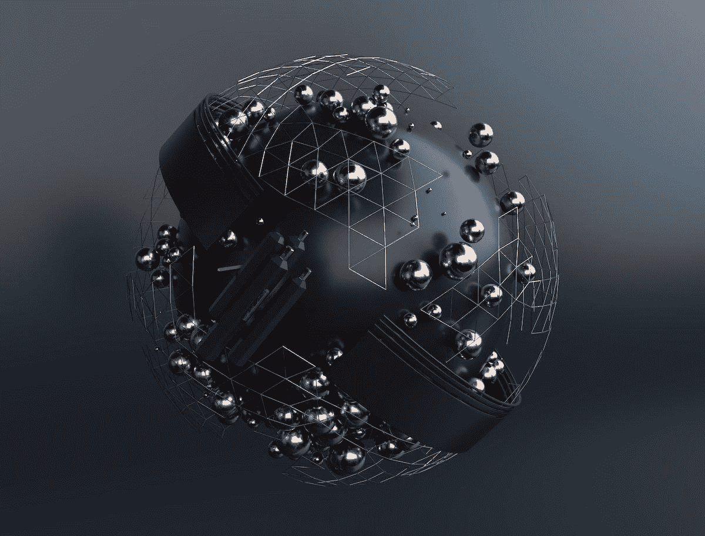
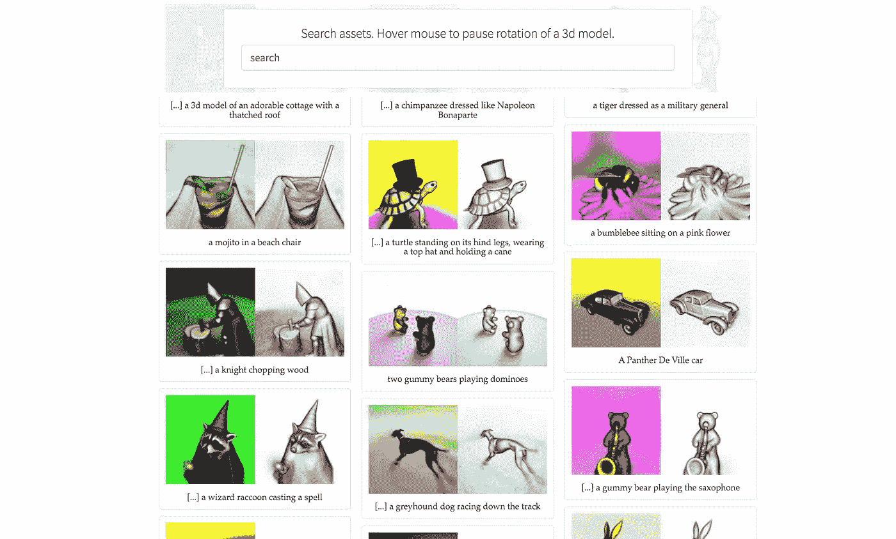

# DreamFusion:从文本生成 3D 模型

> 原文：<https://medium.com/mlearning-ai/dreamfusion-generate-3d-models-from-text-a1cb640f9550?source=collection_archive---------1----------------------->

## 人工智能生成的 3D 模型即将问世。DreamFusion:使用 2D 扩散将文本转换为 3D。

我们只能梦想文本到图像的技术，它最终随着 Dall-E & Midjourney 和稳定的传播而出现。Blender，开源 3D 软件有一个新的稳定的扩散实现，用于创建无缝纹理。

我们都知道文本到 3D 技术的出现只是时间问题。人工智能肯定会改变现在和未来制作 3D 应用的方式。

[**访问梦想融合**](https://dreamfusion3d.github.io/)

将文本到图像的方法适配到 3D 合成需要标记的 3D 资产的大规模数据集和用于去噪 3D 数据的有效架构，这些目前都不存在。在这项工作中，DreamFusion 通过使用预训练的 2D 文本到图像扩散模型来执行文本到 3D 合成，找到了一种绕过这些限制的方法。

DreamFusion gallery screenshot.

目前，并非所有的模型都可以下载。所有这些样本的想法都是为了推动人工智能能够创造的极限。说到人工智能生成的 3D 模型，我认为这是迄今为止最好的一个。人工智能生成雕刻的几何图形。当你看他们的画廊时，他们有很多好东西。看到结果如何出来，以及人工智能如何处理文本以吐出 3d 模型，这很有趣。

[**参观梦想融合画廊**](https://dreamfusion3d.github.io/gallery.html)

## NordVPN

> *担心您的隐私和安全？通过屏蔽你的 IP 地址，NordVPN 保护了用户的隐私和虚拟位置。受到 PCMag、Forbes、& WIRED 等独立专家的信任，我们是领先的 VPN 服务，具有阻止恶意软件、广告、恶意网站和跟踪器的威胁保护功能。*

[***在 NordVPN 网站上了解更多信息***](https://go.nordvpn.net/aff_c?offer_id=15&aff_id=75170&url_id=902)

*声明:中的这个链接是一个附属链接，如果您决定购买付费计划，它可以免费向我提供补偿。*

*原载于 2022 年 10 月 2 日 https://www.shakiroslann.com**T21*[。](https://www.shakiroslann.com/dreamfusion-ai-3d/)

 [## Mlearning.ai 提交建议

### 如何成为 Mlearning.ai 上的作家

medium.com](/mlearning-ai/mlearning-ai-submission-suggestions-b51e2b130bfb)