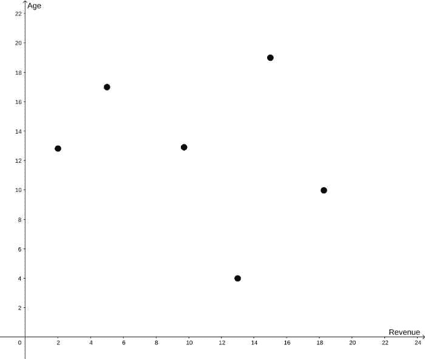
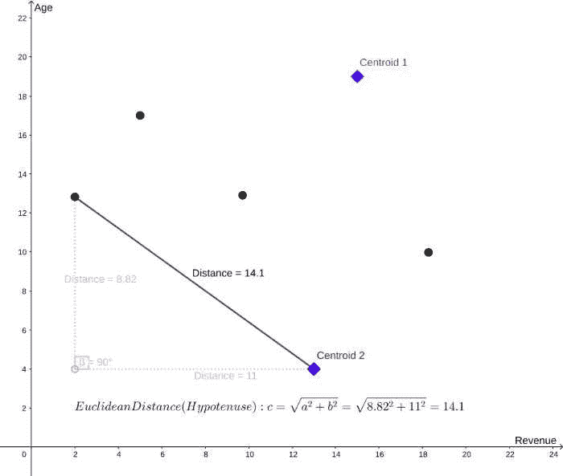
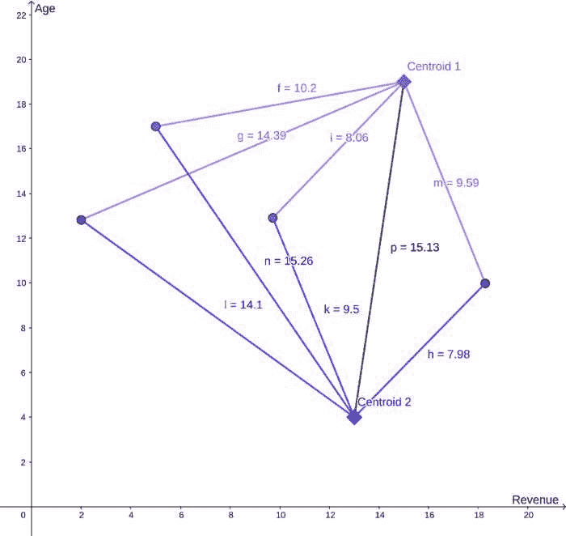
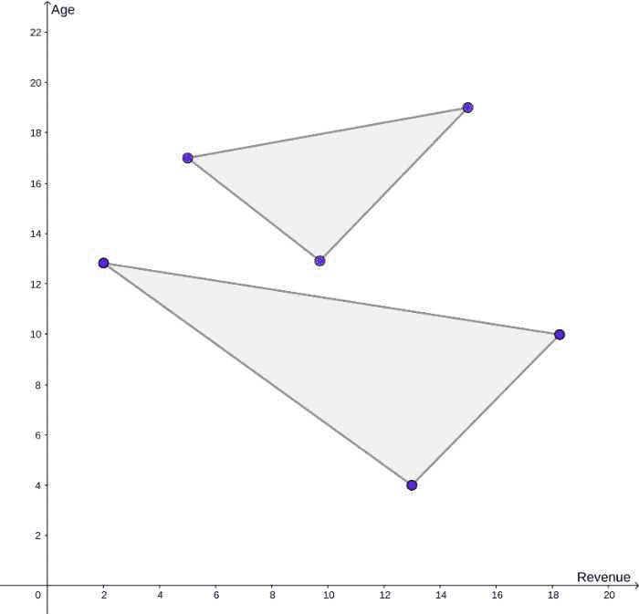
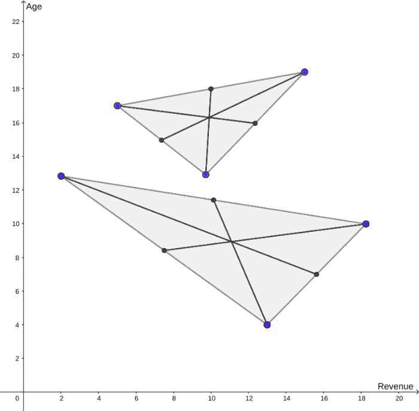
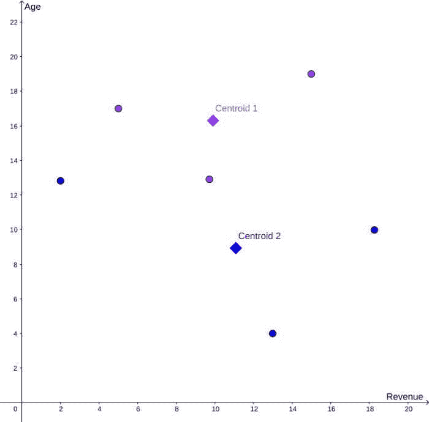
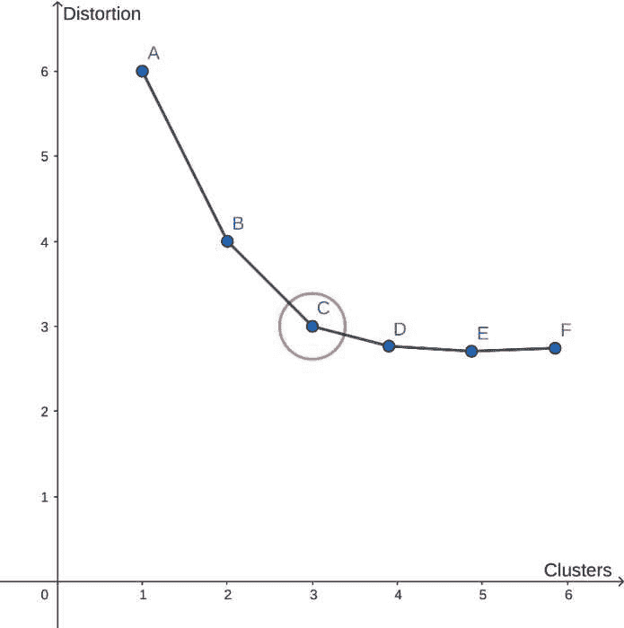

# 使用 k 均值聚类驱动价值

> 原文：<https://medium.com/mlearning-ai/driving-value-by-classifying-with-k-means-clustering-f689f87db38f?source=collection_archive---------3----------------------->

尽管每个客户都是独一无二的，但是将相似的客户分组是非常有益的。这种分组或聚类对于大规模与客户互动的企业至关重要。例如，为每个客户开发一个独特的客户保持计划是站不住脚的，尤其是如果公司有成千上万的客户。相反，企业需要了解哪一组客户更容易接受保留计划。为了了解该群体或细分市场的构成，公司必须首先将相似的客户划分为特定的群体。

对客户进行分组的一种方法是使用 k 均值聚类。该过程将数据集中的每个客户随机分配到多个组或分类中的一个。客户的初始分配构成了算法的第一步或迭代。重复该过程，直到集群分配的改善不明显。

根据众多标准一行接一行地将客户手动分配到一个组是低效的。用不了多久，每个顾客都会显得独一无二，森林会为树木而消失。需要一个自动化的解决方案。挑战在于系统地发现哪些客户是相似的。相似的客户可以被分组为特定的类型，例如高增长、稳定或有风险。幸运的是，存在一种数学方法来解决这个问题，甚至跨越成千上万的客户。这种方法被称为 K 均值聚类。

这篇文章将回顾 k-means 聚类和“肘方法”背后的概念。我们将讨论这些技术如何对相似的数据点进行分组。最后，我们将探索企业如何应用它们来创造更多价值。

**那么什么是 k 均值聚类呢？**

k 均值聚类是一种用于对相似数据点进行分组的技术。它是一种无监督的机器学习算法，将数据划分为 k 个组或簇，其中每个组包含相似的观察值。

成功的聚类有两个标准:(A)数据点应该靠近它们的指定质心，以及(B)质心应该远离。这些标准可以用邓恩指数来量化——最小(B) /最大(A)。邓恩指数越高，聚类成功越大。

我们将探索众多可用的集群技术中的两种。这两种技术是(1)同时随机选择多个质心和(2)一次随机选择一个质心。让我们开始探索更常见的第一种方法。

目标是确定哪些客户应该接受促销，以激励他们保持客户身份。我们假设年长的客户产生更多的收入，因此年轻的客户应该得到保留计划的推广。每个点代表一个基于收入和年龄的客户。

绘制完成后，算法从从整个数据集中随机选择 k 个观察值开始。k 代表集群的数量。稍后将讨论确定适当的集群数量。将基于两个变量或轴(如收入和年龄)假设两个聚类。然后计算每个质心和每个数据点之间的欧几里德距离。欧几里德距离仅仅是该点和质心之间斜边的距离。

下表显示了每个计算出的距离。您会看到一些点到一个质心的距离比到另一个质心的距离短。数据点被分配给距离最短的质心。三个点是紫色的，表示质心为 1 的聚类。剩余的蓝色数据点被分配给质心 2。

接下来，重新定位质心，使其位于群集的中心。首先，让我们把每个集群想象成一个多边形。

现在是确定质心位置的时候了。首先，计算每个多边形的中心。想象一条在多边形点和对边中点之间延伸的线。对多边形的每个点执行此任务将显示中心。

最后确定每个质心的中心！

但不要这么快！该练习从随机选择数据点作为质心开始。如果随机选择不同的点会怎样？上面概述的步骤需要重新运行许多次，但是使用不同的起始质心。流程应该重新运行多少次？没有单一的答案，但有其他方法。最直接的方法是预先确定运行次数。或者，如果质心位置没有在后续运行中重新定位，则不需要额外的运行。

那么，集群的正确数量是多少呢？同样，不存在单一的答案，但有不同的方法。肘方法是确定最佳聚类数的常用方法。它决定了再添加一个聚类会停止提高准确性-您的肘点。

随着集群数量的增加，确定集群的过程运行多次。随着分类计数的增加，分类中每个点与分类质心之间的距离将会减小。关键是在聚类数和聚类精度之间找到合适的折衷。

递增群集计数的效果被计算为群集的“失真”。失真通常计算为每个数据点与其质心之间的均方距离。随着簇的增加，失真将减少。失真的改善将随着每个后续簇的增加而减少。不久，失真的改善并不能证明增加一个集群是合理的。

在本例中，3 个簇(C 点)是最佳数量。相对于第二和第三群集的添加，第四群集(点 D)提供了失真的最小改善。C 点是折线图“弯曲”变平的“肘部”。

从随机选择的质心开始的方法是最常见的。但是，有一种替代方法，K-means ++。这种相对较新的方法较少依赖于初始化算法的随机性，因此可以提供改进的聚类。

回到成功聚类的两个标准，我们希望更紧密的聚类离得更远。传统的 k-means 技术同时随机选择预定数量的质心来初始化算法。K-means ++随机选择一个质心进行初始化。通过拾取离当前质心最远的点来选择每个附加质心。这种方法在最大化成功聚类的第二个标准方面是优越的。这两种技术在其他方面是相似的。

那么，集群是如何为公司创造价值的呢？

K-means 聚类对于通过对公司数据点进行分组来识别相似的客户并了解他们的行为是必不可少的。将客户划分为具有相似需求的群体可以让公司更好地满足这些需求。解决客户需求可以提高客户保留率并创造价值。

回到我们的使用案例，我们看到集群 2 比集群 1 产生的收入略多，尽管这个群体平均来说更年轻。这一观察对我们的假设提出了质疑，即老客户会产生更多的收入。在推出保留计划促销之前，需要进一步调查以了解这种关系。

 [## Mlearning.ai 提交建议

### 如何成为 Mlearning.ai 上的作家

medium.com](/mlearning-ai/mlearning-ai-submission-suggestions-b51e2b130bfb)