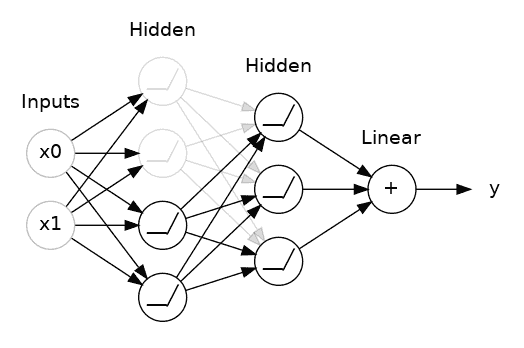

# 辍学:防止神经网络过度拟合的简单方法

> 原文：<https://medium.com/mlearning-ai/dropout-a-simple-way-to-prevent-neural-networks-from-overfitting-e95572aad1df?source=collection_archive---------10----------------------->

## 辍学，过度适应，如何解决

深度学习的世界不仅仅是密集的层。有几十种层可以添加到模型中。(尝试浏览 [Keras 文档](https://www.tensorflow.org/api_docs/python/tf/keras/layers/)获取样本！)有些就像致密层，定义神经元之间的连接，而有些则可以进行预处理或其他类型的转换。

在本文中，我们将了解一种特殊的层，不包含任何神经元本身，但它添加了一些功能，有时可以以各种方式使模型受益。现代建筑中常用。

# 拒绝传统社会的人

第一个是“脱层”，它可以帮助纠正过度拟合。

在上一课中，我们讨论了网络学习训练数据中的虚假模式是如何导致过度拟合的。为了识别这些虚假模式，网络通常依赖于非常特定的权重组合，这是一种权重“共谋”。如此具体，他们往往是脆弱的:删除一个和阴谋土崩瓦解。

这就是**辍学**背后的想法。为了打破这些阴谋，我们在训练的每一步随机地*丢弃*一层输入单元的一部分，使得网络更难学习训练数据中的那些虚假模式。相反，它必须寻找广泛的、一般的模式，其权重模式往往更稳健。



你也可以把辍学看作是创建一种网络组合。预测将不再由一个大网络做出，而是由一个由较小网络组成的委员会做出。委员会中的个人往往会犯不同类型的错误，但同时又是正确的，这使得委员会作为一个整体比任何个人都要好。(如果你熟悉作为决策树集合的随机森林，这是相同的想法。)

# 添加辍学

在 Keras 中，退出率参数`rate`定义了关闭输入单元的百分比。将`Dropout`图层放在要应用漏白的图层之前:

```
keras.Sequential([
    # ...
    layers.Dropout(rate=0.3), # apply 30% dropout to the next layer
    layers.Dense(16),
    # ...
])
```

[](/mlearning-ai/mlearning-ai-submission-suggestions-b51e2b130bfb) [## Mlearning.ai 提交建议

### 如何成为 Mlearning.ai 上的作家

medium.com](/mlearning-ai/mlearning-ai-submission-suggestions-b51e2b130bfb)