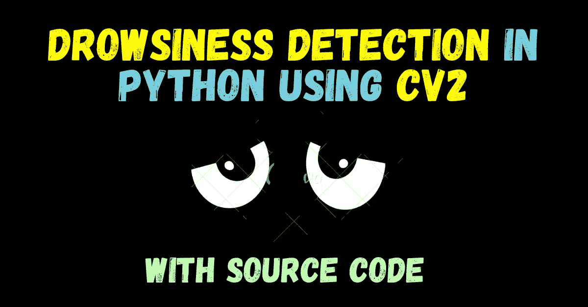
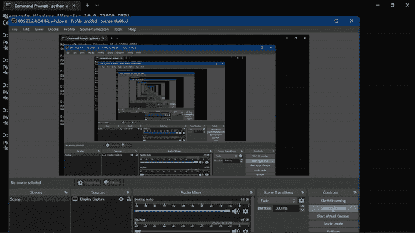

# 使用 Python 中的 cv2 进行睡意检测——有趣的项目

> 原文：<https://medium.com/mlearning-ai/drowsiness-detection-using-cv2-in-python-interesting-project-623a6a3b4393?source=collection_archive---------3----------------------->



嘿，在这个博客中，我们将建立一个**睡意检测**应用程序，它将检测视频中的人是否变得昏昏欲睡。

这是一个非常**有趣而简单的项目**，甚至不到 80 行代码，所以没有任何进一步的原因，让我们做吧…

【https://machinelearningprojects.net/drowsiness-detection/】点击此处阅读完整博客—[](https://machinelearningprojects.net/drowsiness-detection/)

**点击此处查看视频—[https://youtu.be/lq096rDZB9Y](https://youtu.be/lq096rDZB9Y)**

# **偷偷看我们的输出**

****注意——你在这里听不到警报声，因为它是 GIF 格式的，你可以看看我博客上的视频**[**https://machinelearningprojects.net/drowsiness-detection/**](https://machinelearningprojects.net/drowsiness-detection/)**

****

# **睡意检测代码**

```
from imutils import face_utils
import dlib
import cv2
from pygame import mixerthres = 6mixer.init()
sound = mixer.Sound('alarm.wav')dlist = []detector = dlib.get_frontal_face_detector()
predictor = dlib.shape_predictor("shape_predictor_68_face_landmarks.dat")cap = cv2.VideoCapture(0)def dist(a,b):
    x1,y1 = a
    x2,y2 = b
    return ((x1-x2)**2 + (y1-y2)**2)**0.5

while True:
    # Getting out image by webcam 
    _, image = cap.read()
    # Converting the image to gray scale
    gray = cv2.cvtColor(image, cv2.COLOR_BGR2GRAY)

    # Get faces into webcam's image
    rects = detector(gray, 0)

    # For each detected face, find the landmark.
    for (i, rect) in enumerate(rects):
        # Make the prediction and transfom it to numpy array
        shape = predictor(gray, rect)
        shape = face_utils.shape_to_np(shape)

        # Draw on our image, all the finded cordinate points (x,y) 
        for (x, y) in shape:
            cv2.circle(image, (x, y), 2, (0, 255, 0), -1)

        le_38 = shape[37]
        le_39 = shape[38]
        le_41 = shape[40]
        le_42 = shape[41] re_44 = shape[43]
        re_45 = shape[44]
        re_47 = shape[46]
        re_48 = shape[47]        dlist.append((dist(le_38,le_42)+dist(le_39,le_41)+dist(re_44,re_48)+dist(re_45,re_47))/4<thres)
        if len(dlist)>10:dlist.pop(0) # Drowsiness detected
        if sum(dlist)>=4:
            try:
                sound.play()
            except:
                pass
        else:
            try:
                sound.stop()
            except:
                pass

    # Show the image
    cv2.imshow("Output", image)

    if cv2.waitKey(5) & 0xFF == 27:
        breakcv2.destroyAllWindows()
cap.release()
```

*   **第 1–4 行:导入所需的库。**
*   **第 6 行:**设置一个阈值**(将在前面的代码中看到)。**
*   **第 8–9 行:**使用 pygame 模块**创建闹钟声音，以便在应用程序中进一步使用。**
*   **第 11 行:我们将在前面使用的空列表。**
*   **第 13 行:使用 **dlib 人脸检测器**。**
*   **第 14 行:使用 **dlib 地标检测器检测眼点**。**
*   **第 16 行:**初始化 cap 对象稍后使用网络摄像头**。**
*   **第 18–21 行:一个简单的距离函数**，它计算两个坐标之间的距离**。**
*   **第 25 行:从网络摄像头读取图像。**
*   **第 27 行:**转换成灰度**。**
*   **第 30 行:检测人脸。**
*   **第 33 行:开始遍历这些面。**
*   **Lin 35–36:**获取 68 个人脸标志，并将其转换为 NumPy 数组**。**
*   **第 39–40 行:画出所有的地标。**
*   **第 42–50 行:提取所需的眼睛标志。**
*   **对于左眼，我们将提取 **38、39、42 和 41** 。**
*   **对于右眼，我们将提取 **44、45、48 和 47** 。**
*   ***在阅读下一步之前，先阅读下面的算法。***

****

*   **第 54 行:**该行负责保持 dlist=10** 的大小。**
*   **删除从前面开始，添加在最后完成。**
*   **这就像一个排队系统。**
*   **第 57–66 行:**当列表**中至少有 4 个 Trues 时，播放警报。当他们少于 4 时停止。**
*   **第 69 行—显示图像。**
*   **第 71–72 行:当用户点击 **ESC** 键时停止应用程序。**
*   **第 74–75 行:**关闭所有 cv2 窗口并释放网络摄像头**。**

# **用于检测睡意的算法:**

*   ****找出 38–42、39–41、44–48 和 45–47 地标之间的距离，并找出这四个地标的平均值。****
*   ****如果这个平均值大于我们最初定义的阈值，在我们的 dlist 中追加/添加一个 True。****
*   ****如果我们的 dlist 包含 4 个或更多的 Trues，这意味着在连续 4 帧中，检测到睡意，因此播放警报。****
*   **我们保留了 4 或更多的概念，因为如果我们不这样做，我们的程序将会发出警报，即使我们眨眼也是假阳性。**

# **输出**

****注意——你不会在这里听到警报声，因为它是 GIF 格式的，你可以查看我博客上的视频**[**https://machinelearningprojects.net/drowsiness-detection/**](https://machinelearningprojects.net/drowsiness-detection/)**

****

# **要下载源代码，请访问我的博客—[https://machinelearningprojects.net/drowsiness-detection/](https://machinelearningprojects.net/drowsiness-detection/)**

# **执行睡意检测的其他想法:**

*   **一种方法是我们上面执行的。**
*   **第二种方式可以是**在面部图像上训练神经网络**。**
*   **第三种方式可以是**在眼睛图像上训练神经网络**。**

**这就是你如何使用 cv2 和 dlib 在 python 中执行**睡意检测。****

****查看我的其他** [**机器学习项目**](https://machinelearningprojects.net/machine-learning-projects/)**[**深度学习项目**](https://machinelearningprojects.net/deep-learning-projects/)**[**计算机视觉项目**](https://machinelearningprojects.net/opencv-projects/)**[**NLP 项目**](https://machinelearningprojects.net/nlp-projects/) **，以及** [**烧瓶项目**](https://machinelearningprojects.net/flask-projects/)********

## ******[**成为 MLearning.ai** 的作家 ](https://mlearning.substack.com/about)******

******[](/mlearning-ai/mlearning-ai-submission-suggestions-b51e2b130bfb) [## Mlearning.ai 提交建议

### 如何成为 Mlearning.ai 上的作家

medium.com](/mlearning-ai/mlearning-ai-submission-suggestions-b51e2b130bfb)******