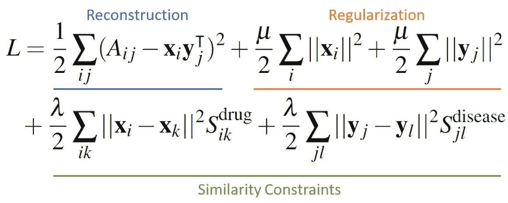
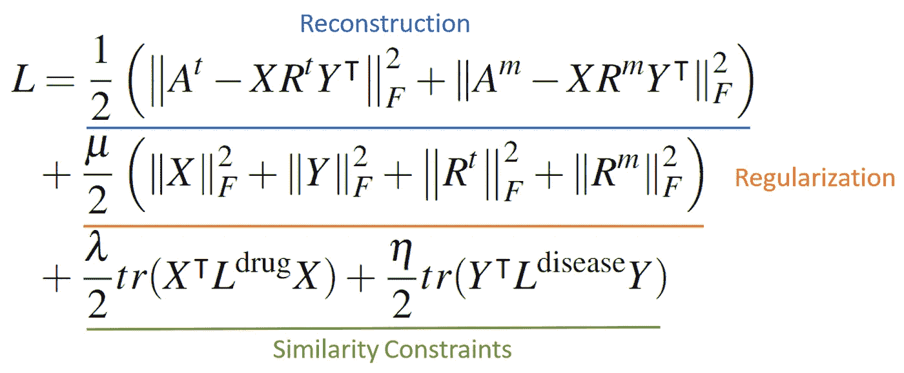

# 药物-疾病关联预测

> 原文：<https://medium.com/mlearning-ai/drug-disease-association-prediction-14892917ec5d?source=collection_archive---------2----------------------->

## 机器学习如何有助于药物再利用？

Photo by [National Cancer Institute](https://unsplash.com/@nci?utm_source=unsplash&utm_medium=referral&utm_content=creditCopyText) on [Unsplash](https://unsplash.com/s/photos/medicine?utm_source=unsplash&utm_medium=referral&utm_content=creditCopyText)

正如在[上一篇文章](/mlearning-ai/computational-drug-repurposing-9a5b9235ad70)中所解释的，为特定疾病开发新的药物是昂贵的。相反，如果现有的化合物可以重新用于治疗，这一成本可以大大降低。因此，对药物-疾病关联的更好理解将有益于制造商和有需要的患者。

本文将讨论在药物-疾病关联文献中常见的一种机器学习方法和两类方法。(1) **PREDICT** ，该领域最早的 ML 尝试之一，将特征工程加逻辑回归应用于问题，引领 ML 努力进入该领域。(2) **矩阵分解**，通常将一个大的、有噪声的矩阵分解成两个维度更小的因子矩阵，自然适用于药物-疾病、药物-药物和疾病-疾病关联表(矩阵)。(3) **还提出了基于神经网络-** 的模型，其示例使用自动编码器来减少药物和疾病表示的特征维度。

Photo by [Jen Theodore](https://unsplash.com/@jentheodore?utm_source=unsplash&utm_medium=referral&utm_content=creditCopyText) on [Unsplash](https://unsplash.com/s/photos/predict?utm_source=unsplash&utm_medium=referral&utm_content=creditCopyText)

# 预测

这种方法首先对现有数据进行分类，并建立三个表格:药物-疾病、药物-药物和疾病-疾病表格。

第一个表用于**药物-疾病关联**，它记录了每个药物-疾病对的二元关联/无关联标签。(实际上，我们只需要正的线对，并假设所有剩余的线对都是负的。)该表由 4 个来源构成:(1)记录疾病表型的 Man⁵在线孟德尔遗传(OMIM );(2) DrugBank⁴，记录药物目标和适应症；(3) DailyMed 和(4)Drugs.com，它们都保留了 FDA 的药品标签和适应症。使用[统一医疗语言系统](https://www.nlm.nih.gov/research/umls/index.html)对这些来源的信息进行标准化。

第二个表是用于**药物-药物相似性**的，由 5 个度量组成:(1)基于*化学*的度量，根据药物库中记录的药物的规范[简化分子输入行输入系统](https://en.wikipedia.org/wiki/Simplified_molecular-input_line-entry_system)(微笑)entries⁶计算；(2)从 SIDER database⁷中记录的编码副作用获得的*副作用*度量；(3)基于相应药物相关基因序列的 Smith-Waterman 序列比对 score⁸的*序列*度量；(4)从药物相关 genes⁹的蛋白质-蛋白质相互作用网络上的蛋白质之间的距离计算的*蛋白质*度量，以及最后(5)基于由[基因本体资源](http://geneontology.org/) ⁰.定义的药物相关基因之间的语义相似性分数的 *GO* 度量

最后一个表是针对**疾病-疾病相似度**的，由 6 个度量组成:(1)一个*表型*度量，由 OMIM 数据库中记录的[医学主题词](https://en.wikipedia.org/wiki/Medical_Subject_Headings) (MeSH)之间的相似度构建；(2)基于人类表型本体(HPO)条目之间的雷斯尼克相似性的语义表型相似性(T22 ),由 OMIM 数据丰富；(3)每对遗传签名之间的基于*遗传-* 的 [Jaccard 评分](https://en.wikipedia.org/wiki/Jaccard_index)，由所有基因的统一列表中相互上调的基因和相互下调的基因的总数表示；(4–6)与药物相似性中使用的(3–5)相同。

有了这些表格特征，在已知所有其他已知关联的情况下，设计一个模型来分类药物-疾病关联是否存在就相对简单了。更具体地说，PREDICT 采用了经典的[逻辑回归](https://en.wikipedia.org/wiki/Logistic_regression)，并取得了当时最先进的业绩。

# 矩阵分解

有许多尝试使用矩阵分解(MF)进行药物-疾病关联估计。我们将把重点放在那些我们认为最有趣和与我们的研究最相关的内容上。

## 相似约束矩阵分解

第一个想法⁴与 MF，从流形学习理论中汲取见解，并使用药物-药物相似性矩阵加上疾病-疾病相似性矩阵来指导药物-疾病关联的因子分解。

Equation 1: SCMF objective function, consisting of a reconstruction loss, a regularization loss, plus a similarity loss. (image by author)

如等式 1 所示，该算法为每种药物(x)和疾病(y)找到低维表示，使得二元药物-疾病关联矩阵可以由它们的乘积来近似。药物和疾病向量通过它们的大小和相似性矩阵被正则化，相似性矩阵使用与预测相似的信息来计算。为了对未知关联进行预测，我们可以将药物矩阵与疾病矩阵相乘，以获得包含预测的关联矩阵。可以添加到该方法的一个简单改进是引入屏蔽矩阵，该屏蔽矩阵屏蔽掉目标计算中的未知关联，而不是将它们视为没有关联。

## 多任务集体矩阵分解

⁵与 MF 的另一项尝试探索了这样一个事实，即在[比较毒理基因组学数据库](http://ctdbase.org/)中记录了两种类型的关联，因此他们分别使用它们来实现更大的模型容量。

Equation 2: MTCMF objective consists of a reconstruction loss, a regularization loss, and a similarity loss. (image by author)

如等式 2 所示，目标类似于 SCMF，但是区分了治疗关联(At)和标记/机制关联(Am)。此外，它使用相似性矩阵的[图拉普拉斯](https://en.wikipedia.org/wiki/Laplacian_matrix)来执行基于相似性的正则化，这在 MF 文献中很常见。我们认为这种从可用数据集中提取更多信息的尝试无疑是积极的一步；这将是有趣的，看看是否有可能挖掘和整合更多的药物疾病协会的特点到我们的分析。

Photo by [Hal Gatewood](https://unsplash.com/@halacious?utm_source=unsplash&utm_medium=referral&utm_content=creditCopyText) on [Unsplash](https://unsplash.com/s/photos/brain?utm_source=unsplash&utm_medium=referral&utm_content=creditCopyText)

# 神经网络

这里讨论的方法不仅仅是神经网络模型，而是将它们作为一个组件使用。在这些模型中选择何时何地放置神经网络主要是任意的。在一项更稳健的研究中，我们期望这种选择成为超参数搜索的目标。

## Sigmoid 核卷积神经网络

与以前的方法类似，sigmoid 核卷积神经网络⁶ (SKCNN)也使用从前面提到的多个来源提取的药物-药物相似性矩阵和疾病-疾病相似性矩阵。此外，它根据每种药物和疾病的**关联**简档，为每种药物和疾病构建一个**特征向量**，其元素是二元的，表示药物/疾病是否与相应的疾病/药物有关联。然后，它基于对这些特征向量的 sigmoid 核变换来构建(基于 sigmoid 核的)相似性矩阵。

与 MF 方法不同，SKCNN 然后专注于一种药物和一种疾病，从矩阵中提取它们的特征，并形成一个特征向量，直接在这个**药物-疾病对**上用 CNN 和随机森林执行**二元分类**。(在不质疑该方法有效性的情况下，我们试图查看[实现](https://github.com/HanJingJiang/SKCNN)，并发现拥有完整的方法实现，以及在他们的实验中使用的必要数据集，可以让存储库受益。)

## 稀疏自动编码器+旋转森林

出于与之前类似的想法，同一作者⁷添加了稀疏自动编码器来改进特征提取步骤，并用旋转森林⁸替换随机森林来解决过拟合问题。尽管它具有最先进的性能，但我们发现模型组件的组成有些随意，也许可以更好地激发。然而，他们在将不同的洗钱技术应用于毒品再利用问题上的努力是非常值得称赞的。

Photo by [Towfiqu barbhuiya](https://unsplash.com/@towfiqu999999?utm_source=unsplash&utm_medium=referral&utm_content=creditCopyText) on [Unsplash](https://unsplash.com/s/photos/medicine?utm_source=unsplash&utm_medium=referral&utm_content=creditCopyText)

# 结论

总的来说，我们认为致力于药物再利用的努力有限，特别是来自机器学习社区的努力。随着多模态分析、自我监督学习的发展和电子健康记录数据可用性的增加，我们希望在这个重要且有利可图的方向上进行更多的研究。

[1] Gottlieb，Assaf 等人，“预测:一种推断新药适应症并应用于个体化药物的方法。”*分子系统生物学* 7.1 (2011): 496。

[2]张，文，等.“利用相似性约束矩阵分解预测药物与疾病的关联” *BMC 生物信息学*19.1(2018):1–12。

[3]蒋，韩静，俞，，朱洪友.“SAEROF:通过合并旋转森林和稀疏自动编码器深度神经网络进行大规模药物-疾病关联预测的集成方法。”*科学报告*10.1(2020):1–11。

[4] Wishart，David S .等，“药物银行:药物、药物作用和药物靶标的知识库。”*核酸研究* 36.suppl_1 (2008): D901-D906。

[5]哈莫什，阿达等，“人类在线孟德尔遗传(OMIM)，人类基因和遗传疾病的知识库。”*核酸研究* 33.suppl_1 (2005): D514-D517。

[6] Steinbeck，Christoph 等，“化学开发工具包(CDK)的最新发展——一个用于化学和生物信息学的开源 java 库。”*现行药物设计*12.17(2006):2111–2120。

[7]库恩，迈克尔等，“获取药物表型效应的副作用资源。”*分子系统生物学* 6.1 (2010): 343。

[8] Kinnings，Sarah L .等人，“利用化学系统生物学进行药物发现:重新定位安全药物 Comtan 以治疗多药和广泛耐药结核病。”PLoS 计算生物学 5.7 (2009): e1000423。

[9] Perlman，Liat，等，“结合药物和基因相似性测量以阐明药物靶标。”*计算生物学杂志*18.2(2011):133–145。

[10] Ovaska，Kristian，Marko Laakso 和 Sampsa Hautaniemi。"用于微阵列实验的基于基因本体的快速聚类."*生物数据挖掘*1.1(2008):1–8。

11 菲利普·雷斯尼克。《分类学中的语义相似性:基于信息的度量及其在自然语言歧义问题中的应用》《人工智能研究杂志》11(1999):95–130。

[12]彼得·罗宾逊和 s·蒙德洛斯。"人类表型本体论."*临床遗传学*77.6(2010):525–534。

[13]马、云潜、云复。*流形学习理论及应用*。第 434 卷。博卡拉顿:CRC 出版社，2012 年。

[14]张，文等，“用相似性约束矩阵分解法预测药物与疾病的关系。” *BMC 生物信息学*19.1(2018):1–12。

[15]黄，冯等，“基于集体矩阵分解的多任务学习预测药物与疾病的关系”*生物工程与生物技术前沿* (2020): 218。

[16]蒋，韩静，朱洪友，于.“通过基于 sigmoid 核的卷积神经网络预测药物与疾病的关联。”*转化医学杂志*17.1(2019):1–11。

[17]蒋，韩静，俞，，朱洪友.“SAEROF:通过合并旋转森林和稀疏自动编码器深度神经网络进行大规模药物-疾病关联预测的集成方法。”*科学报告*10.1(2020):1–11。

[18]罗德里格斯、胡安·何塞、柳德米拉·昆切瓦和卡洛斯·阿隆索。"旋转森林:一种新的分类器集成方法."IEEE 模式分析和机器智能汇刊 28.10(2006):1619–1630。

 [## Mlearning.ai 提交建议

### 如何成为 Mlearning.ai 上的作家

medium.com](/mlearning-ai/mlearning-ai-submission-suggestions-b51e2b130bfb)