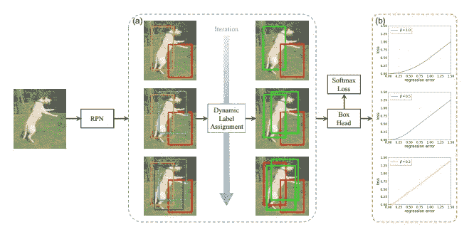

# 动态 RCNN——通过动态训练实现高质量目标检测

> 原文：<https://medium.com/mlearning-ai/dynamic-rcnn-towards-high-quality-object-detection-via-dynamic-training-8d42d69c24e3?source=collection_archive---------2----------------------->

## 深度学习

## 修复培训过程中的不一致问题

Dynamic RCNN (Source: [Dynamic RCNN](https://arxiv.org/abs/2004.06002))

你好。今天我们就来看看[动态 RCNN](https://arxiv.org/abs/2004.06002) ，一篇中科院研究人员的论文。

## 概观