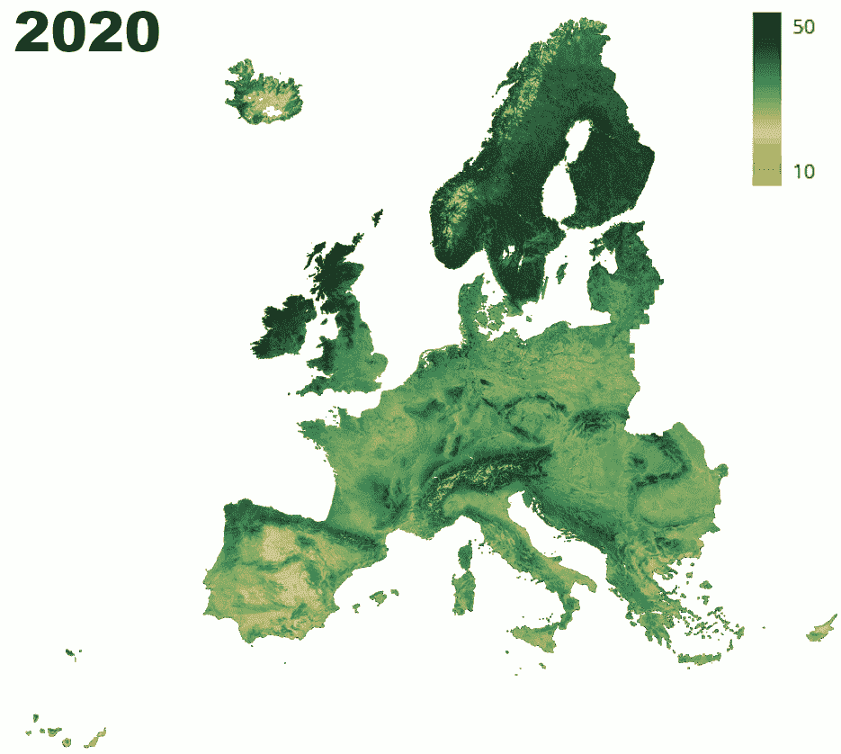
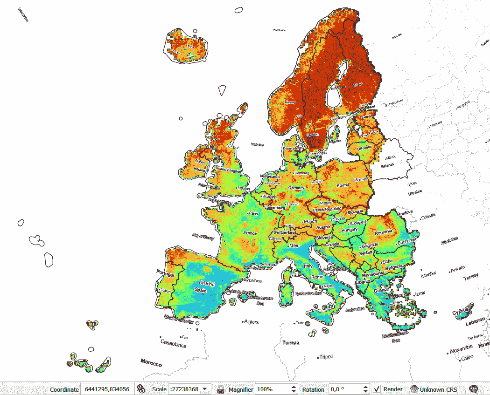
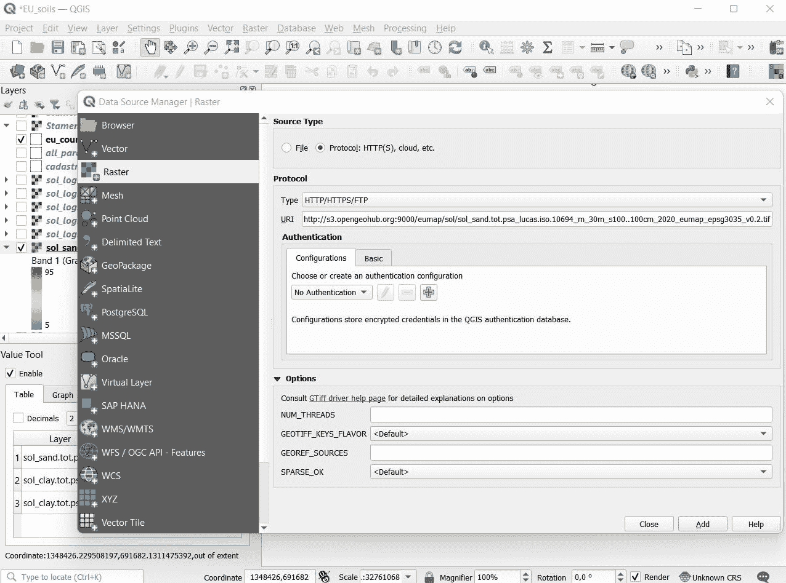

# 基于机器学习和 EO 数据的农场尺度的动态土壤信息:为欧洲建立一个开放的土壤数据立方体

> 原文：<https://medium.com/mlearning-ai/dynamic-soil-information-at-farm-scale-based-on-machine-learning-and-eo-data-building-an-open-1a6ffe282162?source=collection_archive---------0----------------------->

*编写人:Tom Hengl(OpenGeoHub/EnvirometriX)、Leandro Parente(OpenGeoHub/EnvirometriX)、ich Sani Wheeler(OpenGeoHub/EnvirometriX)和 Carmelo Bonannella(OpenGeoHub)*

> 土壤象征着肥沃，是我们文明的基础。由于土壤具有重要的生态系统服务功能，从种植作物、过滤水到提供建筑材料，人们越来越关注土壤。土壤也是潜在的碳库之一，可以大大减少大气中的二氧化碳。当前用于监测土壤特性(物理、化学和生物特性)以及土壤流失和退化的系统[无法提供土壤资源随时间变化的准确情况](https://www.nationalacademies.org/our-work/exploring-a-dynamic-soil-information-system-a-workshop)。为了缩小这一差距，OpenGeoHub、EnvirometriX 和合作伙伴正在建立开放土壤数据立方体类型的解决方案，利用集合机器学习和大规模地球观测数据来生成数十亿像素的预测。了解如何访问和使用这些数据，并为此计划做出贡献！

# 监测土壤

需要对土壤进行监测，因为从原则上讲，土壤是脆弱的生态系统，失去土壤的代价极其高昂。例如，科学家估计大约需要 100 年才能产生大约 3 厘米厚的表层土壤(Stockmann 等人，2014 年)，而这些时间我们再也承受不起了。[土壤退化的主要驱动因素](/nerd-for-tech/restoration-culture-what-is-land-degradation-how-to-measure-it-and-what-can-you-do-to-reverse-341e448994da)通常是不可持续的土地利用和人口压力(博雷利等人，2017)。对土壤健康的常见威胁包括:

*   土壤有机质的流失；
*   生物多样性的丧失；
*   土壤因侵蚀而流失；
*   重金属和类似物造成的土壤板结和土壤污染；

在过去的 150 年里，由于侵蚀、压实、荒漠化、酸化以及土壤有机碳和主要养分的损失，地球上一半的表土已经退化；由于全球土地利用和气候的变化，土壤侵蚀可能在未来 30 年增加 60%(博雷利等人，2017)。有些矛盾的是，一方面，土壤是减少温室气体排放的解决方案之一(Sha et al .，2022)，而另一方面，欧盟 60-70%的土壤是不健康的，主要是因为不可持续的管理做法。美国的一个团队最近估计，在气候变化的影响下，美国大陆可能会损失 1.8 千兆克的土壤有机碳(Gautam 等人，2022)。

# 关键土壤健康指标

跟踪土壤动态的一个切实可行的方法是测量和监测具体的土壤健康指标，特别是那些确定土壤状态及其生态系统服务的指标。目前，已经提出了八(8)个土壤健康指标来评估[欧洲委员会(MB)的土壤健康和食品目标](https://ec.europa.eu/environment/publications/eu-soil-strategy-2030_en)，它们是:(1)土壤污染物、过量养分和盐的存在；(2)土壤有机碳储量；(3)土壤结构，包括土壤容重和无土壤密封和侵蚀；(4)土壤生物多样性；(5)土壤养分和酸度(pH)；(6)植被覆盖度；(7)景观异质性，和(8)森林覆盖。本文中描述的开放土壤数据立方体具有特定的用途，允许对土壤健康指标进行简单而可靠的验证，特别是在没有国家参考数据集存在或不公开的情况下。我们将进一步增加新的和更新现有的关键土壤健康指标，以便在未来几年进行接近农场规模的趋势分析。

**欧洲大陆开放土壤数据立方体**

在 [Geo-harmonizer](https://opendatascience.eu/geoharmonizer-project/) 和[agriculture CO2 . eu](https://agricaptureco2.eu/)项目中，我们开发了使用最先进的机器学习方法和最先进的公开地球观测数据( [GLAD Landsat](https://glad.geog.umd.edu/ard/glad-landsat-ard) )绘制和监测土壤养分的方法；哨兵-2)。我们特别感兴趣的是对关键土壤变量进行时空预测，如土壤有机碳、pH 值、土壤养分、粘土和砂粒含量以及相关的土壤水力特性。我们通常生成土壤变量的年度预测，以便这些预测可用于时间序列分析和检测土壤变化的关键驱动因素。我们之前以精细的空间分辨率(30 米)绘制了欧盟的动态土地覆盖和植被[,这显示了比纯粹的空间方法更具优势(Witjes 等人，2022)。我们目前正在使用一致的](/swlh/europe-from-above-space-time-machine-learning-reveals-our-changing-environment-1b05cb7be520)[时空机器学习系统](https://opengeohub.github.io/spatial-prediction-eml/)发布土地覆盖、森林树种、土壤和自然灾害(火灾、洪水)的多个输出，所有输出都通过 [https://EcoDataCube.eu](https://EcoDataCube.eu) 发布。

尽管一些泛欧盟土壤性质预测已经存在(Toth 等人，2017 年；Ballabio 等人，2019 年)这些都是基于相对粗糙的分辨率(250 米)，只关注变化的空间部分。[大量研究表明，土壤性质会动态变化](https://www.nationalacademies.org/our-work/exploring-a-dynamic-soil-information-system-a-workshop)，通常变化幅度很大，主要是由于土地使用的变化、降雨量和总体气候的变化。例如，土壤 pH 值(黄等，2022 年)和土壤有机碳(Knotters 等，2022 年)在过去 40 多年里发生了显著变化；主要是由于土地利用集约化，转换自然湿地和类似。最近由 [UNCCD](https://www.unccd.int/land-and-life/land-degradation-neutrality/overview) / [IPCC](https://www.ipcc.ch/srccl/) 提出的倡议将土壤碳的损失作为[土地退化中立的关键指标之一](/nerd-for-tech/restoration-culture-what-is-land-degradation-how-to-measure-it-and-what-can-you-do-to-reverse-341e448994da)。

Spatiotemporal predictions of soil organic carbon for top-soil. Log soil organic carbon values: 10 = 0.2% SOC, 50 = 14.7% SOC.

为了帮助提供整个欧洲大陆的无缝动态土壤信息，我们使用[为 0、30、60 和 100 厘米的四个标准深度和六个时期生成了 30 米空间分辨率的关键土壤属性时空预测:(1)2000–2002，(2)2002–2006，(3)2006–2010，(4)2010–2014，(5)2014–2018 和(6)2018–2020 我们预测土壤变量的初始模型使用时空重叠拟合，交叉验证的结果表明这些模型是有意义的。几个最初准备的 30 米分辨率协变量(特别是大地卫星产品:红色、近红外和 SWIR 波段，NDVI，SAVI)与动态土壤 pH 值、碳含量显著相关，因此可用于提供前所未有的详细程度的预测。描述方法步骤和准确性结果的科学出版物即将出版。订阅我们的](https://opengeohub.github.io/spatial-prediction-eml/)[频道](https://opengeohub.org/)接收更新。

Open Soil Data Cube for Europe is available at 30m spatial resolution for four standard depths 0, 30, 60 and 100 cm. Example of soil pH predictions with a zoom-in on Netherlands.

**开放土壤数据立方体技术细节**

欧洲开放土壤数据立方体的一般特征:

*   一致的输入[训练点](https://opengeohub.github.io/SoilSamples/datasets.html#europe)(例如 [LUCAS-soil](https://esdac.jrc.ec.europa.eu/projects/lucas) 、 [GEMAS](http://gemas.geolba.ac.at/) 和国家土壤剖面数据库，最重要的是 [BZE LW 德国国家土壤剖面数据库](https://doi.org/10.3220/DATA20200203151139))，这些数据已经过质量控制，可用于产生时空土壤特性的无偏估计；
*   共变层(陆地卫星季节性图像、植被指数、地形、岩性和气候层)作为完整一致的间隙填充云优化地理图；
*   在像素级提供预测误差，使得进一步使用改进的采样和局部建模成为可能；
*   所有处理步骤都被完整记录，完全自动化，并可用于在新点数据到达时更新预测(例如 LUCAS 2022)，
*   数据(预测)可通过 zenodo.org 和通过 [Wasabi 云优化的 GeoTIFFs S3 服务](https://stac.opendatascience.eu/)获得，允许用户直接将其用作分析就绪的地理空间数据库；

欧洲开放土壤数据立方体的目标/预期用途包括:

*   *土地恢复和再生农业项目；*
*   *开放的土壤有机碳监测平台；*
*   *土壤特性趋势的时间序列分析和变化的正负驱动因素的检测；*
*   [*不确定性引导取样*](https://opengeohub.github.io/spatial-sampling-ml/) *帮助改进地方/区域层面的预测；*

# 访问开放土壤数据立方体

要访问上述地图，请访问 [https://EcoDataCube.eu](https://EcoDataCube.eu) 数据门户或使用 [**STAC**](https://stac.ecodatacube.eu) 。地图以 SA 4.0 许可证在 [CC 下分发，免费下载。用于准备地图的输入训练点、代码和说明将在未来几个月内提供。](https://creativecommons.org/licenses/by-sa/4.0/)

The Open Soil Data Cube is available also via [https://EcoDataCube.eu](https://maps.opendatascience.eu) as 3D+T data cube and can be used to access soil data on your mobile phone i.e. directly on the field.

当前可用土壤特性的简短描述:

*   log.oc =使用 exp(x/10)-1 反转化的有机碳对数[g/kg]；
*   ph . H2O = H2O 土壤的 pH 值；
*   sand.tot =含砂量[百分比]；
*   clay.tot =粘土含量[百分比]；
*   db_od =干容重[kg/m3⨉10]；

估计类型:m =均值；md =预测误差；

在固定深度预测土壤特性:

*   表层土壤= s0..0cm，
*   底土 1 = s30..30cm，
*   底土 2 = s60..60cm，
*   底土 3 = s100..100cm。

要估算深度间隔，如 0-30 厘米、0-100 厘米，最好使用[梯形法则公式](https://doi.org/10.1371/journal.pone.0169748.g001)。

期间:2000 年(2000–2003 年)、2004 年(2004–2007 年)、2008 年(2008–2011 年)、2012 年(2012–2015 年)、2016 年(2016–2019 年)、2020 年；

URL 占位符:

*   https://S3 . eu-central-1 . wasabisys . com/eu map/sol/sol _ clay . tot . PSA _ Lucas . iso . 10694 _ { estimation _ type } _ 30m _ { depth } _ { year } _ eu map _ epsg 3035 _ v 0.2 . TIF
*   https://S3 . eu-central-1 . wasabisys . com/eu map/sol/sol _ db . od _ Lucas . iso . 10694 _ { estimation _ type } _ 30m _ { depth } _ { year } _ eu map _ epsg 3035 _ v 0.2 . TIF
*   https://S3 . eu-central-1 . wasabisys . com/eu map/sol/sol _ log . oc _ Lucas . iso . 10694 _ { estimation _ type } _ 30m _ { depth } _ { year } _ eu map _ epsg 3035 _ v 0.2 . TIF
*   https://S3 . eu-central-1 . wasabisys . com/eu map/sol/sol _ ph . H2O _ Lucas . iso . 10694 _ { estimation _ type } _ 30m _ { depth } _ { year } _ eu map _ epsg 3035 _ v 0.2 . TIF
*   https://S3 . eu-central-1 . wasabisys . com/eu map/sol/sol _ sand . tot . PSA _ Lucas . iso . 10694 _ { estimation _ type } _ 30m _ { depth } _ { year } _ eu map _ epsg 3035 _ v 0.2 . TIF

URL 示例:

*   [https://S3 . eu-central-1 . wasabisys . com/eu map/sol/sol _ clay . tot . PSA _ Lucas . iso . 10694 _ m _ 30m _ s0..0cm _ 2020 _ eu map _ epsg 3035 _ v 0.2 . TIF](https://s3.eu-central-1.wasabisys.com/eumap/sol/sol_clay.tot.psa_lucas.iso.10694_m_30m_s0..0cm_2020_eumap_epsg3035_v0.2.tif)
*   [https://S3 . eu-central-1 . wasabisys . com/eu map/sol/sol _ db . od _ Lucas . iso . 10694 _ m _ 30m _ s0..0cm _ 2020 _ eu map _ epsg 3035 _ v 0.2 . TIF](https://s3.eu-central-1.wasabisys.com/eumap/sol/sol_db.od_lucas.iso.10694_m_30m_s0..0cm_2020_eumap_epsg3035_v0.2.tif)
*   [https://S3 . eu-central-1 . wasabisys . com/eu map/sol/sol _ log . oc _ Lucas . iso . 10694 _ m _ 30m _ s0..0cm _ 2020 _ eu map _ epsg 3035 _ v 0.2 . TIF](https://s3.eu-central-1.wasabisys.com/eumap/sol/sol_log.oc_lucas.iso.10694_m_30m_s0..0cm_2020_eumap_epsg3035_v0.2.tif)
*   [https://S3 . eu-central-1 . wasabisys . com/eu map/sol/sol _ ph . H2O _ Lucas . iso . 10694 _ m _ 30m _ s0..0cm _ 2020 _ eu map _ epsg 3035 _ v 0.2 . TIF](https://s3.eu-central-1.wasabisys.com/eumap/sol/sol_ph.h2o_lucas.iso.10694_m_30m_s0..0cm_2020_eumap_epsg3035_v0.2.tif)
*   [https://S3 . eu-central-1 . wasabisys . com/eu map/sol/sol _ sand . tot . PSA _ Lucas . iso . 10694 _ m _ 30m _ s0..0cm _ 2020 _ eu map _ epsg 3035 _ v 0.2 . TIF](https://s3.eu-central-1.wasabisys.com/eumap/sol/sol_sand.tot.psa_lucas.iso.10694_m_30m_s0..0cm_2020_eumap_epsg3035_v0.2.tif)

预测基于统计计算的 R 环境中实现的 [3D 集成机器学习框架](https://opengeohub.github.io/spatial-prediction-eml/spatial-interpolation-in-3d-using-ensemble-ml.html)(Hengl&MacMillan，2019；亨格尔等人，2021 年)。对于每个像素，我们提供的预测误差为对数或原始变量标度中的 1 个标准偏差。要对 log.oc 映射进行反向转换，请使用公式:exp(x/10)-1。这些是反向转换值的示例:

*   log . oc = 15→0.3% SOC；
*   log . oc = 20→0.6% SOC；
*   log . oc = 25→1.1% SOC；
*   log . oc = 30→1.9% SOC；
*   log . oc = 35→3.2% SOC；
*   log . oc = 40→5.3% SOC；
*   log . oc = 50→14.8% SOC；

体积密度图也以 10 千克/立方米提供，以减少总数据量；将数值转换为千克/立方米乘以 10，例如 120 = 1200 千克/立方米= 1.2 吨/立方米。

如何访问和查看地图？只需打开 [QGIS](https://qgis.org/) 中的[图片 URL](https://stac.opendatascience.eu/) ，你就不必下载大的 tiffs 文件了。

Accessing the Open Soil Data cube for Europe using Cloud-Optimized GeoTIFFs.

# 为欧洲开放土壤数据立方体做出贡献

我们计划不断更新预测，因此欢迎投稿:

*   如果您是土壤测量员、土壤研究人员或农业推广专家，了解 2000 年至 2022 年期间的一些土壤样本/土壤剖面，请与我们分享您的点数据(我们愿意签署专业数据共享协议)，以便我们可以将您的数据用于公益事业，即支持土地恢复和再生农业项目；
*   如果您发现一个错误或问题，即如果我们的预测与您的实际测量结果有显著差异，请联系我们和/或报告一个错误；
*   如果您正在以可比较的空间分辨率(例如 10 米到 250 米)生成欧洲范围的数据，请联系我们，我们可以将您的图层贡献给数据立方体(前提是满足一些最低条件，例如开放数据许可、提供元数据、完整一致的间隙填充图层)；

所有的错误、更新、请求和改进都可以通过官方的 [Geo-harmonizer 项目库](https://gitlab.com/geoharmonizer_inea/spatial-layers/-/issues)进行注册。

# 在农场尺度上使用土壤数据立方体

如果您是土地所有者、农业企业或食品生产商，并且如果您需要土壤碳认证的额外土壤信息，请联系 [EnvirometriX](https://envirometrix.nl/) 和/或相应的 [AgriCapture partners](https://agricaptureco2.eu/) 。我们渴望帮助您改善土地的土壤健康状况，优化您的土地使用系统。

# 放弃

欧洲开放土壤数据立方体的预测 v0.2 是首次公开发布的 2000-2020 年期间欧洲大陆高空间分辨率土壤属性预测。这些预测发布时没有任何保证，仅用于测试目的。您理解，您自行决定并自行承担风险从 OpenGeoHub 网站下载或以其他方式通过 OpenGeoHub 网站获取内容或服务(另请参见:[一般条款和条件](https://opengeohub.org/general-terms-and-conditions/))。

您可以自由复制、分发、传输和改编我们的数据，只要您信任 OpenGeoHub 和贡献者。如果您更改或构建我们的数据，您只能在相同的许可下发布结果。完整的[法典](https://creativecommons.org/licenses/by-sa/4.0/)解释了你的权利和责任。

# 承认

欧洲开放土壤数据立方体是 OpenGeoHub、EnvirometriX、MultiOne.hr、图能研究所、JRC ESDC +所有其他贡献点数据的合作伙伴的联合倡议。我们特别感谢[欧洲土壤数据中心](https://esdac.jrc.ec.europa.eu/)、[图宁气候智能农业研究所](https://www.thuenen.de/en/ak/)和各种国家研究所提供的土壤样本和剖面，这些样本和剖面用于为欧洲做出一致的预测。如果没有[卢卡斯土壤项目](https://esdac.jrc.ec.europa.eu/projects/lucas) (Orgiazzi 等人，2018 年)和其他各种欧盟委员会资助的项目，欧洲的动态土壤信息的产生可能是不可能的。

OpenGeoHub 是一个独立的非营利性研究基金会，致力于推动开源和开放数据解决方案。 [EnvirometriX 有限公司](https://envirometrix.nl/)是该集团的商业分支机构，负责为[agriculture](https://agricaptureco2.eu/)和类似的土壤监测项目设计土壤取样设计。根据第 [101004282](https://cordis.europa.eu/project/id/101004282) 号赠款协议，agriculture CO2 获得欧盟 Horizon 2020 研究与创新计划的资助。 [OpenDataScience.eu 项目](https://opendatascience.eu/)由欧盟共同资助( [CEF 电信项目 2018-EU-IA-0095](https://ec.europa.eu/inea/en/connecting-europe-facility/cef-telecom/2018-eu-ia-0095) )，作为电信计划中连接欧洲设施(CEF)的一部分，该设施是欧盟的一个重要工具，通过部署数字服务基础设施(DSIs)和宽带网络来促进公共行政部门、企业和公民之间的跨境互动。

# 引用的参考文献:

1.  巴拉比奥，c .，卢加托，e .，费尔南德斯-乌加尔德，o .，奥尔吉亚齐，a .，琼斯，a .，博雷利，p .，… &帕纳戈斯，P. (2019)。使用高斯过程回归在欧洲尺度绘制卢卡斯表层土壤化学性质。Geoderma，355，113912。[https://doi.org/10.1016/j.geoderma.2019.113912](https://doi.org/10.1016/j.geoderma.2019.113912)
2.  博雷利，p .，罗宾逊，D. A .，弗莱舍，L. R .，卢加托，e .，巴拉比奥，c .，阿莱韦尔，c，…和帕纳戈斯，P. (2017)。对 21 世纪土地利用变化对土壤侵蚀的全球影响的评估。*自然通讯*， *8* (1)，1–13。[https://doi.org/10.1038/s41467-017-02142-7](https://doi.org/10.1038/s41467-017-02142-7)
3.  高塔姆，s .，米什拉，u .，斯考恩，C. D .，威尔斯，S. A .，阿迪卡里，k .，& Drewniak，B. A. (2022)。到 2100 年，由于气候变化，美国大陆可能会失去 1.8 千兆克的土壤有机碳。全球生态学和生物地理学，31(6)，1147–1160。[https://doi.org/10.1111/geb.13489](https://doi.org/10.1111/geb.13489)
4.  t .亨格尔和麦克米伦出版公司(2019 年)。用 R 进行土壤预测制图(第 370 页)。瓦格宁根:开放地理中心基金会。从[https://soilmapper.org](https://soilmapper.org)取回
5.  Hengl，Tomislav，Miller，M. A. E .，Križ an，j .，Shepherd，K. D .，Sila，a .，Kilibarda，m .，克劳奇，J. (2021)。使用双尺度集合机器学习以 30 米空间分辨率绘制非洲土壤特性和养分图。科学报告，11(1)，1–18。https://doi.org/10.1038/s41598-021-85639-y
6.  黄，谢，崔，陈，侯，李，刘，江，李，…，徐，(2022)。全球范围内由于造林造成的土壤酸化。森林生态与管理，505，119951。【https://doi.org/10.1016/j.foreco.2021.119951 
7.  Knotters，m .，Teuling，k .，Reijneveld，a .，Lesschen，J. P .，& Kuikman，P. (2022)。1998-2018 年荷兰土壤中有机质含量和碳储量的变化。Geoderma，414，115751。[https://doi.org/10.1016/j.geoderma.2022.115751](https://doi.org/10.1016/j.geoderma.2022.115751)
8.  Orgiazzi，a .，Ballabio，c .，Panagos，p .，Jones，a .，和 Fernández‐Ugalde，O. (2018 年)。欧洲最大的可扩展土壤数据集:综述。欧洲土壤科学杂志，69(1)，140–153。[https://doi.org/10.1111/ejss.12499](https://doi.org/10.1111/ejss.12499)
9.  沙，钟，白，杨，李，兰，洪，张，徐，李，谢，杨(2022)。陆地植被的全球碳汇潜力可以通过最佳土地管理大幅增加。通信地球与环境，3(1)，1–10。[https://doi.org/10.1038/s43247-021-00333-1](https://doi.org/10.1038/s43247-021-00333-1)
10.  斯托克曼大学、米纳斯尼大学和麦克布拉特尼大学(2014 年)。土壤生长速度有多快？。晶胞，216，48–61。[https://doi.org/10.1016/j.geoderma.2013.10.007](https://doi.org/10.1016/j.geoderma.2013.10.007)
11.  Tóth，b .、Weynants，m .、Pásztor，l .、& Hengl，T. (2017)。欧洲 250 米分辨率的三维土壤水力数据库。水文过程，31(14)，2662–2666。[https://doi.org/10.1002/hyp.11203](https://doi.org/10.1002/hyp.11203)
12.  Witjes，m .，Parente，l .，van Diemen，C. J .，Hengl，t .，Landa，m .，Brodsky，l .，… & Glusica，L. (2022)。基于 LUCAS、CORINE 和 GLAD Landsat 生成欧洲(2000-2019 年)土地利用/土地覆盖时序地图的时空集成机器学习框架。皮尔杰，出版中，[https://doi.org/10.21203/rs.3.rs-561383/v3](https://doi.org/10.21203/rs.3.rs-561383/v3)

 [## Mlearning.ai 提交建议

### 如何成为 Mlearning.ai 上的作家

medium.com](/mlearning-ai/mlearning-ai-submission-suggestions-b51e2b130bfb)