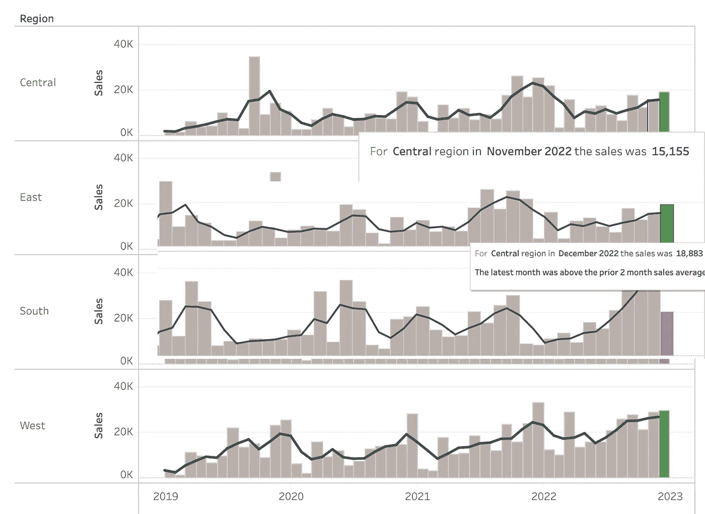
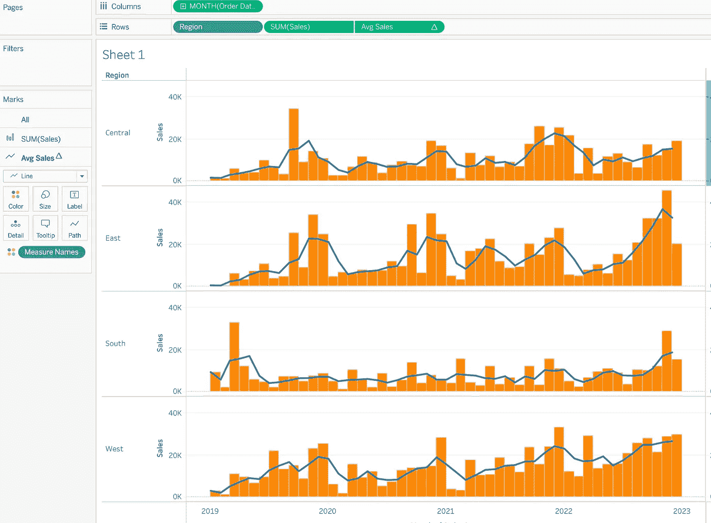
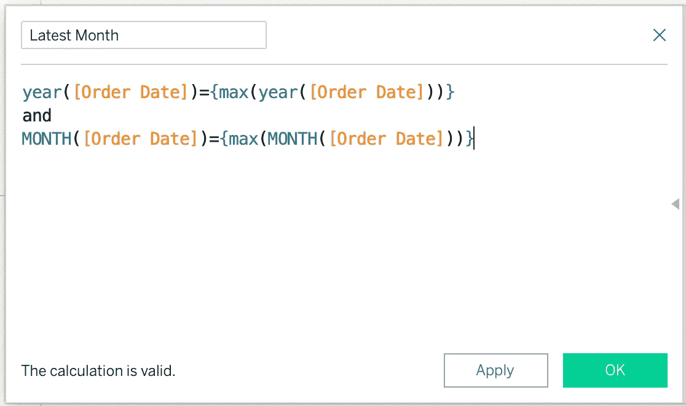
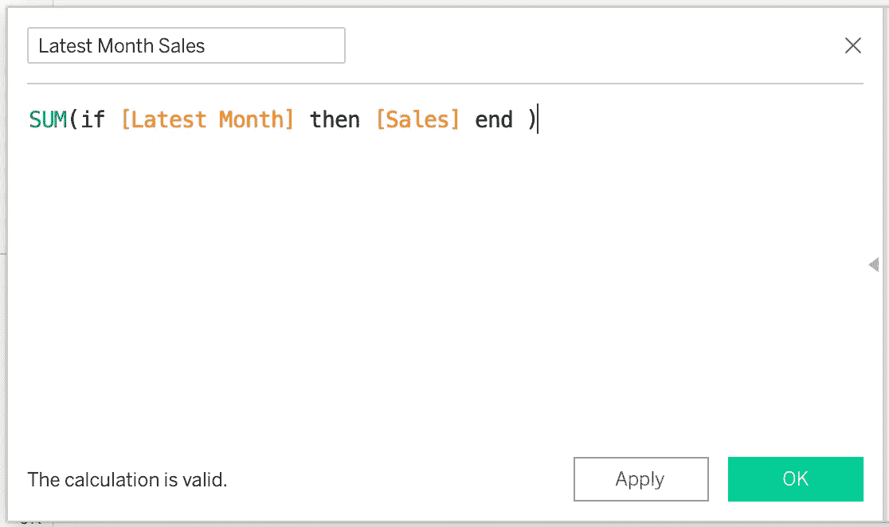
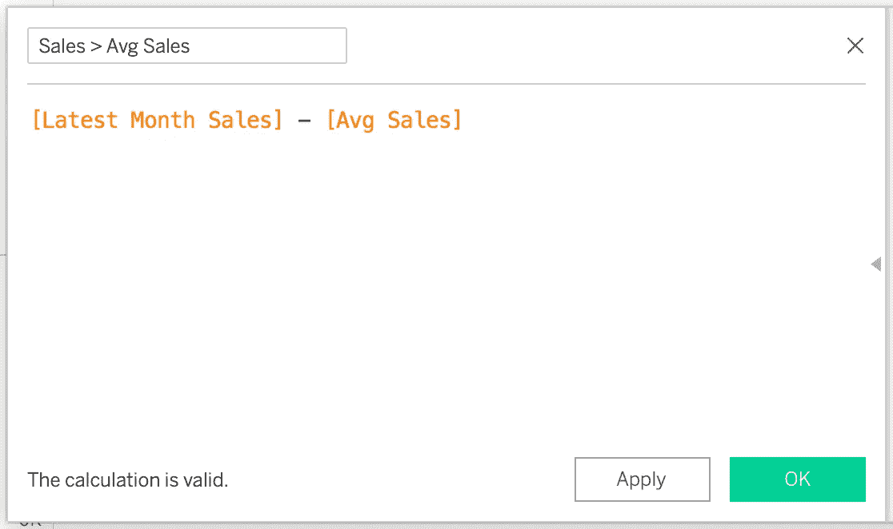
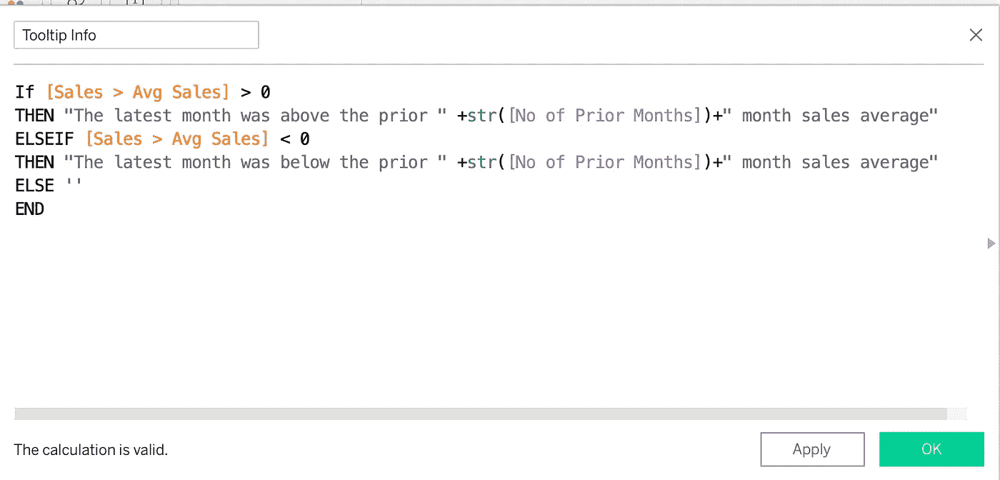
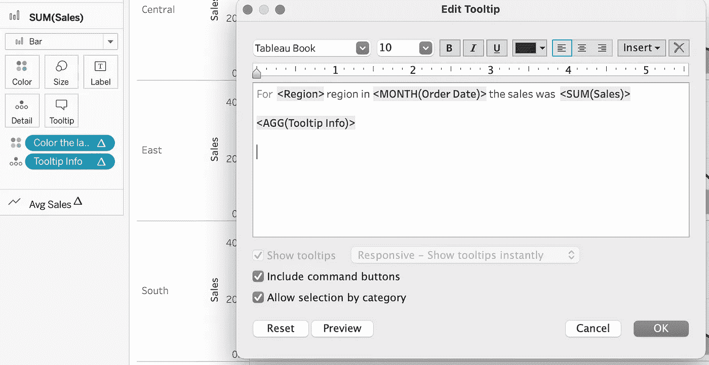

# Tableau 中的动态工具提示

> 原文：<https://medium.com/mlearning-ai/dynamic-tooltip-in-tableau-544a40dc95ff?source=collection_archive---------0----------------------->

Tableau 默认显示所有度量的工具提示。尺寸也可以显示工具提示，但这需要一些额外的解决方法。

在这个博客中，我们将讨论实现动态工具提示的解决方案。

让我们通过下面的例子来理解这个场景:

在下面的双轴图中，条形图显示了所有期间的区域销售情况，折线图显示了基于前几个月选择的平均销售情况。

从上图中我们可以看到，同一个工具提示分别显示了 11 月和 12 月的不同信息。

## 让我们从解决方案开始:

1.  以订单日期、地区、销售额和平均销售额的月份为例，创建一个双轴图表，如下所示。

我使用了以下计算方法来创建平均销售额:

WINDOW _ AVG(sum([销售])，[前几个月的数量]，0)

> 前几个月的数目是整数数据类型的参数。

2.创建一个计算字段来获取最近的月份:

年([订单日期])={max(年([订单日期]))}
和
月([订单日期])={max(月([订单日期])}

3.现在创建最近一个月的销售额，如下所示:

总和(如果[最近一个月]则[销售]结束)

4.为了检查销售额是大于还是小于平均销售额，我创建了下面的计算。

5.现在，我们将创建一个计算字段，在工具提示中显示所需的信息。

6.将工具提示信息字段放在 Sum(sales)卡的详细信息部分。

7.使用所需信息编辑工具提示，并在文本后插入工具提示信息字段。

一切都结束了。

工具提示消息现在将显示所有月份的不同销售信息以及最近一个月的附加信息。

您可以通过下面的链接查看仪表板:

[https://public . tableau . com/app/profile/SAS 6152/viz/wow 2022 w33 _ 16617576218660/wow 2022 w33 _ 1](https://public.tableau.com/app/profile/sas6152/viz/WOW2022W33_16617576218660/WOW2022W33_1)

我希望这篇文章对你有帮助。感谢阅读。

我要感谢洛娜·布朗的启发。

如果你喜欢这篇文章，那么不要忘记留下掌声和分享，以便更好地传播。

 [## Mlearning.ai 提交建议

### 如何成为 Mlearning.ai 上的作家

medium.com](/mlearning-ai/mlearning-ai-submission-suggestions-b51e2b130bfb)