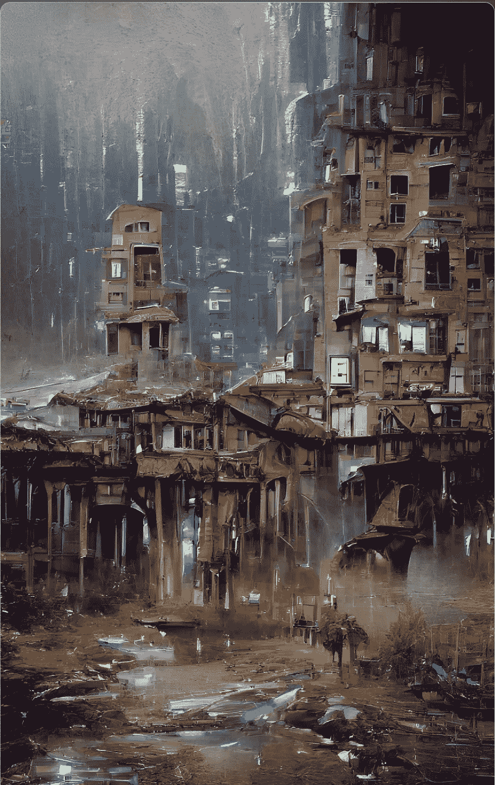
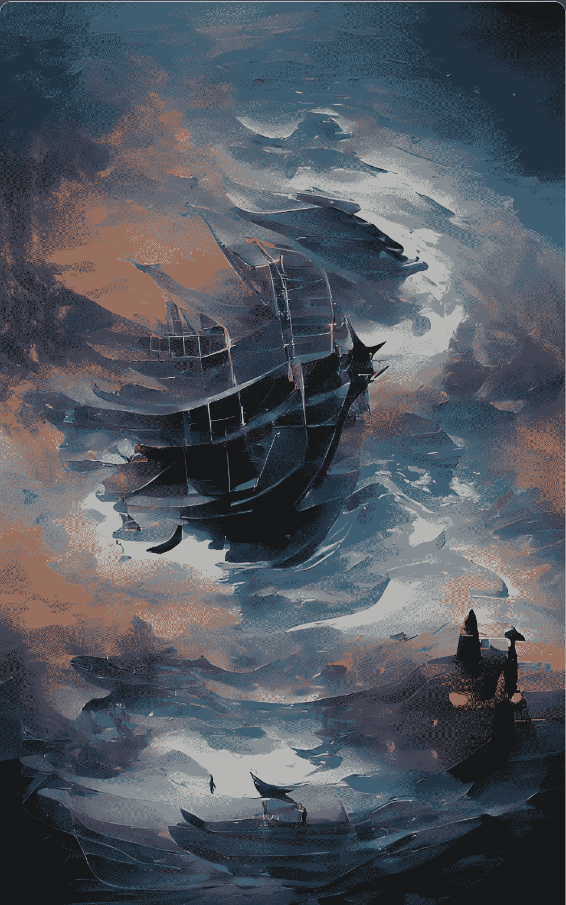
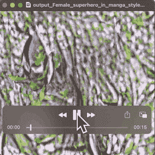
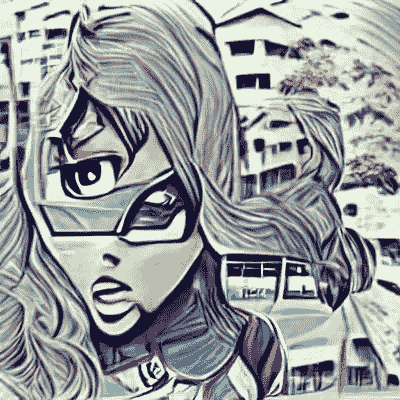

# 每种艺术都有一个故事

> 原文：<https://medium.com/mlearning-ai/each-art-has-a-story-90062476bd90?source=collection_archive---------8----------------------->

## 我们的想法可以通过概率和算法转化为艺术。

Galaxies and Blackholes.

我花了一些时间研究当今最先进的文本到图像系统**。以下是对此的一些想法:**

**近年来，计算机视觉已经取得了令人难以置信的进展，这要归功于可以在包含数十亿甚至数万亿张照片的数据集上工作的缩放模型。一个这样的模型是 CLIP，它学习具有所需属性的图像的压缩表示:它对分布偏移具有鲁棒性，并且在没有任何关于什么应该进入特定图片的先验知识的情况下，在从未标记的数据预测标签时表现良好！**

> **剪辑图像编码器可以产生对应于给定文本嵌入的多个图像。反相器及其近似反相(解码器)的存在，允许超出翻译到图像翻译的能力！**

**在我正在创作的一系列艺术品中，我在探索创造力。**

**我在看不同的艺术家如何对待创意，以及他们认为什么是创意。**

**我在努力寻找自己的创意，看看自己能走多远。**

****

**La esquina.**

**我们也可以通过反转插值在输入图像之间进行插值。这允许我们创建两种输入混合的新图像。通过反转插值，我们可以探索两幅图像之间的空间，创建新的有趣的视觉效果。**

****

**The darkest time.**

**为了获得完整的图像生成模型，我们将剪辑图像嵌入与微调的 GAN 相结合。这使得我们不仅可以生成逼真的图像，还可以控制图像的风格和内容。**

**下面我们展示了制作艺术品的流程:**

****

**VQGAN+CLIP generated artwork.**

**最终结果:**

****

**Super Hero.**

**你可以用点积(***NP . dot【a，b】***)和[代价函数***【J(x)***](https://dronesai-peiskos.medium.com/yes-its-worthy-einstein-summation-notation-applied-to-machine-learning-9455b5995394)来发掘你的创造力。**

**感谢阅读，**

**直到下次，**

** [## Mlearning.ai 提交建议

### 如何成为 Mlearning.ai 上的作家

medium.com](/mlearning-ai/mlearning-ai-submission-suggestions-b51e2b130bfb)**