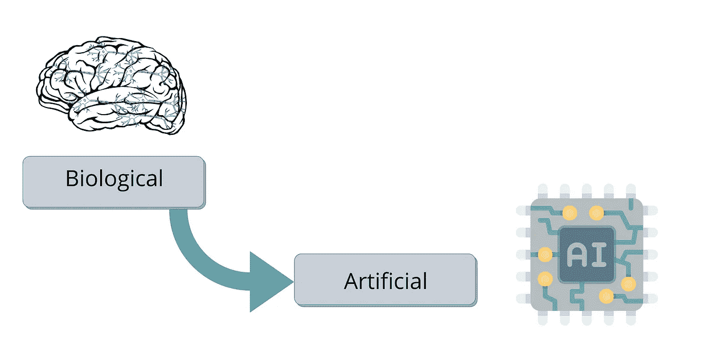
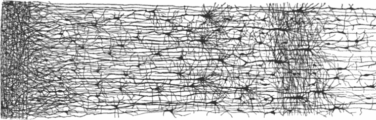
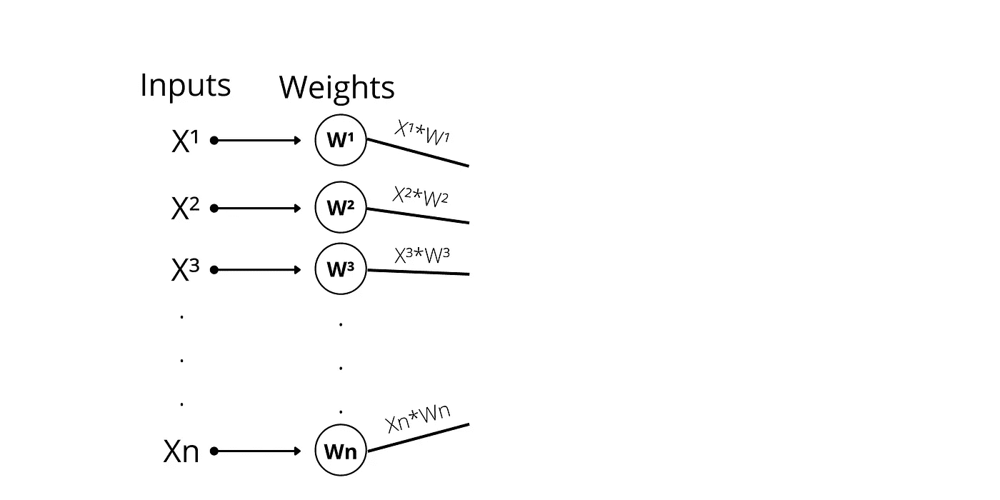
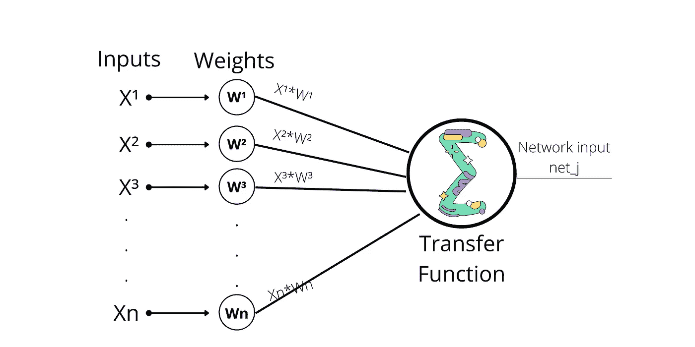
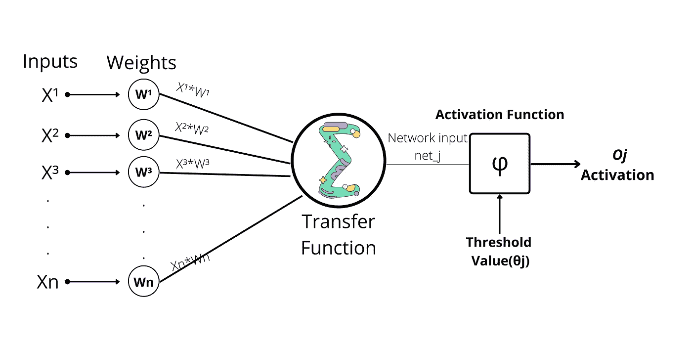

# 人工神经网络的早期时代

> 原文：<https://medium.com/mlearning-ai/early-era-of-artificial-neural-networks-e1844284f99c?source=collection_archive---------7----------------------->



Image Source: Author Edit

鸟类启发我们飞越天空，牛蒡植物启发我们创造 velcro，以及无数其他受大自然启发的发明。从大脑的架构中获得灵感来构建智能系统似乎是合乎逻辑的。这就是这个想法如何导致人工神经网络(ANN)的产生。然而，尽管飞机的灵感来自鸟类，但它们并不扇动翅膀。同样，人工神经网络也逐渐进化，变得与它们的生物表亲不同。

人工神经网络是深度学习的核心。它们一直在我们身边做着令人惊叹的事情，使它们多功能、可扩展、复杂，并且是跟踪大数据和/或复杂机器学习任务的理想选择，例如基于身份对照片进行聚类(Google Images)，通过语音识别支持您的网络搜索/搜索(Google、Siri、Alexa、Cortona 等)。)，根据你的兴趣推荐视频(网飞，YouTube)或者现在学习使用机器人复制人类动作(Hotelling robots to Boston Dynamics)。


AI Powered Apps

# 从生物神经元到人工神经元

令人惊讶的是，人工神经网络已经存在了一段时间。早在 20 世纪 40 年代，神经生理学家麦卡洛克和数学家皮茨在他们的论文“[神经活动中固有思想的逻辑演算*](https://www.cs.cmu.edu/~./epxing/Class/10715/reading/McCulloch.and.Pitts.pdf) ”中首次创造并介绍了它们


Image Source: [www.semanticscholar.org](https://www.semanticscholar.org/paper/On-the-legacy-of-W.S.-McCulloch-Moreno-D%C3%ADaz-Moreno-D%C3%ADaz/8056242a82ecc5e0064d4ff187fb07c5853fe8a6/figure/1)

他们提出了一种简化的计算算法/模型，描述了生物神经元如何在动物大脑中协同工作，使用 ***比例逻辑来执行复杂的决策。*** 这是第一个神经架构，从那以后很多都是基于这个研究发展起来的。

人工神经网络在 20 世纪 60 年代的早期成功使人们普遍相信，我们可能很快就会拥有智能机器。但是，当他们很快意识到他们的承诺可能无法实现时，资金流向了其他地方，AI 进入了一段时间的黑暗冬天，直到 20 世纪 80 年代，新的架构被发明出来，新的训练技术被开发出来。但进展缓慢，到 20 世纪 90 年代，最大似然算法出现了，与神经网络不同，它通常以强大的理论基础产生更好的结果。这将人工智能推回到黑暗中。最后，现在我们正在经历一个人工智能的新时代，这个时代可能与以前不同，因为:

*   大量数据可用于训练比 ML 算法更好的复杂架构。
*   计算能力的巨大提升(CPU → GPU → TPU)。
*   培训技术的改进和大量的高级 API(Keras、TensorFlow、Pytorch 等)。)
*   人工神经网络似乎有更多的资金，因为它目前在各种流的进展。

# 生物神经元


Image Source: [www.cs.toronto.edu](https://www.cs.toronto.edu/~lczhang/aps360_20191/lec/w02/terms.html)

在我们进入人工神经网络之前，让我们先了解一下生物神经元。它看起来不寻常，主要存在于每种动物/人类的大脑皮层，由一个称为细胞核的细胞体和大多数其他复杂部分以及称为树突的分支延伸和一个称为轴突的长延伸组成。在其末端附近，轴突分裂成多个分支，称为轴突末端/末端树突，这些末端的尖端是称为突触末端或简称为突触的微小结构，它们连接到其他神经元的树突。生物神经元接收来自其他神经元的短电脉冲，当这些电脉冲足够多时，在几毫秒内，神经元向其他连接的神经元发出信号。神经元被组织在巨大的复杂网络中，连接着数十亿这样的神经元，其中一个神经元可以连接到数千个其他神经元，以在弹指之间执行复杂的决策。这些神经元通常排列在连续的层中，如下图所示。



Image Source : [Stack Exchange](https://ai.stackexchange.com/questions/3739/are-biological-neurons-organized-in-consecutive-layers-as-well)

# 人工神经元

> 一个**人工神经元**是一个[数学函数](https://en.wikipedia.org/wiki/Function_(mathematics))，被设想为生物[神经元](https://en.wikipedia.org/wiki/Neuron)的[模型](https://en.wikipedia.org/wiki/Mathematical_model)，一个[神经网络](https://en.wikipedia.org/wiki/Neural_network)。人工神经元是[人工神经网络](https://en.wikipedia.org/wiki/Artificial_neural_network)中的基本单元。

那么，问题来了，我们是如何复制生物神经元的？让我们分解步骤，了解神经元的工作单元。我们从可能是思想/数据的信号开始。在计算中，我们用一些变量在数学上表达它们，比如。

```
Inputs -->  X1 X2 X3 ...... Xn
```

我们知道，信号根据接收到的信号类型使神经元兴奋。在进一步处理之前，各种神经元参与决策的计算，这只是与执行决策的每个神经元相关联的权重。



Inputs and Weights

现在，生物神经元积累所有这些信息，并给它充电，以总结信息。所实现的人工神经元也试图通过对来自不同神经元的所有加权输入求和来以类似的方式运行，我们将此称为**传递函数**。新计算的加权输入称为**网络输入**。



Artificial Neuron

在神经元被充电后，如果超过某个阈值，它就会向下一个神经元释放电流。以类似的方式，我们可以通过引入一个**激活函数**来计算实现它。一个激活函数接受网络输入，并检查它是否超过了某个阈值，然后将信号发送给下一个神经元，这被称为**神经元激活**。



Artificial Neuron Unit

## 结束语

总而言之，人工神经元是试图模仿人类生物神经元的数学和计算模型的结合，并通过聚集数百万这样的神经元来帮助人类建立复杂的系统/智能机器。是时候感谢麦卡洛克·皮茨公司为今天的复杂系统铺平了道路，这些系统从一天开始就在我们周围，使用语音命令自动化家庭，让我们在路上行驶。

[](/mlearning-ai/mlearning-ai-submission-suggestions-b51e2b130bfb) [## Mlearning.ai 提交建议

### 如何成为 Mlearning.ai 上的作家

medium.com](/mlearning-ai/mlearning-ai-submission-suggestions-b51e2b130bfb)