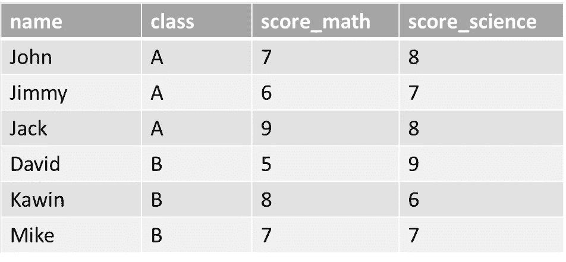
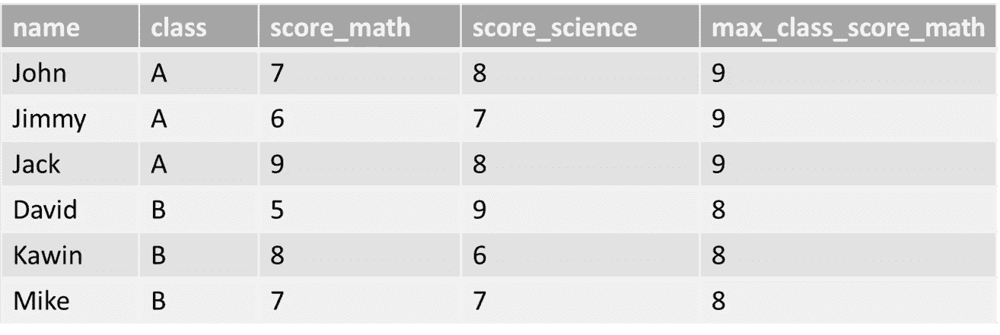
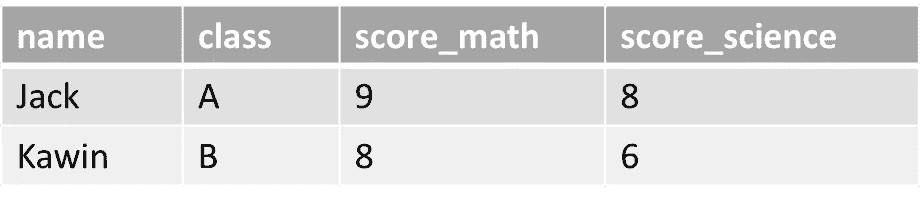
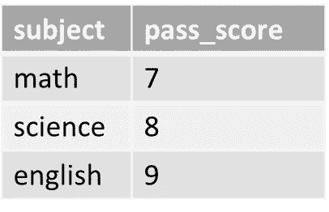
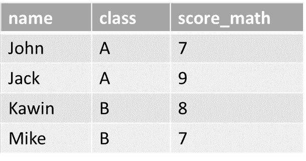

# 带有子查询的更简单的 SQL 查询

> 原文：<https://medium.com/mlearning-ai/easier-sql-query-with-a-subquery-d9e69249eb0f?source=collection_archive---------2----------------------->

# 什么是子查询？

子查询是大型查询中的小型 SQL 查询。这是一个由大型 SELECT 语句嵌套的 SELECT 语句。通过括号: ()，可以很容易地注意到子查询。


## 子查询的好处

*   允许您在外部查询中使用内部查询的结果。
*   易于理解和调整，因为它将查询分成独立的部分。
*   用于返回将在主查询中使用的筛选数据。

## 子查询出现次数

*   SELECT 子句:计算值
*   FROM 子句:数据源
*   WHERE 子句:选择标准

> 想要一个 SQL 复习器→
> https://medium . com/mlearning-ai/quick-SQL-query-reminder-622 a98d 3 ad 0c

# 子查询示例

student_score 数据库中的示例表由 4 列组成。



询问

```
SELECT *
FROM student_score 
```

## 1.选择子句

我想创建一个名为 max_class_score_math 的新列，显示每个类的最大 score_math。



询问

```
SELECT *,
      ( SELECT MAX(score_math)
        FROM student_score
        WHERE class = s.class
      ) AS max_class_score_math
FROM student_score AS s
```

*   创建一个子查询来计算 MAX score_math 并作为新列 max_class_score_math 输出
*   将 student_score 表命名为 s，以在子查询中指定条件

## 2.WHERE 子句

我想只显示每个班级数学分数最高的学生。



询问

```
SELECT *
FROM student_score AS s
WHERE score_math = ( SELECT MAX(score_math)
                   FROM student_score
                   WHERE class = s.class
                   )
```

*   使用子查询作为筛选条件
*   它将只返回 score_math 等于该类的最大 score_math 的学生

## 3.FROM 子句

现在，我有了一个名为 subject_score 的新表，它显示了每个科目的通过标准。



我想看看通过数学考试的学生。



询问

```
SELECT *
FROM
 (SELECT pass_score 
  FROM subject_score
  WHERE subject = 'math') AS pass_math, 
  student_score AS s
WHERE s.score_math >= pass_math.pass_score;
```

*   创建一个子查询来查找数学科目的通过标准
*   仅过滤 math_score 符合标准的学生

# 注意

本文中显示的许多查询都可以使用 JOIN 编写，但是使用子查询可能更容易理解。虽然子查询更容易编写，但是服务器可能会更好地优化连接。

希望学习子查询让你的生活更轻松。

请关注更多数据科学文章。

[](/mlearning-ai/mlearning-ai-submission-suggestions-b51e2b130bfb) [## Mlearning.ai 提交建议

### 如何成为 Mlearning.ai 上的作家

medium.com](/mlearning-ai/mlearning-ai-submission-suggestions-b51e2b130bfb)